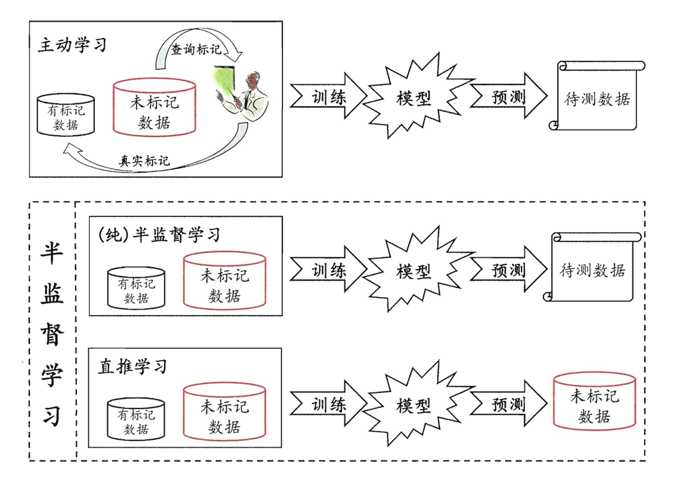
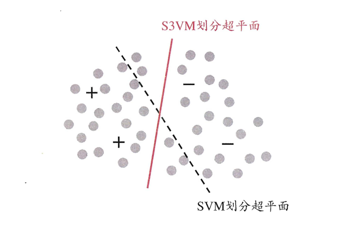
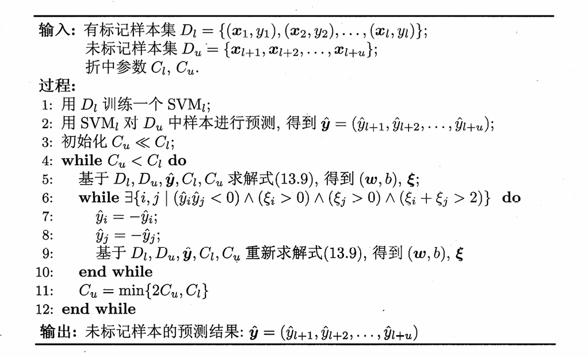

# Chapter13 半监督学习

***

## 未标记样本

没有标签的样本称为未标记样本，半监督学习指的是让学习器不依赖外界交互，自动利用未标记样本来提升学习性能。

半监督学习基于以下两个假设：

* **聚类假设（cluster assumption）**：假设数据存在簇结构，同一个簇的样本属于同一个类别
* **流形假设（manifold assumption）**：假设数据分布在流形结构上，邻近的样本有相似的输出值（聚类假设的推广）

***

## 生成式方法

生成式方法假设所有数据（无论是否标记），都是由同一个潜在模型生成。

假设高斯混合模型：

$$p(\mathbf{x})=\sum\limits\_{i=1}^N\alpha\_i\cdot p(\mathbf{x}|\boldsymbol{\mu}\_i,\boldsymbol{\Sigma}\_i)$$

令 $f(\mathbf{x})$ 表示预测标记，$\Theta$ 表示 $\mathbf{x}$ 属于第几个高斯混合成分，由最大化后验概率可知：

$$\begin{align}
f(\mathbf{x}) & = \operatorname\*{arg\,max}\_j p(y=j|\mathbf{x}) \\\
& = \operatorname\*{arg\,max}\_j\sum\limits\_{i=1}^Np(y=j,\Theta=i|\mathbf{x}) \\\
& = \operatorname\*{arg\,max}\_j\sum\limits\_{i=1}^Np(y=j|\Theta=i,\mathbf{x})\cdot p(\Theta=i|\mathbf{x})
\end{align}$$

其中

$$p(\Theta=i|\mathbf{x})=\frac{\alpha\_i\cdot p(\mathbf{x}|\boldsymbol{\mu}\_i,\boldsymbol{\Sigma}\_i)}{\sum\limits\_{k=1}^N \alpha\_k \cdot p(\mathbf{x}|\boldsymbol{\mu}\_k,\boldsymbol{\Sigma}\_k)}$$

$$p(y=j|\Theta=i,\mathbf{x})=\begin{cases}
    1 & i=j \\\
    0 & i\neq j
\end{cases}$$

第一个式子不涉及样本标记，因此有标记样本和未标记样本均可利用；第二个式子需要知道样本标记，因此只能利用有标记样本。

综上：

给定有标记样本集 $D\_l=\\{(\mathbf{x}\_1,y\_1),\dots,(\mathbf{x}\_l,y\_l)\\}$，未标记样本集 $D\_u=\\{\mathbf{x}\_{l+1},\dots,\mathbf{x}\_{l+u}\\}$，$l+u=m$。

E 步：

计算未标记样本 $\mathbf{x}\_j$ 属于各高斯混合成分的概率：

$$\gamma\_{ji}=\frac{\alpha\_i\cdot p(\mathbf{x}\_j|\boldsymbol{\mu}\_i,\boldsymbol{\Sigma}\_i)}{\sum\limits\_{k=1}^N\alpha\_k\cdot p(\mathbf{x}\_i|\boldsymbol{\mu}\_i,\boldsymbol{\Sigma}\_i)}$$

M 步：

目标最大化的对数似然：

$$LL(D\_l\cup D\_u)=\sum\limits\_{(\mathbf{x}\_j,y\_j)\in D\_l}\ln(\sum\limits\_{i=1}^N\alpha\_i\cdot p(\mathbf{x}\_j|\boldsymbol{\mu}\_i,\boldsymbol{\Sigma}\_i)\cdot p(y\_j|\Theta=i,\mathbf{x}\_j))+\sum\limits\_{\mathbf{x}\_j\in D\_u}\ln(\sum\limits\_{i=1}^N\alpha\_i\cdot p(\mathbf{x}\_j|\boldsymbol{\mu}\_i,\boldsymbol{\Sigma}\_i))$$

然后再进行求导即可。

***

## 半监督SVM

考虑二分类模型，S3VM 试图找到能将两类有标记样本分开，并且穿过数据低密度区域的超平面：

（图中的灰色点表示未标记样本）

**TSVM:**

TSVM 是 S3VM 中最著名的一种。

TSVM 尝试将每个未标记样本分别作为正例或反例，然后在所有这些结果中，寻求一个在所有样本（包括有标记样本和进行了标记指派的未标记样本）上间隔最大化的超平面。

具体步骤：

* 仅利用有标记样本学得一个 SVM
* 利用这个 SVM 对未标记样本进行预测，得到“伪标记”
* 更新 SVM
* 寻找两个标记指派为异类且很可能发生错误的未标记样本，交换它们的标记，重新更新 SVM
* 重复上一步，并不断提高未标记样本的权重

!!! Warning
    此处省略图半监督学习、基于分歧的方法、半监督聚类。