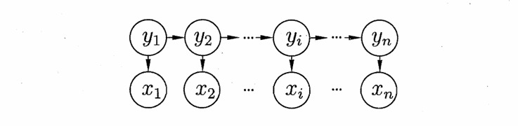
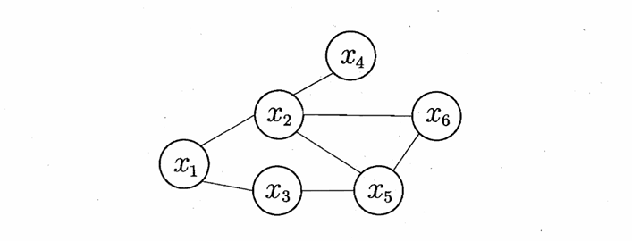
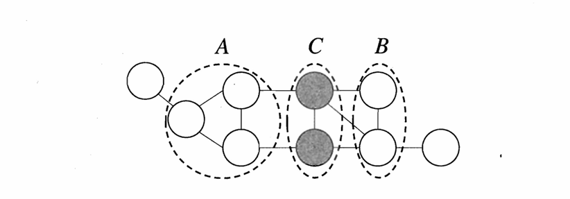
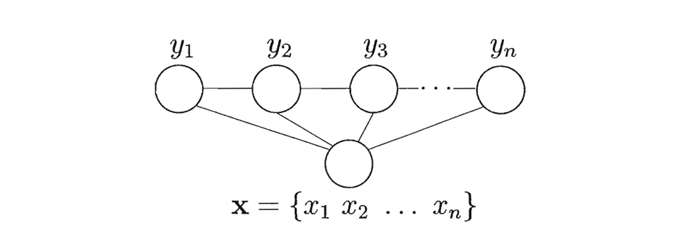

# Chapter14 概率图模型

***

## 隐马尔可夫模型

**概率图模型（probabilistic graphical model）：**

概率图模型是用图来表达变量关系的概率模型。分为

* 有向图模型（又称“贝叶斯网”）
* 无向图模型（又称“马尔可夫网”）

**隐马尔可夫模型（Hidden Markov Model, HMM）：**

隐马尔可夫模型是一种有向图模型。有两种变量：

* 状态变量 $\\{y_1,y_2,\dots,y_n\\}$
* 观测变量 $\\{x_1,x_2,\dots,x_n\\}$

二者的依赖关系如下图所示：

***

## 马尔可夫随机场

**马尔可夫随机场（Markov Random Field, MRF）：**

马尔可夫随机场是一种无向图模型。

如果一组节点两两都有边连接，则这个节点子集称为一个**团（clique）**；如果一个团不能再通过添加节点而扩大，或者说不能被其他团包含，则称为**极大团（maximal clique）**。每个节点都至少出现在一个极大团中。

**联合概率分布：**

对于节点图中的 $n$ 个变量 $\mathbf{x}=\\{x_1,\dots,x_n\\}$，设所有极大团构成的集合为 $\mathcal{C}^\*$，极大团 $Q\in\mathcal{C}^\*$ 对应的变量集合为 $\mathbf{x}_Q$，则有联合概率分布：

$$P(\mathbf{x})=\frac{1}{Z^\*}\prod_{Q\in\mathcal{C}^\*}\psi_Q(\mathbf{x}_Q)$$

其中，$\psi_Q$ 为 $Q$ 对应的**势函数**，用于对变量关系进行建模；$Z^\*$ 为**规范化因子**，确保 $P(\mathbf{x})$ 是被正确定义的概率。

**条件独立性：**

如下图所示，若从节点集 $A$ 到节点集 $B$ 必须经过节点集 $C$，则 $C$ 是 $A$ 和 $B$ 的**分离集（separating set）**。

若给定两个变量子集的分离集，则这两个变量子集条件独立，这称为**全局马尔可夫性（global Markov property）**。如上例，记作 $\mathbf{x}_A \perp \mathbf{x}_B \mid \mathbf{x}_C$。

由全局马尔可夫性可以推出：

* **局部马尔可夫性（local Markov property）**：若给定某变量 $v$ 的全部相邻变量 $n(v)$，则该变量条件独立于其他变量 $V\setminus(n(v)\cup\\{v\\})$：$\mathbf{x}\_v\perp\mathbf{x}\_{V\setminus(n(v)\cup\\{v\\})} \mid \mathbf{x}\_{n(v)}$
* **成对马尔可夫性（pairwise Markov property）**：两个非相邻变量 $u$ 和 $v$ 在给定所有其他变量 $V\setminus\\{u,v\\}$ 的条件下独立：$\mathbf{x}\_u\perp\mathbf{x}\_v \mid \mathbf{x}\_{V\setminus\\{u,v\\}}$

***

## 条件随机场

**条件随机场（Conditional Random Field, CRF）：**

条件随机场是一种无向图模型。

!!! Note
    生成式模型对联合分布进行建模，隐马尔可夫模型和马尔可夫随机场都是生成式模型；判别式模型对条件分布进行建模，条件随机场是判别式模型。

令观测序列 $\mathbf{x}=\\{x_1,\dots,x_n\\}$，对应标记序列 $\mathbf{y}=\\{y_1,\dots,y_n\\}$，则条件随机场的目标是构建条件概率模型 $P(\mathbf{y}|\mathbf{x})$。

!!! Warning
    此处省略学习与推断、近似推断、话题模型。