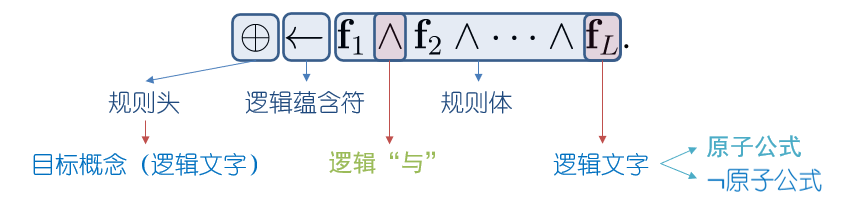
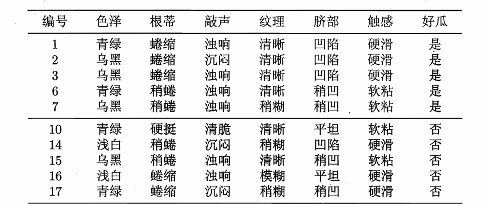
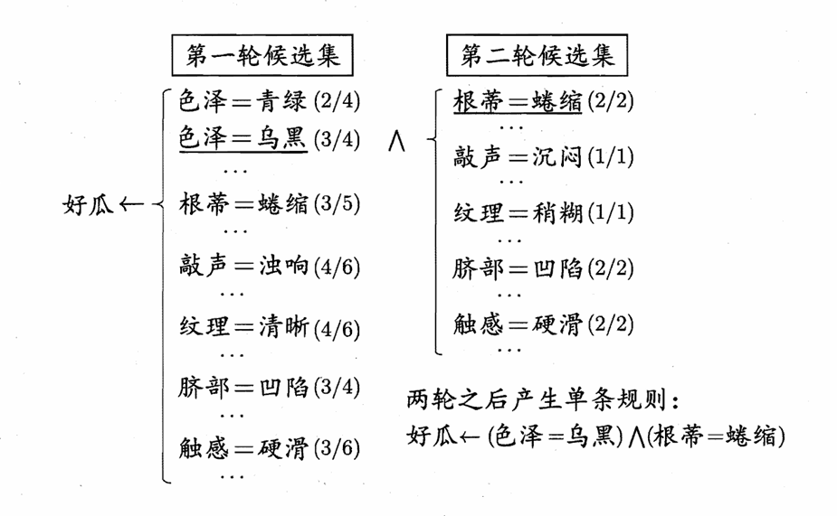
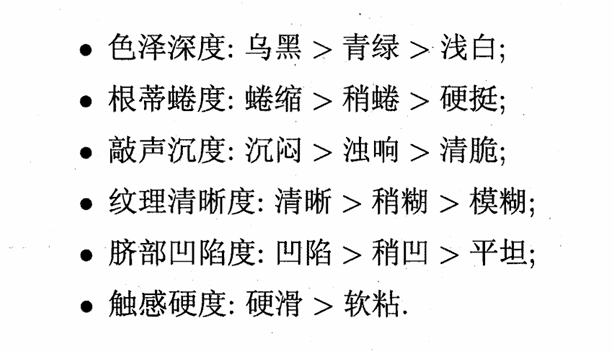
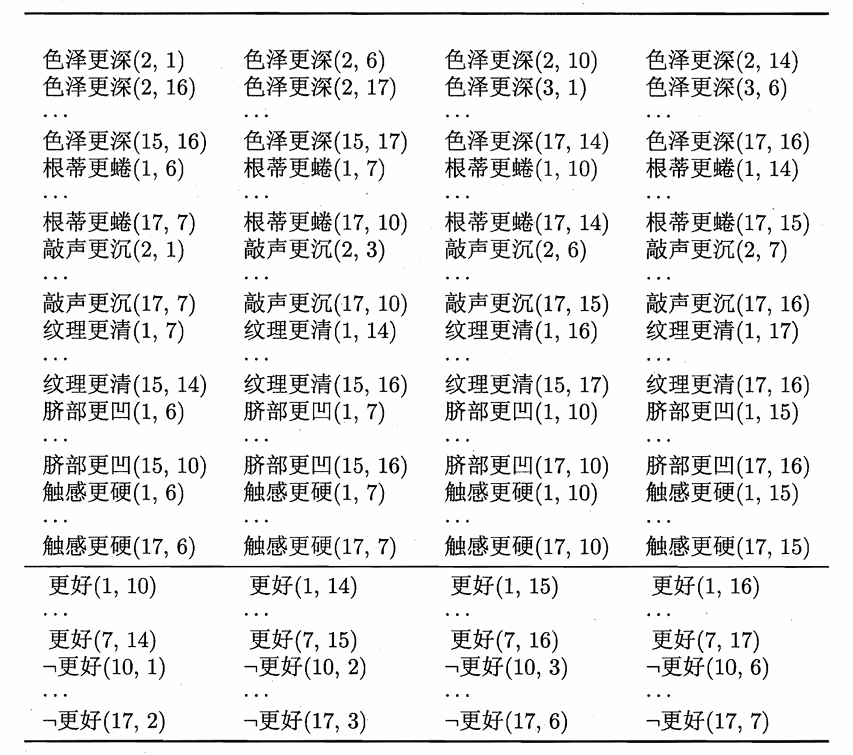

# Chapter15 规则学习

***

## 基本概念

规则的形式如下：

!!! Example
    规则1：好瓜 $\gets$ (根蒂 = 蜷缩) ∧ (脐部 = 凹陷)

    规则2：¬好瓜 $\gets$ (纹理 = 模糊)

如果样本符合某个规则，则称为被该规则**覆盖**。如果被多个规则覆盖且判别结果不同，则称为**冲突**，有以下解决方法：

* 投票法：听从更多结果相同的规则
* 排序法：听从优先级最高的规则
* 元规则法：额外制定一些约束规则的规则

规则按照表达形式可以分成两类：

* **命题规则**：原子命题 + 逻辑连接词（例如上面的例子）
* **一阶规则**：引入量词、谓词等，更加复杂

命题规则是一阶规则的特例。

***

## 序贯覆盖 Sequential Covering

规则学习的目标是**产生一个能覆盖尽可能多样例的规则集**，最直接的做法是**序贯覆盖**：:在训练集上每学到一条规则，就将该规则覆盖的训练样例去除，然后以剩下的训练样例组成训练集，重复上述过程。

以如下数据集为例：

从空规则 $\oplus\gets$ 开始，将正例类别作为规则头，逐个遍历训练集中的每个属性及取值。例如，根据第一个样例的第一个属性：

$$\text{好瓜}\gets(\text{色泽}=\text{青绿})$$

这条规则覆盖的样例中包括了两个正例和两个反例，不符合要求。我们可以尝试将“青绿”换成“乌黑”，但依然不行。我们还可以尝试增加原子命题：

$$\text{好瓜}\gets(\text{色泽}=\text{青绿})\land(\text{根蒂}=\text{蜷缩})$$

这条规则依然覆盖了反例。当我们换成

$$\text{好瓜}\gets(\text{色泽}=\text{青绿})\land(\text{根蒂}=\text{稍蜷})$$

这条规则不覆盖任何反例，因此可以保留，然后去除它覆盖的样例。继续学习规则，最后得到如下规则集：

$$\text{规则1}:\text{好瓜}\gets(\text{色泽}=\text{青绿})\land(\text{根蒂}=\text{稍蜷})$$

$$\text{规则2}:\text{好瓜}\gets(\text{色泽}=\text{青绿})\land(\text{敲声}=\text{浊响})$$

$$\text{规则3}:\text{好瓜}\gets(\text{色泽}=\text{乌黑})\land(\text{根蒂}=\text{蜷缩})$$

$$\text{规则4}:\text{好瓜}\gets(\text{色泽}=\text{乌黑})\land(\text{纹理}=\text{稍糊})$$

该规则集覆盖了所有正例，未覆盖任何反例。

序贯覆盖一般有两种策略：

* **自顶向下**：从一般规则开始，通过添加新文字逐渐变成特定规则
* **自底向上**：从特定规则开始，通过删除文字逐渐变成一般规则

命题规则常使用自顶向下的方法，一阶规则常使用自底向上的方法。

仍以上述数据集为例，如果使用自顶向下的方法：

图中的分母表示覆盖了多少样例，分子表示其中有多少正例。第一轮候选集中“色泽=乌黑”规则准确率最高，在此基础上再添加新的文字。

!!! Note
    规则生成过程中常用的评估标准：

    先考虑规则准确率，再考虑覆盖样例数，最后考虑属性次序。

***

## 一阶规则学习

对于西瓜数据，可以定义：

因此，上述数据集可以改为：

其中，每个数据直接描述了样例间的关系，称为**关系数据**；由原样本属性转化而来的“色泽更深”“根蒂更蜷”等原子公式称为**背景知识**；由样本类别转化而来的“更好”“¬更好”等原子公式称为**关系数据样例**。例如，可以学到一阶规则：

$$(\forall X,\forall Y)(\text{更好}(X,Y)\gets\text{根蒂更蜷}(X,Y)\land\text{脐部更凹}(X,Y))$$

**FOIL** 是一阶规则学习算法，遵循序贯覆盖，采用自顶向下的策略。使用 **FOIL 增益** 来选择文字：

$$\text{F\_Gain}=\hat{m}\_+\times(\log_2\frac{\hat{m}\_+}{\hat{m}\_+ + \hat{m}\_-}-\log_2\frac{m\_+}{m\_+ + m\_-})$$

其中，$m_+$ 和 $m_-$ 分别表示当前规则覆盖的正例和反例数，$\hat{m}\_+$ 和 $\hat{m}\_-$ 分别表示添加新文字后规则覆盖的正例和反例数。

!!! Warning
    此处省略剪枝优化、归纳逻辑程序设计（ILP）。