

# Chapter16 强化学习

***

## 任务与奖赏

强化学习常用**马尔可夫决策过程（Markov Decision Process, MDP）** 描述：

$$E=\langle X,A,P,R\rangle$$

* $E$：环境
* $X$：状态空间
* $A$：动作空间
* $P:X\times A\times X\mapsto\mathbb{R}$：状态转移概率
* $R:X\times A\times X\mapsto\mathbb{R}$ 或 $R:X\times X\mapsto\mathbb{R}$：奖励函数

策略分为两种：

* $\pi:X\mapsto A$：确定性策略
* $\pi:X\times A\mapsto\mathbb{R}$：随机性策略

强化学习的目标是**找到能使长期累积奖赏最大化的策略**，长期累积奖赏分为两种：

* $\mathbb{E}[\frac{1}{T}\sum\limits_{t=1}^Tr_t]$：T 步累积奖赏
* $\mathbb{E}[\sum\limits_{t=0}^\infty \gamma^tr_{t+1}]$：$\gamma$ 折扣累积奖赏

!!! Note
    强化学习可以认为是一种延迟标记信息的监督学习。

***

## K-摇臂赌博机

先考虑最简单的**单步强化学习任务**，目标是**最大化单步奖赏**，需要考虑：

* 每个动作带来的奖赏
* 执行奖赏最大的动作

单步强化学习任务对应的理论模型是 **K-摇臂赌博机**。$K$ 个摇臂，限定尝试次数，每个摇臂有一定概率吐出硬币，目标是获得最多的硬币。

* 仅探索（对应第一个考虑点）：将所有尝试机会平均分配，以每个摇臂各自的平均吐币概率作为奖赏期望的近似估计
* 仅利用（对应第二个考虑点）：每次都选择目前为止平均奖赏期望最高的摇臂

上述的“探索”与“利用”是矛盾的，称为**探索 - 利用窘境**。以下为两种折中方法：

### $\epsilon$-贪心

以 $\epsilon$ 的概率随机选择摇臂（探索），以 $1-\epsilon$ 的概率选择目前为止平均奖赏期望最高的摇臂（利用）。

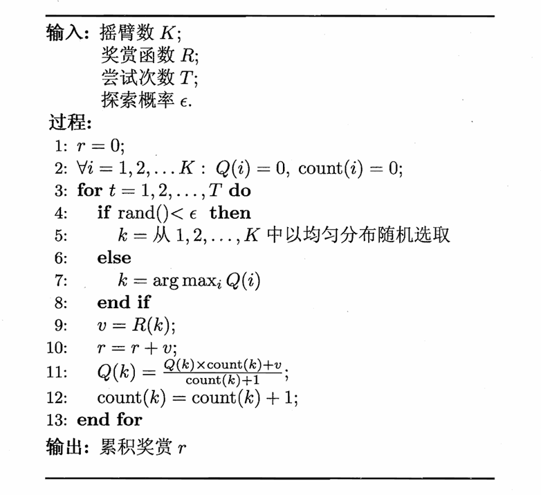

若摇臂奖赏的不确定性较大，例如概率分布较宽时，则需要更多的探索，此时需要更大的 $\epsilon$。随着尝试次数的增加，对探索的需求降低，可以逐渐减小 $\epsilon$。

### Softmax

每个摇臂都有概率选中，但目前为止平均奖赏期望高的摇臂被选中的概率更大。概率基于 **Boltzmann 分布**：

$$P(k)=\frac{e^{\frac{Q(k)}{\tau}}}{\sum\limits_{i=1}^K e^{\frac{Q(i)}{\tau}}}$$

$\tau$ 称为**温度**，趋于 $0$ 则趋向利用，趋于 $\infty$ 则趋向探索。

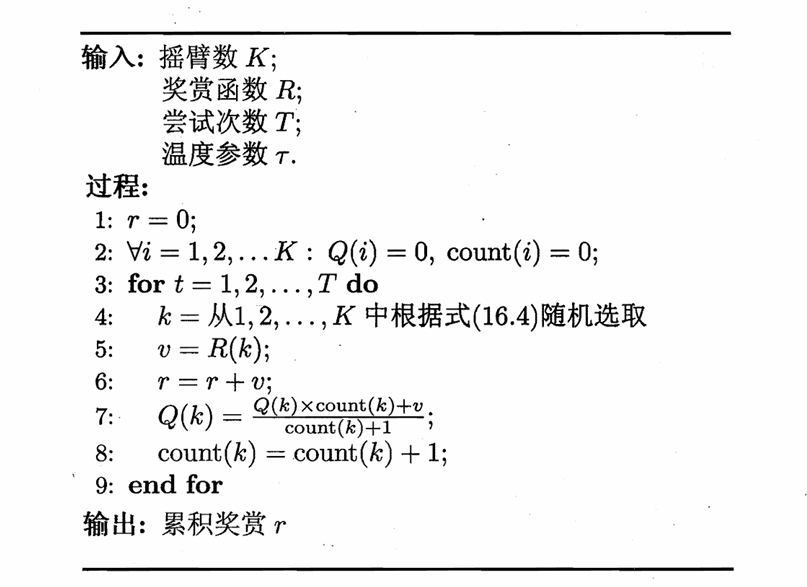

***

## 有模型学习 Model-Based Learning

考虑多步强化学习任务。若

$$E=\langle X,A,P,R\rangle$$

均已知，则称为**有模型学习**。

### 策略评估

**状态值函数（state value function）：**

$V^{\pi}(x)$ 表示从状态 $x$ 出发，使用策略 $\pi$ 带来的累计奖赏的期望：

$$\begin{cases}
    V\_T^{\pi}(x)=\mathbb{E}\_{\pi}[\frac{1}{T}\sum\limits\_{t=1}^Tr\_t|x\_0=x] \\\
    V\_{\gamma}^{\pi}(x)=\mathbb{E}\_{\pi}[\sum\limits\_{t=0}^\infty \gamma^tr\_{t+1}|x\_0=x]
\end{cases}$$

**状态-动作值函数（state-action value function）：**

$Q^{\pi}(x,a)$ 表示从状态 $x$ 出发，采取动作 $a$，并随后使用策略 $\pi$ 带来的累计奖赏的期望：

$$\begin{cases}
    Q\_T^{\pi}(x,a)=\mathbb{E}\_{\pi}[\frac{1}{T}\sum\limits\_{t=1}^Tr\_t|x\_0=x,a\_0=a] \\\
    Q\_{\gamma}^{\pi}(x,a)=\mathbb{E}\_{\pi}[\sum\limits\_{t=0}^\infty \gamma^tr\_{t+1}|x\_0=x,a\_0=a]
\end{cases}$$

**动作-状态全概率展开（Bellman 等式）：**

$$
\begin{align}
V\_T^{\pi}(x) & =\mathbb{E}\_{\pi}[\frac{1}{T}\sum\limits\_{t=1}^Tr\_t|x\_0=x] \\\
& =\mathbb{E}\_{\pi}[\frac{1}{T}r\_1+\frac{T-1}{T}\frac{1}{T-1}\sum\limits\_{t=2}^Tr\_t|x\_0=x] \\\
& =\sum\limits\_{a\in A}\pi(x,a)\sum\limits\_{x'\in X}P\_{x\to x'}^a[\frac{1}{T}R\_{x\to x'}^a+\frac{T-1}{T}V\_{T-1}^{\pi}(x')]
\end{align}
$$

同理：

$$V_{\gamma}^{\pi}(x)=\sum\limits_{a \in A} \pi(x, a) \sum\limits_{x' \in X} P_{x \to x'}^a (R_{x \to x'}^a + \gamma V_{\gamma}^{\pi}(x'))$$

如果使用上述递归式计算值函数，本质上是一种**动态规划**。

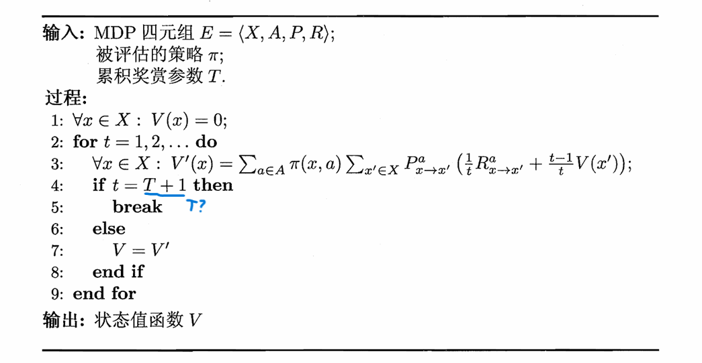

!!! Note
    $V_{\gamma}^{\pi}$ 也可以使用类似的算法，只要设置一个阈值 $\theta$，当

    $$\max\limits_{x\in X}|V(x)-V'(x)|<\theta$$

    时就停止迭代。

状态值函数可以推出状态-动作值函数：

$$\begin{cases}
    Q_T^{\pi}(x,a)=\sum\limits_{x'\in X}P_{x\to x'}^a[\frac{1}{T}R_{x\to x'}^a+\frac{T-1}{T}V_{T-1}^{\pi}(x')] \\\
    Q_{\gamma}^{\pi}(x,a)=\sum\limits_{x'\in X}P_{x\to x'}^a[R_{x\to x'}^a+\gamma V_{\gamma}^{\pi}(x')]
\end{cases}$$

### 策略改进

策略改进的目标是得到**最优策略**：

$$\pi^\*=\operatorname\*{arg\,max}\_{\pi}\sum\limits\_{x\in X}V^{\pi}(x)$$

最优策略对应的值函数 $V^\*$ 称为**最优值函数**：

$$\forall x\in X: V^\*(x)=V^{\pi^\*}(x)$$

由于 $V^\*$ 对应最优策略且表示累计奖赏值达到最大，因此如果将 $V^\*$ 代入前面的 Bellman 等式，$\pi^\*$ 在状态 $x$ 下应该选择最优的动作 $a$，也就是能获得最大累计奖赏的动作，此时得到的是**最优 Bellman 等式**：

$$\begin{cases}
    V_T^\*(x)=\max\limits_{a\in A}\sum\limits_{x'\in X}P_{x\to x'}^a[\frac{1}{T}R_{x\to x'}^a+\frac{T-1}{T}V_{T-1}^\*(x')] \\\
    V_{\gamma}^\*(x)=\max\limits_{a\in A}\sum\limits_{x'\in X}P_{x\to x'}^a[R_{x\to x'}^a+\gamma V_{\gamma}^\*(x')]
\end{cases}$$

换言之

$$V^\*(x)=\max\limits_{a\in A}Q^{\pi^\*}(x,a)$$

再代回到关于状态-动作值函数的 Bellman 等式，得到**最优状态-动作值函数**：

$$\begin{cases}
    Q_T^\*(x,a)=\sum\limits_{x'\in X}P_{x\to x'}^a[\frac{1}{T}R_{x\to x'}^a+\frac{T-1}{T}\max\limits_{a'\in A}Q_{T-1}^\*(x',a')] \\\
    Q_{\gamma}^\*(x,a)=\sum\limits_{x'\in X}P_{x\to x'}^a[R_{x\to x'}^a+\gamma \max\limits_{a'\in A}Q_{\gamma}^\*(x',a')]
\end{cases}$$

最优 Bellman 等式揭示了非最优策略的改进方式：将策略选择的动作改变为当前最优的动作。记原策略为 $\pi$，改进后的策略为 $\pi'$，则

$$\pi'(x)=\operatorname\*{arg\,max}\_{a\in A}Q^{\pi}(x,a)$$

### 算法

**策略迭代算法：**

交替进行如上的策略评估和策略改进，直到策略不再改变为止：

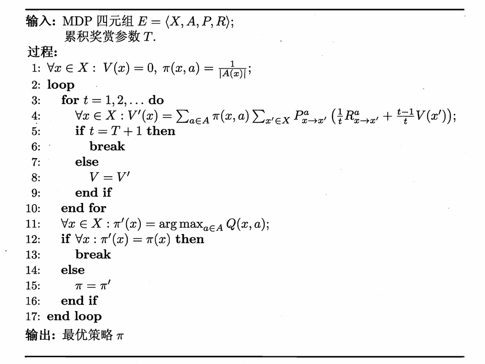

**值迭代算法：**

策略改进和值函数改进本质上是等价的：

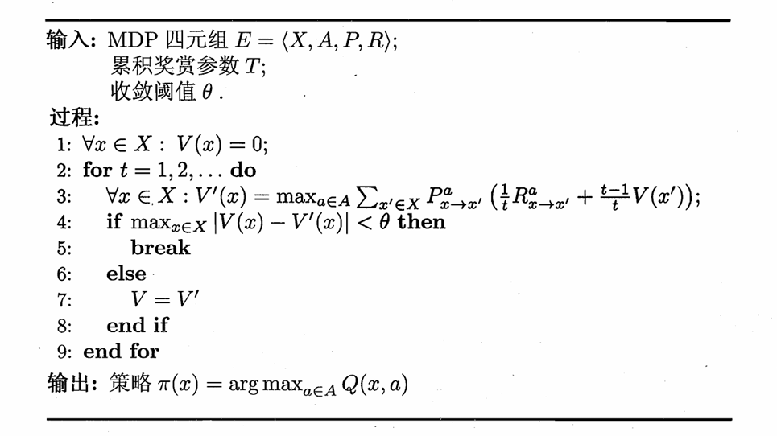

!!! Note
    有模型学习并未涉及泛化能力。

***

## 免模型学习 Model-Free Learning

环境的状态数、环境的转移概率、奖赏函数等信息均未知，学习算法不依赖于环境建模。

### 蒙特卡洛强化学习

问题一：

如果考虑之前的策略迭代算法，那么首先遇到的问题是策略无法评估，因为模型未知，无法进行全概率展开。这个时候一种策略评估的替代方法是**多次采样**，然后取平均累计奖赏来作为期望累计奖赏的近似，这称为**蒙特卡洛强化学习**。

!!! Note
    由于采样是有限的，因此更适合使用 T 步累积奖赏。

问题二：

之前的策略迭代算法中包含 $V$ 和 $Q$ 之间的转换，模型未知时比较困难，因此，直接考虑 $Q$ 的估计和更新。

问题三：

之前的策略迭代算法中每个状态都进行了起始的估计，然而在模型未知的情况下，机器只能从一个起始状态（或起始状态集合）开始探索，因此只能在探索的过程中逐渐发现各个状态并估计状态-动作值函数。

综合起来，从起始状态出发，使用某种策略进行采样，执行 $T$ 步后可以获得轨迹

$$\langle x_0,a_0,r_1,\dots,x_{T-1},a_{T-1},r_T,x_T\rangle$$

然后，对轨迹内每一对状态-动作，记录其后的奖励之和。如果能进行多次轨迹采样，便可以对每个状态-动作对的累计奖赏取平均，作为其状态-动作值函数的估计。

由于要进行多次轨迹采样，因此如果策略是确定性的话，需要引入 $\epsilon$-贪心等探索机制来增加随机性。将原本的确定性策略记为 $\pi$，引入 $\epsilon$-贪心后得到新的策略

$$\pi^{\epsilon}(x)=\begin{cases}
    \pi(x) & 1-\epsilon\\\
    \text{随机选择 $A$ 中的动作} & \epsilon
\end{cases}$$

#### 同策略（on-policy）蒙特卡洛强化学习算法

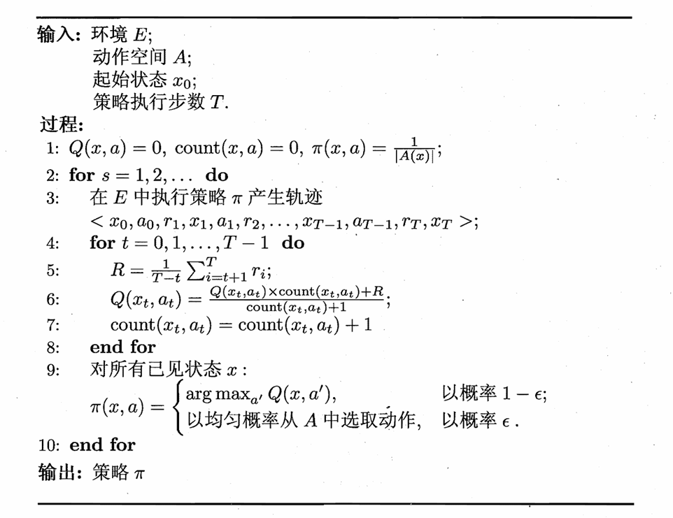

* 策略初始化为等概率选择动作
* 根据当前策略，采样一条长度为 $T$ 的轨迹
* 更新状态-动作值函数 $Q(x,a)$ 的估计
* 对目前已经出现过的状态 $x$，更新策略 $\pi(x)$：有 $1-\epsilon$ 的概率选择能使 $Q(x,a)$ 最大的动作 $a$，有 $\epsilon$ 的概率随机选择动作
* 重复上述过程，直到收敛

!!! Note
    第 5 行除以了 $\frac{1}{T-t}$，是 T 步累积奖赏的定义。（虽然叫累积奖赏但是定义却有平均）

#### 异策略（off-policy）蒙特卡洛强化学习算法

我们希望仅在策略评估时引入 $\epsilon$-贪心，而在策略改进时不引入。

可以考虑从使用两个不同的策略 $\pi$ 和 $\pi'$ 来采样轨迹，区别在于每个状态动作对被采样的概率不同。

!!! Success "Definition"
    **重要性采样：**

    基于一个分布的采样来估计另一个分布下的期望。

    若根据概率分布 $p$ 上的采样 $\\{x_1,x_2,\dots,x_m\\}$ 来估计 $f$ 的期望：

    $$\mathbb{E}[f]=\int_xp(x)f(x)dx$$

    $$\hat{\mathbb{E}}[f]=\frac{1}{m}\sum\limits_{i=1}^mf(x_i)$$

    则根据概率分布 $q$ 上的采样 $\\{x_1',x_2',\dots,x_m'\\}$ 来估计 $f$ 的期望：

    $$\mathbb{E}[f]=\int_xq(x)\frac{p(x)}{q(x)}f(x)dx$$

    $$\hat{\mathbb{E}}[f]=\frac{1}{m}\sum\limits_{i=1}^m \frac{p(x_i')}{q(x_i')}f(x_i')$$

回到问题上，$\pi$ 为确定性策略，$\pi'$ 为 $\epsilon$-贪心策略。使用策略 $\pi$ 的采样轨迹来评估策略 $\pi$，实际上就是对累积奖赏估计期望：

$$Q(x,a)=\frac{1}{m}\sum\limits_{i=1}^mR_i$$

使用策略 $\pi'$ 的采样轨迹来评估策略 $\pi$，实际上就是对累计奖赏加权估计期望：

$$Q(x,a)=\frac{1}{m}\sum\limits_{i=1}^m\frac{P_i^{\pi}}{P_i^{\pi'}}R_i$$

其中 $P_i^{\pi}$ 和 $P_i^{\pi'}$ 分别为轨迹 $i$ 在策略 $\pi$ 和 $\pi'$ 下产生的概率。轨迹 $\langle x_0,a_0,r_1,\dots,x_{T-1},a_{T-1},r_T,x_T\rangle$ 在策略 $\pi$ 下产生的概率为：

$$P^{\pi}=\prod\limits_{i=0}^{T-1}\pi(x_i,a_i)P_{x_i\to x_{i+1}}^{a_i}$$

$$\frac{P^{\pi}}{P^{\pi'}}=\prod\limits_{i=0}^{T-1}\frac{\pi(x_i,a_i)}{\pi'(x_i,a_i)}$$

其中，由于 $\pi$ 是确定性策略，因此 $\pi(x_i,a_i)$ 始终为 $1$；而 $\pi'(x_i,a_i)$ 为 $\frac{\epsilon}{|A|}$ 或 $1-\epsilon+\frac{\epsilon}{|A|}$。

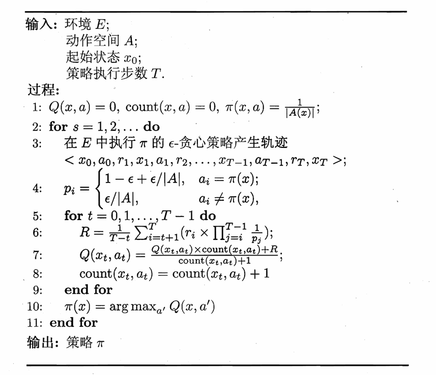

上述算法除了累积奖赏的修正和策略的确定性更新，其他仍然保持一致。

!!! Note
    一些疑惑：

    一. 为什么对单步奖赏分别进行修正，而不是对累积奖赏整体修正？

    From GPT: 因为 $r_i$ 不是在同一个概率空间下生成的。考虑轨迹 $\langle x_t,a_t,r_{t+1},\dots,r_{T}\rangle$，$r_{t+1}$ 依赖的区间是 $\langle x_t,a_t\rangle$，$r_{t+2}$ 依赖的区间是 $\langle x_t,a_t,x_{t+1},a_{t+1}\rangle$……

    二. 为什么单步奖赏 $r_i$ 对应的是 $\prod\limits_{j=i}^{T-1}\frac{1}{p_j}$，而不是 $\prod\limits_{j=t}^{i-1}\frac{1}{p_j}$？

    From GPT: 标准情况下应该是后者？

    吐槽：这里书上讲得略显混乱，笔者也没完全弄明白。

### 时序差分学习 Temporal-Difference Learning (TD)

蒙特卡洛强化学习每次更新都需要完成一个完整的轨迹，而时序差分学习为增量式更新，结合了动态规划与蒙特卡洛方法。其中，**Sarsa 算法为同策略，Q-学习算法为异策略**。

#### Sarsa 算法

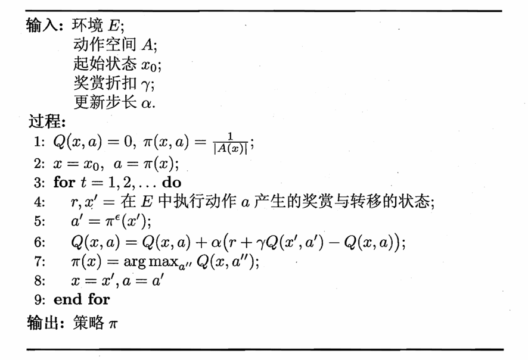

#### Q-学习算法

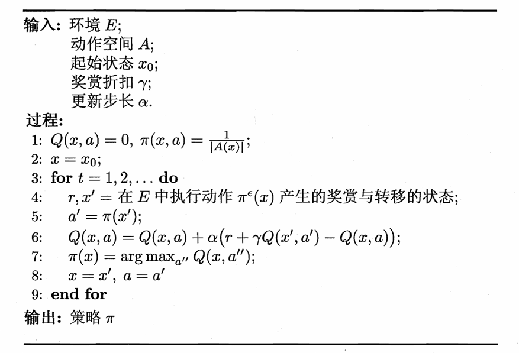

***

## 值函数近似

之前我们一直假定任务在有限状态空间上进行，此时值函数和每个状态一一对应。但是如果状态空间连续（$X=\mathbb{R}^n$），那么这个时候需要近似：

$$V_{\boldsymbol{\theta}}(\mathbf{x})=\boldsymbol{\theta}^T\mathbf{x}$$

其中，$\mathbf{x}$ 为状态向量，$\boldsymbol{\theta}$ 为参数向量。我们希望 $V_{\boldsymbol{\theta}}(\mathbf{x})$ 与真实值函数 $V^{\pi}$ 尽量接近，使用**最小二乘误差**：

$$E\_{\boldsymbol{\theta}}=\mathbb{E}\_{\mathbf{x}\sim\pi}[(V^{\pi}(\mathbf{x})-V\_{\boldsymbol{\theta}}(\mathbf{x}))^2]$$

要让上式关于  $\boldsymbol{\theta}$ 取最小值，最后得到单样本的更新规则：

$$\boldsymbol{\theta}\to\boldsymbol{\theta}+\alpha(V^{\pi}(\mathbf{x})-V\_{\boldsymbol{\theta}}(\mathbf{x}))\mathbf{x}$$

问题就在于 $V^{\pi}$ 是不知道的，但可以借助时序差分学习中的

$$V^{\pi}(\mathbf{x})=r+\gamma V^{\pi}(\mathbf{x}')$$

来替代，得到

$$\boldsymbol{\theta}\to\boldsymbol{\theta}+\alpha(r+\gamma V\_{\boldsymbol{\theta}}(\mathbf{x}')-V\_{\boldsymbol{\theta}}(\mathbf{x}))\mathbf{x}$$

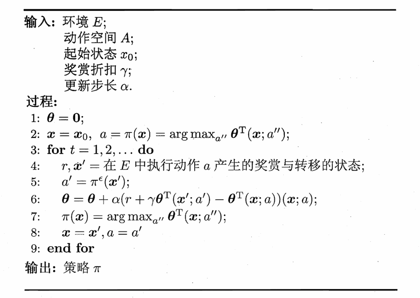

***

## 模仿学习 Imitation Learning

模仿学习相比于经典强化学习，多了人类专家的决策过程范例。

**直接模仿学习：**

假设人类专家的决策轨迹数据为 $\\{\tau_1,\tau_2,\dots,\tau_m\\}$，每条轨迹为

$$\tau_i=\langle s_1^i,a_1^i,s_2^i,a_2^i,\dots,s_{n_i+1}^i\rangle$$

其中 $n_i$ 为第 $i$ 条轨迹中的转移次数。

将所有状态-动作对提取出来：

$$D=\\{(s_1,a_1),(s_2,a_2),\dots,(s_{\sum\limits_{i=1}^mn_i},a_{\sum\limits_{i=1}^mn_i})\\}$$

相当于获得了特征-标记对，可以用普通的机器学习方法学得策略模型，作为强化学习的初始策略，之后再用强化学习进行改进。

**逆强化学习：**

逆强化学习指的是从示范数据中反推出奖赏函数，这个奖赏函数要让示范策略成为最优策略。

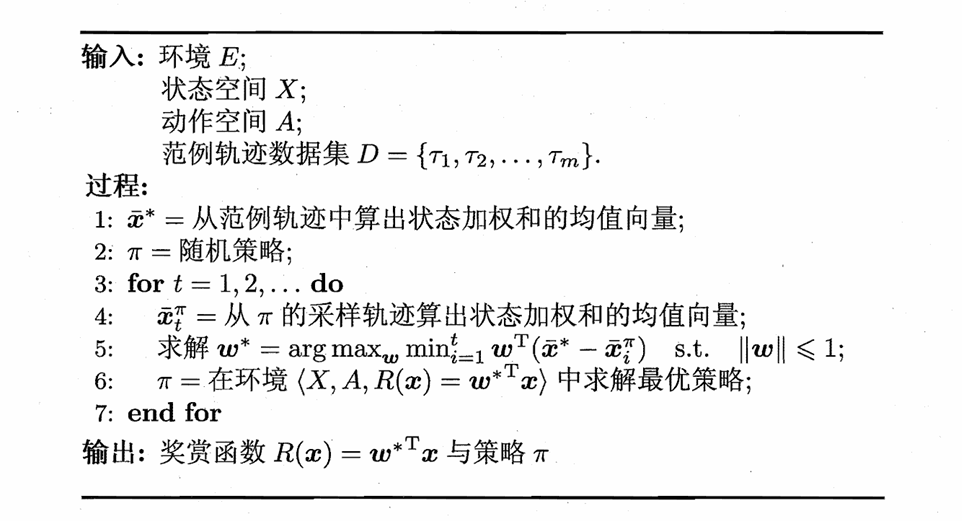