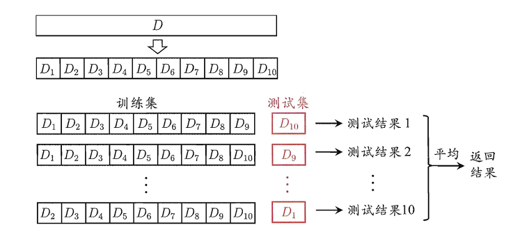
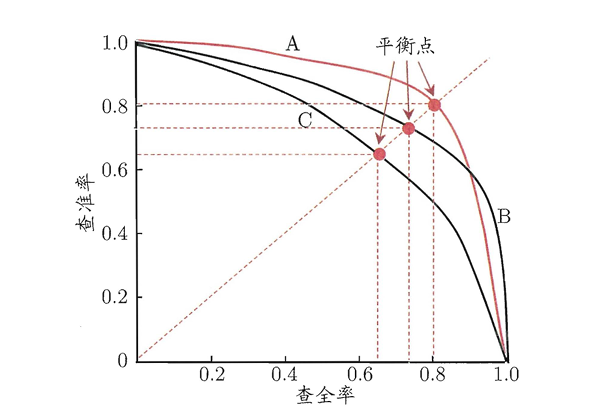
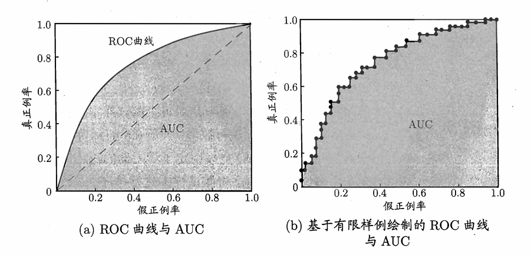
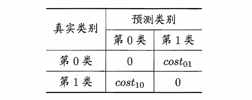
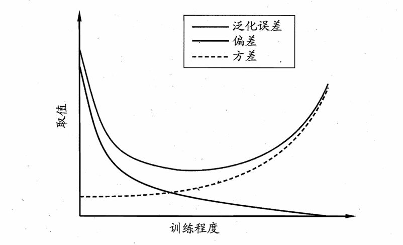

# Chapter2 模型的评估与选择

***

## 评估方法

对于一个含有 $m$ 个样例的数据集 $D=\\{(x_1,y_1), (x_2,y_2), \dots, (x_m,y_m)\\}$，如何产生训练集 $S$ 和测试集 $T$？

### 留出法 Hold-out

直接切分。

* 两个集合尽可能保持数据分布的一致性
* 分层采样，保持类别比例一致
* 一般若干次随机划分，重复实验取平均值

### 交叉验证 Cross-validation

将数据集分层采样划分 $k$ 个大小相似的互斥子集，每次用 $k-1$ 个子集作为训练集，剩下一个子集作为测试集，最终返回 $k$ 个测试结果的均值。

为了减小因样本划分不同而引入的差别，$k$ 折交叉验证通常随机使用不同的划分重复 $p$ 次，最终的评估结果是这 $p$ 次 $k$ 折交叉验证结果的均值。

!!! Success "Definition"
    **留一法（leave-one-out, LOO）：**

    交叉验证的极端，一个数据就是一个子集（$m=k$），不受随机样本划分方式的影响。

### 自助法 Bootstrapping

从大小为 $m$ 的数据集 $D$ 中有放回地随机抽取 $m$ 个样本。被抽中的样本组成训练集（被抽中几次，在训练集中就有几份拷贝），一次都没被抽中的组成测试集。

样本在 $m$ 次采样中始终不被采到的概率是 $(1-\frac{1}{m})^m$，取极限得到：

$$\lim\limits_{m\rightarrow\infty}(1-\frac{1}{m})^m=\frac{1}{e}\approx 0.368$$

!!! Note
    数据集小，难以划分训练集和测试集时，用自助法；  
    数据量足够，用留出法或交叉验证。

***

## 性能度量

如何评价模型的性能？

要评估学习器 $f$ 的性能，就要把预测结果 $f(x)$ 与真实标记 $y$ 进行比较。

回归任务常使用 **均方误差**：

$$E(f;D)=\frac{1}{m}\sum\limits_{i=1}^m(f(x_i)-y_i)^2$$

分类任务常使用：

* **错误率**：分错样本占样本总数的比例
* **精度**：分对样本占样本总数的比例

### 混淆矩阵 Confusion Matrix

常见于信息检索。

$~$|预测结果是正例|预测结果是反例
:---:|:---:|:---:
**真实情况是正例**|$TP$（真正例）|$FN$（假反例）
**真实情况是反例**|$FP$（假正例）|$TN$（真反例）

查准率（precision）：

$$P=\frac{TP}{TP+FP}$$

查全率（recall）：

$$R=\frac{TP}{TP+FN}$$

### P-R 曲线

P-R 曲线适用于二分类问题，绘制步骤如下：

* 分类模型为每个样本输出一个属于正例的概率（置信度）
* 将所有样本按照概率从高到低排序
* 依次选取每个样本的概率作为分类阈值（例如某个样本预测为正例的概率是 0.9，则以 0.9 作为分类阈值）
* 在每个阈值下，重新划分正例和反例，计算相应的查准率和查全率
* 以查全率为横坐标，查准率为纵坐标绘制曲线

一般来说，包围面积越大的学习器越好。也可以比较**平衡点（break-event point, BEP）**：曲线上查准率 = 查全率时的取值。

### F1 度量

F1 度量比平衡点更常用，只有查准率和查全率都高时，F1 才高。

$$F_1=\frac{2\times P\times R}{P+R}=\frac{2\times TP}{\text{样例总数}+TP-TN}$$

比 F1 更一般的形式：

$$F_{\beta}=\frac{(1+\beta^2)\times P\times R}{(\beta^2\times P)+R}$$

* $\beta=1$：标准 F1
* $\beta>1$：更看重查全率（逃犯信息检索）
* $\beta<1$：更看重查准率（商品推荐系统）

### ROC 曲线

全称**受试者工作特征曲线**。

横轴：假正例率 $FPR=\frac{FP}{FP+TN}$

纵轴：真正例率 $TPR=\frac{TP}{TP+FN}$

ROC 曲线的绘制和 P-R 曲线类似，除了横轴和纵轴，其他没有区别。但是，如果测试样例非常有限，则采用走格子的画法：

* 设 $m^+$ 为真实的正例数， $m^-$ 为真实的反例数
* 分类模型为每个样本输出一个属于正例的概率（置信度）
* 将所有样本按照概率从高到低排序
* 从原点 $(0,0)$ 开始，遍历排序后的样本，如果当前样本为真实的正例，则向上移动 $\frac{1}{m^+}$，否则向右移动 $\frac{1}{m^-}$，直到遍历完所有样本

使用走格子画法时，图上每个 $(x_i,y_i)$ 也精确对应了在某个分类阈值下的假正例率和真正例率，这个分类阈值就是排序中第 $i$ 个样本被预测为正例的概率。

根据 ROC 曲线下的面积 **AUC 值（area under curve）** 来评估模型性能。AUC 值越大，模型性能越好。

$$\text{AUC}\approx\sum\limits_{i=1}^{m-1}\frac{(x_{i+1}-x_i)(y_i+y_{i+1})}{2}\text{ （竖着划分成梯形）}$$

AUC 值衡量的是模型是否把正例排在反例前面，即排序质量。

### 代价敏感错误率

不同类型的错误所造成的后果可能不同，因此要为错误赋予**非均等代价**。

因此，我们可以使用**代价矩阵**，其中 $cost_{ij}$ 表示将第 $i$ 类样本预测为第 $j$ 类样本所付出的代价。

在非均等代价下，我们不再最小化错误次数，而是最小化总体代价，对应代价敏感错误率的计算公式为：

$$E(f;D;cost)=\frac{1}{m}(\sum\limits_{x_i\in D^+}I[f(x_i)\neq y_i]\cdot cost_{10}+\sum\limits_{x_i\in D^-}I[f(x_i)\neq y_i]\cdot cost_{01})$$

***

## 比较检验 Hypothesis Test

**假设检验**告诉我们：若在测试集上学习器 A 比 B 好，则 A 的泛化性能是否真的优于 B，以及把握有多大。

假设学习器的测试错误率为 $\hat{\epsilon}$，测试样本从样本总体分布中独立采样而来，测试样本数量为 $m$，则这个学习器对这 $m$ 个样本进行预测的结果是 $\hat{\epsilon}\times m$ 个样本被误分类。

现在我们想知道，如果学习器的泛化错误率为 $\epsilon$，那么在这 $m$ 个样本上也恰好误分类 $\hat{\epsilon}\times m$ 个样本的概率是多少：

$$P(\hat{\epsilon};\epsilon)=C_{m}^{\hat{\epsilon}\times m}\cdot\epsilon^{\hat{\epsilon}\times m}\cdot(1-\epsilon)^{(1-\hat{\epsilon})\times m}$$

这也表示：在 $m$ 个样本的测试集上，泛化错误率为 $\epsilon$ 的学习器被测得测试错误率为 $\hat{\epsilon}$ 的概率。

$P(\hat{\epsilon};\epsilon)$ 对 $\epsilon$ 求偏导，可得当 $\epsilon=\hat{\epsilon}$ 时，概率最大。

### 二项检验 Binomial Test

给定 $\alpha$ 和 $\epsilon_0$，我们想知道：是否有 $1-\alpha$ 的把握认为学习器的泛化错误率 $\epsilon\leqslant\epsilon_0$。

那么我们只需要计算一个临界值 $\overline{\epsilon}$：

$$\overline{\epsilon}=\max\epsilon\quad\text{ s.t. }\sum\limits_{i=\epsilon_0\times m+1}^mC_m^i\epsilon^i(1-\epsilon)^{m-i}<\alpha$$

只要在这 $m$ 个样本上的测试错误率 $\hat{\epsilon}<\overline{\epsilon}$，就有那么多把握。

### T-检验

如果使用的是重复留出法或者交叉验证法，会有 $k$ 个测试错误率 $\hat{\epsilon}_1, \hat{\epsilon}_2, \dots, \hat{\epsilon}_k$，平均值为 $\mu$。

确定了 $k$ 和 $\alpha$，就可以通过查表得到 t 分布的两个临界值 $t_{\alpha/2}$ 和 $t_{-\alpha/2}$。

若 $|\mu-\epsilon_0|$ 位于 $[t_{-\frac{\alpha}{2}},t_{\frac{\alpha}{2}}]$ 范围内，则有 $1-\alpha$ 的把握认为学习器的泛化错误率 $\epsilon=\epsilon_0$。

!!! Warning
    此处省略：交叉验证 T-检验、McNemar 检验、Friedman 检验、Nemenyi 后续检验。

***

## 偏差与方差

!!! Note
    偏差与方差可以用打靶来举例。

    偏差指的是你平均射中的位置与靶心之间的距离。

    方差指的是你每次射击的位置的分散程度。

对测试样本 $x$：

* $y_D$：$x$ 在数据集 $D$ 中的标记（例如人工打上的标记，一般认为就是真实标记，但可能出错）
* $y$：$x$ 的真实标记
* $f(x;D)$：数据集 $D$ 上学得的模型 $f$ 在 $x$ 上的预测标记

以回归任务为例：

**期望：**

$$\overline{f}(x)=\mathbb{E}_D[f(x;D)]$$

**方差：**

$$var(x)=\mathbb{E}_D[(f(x;D)-\overline{f}(x))^2]$$

**噪声：**

$$\varepsilon^2=\mathbb{E}_D[(y_D-y)^2]$$

**偏差：**

$$bias^2(x)=(\overline{f}(x)-y)^2$$

!!! Note
    这里涉及的三处期望都是对训练集 $D$ 的不同采样而言的。

现在，我们假设噪声期望为 $0$（$\mathbb{E}_D[y_D-y]=0$），对泛化误差进行分解：

$$
\begin{align}
E(f;D) & =\mathbb{E}_D[(f(x;D)-y_D)^2] \\\
& =\mathbb{E}_D[(f(x;D)-\overline{f}(x)+\overline{f}(x)-y_D)^2] \\\
& =\mathbb{E}_D[(f(x;D)-\overline{f}(x))^2]+(\overline{f}(x)-y_D)^2+\mathbb{E}_D[2(f(x;D)-\overline{f}(x))(\overline{f}(x)-y_D)] \\\
& =\mathbb{E}_D[(f(x;D)-\overline{f}(x))^2]+\mathbb{E}_D[(\overline{f}(x)-y_D)^2] \\\
& =\mathbb{E}_D[(f(x;D)-\overline{f}(x))^2]+\mathbb{E}_D[(\overline{f}(x)-y+y-y_D)^2] \\\
& =\mathbb{E}_D[(f(x;D)-\overline{f}(x))^2]+\mathbb{E}_D[(\overline{f}(x)-y)^2]+\mathbb{E}_D[(y-y_D)^2]+2\mathbb{E}_D[(\overline{f}(x)-y)(y-y_D)] \\\
& =\mathbb{E}_D[(f(x;D)-\overline{f}(x))^2]+(\overline{f}(x)-y)^2+\mathbb{E}_D[(y-y_D)^2]
\end{align}
$$

!!! Note
    **为什么 $\mathbb{E}_D[2(f(x;D)-\overline{f}(x))(\overline{f}(x)-y_D)]$ 是 $0$？**

    设 $A=f(x;D)-\overline{f}(x)$，$B=\overline{f}(x)-y_D$，因为 $A$ 的随机性来自于训练集的不同，$B$ 的随机性来自于标记的噪声，二者的随机性来源不同，所以 $A$ 和 $B$ 独立。（暂不从数学上严格证明）

    因此，上式可化为：$2\mathbb{E}_D[A]\mathbb{E}_D[B]$

    又有：$\mathbb{E}_D[A]=\mathbb{E}_D[f(x;D)]-\overline{f}(x)=0$

    因此上式为 $0$。

    **为什么 $\mathbb{E}_D[(\overline{f}(x)-y)(y-y_D)]$ 是 $0$？**

    同理，但此时期望为 $0$ 是因为假设噪声期望为 $0$。

综上：

$$E(f;D)=var(x)+bias^2(x)+\varepsilon^2$$

即**泛化误差可分解为方差、偏差与噪声之和**。

**偏差-方差窘境：**

训练不足时，学习器拟合能力弱，此时偏差主导泛化错误率；

随着训练程度加深，学习器拟合能力逐渐增强，方差逐渐主导泛化错误率。

