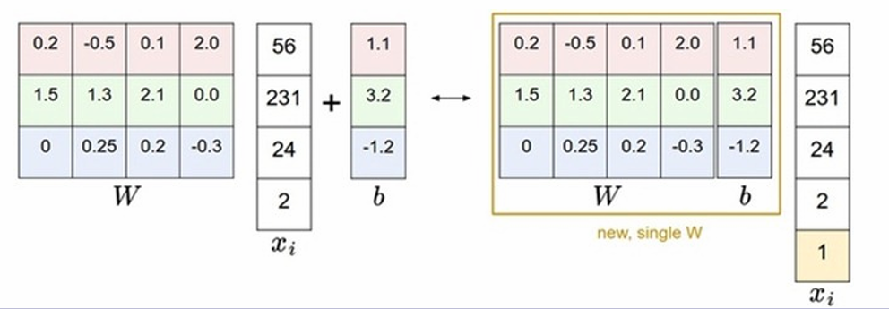
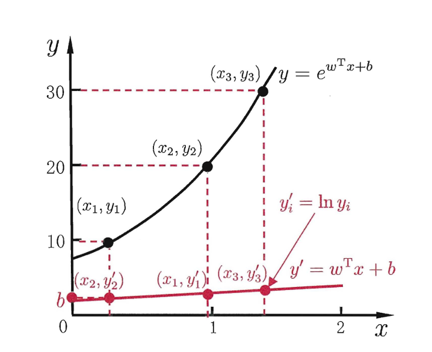
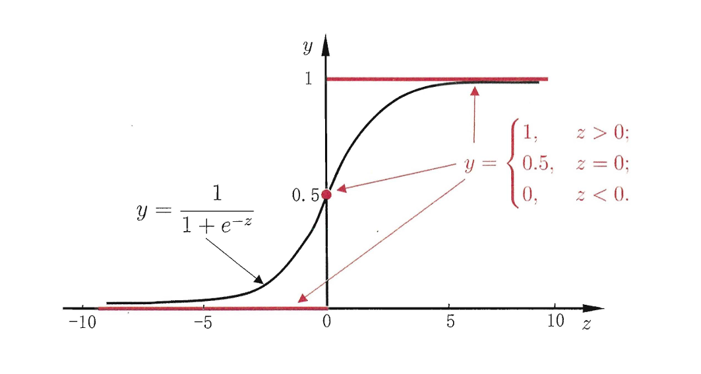
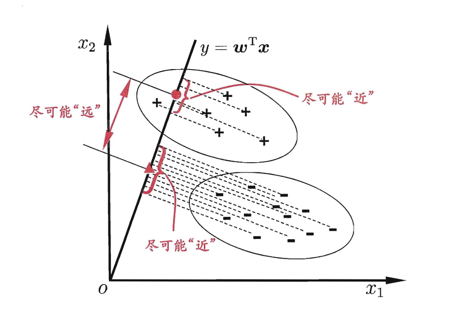
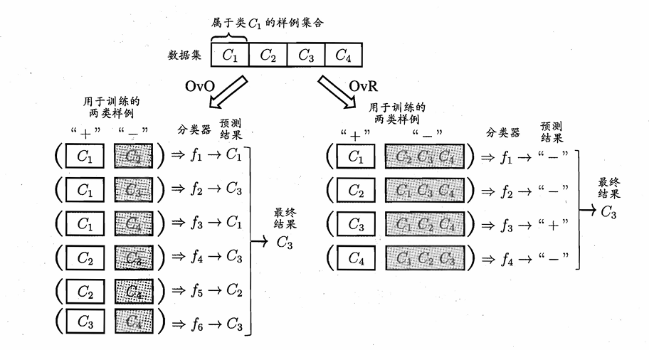
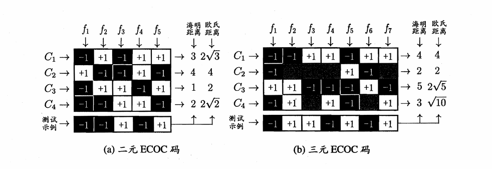
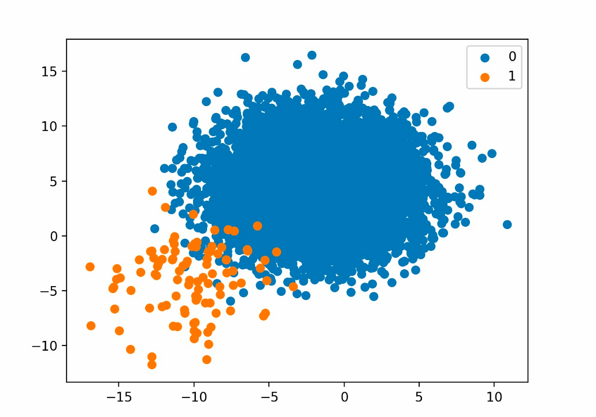

# Chapter3 线性模型

***

## 基本形式

一般形式：

$$f(\mathbf{x})=w_1x_1+w_2x_2+...+w_dx_d+b$$

向量形式：

$$f(\mathbf{x})=\mathbf{w}^T\mathbf{x}+b$$

其中，$\mathbf{w}=(w_1;w_2;...;w_d)$，$\mathbf{x}=(x_1;x_2;...;x_d)$。

***

## 线性回归 Linear Regression

线性回归的目的是学得一个线性模型，尽可能准确地预测实值的输出（连续值）。简单来说，就是**直线拟合**。

!!! Note
    离散属性处理：

    * 有序关系：连续化为连续值
    * 无序关系：若有 $k$ 个可能的属性值，则转换为$k$维的独热编码。

### 最小二乘法 Least Square Method

最小二乘法用于评估线性回归模型的拟合程度，以单元线性回归为例（$x_i$ 和 $w$ 均为标量，即只考虑一个属性），我们要最小化**均方误差**：

$$E_{(w,b)}=\sum\limits_{i=1}^m(y_i-wx_i-b)^2$$

参数对应的梯度：

$$\frac{\partial E}{\partial w}=2[w\sum\limits_{i=1}^mx_i^2-\sum\limits_{i=1}^m(y_i-b)x_i]$$

$$\frac{\partial E}{\partial b}=2[mb-\sum\limits_{i=1}^m(y_i-wx_i)]$$

令梯度为 $0$，解得：

$$w=\frac{\sum\limits_{i=1}^m[y_i(x_i-\overline{x})]}{\sum\limits_{i=1}^mx_i^2-\frac{1}{m}(\sum\limits_{i=1}^mx_i)^2}$$

$$b=\frac{1}{m}\sum\limits_{i=1}^m(y_i-wx_i)$$

### 多元线性回归 Multivariate Linear Regression

现在考虑多属性的线性回归，每个 $\mathbf{x}_i$ 为 $d$ 维列向量。

通过齐次表达，$\mathbf{w}$ 和 $b$ 可以被吸收入向量形式 $\hat{\mathbf{w}}=(\mathbf{w};b)$：

数据集表示为

$$\mathbf{X}=\begin{pmatrix}
x_{11} & x_{12} & ... & x_{1d} & 1 \\\
x_{21} & x_{22} & ... & x_{2d} & 1 \\\
... & ... & ... & ... & ... \\\
x_{m1} & x_{m2} & ... & x_{md} & 1
\end{pmatrix}=\begin{pmatrix}
\mathbf{x}_1^T & 1 \\\
\mathbf{x}_2^T & 1 \\\
... & ... \\\
\mathbf{x}_m^T & 1
\end{pmatrix}$$

$$\mathbf{y}=(y_1;y_2;...;y_m)$$

因此我们要最小化均方误差

$$E_{\hat{\mathbf{w}}}=(\mathbf{y}-\mathbf{X}\hat{\mathbf{w}})^T(\mathbf{y}-\mathbf{X}\hat{\mathbf{w}})$$

对 $\hat{\mathbf{w}}$ 求导得：

$$\frac{\partial E_{\hat{\mathbf{w}}}}{\partial \hat{\mathbf{w}}}=2\mathbf{X}^T(\mathbf{X}\hat{\mathbf{w}}-\mathbf{y})$$

令导数为 $0$ 即可得到解。若 $\mathbf{X}^T\mathbf{X}$ 是满秩矩阵或正定矩阵，则 $\hat{\mathbf{w}}$ 的最优解

$$\hat{\mathbf{w}}^*=(\mathbf{X}^T\mathbf{X})^{-1}\mathbf{X}^T\mathbf{y}$$

此时的线性回归模型为

$$f(\mathbf{x}_i)=\mathbf{x}_i^T(\mathbf{X}^T\mathbf{X})^{-1}\mathbf{X}^T\mathbf{y}$$

!!! Note
    若 $\mathbf{X}^T\mathbf{X}$ 不是满秩矩阵或正定矩阵，则引入正则化。

### 广义线性模型 Generalized Linear Model

$$y=g^{-1}(\mathbf{w}^T\mathbf{x}+b)$$

其中，$g$ 为**联系函数（link function）**，要求单调可微。

**对数线性回归（log-linear regression）** $\ln y =\mathbf{w}^T\mathbf{x}+b$ 是 $g=\ln(\cdot)$ 的情况：

***

## 对数几率回归 Logistic Regression

### 对数几率回归 Logistic Regression

线性模型的预测值 $z=\mathbf{w}^T\mathbf{x}+b$ 是实值，需要转换为 $0/1$。如果直接使用**单位阶跃函数（unit-step function）**：

$$y=\begin{cases}
    0 & z<0 \\\
    \text{都可以} & z=0 \\\
    1 & z>0
\end{cases}$$

会有不连续的问题，因此使用**对数几率函数（logistic function）** 替代。

$$y=\frac{1}{1+e^{-z}}=\frac{1}{1+e^{-(\mathbf{w}^T\mathbf{x}+b)}}$$

得到的结果是**样本被分类为正例的概率**（而不是直接的分类结果）。从后验概率的角度来看：$p(y=1|\mathbf{x})=y$， $p(y=0|\mathbf{x})=1-y$。将样本作为正例的相对可能性的对数称为**对数几率（log odds）**：

$$\ln(\frac{y}{1-y})=\ln\frac{p(y=1|\mathbf{x})}{p(y=0|\mathbf{x})}=\mathbf{w}^T\mathbf{x}+b$$

### 极大似然法 Maximum Likelihood

如果使用对数几率回归，有新的方法来估计参数 $\mathbf{w}$ 和 $b$。

我们可以使用**极大似然法**，尝试调整 $\mathbf{w}$ 和 $b$，最大化**对数似然函数**，从而最大化样本属于其真实分类的概率：

$$l(\mathbf{w},b)=\sum\limits_{i=1}^m\ln p(y_i|\mathbf{x}_i;\mathbf{w},b)$$

令 $\beta=(\mathbf{w};b)$，$\hat{\mathbf{x}}=(\mathbf{x};1)$，则 $\mathbf{w}^T\mathbf{x}+b$ 可简写为 $\beta^T\hat{\mathbf{x}}$。

再令 $p_1(\hat{\mathbf{x}}_i;\beta)=p(y=1|\hat{\mathbf{x}}_i;\beta)$，$p_0(\hat{\mathbf{x}}_i;\beta)=p(y=0|\hat{\mathbf{x}}_i;\beta)$，则

$$p(y_i|\mathbf{x}_i;\mathbf{w},b)=y_ip_1(\hat{\mathbf{x}}_i;\beta)+(1-y_i)p_0(\hat{\mathbf{x}}_i;\beta)$$

代入对数似然函数并化简得：

$$l(\beta)=\sum\limits_{i=1}^m(y_i\beta^T\hat{\mathbf{x}}_i-\ln(1+e^{\beta^T\hat{\mathbf{x}}_i}))$$

然后再取个反，求最小化即可。

!!! Note
    $$\begin{align}
    \ln p(y_i|\mathbf{x}_i;\mathbf{w},b) & =\ln[y_ip_1(\hat{\mathbf{x}}_i;\beta)+(1-y_i)p_0(\hat{\mathbf{x}}_i;\beta)] \\\
    & =\ln[y_i\cdot\frac{1}{1+e^{-\beta^T\hat{\mathbf{x}}_i}}+(1-y_i)\cdot\frac{e^{-\beta^T\hat{\mathbf{x}}_i}}{1+e^{-\beta^T\hat{\mathbf{x}}_i}}] \\\
    & =\ln(\frac{y_ie^{\beta^T\hat{\mathbf{x}}_i}+1-y_i}{1+e^{\beta^T\hat{\mathbf{x}}_i}}) \\\
    & =\ln(y_ie^{\beta^T\hat{\mathbf{x}}_i}+1-y_i)-\ln(1+e^{\beta^T\hat{\mathbf{x}}_i})
    \end{align}$$

    前一项：

    当 $y_i=1$ 时，$\ln(y_ie^{\beta^T\hat{\mathbf{x}}_i}+1-y_i)=\beta^T\hat{\mathbf{x}}_i=y_i\beta^T\mathbf{x}_i$；

    当 $y_i=0$ 时，$\ln(y_ie^{\beta^T\hat{\mathbf{x}}_i}+1-y_i)=0=y_i\beta^T\mathbf{x}_i$。

***

## 线性判别分析 Linear Discriminant Analysis (LDA)

LDA 的思想是：**找到最佳的投影方向（一条直线），使得同类样例的投影点尽可能接近，异类样例的投影点尽可能远离**。LDA 的输入是样本数据，输出是投影方向 $\mathbf{w}$。对于每个新样本，将其投影到 $\mathbf{w}$ 上，根据投影点的位置来决定其类别。

### 二分类 LDA

* $D=\\{(\mathbf{x}_1,y_1),(\mathbf{x}_2,y_2),...,( \mathbf{x}_m,y_m)\\}$：$\mathbf{x}_i$ 是 $n$ 维向量，$y_i\in\\{0,1\\}$
* $N_j$：第 $j$ 类样本的个数
* $X_j$：第 $j$ 类样本的集合
* $\boldsymbol{\mu}_j$：第 $j$ 类样本的均值
* $\boldsymbol{\Sigma}_j$：第 $j$ 类样本的协方差矩阵（去掉分母）[跳转指路](../../Mathematics/Probability/Chapter3.md#third-chapter)

$\boldsymbol{\mu}_j$ 的维度为 $n\times 1$，表达式为：

$$\boldsymbol{\mu}\_j=\frac{1}{N_j}\sum\limits_{\mathbf{x}\in X_j}\mathbf{x}$$

$\boldsymbol{\Sigma}_j$ 的维度为 $n\times n$，表达式为：

$$\boldsymbol{\Sigma}\_j=\sum\limits_{\mathbf{x}\in X_j}(\mathbf{x}-\boldsymbol{\mu}_j)(\mathbf{x}-\boldsymbol{\mu}_j)^T$$

LDA 的第一个目标是**最大化类间距离**。两个类别的中心点 $\boldsymbol{\mu}_0$，$\boldsymbol{\mu}_1$ 在 $\mathbf{w}$ 方向上的投影分别为 $\mathbf{w}^T\boldsymbol{\mu}_0$，$\mathbf{w}^T\boldsymbol{\mu}_1$，因此我们要最大化下面的式子：

$$||\mathbf{w}^T\boldsymbol{\mu}_0-\mathbf{w}^T\boldsymbol{\mu}_1||_2^2$$

LDA 的第二个目标是**最小化类内距离**。两个类别在投影后的协方差分别为 $\mathbf{w}^T\boldsymbol{\Sigma}_0\mathbf{w}$，$\mathbf{w}^T\boldsymbol{\Sigma}_1\mathbf{w}$，因此我们要最小化下面的式子：

$$\mathbf{w}^T\boldsymbol{\Sigma}_0\mathbf{w}+\mathbf{w}^T\boldsymbol{\Sigma}_1\mathbf{w}$$

综上，我们的目标为最大化下面的式子：

$$J=\frac{||\mathbf{w}^T\boldsymbol{\mu}_0-\mathbf{w}^T\boldsymbol{\mu}_1||_2^2}{\mathbf{w}^T\boldsymbol{\Sigma}_0\mathbf{w}+\mathbf{w}^T\boldsymbol{\Sigma}_1\mathbf{w}}=\frac{\mathbf{w}^T(\boldsymbol{\mu}_0-\boldsymbol{\mu}_1)(\boldsymbol{\mu}_0-\boldsymbol{\mu}_1)^T \mathbf{w}}{\mathbf{w}^T(\boldsymbol{\Sigma}_0+\boldsymbol{\Sigma}_1)\mathbf{w}}$$

定义**类内散度矩阵** $\mathbf{S}_w$：

$$\mathbf{S}_w=\boldsymbol{\Sigma}_0+\boldsymbol{\Sigma}_1$$

定义**类间散度矩阵** $\mathbf{S}_b$：

$$\mathbf{S}_b=(\boldsymbol{\mu}_0-\boldsymbol{\mu}_1)(\boldsymbol{\mu}_0-\boldsymbol{\mu}_1)^T$$

则优化目标可重写为

$$J=\frac{\mathbf{w}^T\mathbf{S}_b\mathbf{w}}{\mathbf{w}^T\mathbf{S}_w\mathbf{w}}$$

我们将问题一般化，定义

$$R(A,B,x)=\frac{x^TAx}{x^TBx}$$

该式称为**广义瑞利商（generalized Rayleigh quotient）**，我们的目标是求其最大值。要用到**拉格朗日乘子法**。[跳转指路](../../Mathematics/Mathematical%20Analysis2/Chapter4.md#second-chapter)

若我们固定 $x^HBx=c\neq 0$（原本要求的 $\mathbf{w}$ 只要知道方向就行），则就是要在这个限制下求得 $x^TAx$ 的最大值。

引入拉格朗日乘子，将其转化为拉格朗日函数的无约束极值问题：

$$L(x,\lambda)=x^TAx-\lambda(x^HBx-c)$$

在上式的极值处，应满足

$$\frac{\partial L(x,\lambda)}{\partial x}=0$$

$$Ax-\lambda Bx=0$$

$$B^{-1}Ax=\lambda x$$

回到 LDA 问题中，若 $J$ 要取极值，则应满足

$$\mathbf{S}_b\mathbf{w}=\lambda \mathbf{S}_w\mathbf{w}$$

于是对于任意向量 $\mathbf{w}$，都有

$$\mathbf{S}_w\mathbf{w}=\frac{1}{\lambda}(\boldsymbol{\mu}_0-\boldsymbol{\mu}_1)(\boldsymbol{\mu}_0-\boldsymbol{\mu}_1)^T\mathbf{w}=(\boldsymbol{\mu}_0-\boldsymbol{\mu}_1)[\frac{1}{\lambda}(\boldsymbol{\mu}_0-\boldsymbol{\mu}_1)^T\mathbf{w}]$$

中括号内的部分是一个标量，因此 $\mathbf{S}_w\mathbf{w}$ 与 $(\boldsymbol{\mu}_0-\boldsymbol{\mu}_1)$ 方向相同。

由于我们不用知道 $\mathbf{w}$ 的大小，只要确定方向，所以我们可以直接求

$$\mathbf{w}=\mathbf{S}_w^{-1}(\boldsymbol{\mu}_0-\boldsymbol{\mu}_1)$$

通常对 $\mathbf{S}_w$ 进行**奇异值分解**：

$$\mathbf{S}_w=\mathbf{U}\boldsymbol{\Sigma}\mathbf{V}^T$$

其中，$\boldsymbol{\Sigma}$ 是 $\mathbf{S}_w$ 的奇异值组成的对角矩阵，这样可以得到

$$\mathbf{S}_w^{-1}=\mathbf{V}\boldsymbol{\Sigma}^{-1}\mathbf{U}^T$$

最终可以得到 $\mathbf{w}$，即 LDA 的投影方向。

!!! Note
    **从 $A$ 到 $A^{-1}$：**

    * 求 $A^TA$
    * 求 $A^TA$ 的特征值：$|\lambda E-A^TA|=0$
    * 特征值开平方得到 $A$ 的奇异值，排列得到 $\boldsymbol{\Sigma}$
    * $\mathbf{U}$ 的列向量为 $A A^T$ 的单位特征向量，$\mathbf{V}$ 的列向量为 $A^T A$ 的单位特征向量（$(\lambda E-A^TA)x=0$）

### 多分类 LDA

可以将 LDA 推广到多分类任务中，假设一共有 $N$ 个类，且第 $i$ 类的样本数为 $m_i$。

这个时候，类内散度矩阵重写为

$$\mathbf{S}\_w=\sum\limits_{i=1}^N\mathbf{\Sigma}\_i=\sum\limits_{i=1}^N\sum\limits_{\mathbf{x}\in X_i}(\mathbf{x}-\boldsymbol{\mu}_i)(\mathbf{x}-\boldsymbol{\mu}_i)^T$$

再新定义一个**全局散度矩阵**（其中 $\boldsymbol{\mu}$ 为全局均值）：

$$\mathbf{S}\_t=\sum\limits_{i=1}^m(\mathbf{x}_i-\boldsymbol{\mu})(\mathbf{x}_i-\boldsymbol{\mu})^T=\mathbf{S}_b+\mathbf{S}_w$$

那么就可以得到重写后的类间散度矩阵：

$$\mathbf{S}\_b=\mathbf{S}\_t-\mathbf{S}\_w=\sum\limits_{i=1}^N m_i(\boldsymbol{\mu}_i-\boldsymbol{\mu})(\boldsymbol{\mu}_i-\boldsymbol{\mu})^T$$

!!! Tip "Proof"
    $$\mathbf{x}-\boldsymbol{\mu}=(\mathbf{x}-\boldsymbol{\mu}_i)+(\boldsymbol{\mu}_i-\boldsymbol{\mu})$$

    $$
    \begin{align}
    \mathbf{S}\_t & =\sum\limits_{i=1}^N\sum\limits_{\mathbf{x}\in X_i}[(\mathbf{x}-\boldsymbol{\mu}\_i)+(\boldsymbol{\mu}\_i-\boldsymbol{\mu})][(\mathbf{x}-\boldsymbol{\mu}\_i)+(\boldsymbol{\mu}\_i-\boldsymbol{\mu})]^T \\\
    & =\sum\limits_{i=1}^N\sum\limits_{\mathbf{x}\in X_i}[(\mathbf{x}-\boldsymbol{\mu}\_i)(\mathbf{x}-\boldsymbol{\mu}\_i)^T+(\boldsymbol{\mu}\_i-\boldsymbol{\mu})(\boldsymbol{\mu}\_i-\boldsymbol{\mu})^T+(\mathbf{x}-\boldsymbol{\mu}\_i)(\boldsymbol{\mu}_i-\boldsymbol{\mu})^T+(\boldsymbol{\mu}\_i-\boldsymbol{\mu})(\mathbf{x}-\boldsymbol{\mu}\_i)^T]
    \end{align}
    $$

    第一项：

    $$\sum\limits_{i=1}^N\sum\limits_{\mathbf{x}\in X_i}(\mathbf{x}-\boldsymbol{\mu}_i)(\mathbf{x}-\boldsymbol{\mu}_i)^T=\mathbf{S}_w$$

    第二项：

    $$\sum\limits_{i=1}^N\sum\limits_{\mathbf{x}\in X_i}(\boldsymbol{\mu}_i-\boldsymbol{\mu})(\boldsymbol{\mu}_i-\boldsymbol{\mu})^T=\mathbf{S}_b$$

    第三项：

    $$\sum\limits_{i=1}^N\sum\limits_{\mathbf{x}\in X_i}(\mathbf{x}-\boldsymbol{\mu}\_i)(\boldsymbol{\mu}\_i-\boldsymbol{\mu})^T=\sum\limits_{i=1}^N(\sum\limits_{\mathbf{x}\in X_i}(\mathbf{x}-\boldsymbol{\mu}\_i))(\boldsymbol{\mu}\_i-\boldsymbol{\mu})^T=0$$

    第四项：

    $$\sum\limits_{i=1}^N\sum\limits_{\mathbf{x}\in X_i}(\boldsymbol{\mu}\_i-\boldsymbol{\mu})(\mathbf{x}-\boldsymbol{\mu}\_i)^T=\sum\limits_{i=1}^N(\boldsymbol{\mu}\_i-\boldsymbol{\mu})(\sum\limits_{\mathbf{x}\in X_i}(\mathbf{x}-\boldsymbol{\mu}\_i)^T)=0$$

多分类 LDA 可以有多种实现方法，使用 $\mathbf{S}_b$、$\mathbf{S}_w$、$\mathbf{S}_t$ 三者中任意两个即可。最常见的优化目标是：

$$\max\limits_{\mathbf{W}}\frac{tr(\mathbf{W}^T\mathbf{S}_b\mathbf{W})}{tr(\mathbf{W}^T\mathbf{S}_w\mathbf{W})}$$

其中，$\mathbf{W}$ 为投影矩阵，维度为 $d\times (N-1)$ ，最优解为 $\mathbf{S}_w^{-1}\mathbf{S}_b$ 的 $N-1$ 个最大特征值对应的特征向量组成的矩阵，可以将数据投影到 $N-1$ 维空间中。

***

## 多分类学习

在多分类任务中，常常利用二分类学习器来解决问题。可以对问题进行拆分，为拆出的每个二分类任务训练一个分类器，然后再对每个分类器的预测结果进行集成得到最终结果。

### 一对一 OvO

拆分阶段：

$N$ 个类别两两配对，形成 $\frac{N(N-1)}{2}$ 个二分类任务及对应的学习器。

测试阶段：

每个学习器对测试样本进行预测，得到 $\frac{N(N-1)}{2}$ 个预测结果，然后投票表决。

### 一对其余 OvR

拆分阶段：

某一类作为正例，其他作为反例，形成 $N$ 个二分类任务及对应的学习器。

测试阶段：

每个学习器对测试样本进行预测，得到 $N$ 个预测结果。若只有一个预测为正例，则将该类别作为最终预测结果；若有多个预测为正例，则选择置信度最高的类别作为最终预测结果。

### 多对多 MvM

若干类作为正例，若干类作为反例。使用**纠错输出码（ECOC）**。

编码阶段：

对 $N$ 个类别做 $M$ 次划分，每次划分都将一部分类别划为正例，另一部分类别划为反例。这样，对于每个类别，都有一个长度为 $M$ 的二进制编码，每一位表示在第 $i$ 次划分中该类别是正例还是反例。

解码阶段：

当有一个新样本需要分类时，使用 $M$ 个二分类器对该样本进行预测，得到一个长度为 $M$ 的预测码。然后，将该预测码与每个类别的编码进行比较，选择距离最近的类别作为最终预测结果。

***

## 类别不平衡问题

类别不平衡问题，指的是不同类别训练样例数相差很大（正例少，负例多）。

解决方法：

* 欠采样（undersampling）：减少负例样本数
* 过采样（oversampling）：增加正例样本数
* 阈值移动（threshold-moving）：调整分类阈值：$\frac{y'}{1-y'}=\frac{y}{1-y}\times\frac{m^-}{m^+}$