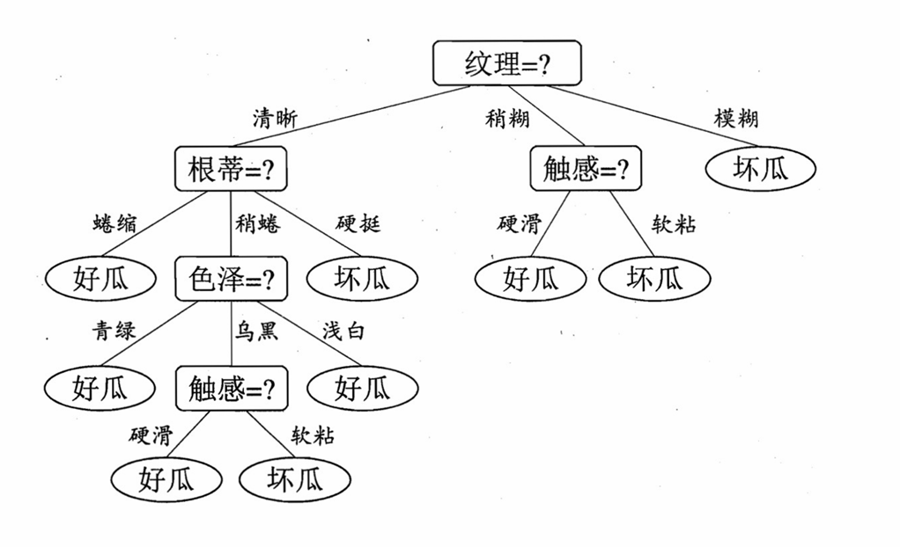
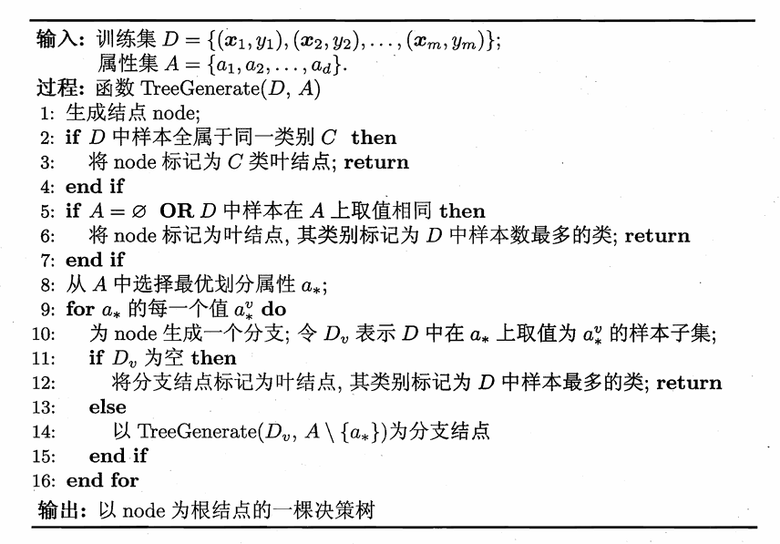
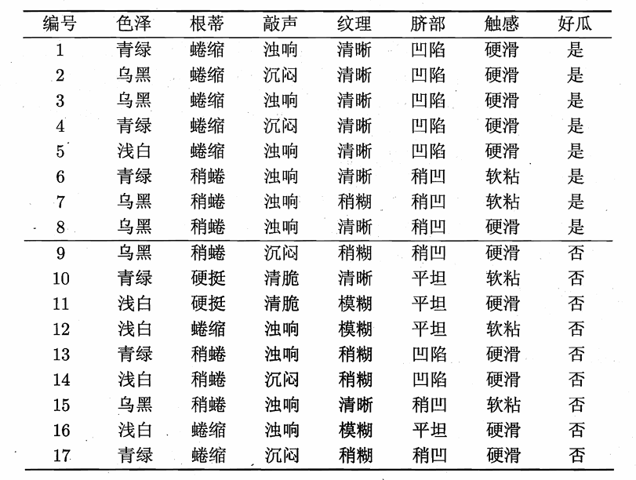
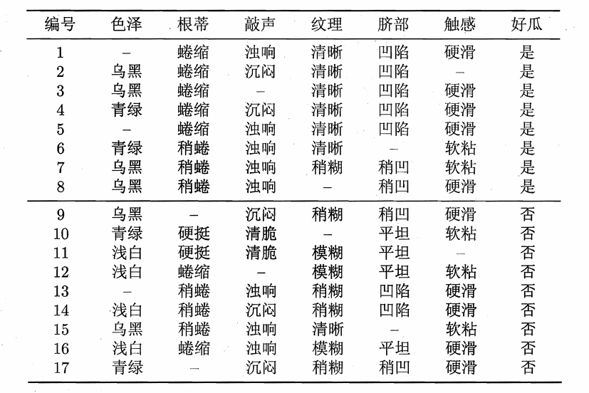

# Chapter4 决策树

***

## 划分选择

决策树学习的关键在于**如何选择最优划分属性**。我们希望决策树的分支节点所包含的样本尽可能属于同一类别，即节点的**纯度（purity）** 越来越高。有以下三种划分依据：

### 信息增益 Information Gain

**信息熵（information entropy）：**

信息熵用于度量样本集合的纯度。设当前样本集合 $D$ 中第 $k$ 类样本比例为 $p_k$，总类别数为 $|\mathcal{Y}|$，则信息熵

$$\text{Ent}(D)=-\sum\limits_{k=1}^{|\mathcal{Y}|}p_k\log_2p_k$$

信息熵越小，纯度越高。

!!! Note
    若 $p_k=0$，则定义 $p_k\log_2p_k=0$。

    $\text{Ent}(D)$ 的最小值为 $0$，最大值为 $\log_2|\mathcal{Y}|$。

**信息增益（information gain）：**

若离散属性 $a$ 有 $V$ 个可能的取值，在 $D$ 上根据 $a$ 划分，得到 $\\{D^1,D^2,...,D^V\\}$。用属性 $a$ 对样本集合 $D$ 进行划分所获得的信息增益为

$$\text{Gain}(D,a)=\text{Ent}(D)-\sum\limits_{v=1}^V\frac{|D^v|}{|D|}\text{Ent}(D^v)$$

信息增益越大，说明用 $a$ 划分所获得的纯度提升越大。因此，决策树每个节点的划分可以由信息增益决定。

!!! Example
    

    以上述数据集 $D$ 为例，$|\mathcal{Y}|=2$，正例占 $p_1=\frac{8}{17}$，反例占 $p_2=\frac{9}{17}$。因此可以算出根节点的信息熵为

    $$\text{Ent}(D)=-(\frac{8}{17}\log_2\frac{8}{17}+\frac{9}{17}\log_2\frac{9}{17})\approx 0.998$$

    然后，要计算出当前属性集合 {色泽、根蒂、敲声、纹理、脐部、触感} 中每个属性的信息增益。
    
    以“色泽”为例，其有三个可能的取值 {青绿、乌黑、浅白}，根据“色泽”划分后得到对应的三个子集 $D^1$、$D^2$ 和 $D^3$。其中，$D^1$ 有 6 个样本，正例占比 $\frac{3}{6}$，反例占比 $\frac{3}{6}$；$D^2$ 有 6 个样本，正例占比 $\frac{4}{6}$，反例占比 $\frac{2}{6}$；$D^3$ 有 5 个样本，正例占比 $\frac{1}{5}$，反例占比 $\frac{4}{5}$。因此，可以计算出划分后这三个子集的信息熵为

    $$\text{Ent}(D^1)=-(\frac{3}{6}\log_2\frac{3}{6}+\frac{3}{6}\log_2\frac{3}{6})=1.000$$

    $$\text{Ent}(D^2)=-(\frac{4}{6}\log_2\frac{4}{6}+\frac{2}{6}\log_2\frac{2}{6})\approx 0.918$$

    $$\text{Ent}(D^3)=-(\frac{1}{5}\log_2\frac{1}{5}+\frac{4}{5}\log_2\frac{4}{5})\approx 0.722$$

    于是，可以算出属性“色泽”的信息增益为

    $$\text{Gain}(D,\text{色泽})=0.998-(\frac{6}{17}\times 1.000+\frac{6}{17}\times 0.918+\frac{5}{17}\times 0.722)\approx 0.109$$

    类似地，可以计算出其他属性的信息增益：

    $$\text{Gain}(D,\text{根蒂})\approx 0.143$$

    $$\text{Gain}(D,\text{敲声})\approx 0.141$$

    $$\text{Gain}(D,\text{纹理})\approx 0.381$$

    $$\text{Gain}(D,\text{脐部})\approx 0.289$$

    $$\text{Gain}(D,\text{触感})\approx 0.006$$

    其中，属性“纹理”的信息增益最大，因此选择“纹理”作为根节点划分属性。以此类推。

!!! Note
    信息增益的缺点：偏好取值数目较多的属性。

### 增益率 Gain Ratio

增益率对信息增益进行规范化，改正其不足。定义为

$$\text{Gain\_ratio}(D,a)=\frac{\text{Gain}(D,a)}{\text{IV}(a)}$$

$$\text{IV}(a)=-\sum\limits_{v=1}^V\frac{|D^v|}{|D|}\log_2\frac{|D^v|}{|D|}$$

!!! Note
    增益率的缺点：偏好取值数目较少的属性。

    C4.5 算法先找出信息增益高于平均水平的属性，再从中选增益率最高的属性。

### 基尼指数 Gini Index

基尼值是另一种度量纯度的指标：

$$\text{Gini}(D)=\sum\limits_{k=1}^{|\mathcal{Y}|}\sum\limits_{k'\neq k}p_kp_{k'}=1-\sum\limits_{k=1}^{|\mathcal{Y}|}p_k^2$$

基尼值反映了从数据集中随机抽取两个样本，其类别标记不一致的概率。基尼值越小，纯度越高。

属性 $a$ 的基尼指数定义为

$$\text{Gini\_index}(D,a)=\sum\limits_{v=1}^V\frac{|D^v|}{|D|}\text{Gini}(D^v)$$

选择基尼指数最小的属性进行划分。

!!! Note
    ID3 决策树：信息熵 + 信息增益  
    C4.5 决策树：信息熵 + 增益率  
    CART 决策树：基尼值 + 基尼指数

***

## 剪枝处理 Pruning

决策树分支过多时容易过拟合。

### 预剪枝 Prepruning

在决策树生成过程中，在每个节点划分前进行估计，如果当前节点的划分不能带来决策树泛化性能的提升，则停止划分并将该节点设为叶节点，类别标记为当前节点中样本数最多的类别。**（边建树，边剪枝）**

通过验证集来验证剪枝效果，分别计算划分前（即直接将该节点作为叶子节点）和划分后的验证集准确率，判断是否需要划分。

优点：

* 降低过拟合风险
* 减少时间开销

缺点：

* 增加欠拟合风险

### 后剪枝 Post-pruning

其实和预剪枝类似，只不过变了个剪枝时间。**（先建树，后剪枝）**

优点：

* 相比于预剪枝会保留更多分支，欠拟合风险更小，泛化性能更好

缺点：

* 因为要生成完整的决策树，因此时间开销更大

***

## 连续值与缺失值

### 连续值处理

决策树只能处理离散属性，对于连续属性则需要**离散化**，最简单的策略是**二分法（bi-partition）**。

第一步：

假定连续属性 $a$ 在样本集合 $D$ 上有 $n$ 个不同的取值 $a^1<a^2<...<a^n$，则可以构造包含 $n-1$ 个元素的候选划分点集合

$$T_a=\\{\frac{a^i+a^{i+1}}{2}|1\leqslant i\leqslant n-1\\}$$

第二步：

每个候选划分点 $t\in T_a$ 可以将样本集合 $D$ 划分为两个子集 $D_t^+$ 和 $D_t^-$，前者包含属性 $a$ 上取值大于 $t$ 的样本，后者包含属性 $a$ 上取值小于等于 $t$ 的样本。

对于每个 $t$，计算对应划分的信息增益，最大的信息增益就是属性 $a$ 的信息增益，对应的划分点即为 $t$。

!!! Note
    与离散属性不同，若当前节点划分属性为连续属性，该属性依然可以作为其后代节点的划分属性。

### 缺失值处理

决策树要求所有样本的属性都完整，但样本的某一些属性值经常会缺失。

**问题一：在属性缺失的情况下，如何选择划分属性？**

给定训练集合 $D$ 和属性 $a$，令$\tilde{D}$ 表示 $D$ 中在属性 $a$ 上取值不缺失的样本子集，我们可以仅根据 $\tilde{D}$ 来判断优劣。

设属性 $a$ 有 $V$ 个可能取值 $\\{a^1,a^2,...,a^V\\}$，在 $\tilde{D}$ 上根据 $a$ 划分，得到 $\\{\tilde{D^1},\tilde{D^2},...,\tilde{D^V}\\}$。

设类别有 $|\mathcal{Y}|$ 个，在 $\tilde{D}$ 上根据类别划分，得到 $\\{\tilde{D_1},\tilde{D_2},...,\tilde{D_{|\mathcal{Y}|}}\\}$。

我们为每个样本 $x$ 赋予一个权重 $w_x$，并定义无缺失值样本的比例

$$\rho=\frac{\sum\limits_{x\in\tilde{D}}w_x}{\sum\limits_{x\in D}w_x}$$

无缺失值样本中类别 $k$ 的比例

$$\tilde{p_k}=\frac{\sum\limits_{x\in\tilde{D_k}}w_x}{\sum\limits_{x\in\tilde{D}}w_x}$$

无缺失值样本中属性 $a$ 取值为 $a^v$ 的比例

$$\tilde{r_v}=\frac{\sum\limits_{x\in\tilde{D^v}}w_x}{\sum\limits_{x\in\tilde{D}}w_x}$$
基于上述定义，可将信息增益的计算式推广为

$$\text{Ent}(\tilde{D})=-\sum\limits_{k=1}^{|\mathcal{Y}|}\tilde{p_k}\log_2\tilde{p_k}$$

$$\text{Gain}(D,a)=\rho\times\text{Gain}(\tilde{D},a)=\rho\times(\text{Ent}(\tilde{D})-\sum\limits_{v=1}^V\tilde{r_v}\text{Ent}(\tilde{D^v}))$$

其实就和传统决策树⼀致，只不过仅在有属性值的⼦集上计
算信息增益，不考虑⽆属性值的样本。

**问题二：给定划分属性，若样本在该属性上的值缺失，如何对其进行划分？**

若样本 $x$ 在划分属性 $a$ 上的取值未知，则将 $x$ 同时划入所有子节点，且样本权值相应地调整为 $\tilde{r_v}\cdot w_x$。

直观地看，就是让同⼀个样本以不同的概率划⼊到不同的⼦节点中去。

!!! Example
    

    以上述数据集为例，一共 17 个样本，权值均为 1。以属性“色泽”为例，该属性上无缺失值的样例子集 $\tilde{D}$ 一共有 14 个样本，其中 6 个正例，8 个负例，因此 $\tilde{D}$ 的信息熵为

    $$\text{Ent}(\tilde{D})=-(\frac{6}{14}\log_2\frac{6}{14}+\frac{8}{14}\log_2\frac{8}{14})=0.985$$

    令 $\tilde{D^1}$、$\tilde{D^2}$ 和 $\tilde{D^3}$ 分别表示“色泽”属性取“浅绿”、“乌黑”和“青绿”的样本子集，则有

    $$\text{Ent}(\tilde{D^1})=-(\frac{2}{4}\log_2\frac{2}{4}+\frac{2}{4}\log_2\frac{2}{4})=1.000$$

    $$\text{Ent}(\tilde{D^2})=-(\frac{4}{6}\log_2\frac{4}{6}+\frac{2}{6}\log_2\frac{2}{6})=0.918$$
    
    $$\text{Ent}(\tilde{D^3})=-(\frac{0}{4}\log_2\frac{0}{4}+\frac{4}{4}\log_2\frac{4}{4})=0.000$$

    因此，样本子集 $\tilde{D}$ 上属性“色泽”的信息增益为

    $$\text{Gain}(\tilde{D}, \text{色泽})=0.985-(\frac{4}{14}\times1.000+\frac{6}{14}\times0.918+\frac{4}{14}\times0.000)=0.306$$

    综上，样本集合 $D$ 上属性“色泽”的信息增益为

    $$\text{Gain}(D, \text{色泽})=\frac{14}{17}\times0.306\approx0.252$$

    其他属性也可以类似算出信息增益，其中属性“纹理”的信息增益最大，因此选择“纹理”作为划分属性。编号为 $\\{8\\}$ 的样本在“纹理”属性上缺失，因此将其同时划分到三个分支中，权重分别调整为 $\frac{7}{15}$、$\frac{5}{15}$ 和 $\frac{3}{15}$。