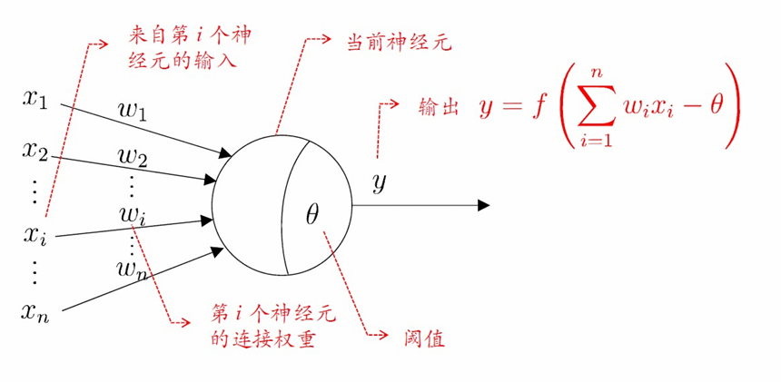
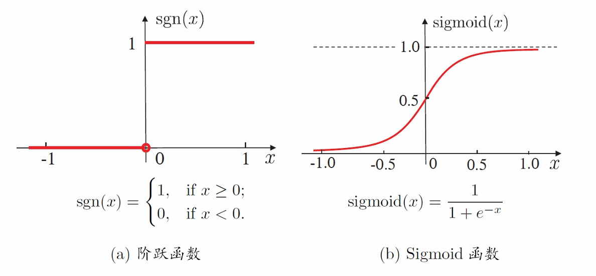
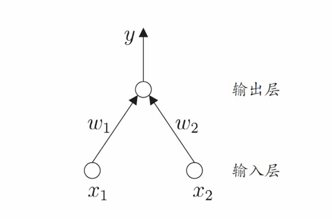
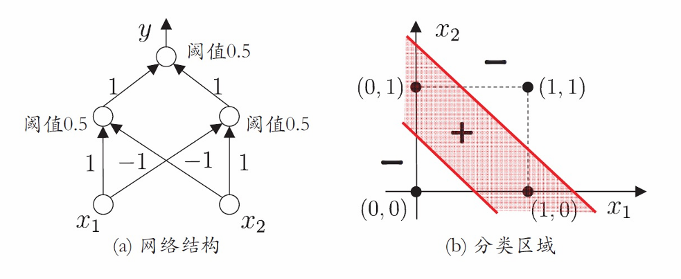
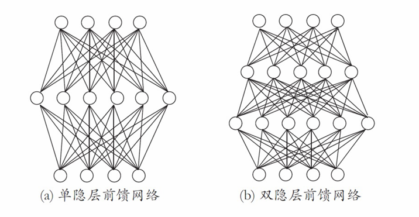
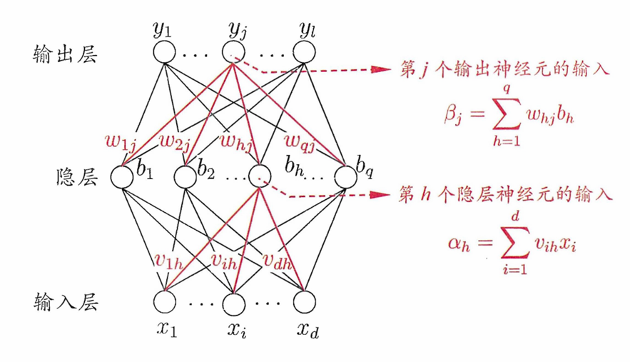
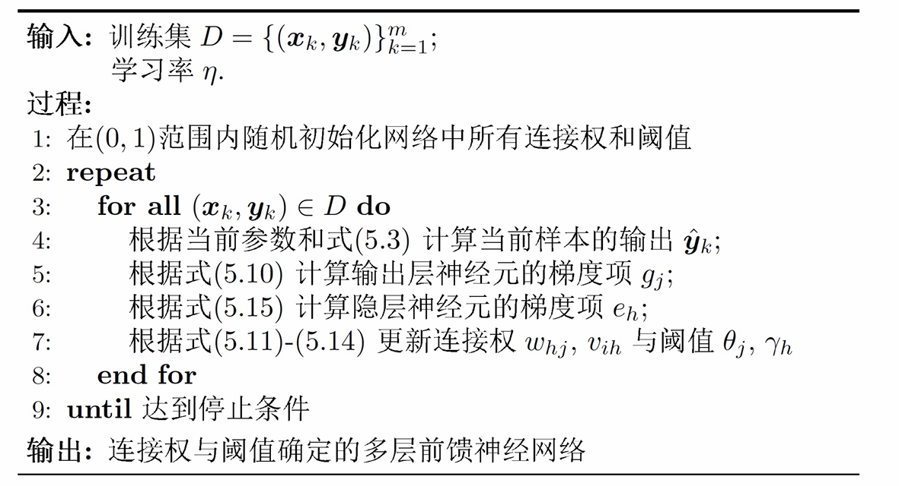

# Chapter5 神经网络

***

## 神经元模型

**M-P 神经元模型：**

**激活函数：**

***

## 感知机与多层网络

**感知机（perceptron）：**

感知机由两层神经元组成，输入层接受外界输入信号传递给输出层，输出层是 M-P 神经元。

感知机很容易实现与或非（假设 $f$ 是阶跃函数）：

* 与：$(x_1\wedge x_2)$  
  
    令 $w_1=w_2=1$，$\theta=2$  
  
* 或：$(x_1\vee x_2)$  
  
    令 $w_1=w_2=1$，$\theta=0.5$  
  
* 非：$\neg x_1$  
  
    令 $w_1=-1,w_2=0$，$\theta=-0.5$  

单层感知机只能解决线性可分问题，此时一定会收敛；否则会振荡。

**多层前馈神经网络（multi-layer feedforward neural network）：**

中间有隐藏层，每相邻两层神经元全连接。

***

## 误差反向传播算法 BackPropagation（BP）

给定训练集 $D=\\{(\mathbf{x}_1,\mathbf{y}_1),(\mathbf{x}_2,\mathbf{y}_2),\ldots,(\mathbf{x}_m,\mathbf{y}_m)\\}$，$\mathbf{x}_i\in \mathbb{R}^d$，$\mathbf{y}_i\in \mathbb{R}^l$。

多层前馈神经网络结构：$d$ 个输入神经元，$q$ 个隐藏神经元，$l$ 个输出神经元，使用 Sigmoid 激活函数。

所有参数（共 $l+q+dq+lq$ 个）：

* $\gamma_h$：隐藏层第 $h$ 个神经元的阈值
* $\theta_j$：输出层第 $j$ 个神经元的阈值
* $v_{ih}$：输入层第 $i$ 个神经元与隐藏层第 $h$ 个神经元之间的连接权重
* $w_{hj}$：隐藏层第 $h$ 个神经元与输出层第 $j$ 个神经元之间的连接权重

**前向传播：**

$$b_h=f(\sum\limits_{i=1}^dv_{ih}x_i-\gamma_h)=f(\alpha_h-\gamma_h)$$

$$\hat{y_j}=f(\sum\limits_{h=1}^q w_{hj}b_h-\theta_j)=f(\beta_j-\theta_j)$$

$$E=\frac{1}{2}\sum\limits_{j=1}^l(\hat{y_j}-y_j)^2$$

!!! Note
    这里只是针对单个训练数据的均方误差，后续还要对所有训练数据求平均。

    系数 $\frac{1}{2}$ 是为了方便求导。

**反向传播：**

从损失函数传回第 $j$ 个输出神经元：

$$\frac{\partial E}{\partial \hat{y_j}}=\hat{y_j}-y_j$$

从第 $j$ 个输出神经元通过 Sigmoid 函数传回 $\beta_j$：

$$\frac{\partial \hat{y_j}}{\partial \beta_j}=\hat{y_j}(1-\hat{y_j})$$

!!! Note
    Sigmoid 函数有：

    $$f'(x)=f(x)(1-f(x))$$

从 $\beta_j$ 通过全连接层传回连接权重 $w_{hj}$：

$$\frac{\partial \beta_j}{\partial w_{hj}}=b_h$$

综上：

$$\frac{\partial E}{\partial w_{hj}}=\frac{\partial E}{\partial \hat{y_j}}\frac{\partial \hat{y_j}}{\partial \beta_j}\frac{\partial \beta_j}{\partial w_{hj}}=(\hat{y_j}-y_j)\hat{y_j}(1-\hat{y_j})b_h$$

类似地：

$$\frac{\partial E}{\partial \theta_j}=-(\hat{y_j}-y_j)\hat{y_j}(1-\hat{y_j})$$

$$\frac{\partial E}{\partial \gamma_h}=b_h(1-b_h)\sum\limits_{j=1}^lw_{hj}(\hat{y_j}-y_j)\hat{y_j}(1-\hat{y_j})$$

$$\frac{\partial E}{\partial v_{ih}}=-b_h(1-b_h)x_i\sum\limits_{j=1}^lw_{hj}(\hat{y_j}-y_j)\hat{y_j}(1-\hat{y_j})$$

***

## 其他常见神经网络

!!! Warning
    此处省略 RBF 网络（单隐层前馈）、ART 网络（竞争学习）、SOM 网络（竞争学习 + 无监督）、级联相关网络（结构自适应）、Elman 网络（递归）、Boltzmann 机（基于能量）、受限 Boltzmann 机（对比散度）。