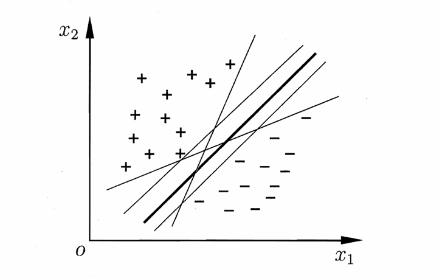
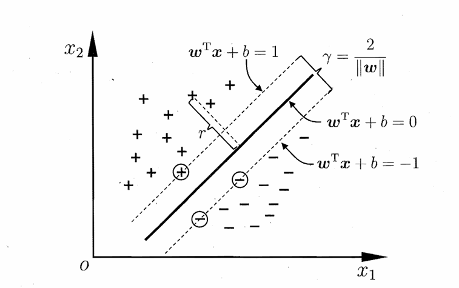
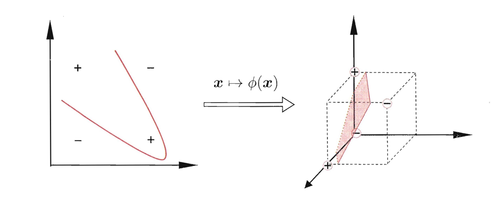
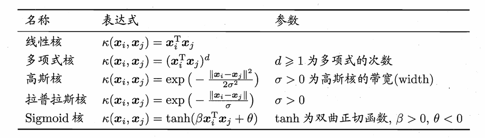
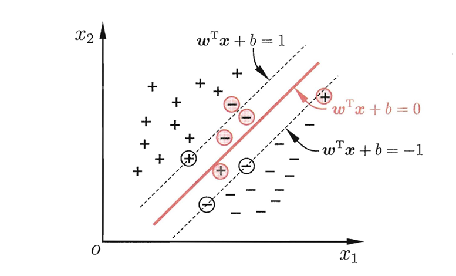
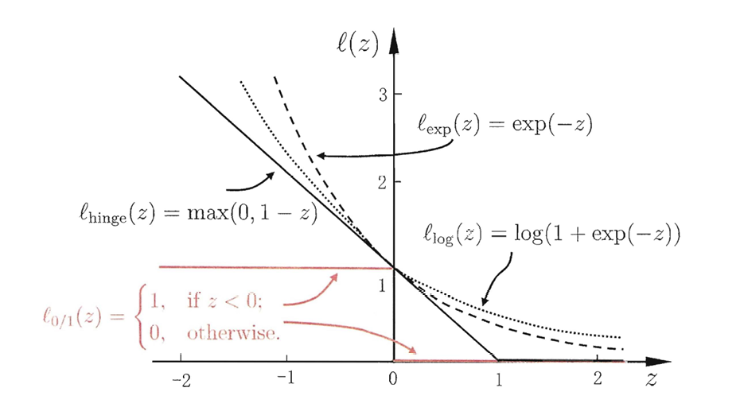

# Chapter6 支持向量机

***

## 间隔与支持向量

线性模型的目标是：在样本空间寻找一个超平面，将不同类别的样本分开。

这样的超平面有无数多个，我们希望找到最中间划分最明显的。使用这个超平面的就是**支持向量机（Support Vector Machine, SVM）**。

假设超平面方程 $(\mathbf{w},b)$：

$$\mathbf{w}^T\mathbf{x}+b=0$$

对于样本空间的任意一点 $\mathbf{x}$，其到超平面的距离为：

$$\gamma_i=\frac{|\mathbf{w}^T\mathbf{x}+b|}{||\mathbf{w}||}$$

假设超平面 $(\mathbf{w},b)$ 能将所有训练样本正确分类，即正例都有 $\mathbf{w}^T\mathbf{x}_i+b>0$，负例都有 $\mathbf{w}^T\mathbf{x}_i+b<0$。令

$$\begin{cases}
    \mathbf{w}^T\mathbf{x}_i+b\geqslant+1 & y_i=+1 \\\
    \mathbf{w}^T\mathbf{x}_i+b\leqslant-1 & y_i=-1
\end{cases}$$

!!! Note
    只要超平面能将所有训练样本正确分类，就能通过缩放 $\mathbf{w}$ 和 $b$，使得上述不等式成立。

若 $(\mathbf{x}_i,y_i)$ 满足 $y_i(\mathbf{w}^T\mathbf{x}_i+b)=1$，则称其为**支持向量**，它们是距离超平面最近的点。正负支持向量之间的距离为**间隔**：

$$\gamma=\frac{2}{||\mathbf{w}||}$$

现在，我们的目标是找到超平面 $(\mathbf{w},b)$，在保证所有样本点都有 $|\mathbf{w}^T\mathbf{x}_i+b|\geqslant1$ 的前提下，最大化间隔：

$$\max\limits_{\mathbf{w},b}\frac{2}{||\mathbf{w}||}\quad\text{s.t.}\quad\forall i,y_i(\mathbf{w}^T\mathbf{x}_i+b)\geqslant1$$

为了之后的计算方便，我们将其转化为等价的形式：

$$\min\limits_{\mathbf{w},b}\frac{1}{2}||\mathbf{w}||^2\quad\text{s.t.}\quad\forall i,y_i(\mathbf{w}^T\mathbf{x}_i+b)\geqslant1$$

***

## 对偶问题

我们使用**拉格朗日乘子法**来求解上述约束优化问题。

上述约束优化问题的约束是：$1-y_i(\mathbf{w}^T\mathbf{x}_i+b)\leqslant 0$。引入拉格朗日乘子 $\alpha_i\geqslant0$，构造拉格朗日函数：

$$L(\mathbf{w},b,\boldsymbol{\alpha})=\frac{1}{2}||\mathbf{w}||^2+\sum\limits_{i=1}^m\alpha_i(1-y_i(\mathbf{w}^T\mathbf{x}_i+b))$$

那么，上述约束优化问题转变为：

$$\max\limits_{\boldsymbol{\alpha}\geqslant0}\min\limits_{\mathbf{w},b}L(\mathbf{w},b,\boldsymbol{\alpha})$$

$L(\mathbf{w},b,\boldsymbol{\alpha})$ 关于 $\mathbf{w},b$ 取最小值时，$\mathbf{w},b$ 偏导为 $0$：

$$\mathbf{w}=\sum\limits_{i=1}^m\alpha_iy_i\mathbf{x}_i$$

$$\sum\limits_{i=1}^m\alpha_iy_i=0$$

代回拉格朗日函数：

$$\frac{1}{2}||\mathbf{w}||^2=\frac{1}{2}(\sum\limits_{i=1}^m\alpha_iy_i\mathbf{x}\_i)^T(\sum\limits_{j=1}^m\alpha_jy_j\mathbf{x}\_j)=\frac{1}{2}\sum\limits_{i=1}^m\sum\limits_{j=1}^m\alpha_i\alpha_jy_iy_j\mathbf{x}\_i^T\mathbf{x}\_j$$

$$\sum\limits_{i=1}^m\alpha_i(1-y_i(\mathbf{w}^T\mathbf{x}\_i+b))=\sum\limits_{i=1}^m\alpha_i-\sum\limits_{i=1}^m\alpha_iy_i(\sum\limits_{j=1}^m\alpha_jy_j\mathbf{x}\_j^T\mathbf{x}\_i+b)=\sum\limits_{i=1}^m\alpha_i-\sum\limits_{i=1}^m\sum\limits_{j=1}^m\alpha_i\alpha_jy_iy_j\mathbf{x}\_i^T\mathbf{x}\_j$$

$$L(\mathbf{w},b,\boldsymbol{\alpha})=\sum\limits_{i=1}^m\alpha_i-\frac{1}{2}\sum\limits_{i=1}^m\sum\limits_{j=1}^m\alpha_i\alpha_jy_iy_j\mathbf{x}\_i^T\mathbf{x}\_j$$

接下来，我们的目标是：最大化 $L(\mathbf{w},b,\boldsymbol{\alpha})$，或者可以等价地表示为：

$$\max_{\boldsymbol{\alpha}}(\sum\limits_{i=1}^m\alpha_i-\frac{1}{2}\sum\limits_{i=1}^m\sum\limits_{j=1}^m\alpha_i\alpha_jy_iy_j\mathbf{x}\_i^T\mathbf{x}\_j)\quad\text{s.t.}\quad\sum\limits_{i=1}^m\alpha_iy_i=0,\alpha_i \geqslant 0$$

这个问题就是原本问题的**对偶问题**。

使用 **SMO** 来求解上述对偶问题。SMO 的基本思想是：

* 选取一对需要更新的变量 $\alpha_i$ 和 $\alpha_j$
* 固定其他所有变量，求解对偶问题更新 $\alpha_i$ 和 $\alpha_j$（此时的约束条件只涉及两个变量，可以用一个变量表示另一个变量，对偶问题变成了求单变量函数的极值）
* 重复上述过程，直到收敛

得到 $\boldsymbol{\alpha}$ 后，再结合训练数据就可以得到 $\mathbf{w}=\sum\limits_{i=1}^m\alpha_iy_i\mathbf{x}_i$；然后由于对于任何支持向量，都有 $y_i(\mathbf{w}^T\mathbf{x}_i+b)=1$，因此可以通过支持向量计算出偏移量 $b$。（支持向量怎么确定请看下文）

注意，记 $f(\mathbf{x})=\mathbf{w}^T\mathbf{x}+b$，整个求解过程中需要满足**KKT条件**：

* 原始可行性条件：$\alpha_i\geqslant0,~y_if(\mathbf{x}_i)\geqslant1$
* 互补松弛条件：$\alpha_i(y_if(\mathbf{x}_i)-1)=0$

可以看出，对于任意训练样本 $(\mathbf{x}_i,y_i)$，总有 $\alpha_i=0$ 或 $y_if(\mathbf{x}_i)=1$，因此只有支持向量才会对 $f(\mathbf{x})$ 有影响，这显示出支持向量机的一个重要性质：训练完成后，大部分的训练样本都不需要保留，最终模型仅与支持向量有关。

***

## 核函数

如果训练数据线性不可分怎么办？

基本思路是：**将数据映射到更高维的空间，使得数据在高维空间线性可分**。（只要属性有限就一定可以）

设映射函数为 $\phi(\mathbf{x})$，则支持向量机模型为

$$f(\mathbf{x})=\mathbf{w}^T\phi(\mathbf{x})+b$$

参数 $\mathbf{w},b$ 的优化目标为

$$\min\limits_{\mathbf{w},b}\frac{1}{2}||\mathbf{w}||^2\quad\text{s.t.}\quad\forall i,y_i(\mathbf{w}^T\phi(\mathbf{x}_i)+b)\geqslant1$$

其对偶问题为

$$\max_{\alpha}(\sum\limits_{i=1}^m\alpha_i-\frac{1}{2}\sum\limits_{i=1}^m\sum\limits_{j=1}^m\alpha_i\alpha_jy_iy_j\phi(\mathbf{x}\_i)^T\phi(\mathbf{x}\_j))\quad\text{s.t.}\quad\sum\limits_{i=1}^m\alpha_iy_i=0,\alpha_i \geqslant 0$$

直接计算 $\phi(\mathbf{x}_i)^T\phi(\mathbf{x}_j)$ 开销较大，因此，可以不显式地设计映射函数 $\phi(\mathbf{x})$，而是设计**核函数**：

$$\kappa(\mathbf{x}_i,\mathbf{x}_j)=\phi(\mathbf{x}_i)^T\phi(\mathbf{x}_j)$$

***

## 软间隔与正则化

**软间隔（soft margin）：**

由于过拟合的存在和核函数的难确定性，我们引入**软间隔**的概念，允许支持向量机在一些样本上不满足约束。

因此，优化目标变为：

$$\min\limits_{\mathbf{w},b}\frac{1}{2}||\mathbf{w}||^2+C\sum\limits_{i=1}^ml_{0/1}(y_i(\mathbf{w}^T\mathbf{x}_i+b)-1)$$

其中，$C$ 为常数，取值影响对不满足约束的样本的容忍度；$l_{0/1}$ 是 0-1 损失函数：

$$l_{0/1}(z)=\begin{cases}
    0 & z\geqslant0 \\\
    1 & z<0
\end{cases}$$

但 0-1 损失函数非凸、非连续，不易优化，因此常常使用其他替代函数：

**正则化（regularization）：**

支持向量机的更一般形式：

$$\min\limits_f[\Omega(f)+C\sum\limits_{i=1}^ml(f(x_i),y_i)]$$

前面一部分为**结构风险**，描述模型的某些性质；后面一部分为**经验风险**，描述模型与训练数据的契合程度。

***

!!! Warning
    此处省略支持向量回归、核方法。