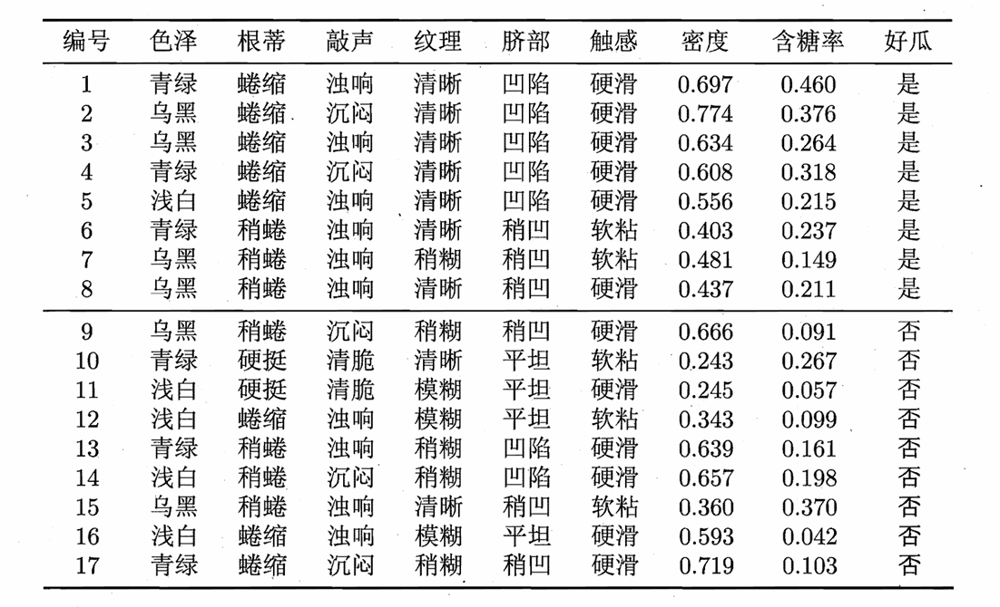
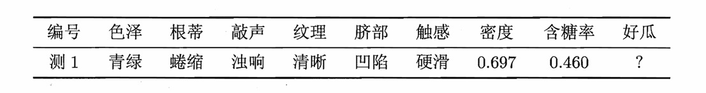
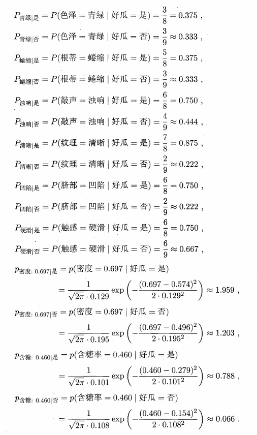
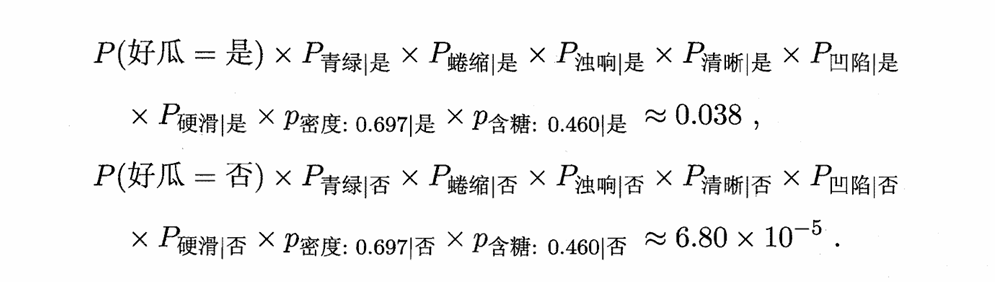
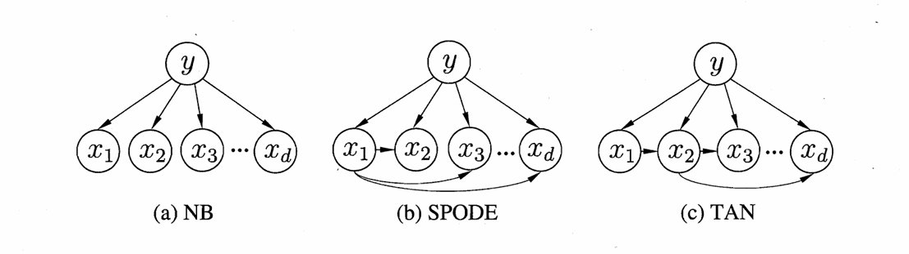
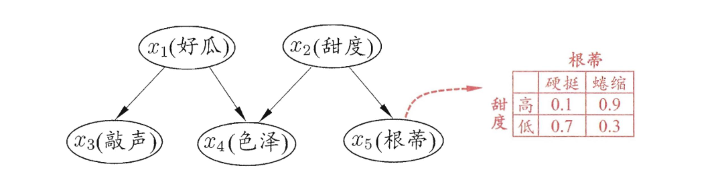
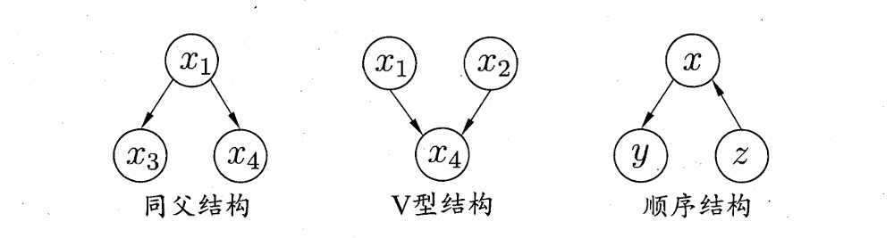
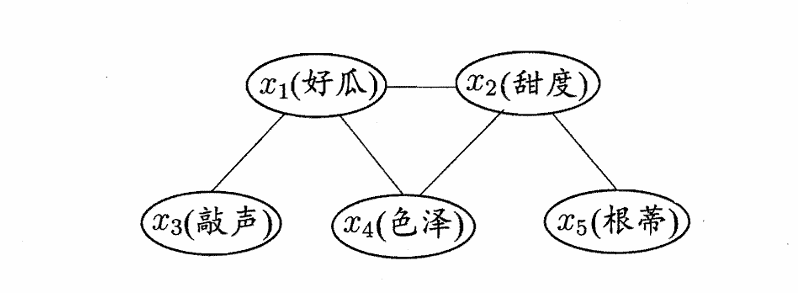
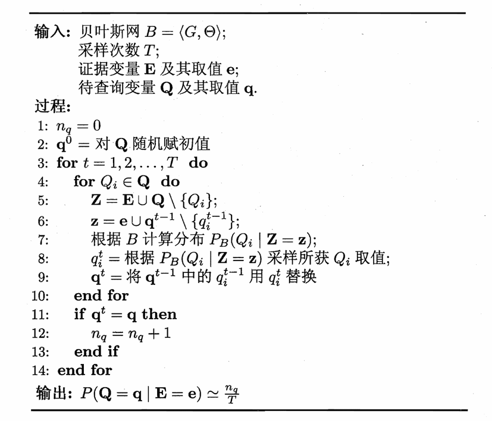

# Chapter7 贝叶斯分类器

***

## 贝叶斯决策论 Bayesian Decision Theory

对于多分类任务，**贝叶斯决策论**是在所有概率都已知的理想情况下，选择最优的类别标记。

**贝叶斯判定准则（Bayes decision rule）：**

设 $N$ 个可能类别 $c_1,c_2,...,c_N$，$\lambda_{ij}$ 表示将真实类别为 $c_j$ 的样本误分类为 $c_i$ 的损失。

基于后验概率 $P(c_i|\mathbf{x})$ 可获得将样本 $\mathbf{x}$ 分类为 $c_i$ 所产生的期望损失（条件风险）：

$$R(c_i|\mathbf{x})=\sum\limits_{j=1}^N\lambda_{ij}P(c_j|\mathbf{x})$$

目标：找到最优的分类函数 $h^{\*}$，输入为 $\mathbf{x}$，输出为 $h^*(\mathbf{x})=c$，这个 $c$ 可以让 $R(c|\mathbf{x})$ 取最小：

$$h^{\*}(\mathbf{x})=\operatorname*{arg\,min}_cR(c|\mathbf{x})$$

若所有误分类损失相等，即 $\lambda_{ij}=1$（$i\ne j$），$\lambda_{ii}=0$，则有：

$$h^{\*}(\mathbf{x})=\operatorname*{arg\,max}_c P(c|\mathbf{x})$$

$h^{\*}$ 称为**贝叶斯最优分类器（Bayes optimal classifier）**，其总体风险称为**贝叶斯风险（Bayes risk）**，其反映了学习性能的理论上限。

!!! Success "Definition"
    **先验概率：**$P(A)$  
    **后验概率：**$P(A|B)$

**机器学习策略：**

机器学习的关键点：估计后验概率 $P(c|\mathbf{x})$。就像我们之前一直研究的那样：在给定一个样本的情况下，它属于不同类别的概率是多少。

* 判别式模型：直接对 $P(c|\mathbf{x})$ 建模，如决策树、神经网络、SVM 等
* 生成式模型：先对联合概率 $P(\mathbf{x},c)$ 建模，再通过贝叶斯公式计算后验概率 $P(c|\mathbf{x})$，如贝叶斯分类器等

**贝叶斯定理：**

$$P(c|\mathbf{x})=\frac{P(\mathbf{x},c)}{P(\mathbf{x})}=\frac{P(c)P(\mathbf{x}|c)}{P(\mathbf{x})}$$

* $P(c)$：类先验概率，样本空间中类别 $c$ 的占比
* $P(\mathbf{x})$：证据因子，样本 $\mathbf{x}$ 出现的概率，一般为可忽略的常数
* $P(\mathbf{x}|c)$：类条件概率 / 似然，最难估计的一部分

于是，生成式模型的关键点从估计后验概率 $P(c|\mathbf{x})$ 变为估计类条件概率 $P(\mathbf{x}|c)$。

***

## 极大似然估计 Maximum Likelihood Estimation

**极大似然估计**：在已经看到一组实验结果的前提下，反推出哪个参数值能让这个结果最有可能发生。

对于类条件概率 $P(\mathbf{x}|c)$，我们先假定其具有某种确定的概率分布形式，再基于训练样本对概率分布的参数 $\theta_c$ 进行估计。为明确起见，将 $P(\mathbf{x}|c)$ 记为 $P(\mathbf{x}|\theta_c)$。

设训练样本中类别为 $c$ 的样本集合为 $D_c$，则在给定类别 $c$ 的条件下，观察到所有对应类别的样本的概率（似然）为：

$$P(D_c|\theta_c)=\prod\limits_{\mathbf{x}\in D_c}P(\mathbf{x}|\theta_c)$$

由于连乘后可能接近 $0$，因此使用**对数似然（log-likelihood）**：

$$LL(\theta_c)=\log P(D_c|\theta_c)=\sum\limits_{\mathbf{x}\in D_c}\log P(\mathbf{x}|\theta_c)$$

因此，$\theta_c$ 的极大似然估计为：

$$\hat{\theta_c}=\operatorname*{arg\,max}_{\theta_c}LL(\theta_c)$$

***

## 朴素贝叶斯分类器 Naive Bayes Classifier

**朴素贝叶斯分类器：**

朴素贝叶斯分类器的基本思路：**假定属性相互独立。**

因此，设 $d$ 为属性数，$x_i$ 为 $\mathbf{x}$ 在第 $i$ 个属性上的取值，则：

$$P(c|\mathbf{x})=\frac{P(c)P(\mathbf{x}|c)}{P(\mathbf{x})}=\frac{P(c)}{P(\mathbf{x})}\prod\limits_{i=1}^dP(x_i|c)$$

由于 $P(\mathbf{x})$ 是常数，因此可以忽略，最终的分类决策准则，也就是朴素贝叶斯分类器的表达式为：

$$h_{nb}(\mathbf{x})=\operatorname*{arg\,max}\_c P(c)\prod\limits_{i=1}^dP(x_i|c)$$

估计 $P(c)$：

$$P(c)=\frac{|D_c|}{|D|}$$

估计 $P(x_i|c)$：

对于离散属性：

$$P(x_i|c)=\frac{|D_{c,x_i}|}{|D_c|}$$

对于连续属性，假定  $p(x_i|c)\sim N(\mu_{c,i},\sigma_{c,i}^2)$：

$$p(x_i|c)=\frac{1}{\sqrt{2\pi}\sigma_{c,i}}e^{-\frac{(x_i-\mu_{c,i})^2}{2\sigma_{c,i}^2}}$$

!!! Example
    **假设训练集如下：**
    
    **用这个训练集训练一个朴素贝叶斯分类器，并对如下测试样例进行分类：**
    

    计算类先验概率 $P(c)$：
    

    计算类条件概率 $P(x_i|c)$：
    

    计算最终概率 $P(c|\mathbf{x})$（忽略 $P(\mathbf{x})$）：
    

    最终判定结果为“好瓜”。

**拉普拉斯修正（Laplacian correction）：**

若某个属性值在训练集中没有与某类别共同出现过，则 $P(x_i|c)=0$，在连乘时会抹去其他属性提供的信息，因此需要修正。设 $N$ 为训练集 $D$ 中的总类别数，$N_i$ 为第 $i$ 个属性的可能取值数，则原本的公式应修正为：

$$\hat{P}(c)=\frac{|D_{c}|+1}{|D|+N}$$

$$\hat{P}(x_i|c)=\frac{|D_{c,x_i}|+1}{|D_c|+N_i}$$

**朴素贝叶斯分类器的使用：**

* 对预测速度要求高：
  预计算所有概率估值，使用时直接查表
* 数据更替频繁：
  不进行任何训练，预测时再估值（**懒惰学习**）
* 数据不断增加：
  基于现有概率估值进行修正（**增量学习**）

***

## 半朴素贝叶斯分类器 Semi-Naive Bayes Classifier

**半朴素贝叶斯分类器：**

朴素贝叶斯分类器的属性独立性假设在现实中很难成立。半朴素贝叶斯分类器的基本思路：**适当考虑一部分属性间的依赖。**

最常用策略：**独依赖估计（One-Dependence Estimators, ODE）**，即假设每个属性在类别之外最多仅依赖一个其他属性：

$$P(c|\mathbf{x})\propto P(c)\prod\limits_{i=1}^dP(x_i|c,pa_i)$$

其中，$pa_i$ 为 $x_i$ 的父属性，问题的关键在于如何确定父属性。

**SPODE（Super-Parent ODE）：**

假设所有属性都依赖于同一属性，这个属性称为**超父（super -parent）**，然后通过交叉验证等模型选择方法来确定超父。

**TAN（Tree Augmented naive Bayes）：**

以属性间的**条件互信息（conditional mutual information）**（属性在已知类别上的相关性）为边的权重，构建完全图，再利用**最大带权生成树算法**，仅保留强相关属性间的依赖性。

**AODE (Averaged ODE)：**

之前的 SPODE 最终确定下来了一个超父，而 AODE 则是尝试将每个属性作为一次超父，构建多个 SPODE 模型后，再对结果进行平均。

***

## 贝叶斯网 Bayesian Network

### 结构

**贝叶斯网：**

贝叶斯网考虑了属性之间更高阶的依赖：

$$B=\langle G,\Theta\rangle$$

* $G$：**有向无环图（Directed Acyclic Graph, DAG）** ，刻画属性依赖关系（结构）
* $\Theta$：**条件概率表（Conditional Probability Table, CPT）** ，描述属性的联合概率分布（参数）

在 $G$ 中，每个节点对应一个属性，如果两个属性有直接依赖关系，则相连。属性 $x_i$ 在 $G$ 中的父节点集合为 $\pi_i$，$\Theta$ 记录了 $\theta_{x_i|\pi_i}=P_B(x_i|\pi_i)$。

!!! Example
    

    从 $G$ 中可以看出：“色泽”直接依赖于“好瓜”和“甜度”，而“根蒂”则直接依赖于“甜度”等。

    从 $\Theta$ 中可以看出：$P(\text{根蒂=硬挺}|\text{甜度=高})=0.1$ 等。

    !!! Note
        贝叶斯网中，最后的分类结果也看作一个属性变量。

贝叶斯网假设每个属性与它的非后裔属性（后裔属性：从它出发沿着箭头可以到达的属性）独立，因此有联合概率分布：

$$P_B(x_1,x_2,...,x_d)=\prod\limits_{i=1}^dP_B(x_i|\pi_i)=\prod\limits_{i=1}^d\theta_{x_i|\pi_i}$$

!!! Example
    

    $$P(x_1,x_2,x_3,x_4,x_5)=P(x_1)P(x_2)P(x_3|x_1)P(x_4|x_1,x_2)P(x_5|x_2)$$

**典型依赖关系：**

* 同父结构：给定父节点 $x_1$ 的取值，则 $x_3$ 和 $x_4$ 独立；$x_1$ 的取值未知，则 $x_3$ 和 $x_4$ 不独立；
* V 型结构：给定子节点 $x_4$ 的取值，则 $x_1$ 和 $x_2$ 不独立；$x_4$ 的取值未知，则 $x_1$ 和 $x_2$ 独立；
* 顺序结构：给定中间节点 $x$ 的取值，则 $y$ 和 $z$ 独立。

其中，同父结构和顺序结构为条件独立；V 型结构为边际独立。

!!! Success "Definition"
    **条件独立：**

    对于属性变量 $X$、$Y$ 和 $Z$，如果在给定 $Z$ 的条件下，$X$ 和 $Y$ 独立，则称 $X$ 和 $Y$ 在给定 $Z$ 的条件下是条件独立的，记为 $X\perp Y|Z$。

    例如上述的同父结构：$x_3\perp x_4|x_1$；上述的顺序结构：$y\perp z|x$。

    **边际独立：**

    对于属性变量 $X$、$Y$ 和 $Z$，如果在没有给定任何条件下，$X$ 和 $Y$ 独立，但在给定 $Z$ 的条件下，$X$ 和 $Y$ 不独立，则称 $X$ 和 $Y$ 是边际独立的，记为 $X\perp\perp Y$。

    例如上述的 V 型结构：$x_1\perp\perp x_2$。

**有向分离（D-separation）：**

有向分离用于将有向图转换为无向图，从而分析属性间的条件独立性：

* 找出所有 V 型结构，在 V 型结构的两个父节点间连一条边；
* 去掉所有箭头方向，得到无向边。

得到的无向图称为**道德图（moral graph）** 。

对于节点 $x$，$y$，$z$，如果去掉 $z$ 后，$x$ 和 $y$ 不连通，则就有条件独立：$x\perp y|z$。

!!! Example
    

    

    由图可得：

    $$x_3\perp x_4|x_1$$

    $$x_4\perp x_5|x_2$$

    $$x_3\perp x_2|x_1$$

    $$x_1\perp x_5|x_2$$

    $$x_3\perp x_5|x_1$$

    $$x_3\perp x_5|x_2$$

### 学习

若网络结构 $G$ 已知，那么我们只需要对训练样本进行计数，得到条件概率表 $\Theta$ 即可。然而，我们往往不知道 $G$，因此，贝叶斯网的首要任务是根据训练样本找到结构最恰当的 $G$。可以先定义一个**评分函数（scoring function）**，用于评估贝叶斯网和训练样本的契合程度，然后再基于此寻找结构最优的 $G$。

最常见的是基于**最小描述长度（Minimum Description Length, MDL）** 准则，即希望编码长度尽可能小。

贝叶斯网 $B=\langle G,\Theta\rangle$ 在训练集 $D$ 上的评分函数：

$$s(B|D)=f(\theta)|B|-LL(B|D)$$

我们称条件概率表的每一个数值为一个参数，$f(\theta)$ 为描述每个参数需要的字节数，$|B|$ 为参数个数，$LL(B|D)=\sum\limits_{i=1}^m\log P_B(\mathbf{x}_i)$，其中 $m$ 为样本总数，$\mathbf{x}_i$ 为第 $i$ 个样本，$P_B(\mathbf{x}_i)$ 就是利用 $\Theta$ 查表得到的第 $i$ 个样本出现的概率。

第一部分 $f(\theta)|B|$ 更多考虑模型复杂度；第二部分 $-LL(B|D)$ 更多考虑模型拟合度。

!!! Note
    从所有可能的网络结构中找到最优贝叶斯网是 NP-Hard 问题。

### 推断

推断的意思是：基于已知属性变量的观测值（证据），推测未知属性变量的取值。

如果贝叶斯网络训练好了，那么它就给出了所有局部的、底层的条件概率，通过这些条件概率可以计算出任意完整的联合概率，再由完整的联合概率可以计算出我们关心的任何后验概率。这就是**精确推断**。但是，这种精确推断也是 NP-Hard 问题，因此需要一些近似推断方法。

**吉布斯采样（Gibbs sampling）：**

设未知变量 $\mathbf{Q}=\\{Q_1,Q_2,...,Q_n\\}$，已知变量 $\mathbf{E}=\\{E_1,E_2,...,E_k\\}$，待推测的具体值 $\mathbf{q}=\\{q_1,q_2,...,q_n\\}$，观测到的具体值 $\mathbf{e}=\\{e_1,e_2,...,e_k\\}$，目标是计算 $P(\mathbf{Q}=\mathbf{q}|\mathbf{E}=\mathbf{e})$。

例如：
$\mathbf{E}=\mathbf{e}$：（色泽；敲声；根蒂）=（青绿；浊响；蜷缩）
$\mathbf{Q}=\mathbf{q}$：（是否为好瓜；甜度）=（是；高）

第一步：

随机产生一个 $\mathbf{q}_0$ 作为初始点，但是对应于 $\mathbf{E}$ 的属性值必须与观测值 $\mathbf{e}$ 一致。

例如：（青绿；浊响；蜷缩；否；高）

第二步：

进行 $T$ 次迭代采样，每次采样中逐个考察未知变量，即假定所有其他属性取当前值，根据贝叶斯网络推测出该属性的条件概率分布，然后根据该条件概率分布重新采样该属性的值。

例如：先假定（色泽=青绿；敲声=浊响；根蒂=蜷缩；甜度=高）不变，根据贝叶斯网络计算出条件概率分布，然后根据该条件概率分布重新采样“是否为好瓜”的值。假设采样结果为“是”，则得到新的样本：（青绿；浊响；蜷缩；是；高）。以此类推。

第三步：

假设经过 $T$ 次采样后得到与查询目标 $\mathbf{q}$ 一致的样本共有 $n_q$ 个，则可近似估算出后验概率：

$$P(\mathbf{Q}=\mathbf{q}|\mathbf{E}=\mathbf{e})\approx\frac{n_q}{T}$$

***

## EM 算法

训练样本并不一定完整，可能存在未观测变量，称为**隐变量（latent variable）**。

令 $\mathbf{X}$ 表示已观测变量集，$\mathbf{Z}$ 表示隐变量集，$\Theta$ 表示模型参数集，若要对 $\Theta$ 做极大似然估计，则应最大化**对数边际似然**：

$$LL(\Theta|\mathbf{X},\mathbf{Z})=\ln\sum\limits_{\mathbf{Z}} P(\mathbf{X},\mathbf{Z}|\Theta)$$

EM 算法的基本思想是：若参数 $\Theta$ 已知，则可根据训练数据推断出最优隐变量 $\mathbf{Z}$ 的值（E 步）；若 $\mathbf{Z}$ 的值已知，则可对 $\Theta$ 做极大似然估计。交替执行，直到收敛。

更进一步，若不取 $\mathbf{Z}$ 的期望，而是取 $\mathbf{Z}$ 的概率分布 $P(\mathbf{Z}|\mathbf{X},\Theta^t)$，则 EM 算法的步骤为：

* E 步：根据当前参数 $\Theta^t$ 推断隐变量分布 $P(\mathbf{Z}|\mathbf{X},\Theta^t)$，并计算对数似然 $LL(\Theta|\mathbf{X},\mathbf{Z})$ 关于 $\mathbf{Z}$  的期望：
  $$Q=\mathbb{E}_{\mathbf{Z}|\mathbf{X},\Theta^t}LL(\Theta|\mathbf{X},\mathbf{Z})$$
* 寻找参数，最大化期望似然：
  $$\Theta^{t+1}=\operatorname*{arg\,max}_{\Theta}Q$$

!!! Note
    有关 EM 算法的更多内容详见 Chapter9。