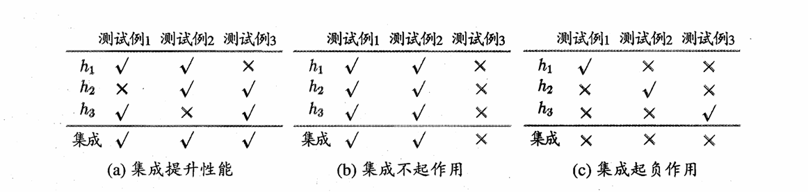
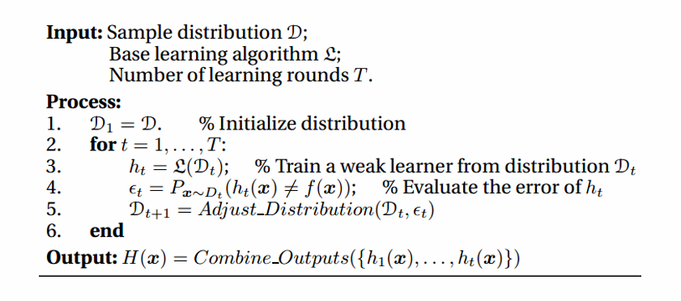
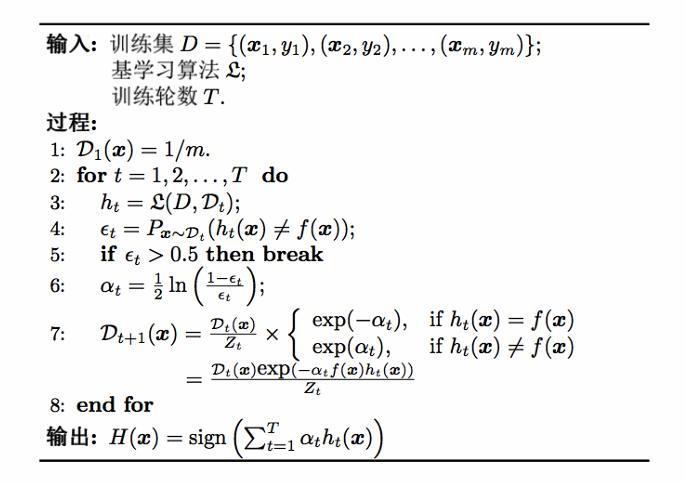
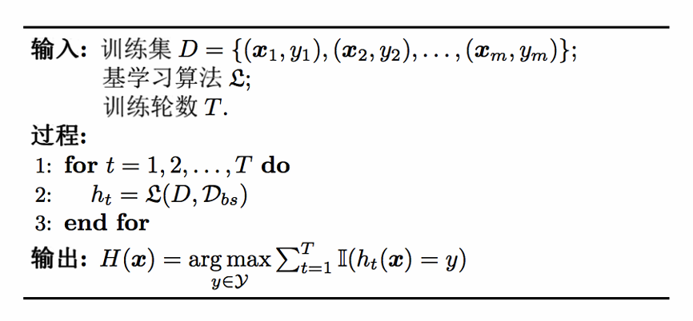
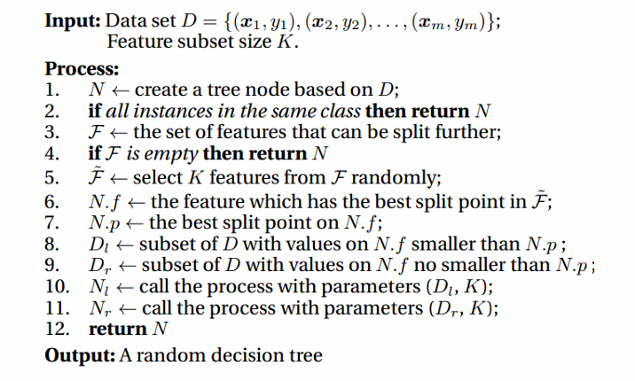
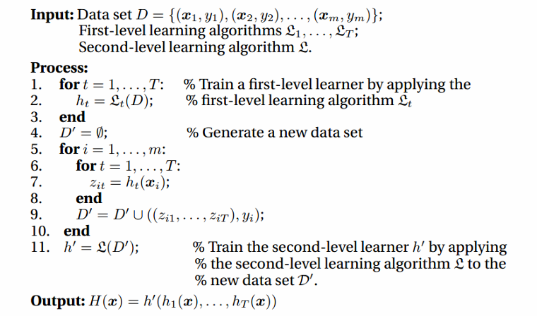

# Chapter8 集成学习

***

## 个体与集成

**集成学习（ensemble learning）** 通过构建并结合多个学习器来提升性能。

例如二分类问题，三个分类器在三个测试样本上的预测结果如下表所示，√ 表示预测正确，× 表示预测错误。若集成学习基于少数服从多数的原则来结合：

进行分析：若有标签 $y\in\\{-1,+1\\}$ 和真实函数 $f$，假定个体分类器的错误率为 $\epsilon$，那么对于每个个体分类器 $h_i$ 有

$$P(h_i(\mathbf{x})\neq f(\mathbf{x}))=\epsilon$$

设有 $T$ 个个体学习器，则集成分类器 $H$ 预测的标签为

$$H(\mathbf{x})=\text{sign}[\sum\limits_{i=1}^Th_i(\mathbf{x})]$$

如果个体学习器相互独立，那么集成的错误率为

$$P(H(\mathbf{x})\neq f(\mathbf{x}))=\sum\limits_{k=0}^{\lfloor\frac{T}{2}\rfloor}C_T^k(1-\epsilon)^k\epsilon^{T-k}\leqslant (1-2\epsilon)^T$$

上式表明，个体学习器数量增大，集成的错误率会以指数级下降，最终趋于 $0$。

这个例子可以看出，个体学习器要有一定的准确性（c 为反例），且彼此之间要有差异性（b 为反例），即**好而不同**。

目前的集成学习算法有两类：

* 个体学习器之间存在强依赖关系，串行生成：Boosting
* 个体学习器之间不存在强依赖关系，并行生成：Bagging、Random Forest

***

## Boosting

Boosting 是一族算法，机制是：

* 先从初始训练集训练出一个个体学习器
* 再根据其表现对训练样本分布进行调整，使得先前学习出错的样本在后续获得更多关注
* 接着在调整后的样本分布上训练下一个个体学习器
* 以此类推，直到达到预定的个体学习器数量
* 最后，将所有个体学习器加权集成

### AdaBoost

AdaBoost 算法基于**加性模型（additive model）**，即个体学习器线性加权

$$H(\mathbf{x})=\sum\limits_{t=1}^T\alpha_t h_t(\mathbf{x})$$

来最小化**指数损失函数（exponential loss function）**

$$l_{\exp}(H|D)=\mathbb{E}_{\mathbf{x}\sim D}[e^{-f(\mathbf{x})H(\mathbf{x})}]$$

其中，标签取值 $\\{-1,+1\\}$，$f(\mathbf{x})$ 为样本 $\mathbf{x}$ 的真实标记，$T$ 为个体学习器数量，$D$ 为训练集。

**为什么要最小化指数损失函数？**

若 $H(\mathbf{x})$ 能使 $l_{\exp}(H|D)$ 最小化，则

$$\frac{\partial l_{\exp}}{\partial H}=-e^{-H(\mathbf{x})}P(f(\mathbf{x})=1|\mathbf{x})+e^{H(\mathbf{x})}P(f(\mathbf{x})=-1|\mathbf{x})=0$$

$$H(\mathbf{x})=\frac{1}{2}\ln\frac{P(f(\mathbf{x})=1|\mathbf{x})}{P(f(\mathbf{x})=-1|\mathbf{x})}$$

因此：

$$\text{sign}(H(\mathbf{x}))=\begin{cases}
    1 & P(f(\mathbf{x})=1|\mathbf{x}) > P(f(\mathbf{x})=-1|\mathbf{x})\\\
    -1 & P(f(\mathbf{x})=1|\mathbf{x}) < P(f(\mathbf{x})=-1|\mathbf{x})
\end{cases}=\operatorname*{arg\,max}_{y\in\\{-1,1\\}}P(f(\mathbf{x})=y|\mathbf{x})$$

这意味着此时 $\text{sign}(H(\mathbf{x}))$ 达到了贝叶斯最优错误率。也说明，如果指数损失函数取最小，则分类错误率也取最小。

**如何最小化指数损失函数？（确定个体分类器的权重）**

第一个个体学习器 $h_1$ 直接从 $D$ 中学得。此后迭代生成 $h_t$ 和 $\alpha_t$。当 $h_t$ 基于分布 $D_t$ 产生后，对应权重 $\alpha_t$ 应使得 $\alpha_th_t$ 能最小化指数损失函数（对应的分量）。

设 $h_t$ 的错误率 $\epsilon_t=P_{\mathbf{x}\sim D_t}(h_t(\mathbf{x})\neq f(\mathbf{x}))$，有

$$l_{\exp}(\alpha_th_t|D_t)=\mathbb{E}_{\mathbf{x}\sim D_t}[e^{-f(\mathbf{x})\alpha_th_t(\mathbf{x})}]=(1-\epsilon_t)e^{-\alpha_t}+\epsilon_te^{\alpha_t}$$

对 $\alpha_t$ 求导并令导数为 $0$，可得：

$$\alpha_t=\frac{1}{2}\ln(\frac{1-\epsilon_t}{\epsilon_t})$$

**如何调整样本分布？**

在获得 $H_{t-1}$ 之后，样本分布要进行调整，使得 $h_t$ 能纠正 $H_{t-1}$ 的错误。理想情况下能纠正全部错误，即最小化

$$l_{\exp}(H_{t-1}+h_t|D)=\mathbb{E}\_{\mathbf{x}\sim D}[e^{-f(\mathbf{x})(H_{t-1}(\mathbf{x})+h_t(\mathbf{x}))}]$$

对 $e^{-f(\mathbf{x})h_t(\mathbf{x})}$ 进行二阶泰勒展开（注意 $f^2(\mathbf{x})=h_t^2(\mathbf{x})=1$）：

$$l_{\exp}(H_{t-1}+h_t|D)\approx \mathbb{E}\_{\mathbf{x}\sim D}[e^{-f(\mathbf{x})H_{t-1}(\mathbf{x})}(1-f(\mathbf{x})h_t(\mathbf{x})+\frac{f^2(\mathbf{x})h_t^2(\mathbf{x})}{2})]=\mathbb{E}\_{\mathbf{x}\sim D}[e^{-f(\mathbf{x})H_{t-1}(\mathbf{x})}(1-f(\mathbf{x})h_t(\mathbf{x})+\frac{1}{2})]$$

于是，理想的个体学习器

$$
\begin{align}
h_t(\mathbf{x}) & =\operatorname\*{arg\,min}\_{h}l_{\exp}(H_{t-1}+h|D)\\\
& =\operatorname\*{arg\,min}\_{h}\mathbb{E}\_{\mathbf{x}\sim D}[e^{-f(\mathbf{x})H_{t-1}(\mathbf{x})}(1-f(\mathbf{x})h_t(\mathbf{x})+\frac{1}{2})]\\\
& =\operatorname\*{arg\,max}\_{h}\mathbb{E}\_{\mathbf{x}\sim D}[e^{-f(\mathbf{x})H_{t-1}(\mathbf{x})}f(\mathbf{x})h(\mathbf{x})]\\\
& =\operatorname\*{arg\,max}\_{h}\mathbb{E}\_{\mathbf{x}\sim D}[\frac{e^{-f(\mathbf{x})H_{t-1}(\mathbf{x})}}{\mathbb{E}\_{\mathbf{x}\sim D}[e^{-f(\mathbf{x})H_{t-1}(\mathbf{x})}]}f(\mathbf{x})h(\mathbf{x})]
\end{align}
$$

其中，$\mathbb{E}\_{\mathbf{x}\sim D}[e^{-f(\mathbf{x})H_{t-1}(\mathbf{x})}]$ 为常数。令 $D_t$ 表示一个分布：

$$D_t(\mathbf{x})=\frac{D(\mathbf{x})e^{-f(\mathbf{x})H_{t-1}(\mathbf{x})}}{\mathbb{E}\_{\mathbf{x}\sim D}[e^{-f(\mathbf{x})H_{t-1}(\mathbf{x})}]}$$

那么，由**重要性采样**：

$$h_t(\mathbf{x})=\operatorname\*{arg\,max}\_{h}\mathbb{E}\_{\mathbf{x}\sim D_t}[f(\mathbf{x})h(\mathbf{x})]=\operatorname\*{arg\,min}\_{h}\mathbb{E}\_{\mathbf{x}\sim D_t}[(f(\mathbf{x})\neq h(\mathbf{x}))]$$

由此可见，最理想的 $h_t$ 在分布 $D_t$ 下能最小化分类误差，因此要基于 $D_t$ 来训练 $h_t$。$D_t$ 和 $D_{t+1}$ 的关系为

$$\begin{align}
D_{t+1}(\mathbf{x}) & = \frac{D(\mathbf{x})e^{-f(\mathbf{x})H_{t}(\mathbf{x})}}{\mathbb{E}\_{\mathbf{x}\sim D}[e^{-f(\mathbf{x})H_{t}(\mathbf{x})}]}\\\
& =\frac{D(\mathbf{x})e^{-f(\mathbf{x})H_{t-1}(\mathbf{x})}e^{-f(\mathbf{x})\alpha_th_t(\mathbf{x})}}{\mathbb{E}\_{\mathbf{x}\sim D}[e^{-f(\mathbf{x})H_{t}(\mathbf{x})}]}\\\
& =D_t(\mathbf{x})\cdot e^{-f(\mathbf{x})\alpha_th_t(\mathbf{x})}\frac{\mathbb{E}\_{\mathbf{x}\sim D}[e^{-f(\mathbf{x})H_{t-1}(\mathbf{x})}]}{\mathbb{E}\_{\mathbf{x}\sim D}[e^{-f(\mathbf{x})H_t(\mathbf{x})}]}
\end{align}$$

**整体算法流程：**

!!! Note
    $Z_t$ 是规范化因子，以确保 $D_{t+1}$ 是一个合法的概率分布。

***

## Bagging 与随机森林

想要得到泛化性能强的集成，个体学习器应尽可能相互独立，一个可能的做法是对训练样本进行采样，产生多个子集，分别训练个体学习器。但是，我们同样希望每个个体学习器的性能不能太差，如果子集太小则不足以进行有效学习。综上，我们可以考虑相互有重叠的采样子集。

### Bagging

* 个体学习器不存在强依赖关系
* 并行生成
* 自助采样

从初始训练集中有放回地抽取多个样本，这样就形成了一个训练子集。形成多个训练子集后，在每个子集上独立地训练一个个体学习器。

集成时，对于分类任务使用简单投票法，对于回归任务使用简单平均法。

设个体学习器的复杂度为 $O(m)$，集成复杂度为 $O(s)$，则 Bagging 的整体复杂度为 $T\cdot(O(m)+O(s))$。由于 $O(s)$ 和 $T$ 不会太大，因此整体复杂度与个体学习器的复杂度同阶。

**包外估计（out-of-bag estimate）：**

由于每个个体学习器只使用了部分训练样本进行训练，因此剩余的样本可以作为验证集评估性能。

令 $D_t$ 表示 $h_t$ 实际使用的训练样本集合，令 $H^{oob}(\mathbf{x})$ 表示对样本 $\mathbf{x}$ 的包外估计，若仅考虑未使用 $\mathbf{x}$ 训练的 $h_t$ 在 $\mathbf{x}$ 上的预测，则有

$$H^{oob}(\mathbf{x})=\operatorname*{arg\,max}\_{y\in\mathcal{Y}}\sum\limits_{t=1}^T\mathbb{I}(h_t(\mathbf{x})=y)\cdot \mathbb{I}(\mathbf{x}\notin D_t)$$

Bagging 整体泛化误差的包外估计

$$\epsilon^{oob}=\frac{1}{|D|}\sum\limits_{(\mathbf{x},y)\in D}\mathbb{I}(H^{oob}(\mathbf{x})\neq y)$$

!!! Note
    从偏差-方差分解的角度来看，Boosting 主要关注降低偏差，Bagging 主要关注降低方差。

### 随机森林 Random Forest

随机森林是 Bagging 的一种特殊形式，除了训练样本的随机采样外，还对特征进行随机采样，然后使用决策树作为个体学习器。

***

## 结合策略

不同个体学习器的预测结果如何结合？

**平均法：**

* 简单平均法：$H(\mathbf{x})=\frac{1}{T}\sum\limits_{t=1}^T h_t(\mathbf{x})$
* 加权平均法：$H(\mathbf{x})=\sum\limits_{t=1}^Tw_t h_t(\mathbf{x})$

**投票法：**

* 绝对多数投票法：若某标记得票超过半数，则预测为该标记；否则拒绝预测
* 相对多数投票法：预测为得票最多的标记，若并列则随机选取
* 加权投票法：每个个体学习器有权重，票数需要加权

**学习法：**

用另一个学习器来结合各个个体学习器的预测结果。

学习法的典型代表是 **Stacking**，其机制是：

先从初始数据集中训练出个体学习器，然后生成新的数据集用来训练用于结合的学习器。新数据集的样例输入特征是个体学习器的输出，新数据集的样例标记依然是原始数据集的样例标记。

***

## 多样性

### 误差-分歧分解

**分歧（ambiguity）：**

分歧表征了个体学习器在样本 $\mathbf{x}$ 上的不一致性，即多样性。

对于某个样本 $\mathbf{x}$，个体学习器的分歧：

$$A(h_i|\mathbf{x})=[h_i(\mathbf{x})-H(\mathbf{x})]^2$$

集成的分歧：

$$\overline{A}(h|\mathbf{x})=\sum\limits_{i=1}^Tw_iA(h_i|\mathbf{x})=\sum\limits_{i=1}^T w_i[h_i(\mathbf{x})-H(\mathbf{x})]^2$$

**误差：**

对于某个样本 $\mathbf{x}$，个体学习器的误差：

$$E(h_i|\mathbf{x})=[f(\mathbf{x})-h_i(\mathbf{x})]^2$$

集成的误差：

$$E(H|\mathbf{x})=[f(\mathbf{x})-H(\mathbf{x})]^2$$

**误差-分歧分解：**

令

$$\overline{E}(h|\mathbf{x})=\sum\limits_{i=1}^T w_i E(h_i|\mathbf{x})$$

表示个体学习器误差的加权，则有：

$$\overline{A}(h|\mathbf{x})=\overline{E}(h|\mathbf{x})-E(H|\mathbf{x})$$

!!! Note
    这里利用了 $H(\mathbf{x})=\sum\limits_{i=1}^T w_i h_i(\mathbf{x})$

上式对于所有样本 $\mathbf{x}$ 均成立，令 $p(\mathbf{x})$ 表示样本概率密度，则在全样本上有

$$\sum\limits_{i=1}^Tw_i\int A(h_i|\mathbf{x})p(\mathbf{x})d\mathbf{x}=\sum\limits_{i=1}^Tw_i\int E(h_i|\mathbf{x})p(\mathbf{x})d\mathbf{x}-\int E(H|\mathbf{x})p(\mathbf{x})d\mathbf{x}$$

个体学习器在全样本上的泛化误差、分歧项和集成在全样本上的泛化误差分别为

$$E_i=\int E(h_i|\mathbf{x})p(\mathbf{x})d\mathbf{x}$$

$$A_i=\int A(h_i|\mathbf{x})p(\mathbf{x})d\mathbf{x}$$

$$E=\int E(H|\mathbf{x})p(\mathbf{x})d\mathbf{x}$$

再令 $\overline{E}=\sum\limits_{i=1}^Tw_iE_i$ 表示个体学习器泛化误差的加权均值，$\overline{A}=\sum\limits_{i=1}^Tw_iA_i$ 表示个体学习器分歧的加权均值，则有

$$E=\overline{E}-\overline{A}$$

该式表明：个体学习器精确性越高、多样性越大，则集成的效果越好。

### 多样性度量

多样性度量也能表征个体学习器的多样化程度，典型做法是考虑两两个体学习器之间的相似程度。

个体学习器 $h_i$ 和 $h_j$ 的**预测结果列联表（contingency table）** 为

$~$|$h_i=+1$|$h_i=-1$
:---:|:---:|:---:
$h_j=+1$|a|c
$h_j=-1$|b|d

$a+b+c+d=m$，分别表示对应样本数目。根据预测结果列联表，下面是一些常见的多样性度量。

**不合度量（disagreement measure）：**

$$dis_{ij}=\frac{b+c}{m}$$

值越大，多样性越大。

**相关系数（correlation coefficient）：**

$$\rho_{ij}=\frac{ad-bc}{\sqrt{(a+b)(a+c)(c+d)(b+d)}}$$

若 $h_i$ 和 $h_j$ 正相关，则值为正；负相关则值为负；不相关则值为 $0$。

**Q-统计量（Q-statistic）：**

$$Q_{ij}=\frac{ad-bc}{ad+bc}$$

**$\kappa$-统计量（kappa-statistic）：**

$$p_1=\frac{a+d}{m}$$

$$p_2=\frac{(a+b)(a+c)+(c+d)(b+d)}{m^2}$$

$$\kappa=\frac{p_1-p_2}{1-p_2}$$

### 多样性增强

* 数据样本扰动
* 输入属性扰动
* 输出表示扰动
* 算法参数扰动