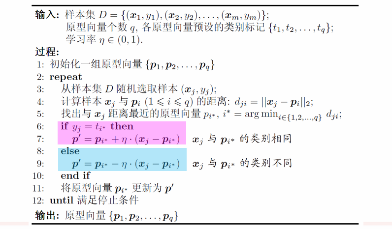
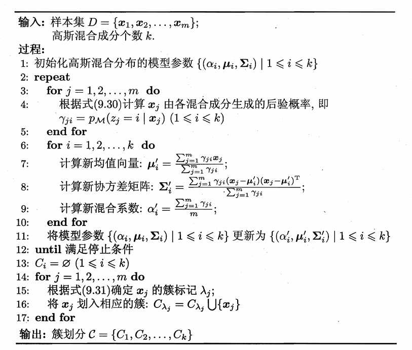

# Chapter9 聚类

什么是聚类？

将数据样本划分为不相交的**簇（cluster）**。

***

## 聚类基础

### 性能度量

聚类的性能度量，又称为**有效性指标（validity index）**。

* 外部指标：将聚类结果与某个参考模型进行比较。如 Jaccard 系数、FM 指数、Rand 指数等
* 内部指标：直接考察聚类结果，无参考模型。如 DB 指数、Dunn 指数等

基本想法：**簇内相似度高，簇间相似度低。**

### 距离计算

**闵可夫斯基距离（Minkowski distance）：**

闵可夫斯基距离针对的是有序属性：

$$\text{dist}\_{\text{mk}}(\mathbf{x}\_i,\mathbf{x}\_j)=(\sum\limits_{u=1}^n|x_{iu}-x_{ju}|^p)^{\frac{1}{p}}$$

* $p=1$：曼哈顿距离（Manhattan distance）
* $p=2$：欧氏距离（Euclidean distance）

**VDM（Value Difference Metric）：**

VDM 针对的是无序属性：

* $m_{u,a}$：属性 $u$ 上取值为 $a$ 的样本数
* $m_{u,a,i}$：在第 $i$ 个样本簇属性 $u$ 上取值为 $a$ 的样本数
* $k$：样本簇数

属性 $u$ 上两个离散值 $a$ 和 $b$ 之间的 VDM 距离为

$$\text{VDM}\_p(a,b)=\sum\limits_{i=1}^k|\frac{m_{u,a,i}}{m_{u,a}}-\frac{m_{u,b,i}}{m_{u,b}}|^p$$

**MinkovDM:**

将闵可夫斯基距离和 VDM 结合起来得到 MinkovDM，即可处理混合属性。假设有 $n_c$ 个有序属性，$n-n_c$ 个无序属性，令有序属性排列在无序属性之前：

$$\text{MinkovDM}\_p(x_i,x_j)=(\sum\limits_{u=1}^{n_c}|x_{iu}-x_{ju}|^p+\sum\limits_{u=n_c+1}^n\text{VDM}\_p(x_{iu},x_{ju}))^{\frac{1}{p}}$$

### 聚类分类

* **原型聚类**
  
  假设：聚类结构能通过一组原型（簇中心）刻画  
  过程：先对原型初始化，然后对原型进行迭代更新求解  
  代表：K均值聚类、学习向量量化、高斯混合聚类  

* **密度聚类**
  
  假设：聚类结构能通过样本分布的紧密程度刻画  
  过程：从样本密度的角度来考察样本之间的可连接性，并基于可连接样本不断扩展聚类簇  
  代表：DBSCAN、OPTICS、DENCLUE  

* **层次聚类**
  
  假设：能够产生不同粒度的聚类结果  
  过程：在不同层次对数据集进行划分，从而形成树形的聚类结构  
  代表：AGNES、DIANA

***

## K 均值聚类

* Step1：随机选取 $k$ 个样本点作为初始的簇中心
* Step2：计算每个样本点与各簇中心的距离，并将样本点分配给距离最近的簇中心
* Step3：更新每个簇的簇中心为该簇中所有样本点的均值
* Step4：重复 Step2 和 Step3，直到簇中心不再变化或达到最大迭代次数

!!! Success "Tip"
    **K-medoids 聚类**

    在每个簇中，如果不以均值作为簇中心，而是以到簇内其他点距离之和最小的点作为簇中心。 

***

## 学习向量量化 Learning Vector Quantization (LVQ)

LVQ 也试图找到一组代表样本簇的原型向量，但 LVQ 是有监督的，假设数据样本带有类别标记。

* 样本集：$D=\\{(\mathbf{x}_1,y_1),(\mathbf{x}_2,y_2),\dots,(\mathbf{x}_m,y_m)\\}$
* 每个样本有 $n$ 个属性和一个类别标记：$\mathbf{x}\_j=(x_{j1},x_{j2},\dots,x_{jn};y_j)$
* 目标：学得一组 $n$ 维原型向量 $\\{\mathbf{p}_1,\mathbf{p}_2,\dots,\mathbf{p}_q\\}$，每个原型向量代表一个聚类簇，簇标记为 $t_i$

!!! Note
    $q$ 不一定等于可能的类别数。

* Step1：随机选取 $q$ 个样本初始化 $q$ 个原型向量
* Step2：随机选取一个有标记的训练样本，找到与其距离最近的原型向量
* Step3：判断样本的类别标记与原型向量的簇标记是否相同
* Step4：若相同，则将原型向量向样本方向移动；否则，将原型向量远离样本方向移动。即更新原型向量
* Step5：重复 Step2 到 Step4，直到满足停止条件

***

## 高斯混合聚类

!!! Success "Definition"
    对 $n$ 维样本空间 $\mathcal{X}$ 中的随机变量 $\mathbf{x}$，若 $\mathbf{x}$ 服从高斯分布，则其概率密度函数为：

    $$p(\mathbf{x})=\frac{1}{(2\pi)^{\frac{n}{2}}|\Sigma|^{\frac{1}{2}}}e^{-\frac{1}{2}(\mathbf{x}-\boldsymbol{\mu})^T\Sigma^{-1}(\mathbf{x}-\boldsymbol{\mu})}$$

    其中，$\boldsymbol{\mu}$ 为 $n$ 维均值向量，$\Sigma$ 为 $n\times n$ 的协方差矩阵。高斯分布由这两个参数确定，我们将概率密度函数记为 $p(\mathbf{x}|\boldsymbol{\mu},\Sigma)$。

**模型假设 - 高斯混合分布：**

$$p_{\mathcal{M}}(\mathbf{x})=\sum\limits_{i=1}^k\alpha_i\cdot p(\mathbf{x}|\boldsymbol{\mu}_i,\Sigma_i)$$

上述分布的形式也是一个概率密度函数，由 $k$ 个高斯分布组成，混合系数满足 $\sum\limits_{i=1}^k\alpha_i=1$。

如果样本的生成是由高斯混合分布给出，那么生成过程如下：

* Step1：根据混合系数选择其中一个高斯分布，混合系数就是选择该高斯分布的概率
* Step2：根据选定的高斯分布生成样本

如果样本是按照上述方法生成的，那么每个样本对应一个 $z_j\in\{1,2,\dots,k\}$，表示该样本属于第几个高斯分布，自然而然达到了聚类的效果。根据**贝叶斯定理**，$z_j$ 的后验分布：

$$
\begin{align}
p\_{\mathcal{M}}(z_j=i|\mathbf{x}\_j) & =\frac{P(z_j=i)\cdot p\_{\mathcal{M}}(\mathbf{x}\_j|z_j=i)}{p\_{\mathcal{M}}(\mathbf{x}\_j)} \\\
& =\frac{\alpha_i\cdot p(\mathbf{x}\_j|\boldsymbol{\mu}\_i,\Sigma_i)}{\sum\limits_{l=1}^k\alpha_l\cdot p(\mathbf{x}\_j|\boldsymbol{\mu}\_l,\Sigma_l)}
\end{align}$$

上式简记为 $\gamma_{ji}$，表示的是对于给定的样本 $\mathbf{x}_j$，其属于第 $i$ 个高斯分布的概率有多大。

因此，对于每个样本 $\mathbf{x}_j$，都有一组属于各高斯分布的概率。我们想要达到这样的效果：分组后，每个样本都属于概率最大的那个高斯分布。

此时，我们的目标是：确定模型参数 $\\{(\alpha_i,\boldsymbol{\mu}_i,\Sigma_i)|1\leqslant i\leqslant k\\}$，从而确定高斯混合分布，这样之后，每个样本 $\mathbf{x}_j$ 对应的簇标记 $\lambda_j$ 就是：

$$\lambda_j=\operatorname*{arg\,max}\_{i\in\\{1,2,\dots,k\\}}\gamma_{ji}$$

**EM 算法：**

给定样本集 $D$，可采用**极大似然估计（最大化对数似然）**。直观理解上就是：我们之前想象样本是由 $p_{\mathcal{M}}(\mathbf{x})$ 生成的，因此我们希望这个模型尽可能贴合我们的样本集，即样本集在该模型下出现的概率尽可能大：

$$
\begin{align}
LL(D) & =\ln(\prod\limits_{j=1}^mp_{\mathcal{M}}(\mathbf{x}\_j)) \\\
& =\sum\limits_{j=1}^m\ln(\sum\limits_{i=1}^k\alpha_i\cdot p(\mathbf{x}\_j|\boldsymbol{\mu}_i,\Sigma_i))    
\end{align}
$$

那么只有导数为 $0$，对数似然才能最大化。得到结果如下：

$$\boldsymbol{\mu}\_i=\frac{\sum\limits_{j=1}^m\gamma_{ji}\mathbf{x}\_j}{\sum\limits_{j=1}^m\gamma_{ji}}$$

$$\Sigma_i=\frac{\sum\limits_{j=1}^m\gamma_{ji}(\mathbf{x}\_j-\boldsymbol{\mu}\_i)(\mathbf{x}\_j-\boldsymbol{\mu}\_i)^T}{\sum\limits_{j=1}^m\gamma_{ji}}$$

$$\alpha_i=\frac{1}{m}\sum\limits_{j=1}^m\gamma_{ji}$$

!!! Tip "Proof"
    **$\boldsymbol{\mu}_i$ 怎么得到：**

    首先，先考虑

    $$p=\frac{1}{(2\pi)^{\frac{n}{2}}|\Sigma|^{\frac{1}{2}}}e^{-\frac{1}{2}(\mathbf{x}-\boldsymbol{\mu})^T\Sigma^{-1}(\mathbf{x}-\boldsymbol{\mu})}$$

    对 $\boldsymbol{\mu}$ 求导。上式取对数：

    $$\ln p=\ln(\frac{1}{(2\pi)^{\frac{n}{2}}|\Sigma|^{\frac{1}{2}}})-\frac{1}{2}(\mathbf{x}-\boldsymbol{\mu})^T\Sigma^{-1}(\mathbf{x}-\boldsymbol{\mu})$$

    $$\frac{\partial \ln p}{\partial \boldsymbol{\mu}}=\Sigma^{-1}(\mathbf{x}-\boldsymbol{\mu})$$

    $$\frac{\partial p}{\partial \boldsymbol{\mu}}=\frac{\partial p}{\partial \ln p}\cdot\frac{\partial \ln p}{\partial \boldsymbol{\mu}}=p\cdot\Sigma^{-1}(\mathbf{x}-\boldsymbol{\mu})$$

    接下来，对 $LL(D)$ 求导：

    $$\frac{\partial LL(D)}{\partial \boldsymbol{\mu}\_i}=\sum\limits_{j=1}^m\frac{1}{\sum\limits_{l=1}^k\alpha_l\cdot p(\mathbf{x}_j|\boldsymbol{\mu}\_l,\Sigma_l)}\cdot\alpha_i\cdot\frac{\partial p(\mathbf{x}_j|\boldsymbol{\mu}\_i,\Sigma_i)}{\partial \boldsymbol{\mu}\_i}$$

    最后一项代入上面的结果：

    $$\frac{\partial LL(D)}{\partial\boldsymbol{\mu}\_i}=\sum\limits_{j=1}^m\frac{1}{\sum\limits_{l=1}^k\alpha_l\cdot p(\mathbf{x}_j|\boldsymbol{\mu}\_l,\Sigma_l)}\cdot\alpha_i\cdot p(\mathbf{x}_j|\boldsymbol{\mu}\_i,\Sigma_i)\cdot\Sigma^{-1}(\mathbf{x}_j-\boldsymbol{\mu}\_i)$$

    代入$\gamma_{ji}$：

    $$\frac{\partial LL(D)}{\partial\boldsymbol{\mu}\_i}=\sum\limits_{j=1}^m\gamma_{ji}\cdot\Sigma^{-1}(\mathbf{x}_j-\boldsymbol{\mu}\_i)$$

    令其为 $0$，并且两边同乘 $\Sigma$，得到：

    $$\sum\limits_{j=1}^m\gamma_{ji}(\mathbf{x}_j-\boldsymbol{\mu}_i)=0$$

    变换后得到结果：

    $$\boldsymbol{\mu}\_i=\frac{\sum\limits_{j=1}^m\gamma_{ji}\mathbf{x}\_j}{\sum\limits_{j=1}^m\gamma_{ji}}$$

    **$\Sigma_i$ 怎么得到：**

    同理：

    $$\frac{\partial \ln p}{\partial \Sigma}=\frac{1}{2}(\Sigma^{-1}(\mathbf{x}-\boldsymbol{\mu})^T(\mathbf{x}-\boldsymbol{\mu})\Sigma^{-1}-\Sigma^{-1})$$

    $$\frac{\partial p}{\partial \Sigma}=p\cdot\frac{1}{2}(\Sigma^{-1}(\mathbf{x}-\boldsymbol{\mu})^T(\mathbf{x}-\boldsymbol{\mu})\Sigma^{-1}-\Sigma^{-1})$$

    $$\frac{\partial LL(D)}{\partial\Sigma_i}=\sum\limits_{j=1}^m\gamma_{ji}\cdot\frac{1}{2}(\Sigma_i^{-1}(\mathbf{x}_j-\boldsymbol{\mu}_i)^T(\mathbf{x}_j-\boldsymbol{\mu}_i)\Sigma_i^{-1}-\Sigma_i^{-1})$$

    令其为 $0$，并且两边同时左右各乘 $\Sigma_i$，得到：

    $$\sum\limits_{j=1}^m\gamma_{ji}(\mathbf{x}\_j-\boldsymbol{\mu}\_i)(\mathbf{x}\_j-\boldsymbol{\mu}\_i)^T=\sum\limits_{j=1}^m\gamma_{ji}\Sigma_i$$

    变换后得到结果：

    $$\Sigma_i=\frac{\sum\limits_{j=1}^m\gamma_{ji}(\mathbf{x}\_j-\boldsymbol{\mu}\_i)(\mathbf{x}\_j-\boldsymbol{\mu}\_i)^T}{\sum\limits_{j=1}^m\gamma_{ji}}$$

    **$\alpha_i$ 怎么得到：**

    除了最大化 $LL(D)$，还要满足约束条件 $\sum\limits_{i=1}^k\alpha_i=1$。因此引入拉格朗日乘子 $\lambda$，构造新的目标函数：

    $$LL(D)+\lambda(\sum\limits_{i=1}^k\alpha_i-1)$$

    上式对于 $\lambda$ 偏导为 $0$ 可以得到：

    $$\sum\limits_{i=1}^k\alpha_i-1=0$$

    上式对于 $\alpha_i$ 偏导为 $0$ 可以得到：

    $$\sum\limits_{j=1}^m\frac{p(\mathbf{x}\_j|\boldsymbol{\mu}\_i,\Sigma_i)}{\sum\limits_{l=1}^k\alpha_l\cdot p(\mathbf{x}\_j|\boldsymbol{\mu}\_l,\Sigma_l)}+\lambda=0$$

    $$\alpha_i=-\frac{1}{\lambda}\sum\limits_{j=1}^m\gamma_{ji}$$

    两边对 $i$ 求和：

    $$1=\sum\limits_{i=1}^k\alpha_i=-\frac{1}{\lambda}\sum\limits_{i=1}^k\sum\limits_{j=1}^m\gamma_{ji}=-\frac{1}{\lambda}\sum\limits_{j=1}^m\sum\limits_{i=1}^k\gamma_{ji}=-\frac{m}{\lambda}$$

    $$\lambda=-m$$

    代入之前的式子，得到结果：

    $$\alpha_i=\frac{1}{m}\sum\limits_{j=1}^m\gamma_{ji}$$

综上：EM 算法包括：

* E 步：计算每个样本 $\mathbf{x}\_j$ 属于各高斯分布的概率 $\gamma_{ji}$
* M 步：根据 $\gamma_{ji}$ 更新模型参数 $(\alpha_i,\boldsymbol{\mu}_i,\Sigma_i)$

!!! Warning
    此处省略密度聚类、层次聚类。