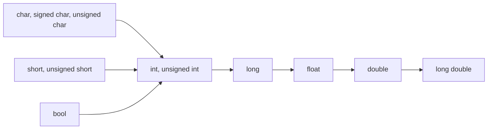

<span style="font-family: 'Times New Roman';">

# Chapter1 c++语法基础

***

## 1.1 c++面向对象程序设计

$~$

**定义：**

**面向对象编程（Object Oriented Programming, OOP）** 是一种编程思想，它将程序看作一个由各种独立的**对象（object）** 组成的集合。每个对象都有自己的属性和方法，并且可以与其他对象进行交互，共同完成任务。在面向对象编程中，通过**类（class）** 和**实例（instance）** 来描述具体事物，类定义了一类事物的通用属性和方法，而实例则是具体某个事物的一个具体表现。

$~$

**特性：**

* 抽象（abstraction）
* 封装（encapsulation）
* 继承（inheritance）
* 多态（polymorphism）

$~$

**c++对C语言的扩展：**

* c++规定函数定义时必须指明类型；
* c++规定高类型向低类型转换必须显式转换；
* c++引入内联函数；
* c++允许设置函数参数的默认值；
* c++允许函数重载和运算符重载；
* c++引入引用的概念。

$~$

***

## 1.2 符号说明

$~$

**数据类型：**

* 基本类型：  
    `int`, `char`, `long`, `wchar_t`, `char16_t`, `char32_t`
* 实型：  
    `float`, `double`, `long double`
* 逻辑类型：  
    `bool`
* 空类型：  
    `void`
* 自定义类型：  
    `struct`, `class`, `union`, `enum`, `pointer`, `array`
* STL中的类型：  
    `vector`, `string`, `list`, `stack`, `map`, `set`
* c++11：  
    `long long`

$~$

**关键字（keyword）：**

系统预定义的单词，不允许重定义。

`auto` `break` `case` `char` `class` `const` `continue` `default` `delete` `else` `enum` `explicit` `extern` `float` `for` `friend` `goto` `if` `inline` `int` `long` `new` `operator` `private` `protected` `public` `register` `return` `short` `signed` `sizeof` `static` `struct` `switch` `this`    `typedef` `union` `unsigned` `virtual` `void` `while`

$~$

**整型（32位系统）：**

类型|说明|字节|范围
:---:|:---:|:---:|:---:
`short [int]`|短整型|2|-32768~32767
`signed short [int]`|有符号短整型|2|-32768~32767
`unsigned short [int]`|无符号短整型|2|0~65535
`int`|整型|4|-2147483648~2147483647
`signed [int]`|有符号整型|4|-2147483648~2147483647
`unsigned [int]`|无符号整型|4|0~4294967295
`long [int]`|长整型|4|-2147483648~2147483647
`signed long [int]`|有符号长整型|4|-2147483648~2147483647
`unsigned long [int]`|无符号长整型|4|0~4294967295

$~$

**转义字符：**

名称|字符形式|值
:---:|:---:|:---:
空字符（null）|`\0`|0X00
换行（newline）|`\n`|0X0A
换页（formfeed）|`\f`|0X0C
回车（carriage return）|`\r`|0X0D
退格（backspace）|`\b`|0X08 
响铃（bell）|`\a`|0X07 
水平制表（horizontal tab）|`\t`|0X09
垂直制表（vertical tab）|`\v`|0X0B
反斜杠（backslash）|`\\` |0X5C
问号（question mark）|`\?`|0X3F
单引号（single quote）|`\'`|0X27
双引号（double quote）| `\"`|0X22

$~$

**输出格式控制符：**

控制符|功能
:---:|:---:
`endl`|输出一个新行符，并清空流
`ends`|输出一个空格符，并清空流
`dec`|用十进制表示法输入或输出数值
`hex`|用十六进制表示法输入或输出数值
`oct`|用八进制表示法输入或输出数值
`setfill(c)`|设置填充符
`setprecision(n)`|设置浮点数输出精度(包括小数点)
`setw(n)`|设置输出宽度

`setprecision(n)`：保留n位有效位，四舍五入：

```cpp linenums="1"
cout<<setprecision(3)<<3.14126<<" "<<2.4576<<endl; //输出：3.14 2.46
```

`setw(n)`：设置输出的宽度，其只对紧接着的输出产生作用。当输出字段长度小于n时，在该字段之前用空格补齐；当输出字段大于n时，整体输出，没有变动：

```cpp linenums="1"
cout<<setw(4)<<123456<<endl; //输出：123456
cout<<setw(8)<<123456<<endl; //输出：__123456（_表示空格）
```

`setiosflags(f)`和`resetiosflag(f)`：设置或重置流的格式：

```cpp linenums="1"
cout<<setiosflags(ios::left)<<setw(8)<<123<<setw(8)<<456<<endl;     //输出：123_____456_____
cout<<resetiosflags(ios::left)<<setw(8)<<123<<setw(8)<<456<<endl;   //输出：_____123_____456
cout<<setiosflags(ios::uppercase)<<hex<<255<<endl;                  //输出：FF
cout<<resetiosflags(ios::uppercase)<<hex<<255<<endl;                //输出：ff
```

数制基数在设置后将一致有效，直到下一次设置新的数制基数才取消：

```cpp linenums="1"
cout<<hex<<17<<" "<<17<<endl; //输出：11 11
cout<<17<<" "<<dec<<17<<endl; //输出：11 17
cout<<17<<" "<<oct<<17<<endl; //输出：17 21
```

$~$

***

## 1.3 指针（pointer）

$~$

**指针类型：**

```cpp linenums="1"
int* p1;                //p1是指向int的指针
int** p2;               //p2是指向int指针的指针
int* p3[10];            //p3是数组，数组元素是int指针
int (*p4)[10];          //p4是指针，指向一个数组，数组元素是int
int (*f1)(int,char);    //f1是指针，指向一个输入为int和char，输出为int的函数
int* f2(int);           //f2是函数，输入为int，输出为int指针
```

$~$

**空指针：**

c++中`NULL`，`0`，`nullptr`意义等价：

```cpp linenums="1"
type *p1=0;
type *p2=NULL;
type *p3=nullptr;
```

$~$

**`void*`指针：**

`void*`指针的值是一个内存地址，但该内存存放的数据类型未知，即`void*`指针是能够接受任何数据类型的特殊指针。

`void*`指针最重要的用途是作为函数的参数，向函数传递一个类型可变的对象；另一种用途是从函数返回一个无类型的对象。

在`void*`指针解引用之前，必须显式地将`void*`指针转换成某种数据类型的指针后使用。

```cpp linenums="1"
int main()
{
    int i=4;
    int* pi=&i;
    double d=9;
    double* pd=&d;
    void* pv;

    pv=&i;              //正确，地址的传递
    pv=pi;              //正确，地址的传递
    cout<<*pv<<endl;    //错误，pv指向的数据类型未知，无法解析
    pv=pd;              //正确，地址的传递
    cout<<*(double*)pv; //正确，在解引用之前进行了显示转换，声明指向的数据类型为double
}
```

$~$

**`begin()`&`end()`：**

`begin()`和`end()`是`<iterator>`头文件的两个函数，前者返回指向数组第一个元素的指针，后者返回指向数组最后一个元素的**下一个位置**的指针。

```cpp linenums="1"
//使用begin()和end()遍历数组a
int a[10]={1,2,3,4,5,6,7,8,9,10};
int* p=a;
for(int* p=begin(a);p!=end(a);p++) cout<<*p<<endl;
```

$~$

**`new`&`delete`：**

`new`用于动态分配内存，返回指针：

```cpp linenums="1"
p1=new type;                //用法一：分配type大小的内存
p2=new type(x);             //用法二：分配type大小的内存并初始化数据为x
p3=new type[n];             //用法三：分配n个type大小的内存（数组）
p4=new type[n1][n2][...];   //用法四：分配多维数组（必须提供所有维的大小）
```

`delete`用于释放内存：

```cpp linenums="1"
delete p1;       //用法一：释放p1指向的内存
delete[] p2;     //用法二：释放p2指向的数组内存
```

$~$

**智能指针：**

智能指针定义在`<memory>`头文件，和普通指针的区别在于，智能指针会负责**自动释放所指向的内存**，无需调用`free`或`delete`。有以下类型：

* `auto_ptr`：  
  （已废弃）
* `shared_ptr`：  
  多个`shared_ptr`可以指向同一个对象，当最后一个`shared_ptr`被销毁时，对象才被释放
* `unique_ptr`：  
  确保同一时间只有一个`unique_ptr` 拥有该对象，不能复制，但可以转移

```cpp linenums="1"
//x_ptr表示auto_ptr，shared_ptr或unique_ptr
x_ptr<type> p1;             //定义智能指针p1，类型为type
x_ptr<type> p2(p1);         //定义智能指针p2，类型为type，初始化为p1
x_ptr<type> p3(new type(x));//定义智能指针p3，类型为type，初始化为new type(x)
```

同类型的`auto_ptr`，`shared_ptr`之间可以相互赋值，但`unique_ptr`不行，因为同一时间只有一个`unique_ptr` 拥有该对象：

```cpp linenums="1"
unique_ptr<int> p1(new int(9));
unique_ptr<int> p2=p1; //错误，地址new int(9)只能存在一个unique_ptr中
```

智能指针和普通指针之间不能随意赋值，但可以通过`get()`函数获取智能指针中的指针后，再赋值给普通指针：

```cpp linenums="1"
int x=9;
int* ip=new int(1);             //普通指针（裸指针）
shared_ptr<int> sp(new int(8)); //智能指针
sp=&x;                          //错误，普通指针不能直接赋给智能指针
sp=ip;                          //错误，普通指针不能直接赋给智能指针
ip=sp;                          //错误，智能指针不能直接赋给普通指针
ip=sp.get();                    //正确
```

$~$

**弱指针：**

共享指针可能会引起循环引用，因为共享指针的释放需要计数归零，当互相引用时无法做到：

```cpp linenums="1"
struct A;
struct B;

struct A {
    shared_ptr<B> b_ptr;
};

struct B {
    shared_ptr<A> a_ptr;
};

int main()
{
    shared_ptr<A> a=make_shared<A>();   //make_shared<>()负责在堆上分配内存，比new更高效
    shared_ptr<B> b=make_shared<B>();
    a->b_ptr=b;
    b->a_ptr=a;
    //此时a和b的引用计数均为2

    return 0;                           //此时a和b无法被释放
}
```

这个时候就要引入弱指针`weak_ptr`。

弱指针也是智能指针的一种，但不占用内存，没有解引用操作，不参与引用计数，是一个观察者。弱指针能够提供对一个或多个共享指针拥有的对象的访问，可以用来解决两个共享指针相互引用产生的循环引用：

```cpp linenums="1"
struct A;
struct B;

struct A {
    std::shared_ptr<B> b_ptr;
};

struct B {
    std::weak_ptr<A> a_ptr;             //使用weak_ptr代替shared_ptr
};

int main()
{
    std::shared_ptr<A> a = std::make_shared<A>();
    std::shared_ptr<B> b = std::make_shared<B>();
    a->b_ptr = b;
    b->a_ptr = a;
    //此时a的引用计数为1，b的引用计数为2

    return 0;                           //此时先释放a再释放b
}
```

$~$

***

## 1.4 引用（reference）

$~$

引用即别名，是对对象的另一种访问方式。

$~$

**左值引用（lvalue reference）：类型& 引用名=变量名**

针对左值（单一变量）使用：

```cpp linenums="1"
int i=9;
int& ir=i;  //ir和i是同一实体的不同名称
```

$~$

**右值引用（rvalue reference）：类型&& 引用名=表达式**

针对右值（常量或表达式等即将销毁的临时对象）使用：

```cpp linenums="1"
double r=10;
double& lr1=r;      //正确，变量名是左值
double& lr2=r+10;   //错误，左值引用只能是单一变量
double&& rr=r;      //错误，右值引用不能是单一变量
double&& rr=r+10;   //正确，rr是保存r+10计算结果（20）的临时内存单元的别名
```

$~$

**注意事项：**

* 引用不是值，不占用内存；
* 引用在声明时必须初始化（除了函数的参数列表或者类的定义）；
* 引用的绑定在运行时不能修改（重新赋值）；
* 引用不能嵌套（因为引用某个引用实际上就是指向同一个值）；
* 指针不能指向引用变量，但引用可以指向指针变量；
* 没有引用类型的数组，也没有整个数组的引用；
* 引用不能为`NULL`或者`void`；
* 若一个变量声明为type&，则必须用一个类型为type或者能转换为type类型的变量（或对象）来赋值。

```cpp linenums="1"
int i=0,a[10]={1,2,3,4,5,6,7,8,9,10},*b[10];

int (&r1)[10]=a;    //正确，r1是具有10个int的数组的引用
int& r2=a[0];       //正确，r2是数组元素的引用
int* (&r3)[10]=b;   //正确，r3是具有10个int指针的数组的引用
int& r4[10]=a;      //错误，r4表示的意思是引用数组，每个数组元素都是引用，是不合法的
r1[3]=0;            //正确，数组引用的用法
```

在定义返回引用的函数时，注意不要返回该函数内的局部变量的引用，因为该变量的生存期仅限于函数内部，当函数返回时，该变量就消失了：

```cpp linenums="1"
int& fun()
{
    int a;
    ...
    return a; //错误
}
```

$~$

**引用传递的应用：**

应用一：交换变量值

```cpp linenums="1"
void swap(int &a,int &b)
{
    int temp=a;
    a=b;
    b=temp;
}
```

应用二：返回多值

```cpp linenums="1"
int fun(int n,int &rSquare,int &rCube)
{
    if(n>20 && n<0) return 1;
    rSquare=n*n;
    rCube=n*n*n;
    return 0;
}
```

$~$

***

## 1.5 常量（const）

$~$

**`const`&`constexpr`:**

`const`可以在编译时确定，也可以在运行时确定。

```cpp linenums="1"
const int class_size=12;
int finalgrade[class_size];
```

这里的`const`是编译时刻的，编译时就替换成常量，因此下面的静态数组定义正确。

```cpp linenums="1"
int x;
cin>>x;
const int size=x;
double classaverage[size];
```

这里的`const`是运行时刻的，只有运行时输入`x`才知道常量的值，但后面的静态数组在编译时就要知道大小来分配内存，因此会报错。

`constexpr`必须在编译时确定：

```cpp linenums="1"
const int n=size();     //正确，n在执行函数size()时取得
constexpr int m=size(); //错误，程序编译时不知道size()的值，因为并没有运行
```

注意事项：

* 常量一经定义就不能再改变
* 常量必须在定义时初始化
* 表达式可以出现在常量的定义语句中，`const`的定义语句可以有变量，但`constexpr`的定义语句不能有变量：

```cpp linenums="1"
int k=9;
const int i1=10+k+6;      //正确
constexpr int i2=10+k+6;  //错误
```

$~$

**常量与指针的限定关系：**

* `type* const p`：  
  指针`p`本身是常量，不能改变指向的地址，但可以改变指向的对象
* `type const *p`：  
  可以改变指向的地址，但不能通过`p`改变指向的对象
* `const type* p`：  
  可以改变指向的地址，但不能通过`p`改变指向的对象
* `const type* const p`：  
  指针本身不能修改，也不能通过指针修改指向的对象

!!! Note
    `type const *p`和`const type* p`指向的对象虽然不能通过`p`修改，但如果有其他指针指向同样的对象，那么只要指向的对象类型不是常量，就可以通过其他指针修改。

    `type* const p`不能指向常量。

```cpp linenums="1"
char c;
char* const pc=&c;      //正确，pc本身是常量，但可以改变指向的对象
pc="bbbb";              //错误，pc本身是常量，不能改变
*pc="a";                //错误，类型不匹配，"a"是const char*，*pc是char
*pc='a';                //正确
*(pc+1)='b';            //正确
pc++='y';               //错误，类型不匹配，pc++是char* const，'y'是char
const int b=28;
int* const pi=&b;       //错误，pi指向的对象可变，但b是常量
```

```cpp linenums="1"
const int a=78;
const int b=28;
int c=18;
const int* pi=&a;   //正确
*pi=58;             //错误，pi指向常量，不能修改
pi=&b;              //正确
*pi=68;             //错误，pi指向常量，不能修改
pi=&c;              //正确
*pi=88;             //错误，无论指向的是否是常量，都不能通过pi进行修改
```

$~$

**顶层常量（top-level const）和底层常量（low-level const）：**

顶层常量包括：所有数据类型定义的常量和本身是常量的指针。

```cpp linenums="1"
const int a=10; //第一种顶层常量
int b=20;
int* const p=&b;//第二种顶层常量
```

底层常量包括：所有指向常量对象的指针和常量引用。

```cpp linenums="1"
const int c=30; 
const int* q=&c;//第一种底层常量
const int& r=c; //第二种底层常量
```

$~$

**字符串常量：**

```cpp linenums="1"
char* s="Hello, world!";
```

`s`是一个指针，指向字符串常量。实际上这里的类型应该是`const char*`，但编译器会自动将其考虑为常量。

字符串实际上是可以修改的，但不同的编译器处理不同，也有可能报错，因此尽量不要修改。

随意修改的定义方法是：

```cpp linenums="1"
char s[]="Hello, world!";
```

$~$

**类型转换：**

变量可以当作常量处理，因为常量比变量更加严格；反过来不行：

```cpp linenums="1"
void f(const int* x);
int a=15;
f(&a);                  //正确，f参数为常量地址，&a为变量地址
const int b=a;          //正确，常量初始化
f(&b);                  //正确，f参数和&b都为常量地址
b=a+1;                  //错误，常量不能再改变
```

如果函数的参数要求是常量，则该参数在函数内部无法修改：

```cpp linenums="1"
void f1(const int i)
{
    i++; //错误
}
```

$~$

***

## 1.6 类型转换

$~$

**浮点型到整型的转换：**

```cpp linenums="1"
int ival=0;
ival=3.54+3;
```

编译器的处理过程如下：

* 将`int 3`转换成`double 3.00`
* 计算得到结果6.54
* 将等号右边的类型转换成等号左边的类型，直接去掉小数部分，即6.54变成6，并赋值给`ival`

$~$

**隐式类型转换：**

* 第一种：  
  在混合类型的算术表达式中，最宽的数据类型为最终类型。



* 第二种：  
  用一种类型的表达式赋值给另一种类型的对象，被赋值的类型为最终类型。

* 第三种：  
  把一个表达式传给一个函数调用，表达式的类型与形参的类型不同，形参的类型为最终类型。

* 第四种：  
  从一个函数返回一个值赋给某个变量，该变量的类型与函数返回类型不同，函数返回类型为最终类型。

$~$

**显式类型转换：**

* `static_cast<type>(expression)`：静态转换
* `dynamic_cast<type>(expression)`：动态转换（适用于多态）
* `const_cast<type>(expression)`：常量转换（移除或添加`const`）
* `reinterpret_cast<type>(expression)`：不相关的类型转换（将整型转换成指针等）

$~$

**`auto`:**

`auto`能从变量或表达式中自动推断出数据类型。

`auto`忽略所有引用，对于常量只保留底层常量，忽略所有顶层常量：

```cpp linenums="1"
auto x=3+8;             //相当于int x=3+8;         
auto c='s';             //相当于char c='s';
auto s="abcde";         //相当于const char* s="abcde";
auto z=x+3.8;           //相当于double z=x+3.8;

int i=1;
const int ic=2,&rc=ic;
auto pi=&i;             //相当于int* pi=&i;
auto pc=&ic;            //相当于const int* pc=&ic; 保留底层指针常量
auto rrc=rc;            //相当于int rrc=rc; 原本rc的类型是const int&，忽略引用再忽略顶层常量就是int
```

用`auto`设置引用类型时，初始值中的顶层常量会被保留：

```cpp linenums="1"
int i=1;
const int ic=2;
auto &ri=i;             //正确，相当于int& ri=i;
auto &rc=ic;            //正确，相当于const int& rc=ic; 初始值中的顶层常量被保留
auto &r0=4.3;           //错误，左值引用不能指向一个常量
auto &&r0=4.3;          //正确，右值引用可以指向一个常量，相当于double&& r0=4.3;
const auto &r1=4.3;     //正确，常量引用可以绑定到右值，相当于const double& r1=4.3;
```

`auto`可以同时定义多个变量，但数据类型只能有一种：

```cpp linenums="1"
auto x=3,y=12,z=30;     //正确
auto a=3,b=3.2;         //错误
```

$~$

**`decltype`:**

`decltype`也能从变量或表达式中自动推断出数据类型。

decltype(表达式1) 变量 = 表达式2

`decltype`用表达式1的结果类型定义变量，用表达式2的值初始化变量。

* 当表达式1是变量时，`decltype`不会忽略顶层常量和引用。
* 当**双括号**把表达式1括起来时，定义的一定是引用；而用**单括号**时，只有表达式1本身是引用时才定义为引用。

$~$

**`auto`和`decltype`推断数组：**

当表达式是一个数组时，`auto`推断出的数据类型是指向数组第一个元素的指针；`decltype`推断出来的数据类型是相同类型的数组：

```cpp linenums="1"
int a[]={1,2,3,4,5};
auto p1=a;          //相当于int* p1
decltype(a) p2;     //相当于int p2[5]
```

$~$

**`decltype(auto)`:**

当我们使用`decltype`时，可能会写出

```cpp linenums="1"
decltype(long expression) a=long expression;
```

的形式，`long expression`被重复输入，比较麻烦，因此`decltype(auto)`对此进行了改进，可以等效地写成：

```cpp linenums="1"
decltype(auto) a=long expression;
```

$~$

***

## 1.7 函数

$~$

**函数默认参数：**

* 函数声明和定义同时存在时，仅声明中才能出现默认参数；
* 函数默认参数只能默认全部或者部分右边的参数，即一旦某个参数开始指定默认值，其右边的所有参数都必须指定默认值；
* 在调用具有默认参数值的函数时，若某个实参默认，其右边的所有实参都应默认。

```cpp linenums="1"
int f(int i1=1,int i2=2,int i3=0)
{
    return i1+i2+i3;
}

f();        //正确，i1=1，i2=2，i3=0
f(3);       //正确，i1=3，i2=2，i3=0
f(2,3);     //正确，i1=2，i2=3，i3=0
f(4,5,6);   //正确，i1=4，i2=5，i3=6
f(,2,3);    //错误，i1缺省，而右边的i2，i3没有（违反第三点）
```

全局变量可以作为默认参数，但局部变量不能作为默认参数：

```cpp linenums="1"
string name="tom";
double h=0.8,len=1.1;
void dog(string dogname=name,double hight=h,double length=len)
{
    cout<<"Dogname:"<<dogname<<"\tHight:"<<h<<"\tLength:"<<len<<endl;
}

int main()
{
    name="Jake";    //修改全局变量，改变实参的默认值
    double h=2.1;   //局部变量h隐藏了全局变量h，对实参的默认值没有影响
    dog();
}
```

$~$

**函数重载（function overloading）：**

函数重载指的是，允许在同一作用域（程序）内定义多个同名函数，这些同名函数可以有不同的返回类型、参数类型、参数数量或函数功能：

```cpp linenums="1"
int abs(int x)
{
    return x>0?x:-x;
}

float abs(float x)
{
    return x>0>?x:-x;
}

double abs(double x)
{
    return x>0>?x:-x;
}

int main()
{
    cout<<abs(-9)<<endl;
    cout<<abs(-9.9f)<<endl;
    cout<<abs(-9.8)<<endl;
}
```

调用函数如果遇到函数重载的情况，则按照以下优先顺序来匹配函数：

* 准确匹配，无需任何转换或只需平凡转换（如数组名到指针、函数名到函数指针、变量到常量等）
* 利用提升（如`bool->int`, `char->int`, `short->int`, `float->double`等）
* 标准转换（如`int<->double`, `double<->long double`, `int->unsigned int`, `T*->void*`等）

```cpp linenums="1"
//记作f1
void f(int i)
{
    cout<<i<<endl;
}

//记作f2
void f(const char* s)
{
    cout<<s<<endl;
}

int main()
{
    char c='A';
    int i=1;
    short s=2;
    double ff=3.4;
    char a[10]="123456789";

    f(c);           //f1，利用提升
    f(i);           //f1，准确匹配
    f(s);           //f1，利用提升
    f(ff);          //f1，标准转换
    f('a');         //f1，利用提升
    f(3);           //f1，准确匹配
    f("string");    //f2，准确匹配
    f(a);           //f2，准确匹配
}
```

函数重载时每个函数的参数表唯一，也就是说，两个重载函数的形参个数、参数类型、参数顺序至少有一个不同。

当形参是顶层常量时，一方面，`const`限定的形参在函数内无法修改；另一方面，实参传递忽略顶层常量，即虽然形参定义的数据类型是`const`，但可以传非常量实参。

$~$

**内联函数（inline function）：**

内联函数是一种特殊的函数，在函数调用时，编译器会将函数代码直接插入到调用的地方，而不是通过传统的函数调用机制（如跳转到函数地址和返回）来执行。例如：

```cpp linenums="1"
inline int min(int a,int b)
{
    return a<b?a:b;
}
```

`int minval=min(i,j);`在编译时将被展开为`int minval=i<j?i:j;`。

注意事项：

* 内联函数在调用前必须要有声明或定义
* 内联函数不能有`for`，`while`，`switch`等复杂结构
* 内联函数不能递归

$~$

***

## 1.8 其他

$~$

**Lambda表达式：**

Lambda表达式实际上是一种匿名内联函数，使用起来更加方便：

```cpp linenums="1"
[capture list](parameters)[mutable]->return_type{statement};
```

capture list称为**捕获列表**，如果Lambda表达式要使用其父作用域的变量，就可以将其写到[ ]中，然后在函数体内就可以直接使用。

捕获变量（captured value）分为：

* 值捕获（value capture）：使用外部变量的值而不修改
* 引用捕获（reference capture）：修改外部变量的值

捕获列表|含义说明
:---:|---
[ ]|不捕获任何外部变量
[=]|值捕获所有外部变量
[&]|引用捕获所有外部变量
[x,&y]|值捕获x，引用捕获y
[&,x]|值捕获x，引用捕获其余外部变量
[=,&x]|引用捕获x，值捕获其余外部变量

parameters为Lambda表达式的形参表，和普通函数一样。

return _type为Lambda表达式的返回类型，允许省略。

statement为Lambda表达式的函数体，可以使用形参表的形参和捕获列表的外部变量。

在默认情况下，Lambda表达式值捕获的变量可看作常量，如果想要修改则可以使用mutable选项取消Lambda表达式的常量性，然后就可以修改了。

$~$

**广义捕获（generalized capture）：**

为捕获的外部变量指定新名称的方式称为广义捕获。例如：


```cpp linenums="1"
int x=4;
auto y=[&r=x,xx=x+1]
{
    r+=2;
    return xx+2;
};
```
    
调用一次`y`后，返回7，`x`的值变为6。

$~$

**命名空间（namespace）：**

命名空间是一种组织代码的方式，将程序的构成要素（变量名、数据类型、函数等）局限在某名字框定的范围内部，内部相互可见，可以直接引用，外部则要应用名字限定才能引用。

```cpp linenums="1"
namespace name
{
    members;
}
```

* `namespace`：定义命名空间的关键字
* `name`：程序员指定的命名空间的名字
* `members`：命名空间的成员，包括变量定义、函数声明、函数定义、结构声明、类声明等

```cpp linenums="1"
namespace ABC
{
    int count;
    typedef float house_price;
    struct student
    {
        char* name;
        int age;
    };
    double add(int a,int b)
    {
        return (double)a+b;
    }
    inline int min(int a,int b);
}
int ABC::min(int a,int b)
{
    return a>b?a:b;
}
```

可以通过作用域限定符`::`访问命名空间的成员，语法为`name::identifier`：

```cpp linenums="1"
int main()
{
    ABC::count=1;           //访问ABC空间中的count
    int count=9;            //main函数中的count与ABC空间中的count无关
    ABC::student s;         //用ABC空间中的student结构定义s
    s.age=9;
    int x=ABC::min(4,5);    //调用ABC中的min函数
}
```

可以使用`using name::identifier`引用命名空间的单个成员：

```cpp linenums="1"
int main()
{
    using ABC::count;
    count=2;
    int count=9;    //错误，重复定义
}
```

可以使用`using namespace name`引用命名空间的全体成员：

```cpp linenums="1"
int main()
{
    using namespace ABC;
    int count=9;    //错误，重复定义
}
```

此外，对于全局变量和局部变量，如果局部变量优先级更高的时候依然想访问全局变量，可以使用`::`限定符。

$~$

**数据类型扩展：**

c++对c的`struct`，`union`，`enum`进行了扩展。

在c中，结构名、联合名、枚举名不是类型：

```c
struct some_struct{...};
struct some_struct struct_var;
```

在c++中，结构名、联合名、枚举名是类型：

```cpp linenums="1"
struct some_struct{...};
some_struct struct_var;
```

此外，c++还允许在`struct`，`union`，`enum`内部设置函数：

```cpp linenums="1"
struct A
{
    int x;
    void setX(int a)
    {
        x=a;
    }
};

int main()
{
    A a[10];
    for(int i=0;i<10;i++) a[i].setX(i);
}
```

$~$

**`enum`和`enum class`：**

`enum`是c使用的枚举（enumeration），作用域不受定义它的{}限制，容易出现重定义错误。

`enum class`是c++使用的枚举器（enumerator），作用域局限在定义它的{}中，不容易出现重定义错误。

```cpp linenums="1"
enum color{black,white,red};
enum class color1{black1,white1,red1};
bool black=false;   //错误，不能通过编译
bool black1=false;  //正确
```

$~$

**`assert`：**

`assert`是一种能检测错误的宏，可以对表达式的结果进行判断，如果为假则退出程序，有利于debug。

```cpp linenums="1"
assert(b != 0 && "Division by zero error!");
```

$~$

**无名联合（anonymous union）：**

无名联合可以声明一组共享同一段内存地址的变量：

```cpp linenums="1"
union
{
    int i;
    float f;
}
```

变量`i`和`f`共享同一段内存地址，可以直接使用类似于`i=20`的语句使用其中的变量。