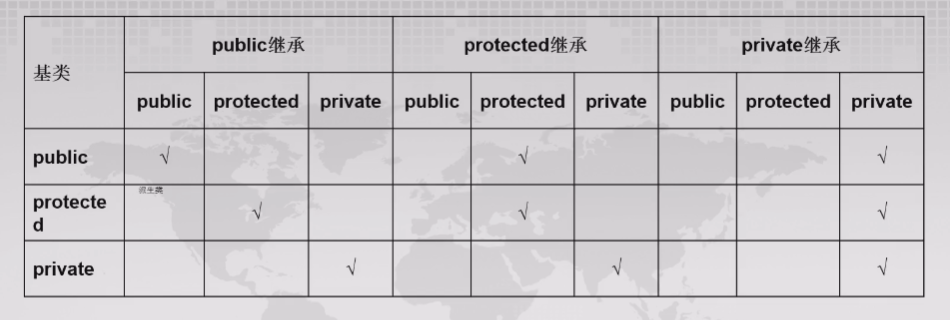

<span style="font-family: 'Times New Roman';">

# Chapter3 继承

***

## 3.1 继承（inheritance）

$~$

**继承**指的是以现有的类为基础定义新的类，子类（derived class）即为拥有父类（base class）的数据成员和成员函数的一份复制品。

继承方式分为**单一继承**（只有一个父类）和**多重继承**（有多个父类）。

!!! Note
    父类 = 基类 = 超类
    子类 = 派生类

$~$

**子类对父类的改变：**

* 增加新的数据成员和成员函数
* 重载父类的成员函数
* 重写父类的成员函数
* 改变父类成员在子类中的访问权限

$~$

**子类不能继承父类的内容：**

* 析构函数
* 友元函数
* 静态数据成员和静态成员函数
* 针对父类定义的一些特殊运算符，如`new`等

$~$

**继承方式：**

子类不同的继承方式会不同程度地改变父类成员在子类中的访问权限。

```cpp linenums="1"
class A{...};
class B: public A{...};         //public继承
class C: private A{...};        //private继承
class D: protected A{...};      //protected继承
```

public继承：

public继承是最常用的继承方式，子类继承了父类的数据成员和成员函数，同时保持这些成员的访问权限不变。

!!! Note
    父类的private成员只能被自身类的成员函数访问，不能被子类访问。
    子类继承父类的private成员，意味着这些成员确实存在于子类中，但不能被子类访问。

private继承：

private继承使得父类的public和protected成员在子类中变为private成员，而private成员依旧无法被子类访问。

protected继承：

protect继承使得父类的public成员在子类中变成protected成员，而其余成员的访问权限保持不变。



$~$

**阻止继承：**

如果不想让一个类作为其他类的父类，可以使用`final`关键字来阻止继承。

```cpp linenums="1"
class A final{...};             //A类不能被继承
class C final: public B{...};   //C类是B类的子类，C类不能被继承
```

$~$

**成员函数的重定义与名字隐藏：**

子类对父类成员函数的重定义或重载会影响父类成员函数在子类中的访问权限，父类的同名成员函数会被子类重载的同名函数隐藏。

!!! Example
    **设计计算矩形与立方体面积和体积的类。**

    将矩形抽象成`Rectangle`类，有protected数据成员`width`和`length`，有成员函数`setWidth`，`setLength`，`getWidth`，`getLength`，`area`（计算矩形的面积），`volume`（计算矩形的体积）和`outData`（输出矩形的长和宽）。

    将立方体抽象成`Cube`类，继承自`Rectangle`类，增加数据成员`height`，成员函数`setHeight`和`getHeight`。

    `Rectangle`类的成员函数`area`，`volume`和`outData`在`Cube`中需要重新定义。

    ```cpp linenums="1"
    class Rectangle
    {
        public:
            void setLength(double h) {length=h;}
            void setWidth(double w) {width=w;}
            double getLength() {return length;}
            double getWidth() {return width;}
            double area() {return length*width;}
            double volume() {return 0;}
            void outData()
            {
                cout<<"length="<<length<<endl;
                cout<<"width="<<width<<endl;
            }
        protected:
            double length;
            double width;
    };

    class Cube:public Rectangle
    {
        public:
            void setHeight(double h) {height=h;}
            double getHeight() {return height;}
            double area() {return 2*(length*width+length*height+width*height);}
            double volume() {return Rectangle::area()*height;}  // 子类访问父类同名成员的方法
            void outData()
            {
                Rectangle::outData();
                cout<<"height="<<height<<endl;
            }
        private:
            double height;
    };

    int main()
    {
        Cube cub1;
        cub1.setLength(4);
        cub1.setWidth(5);
        cub1.setHeight(3);
        cub1.Rectangle::outData(); // 调用从父类继承到的同名成员函数
        cub1.outData(); // 调用子类重定义的同名成员函数
    }
    ```

如果父类的某个成员函数有多个重载的函数版本，子类又定义了同名成员函数，则会隐藏父类同名的所有重载函数。

可以使用`using`声明使得父类同名的所有重载函数在子类中可见：

```cpp linenums="1"
using 父类名::被隐藏的成员函数名;
```

```cpp linenums="1"
class A
{
    public:
        void f(int a){cout<<a<<endl;}
        void f(int a,int b){cout<<a+b<<endl;}
        void f(){cout<<"A::f"<<endl;}
};

class B:public A
{
    public:
        using A::f; //使父类的3个f函数在此区域可见
        void f(char* d){cout<<d<<endl;}
};

int main()
{
    B b;
    b.f();          //调用父类成员
    b.f(1);         //调用父类成员
    b.f(1,2);       //调用父类成员
    b.f("hello");   //调用子类成员
}
```

$~$

**个别调整访问权限：**

在子类中，可以使用`using`语句再次声明父类的非private成员，并改变其访问权限为`using`语句所在区域的权限（即`using`语句在public区域内即为public权限，在protected区域内即为protected权限，在private区域内即为private权限）。

$~$

**友元与继承：**

友元不能被继承。如果一个类继承了其他类，则它声明的友元也只能访问它自己的全体成员，包括它从父类继承到的public成员和protected成员。

```cpp linenums="1"
class Base
{
    public:
        int x=0;
    protected:
        double y=0;
    private:
        float z=0;
        friend class Deri; //Deri为Base的友元类，Deri的成员函数可以访问Base的所有成员
};

class Deri:public Base
{
    protected:
        int dx=1;
    public:
        friend void f1(Deri d);
        friend void f2(Base b);
        void f3(Base b){cout<<b.x<<b.y<<b.z<<endl;} //正确
};

void f1(Deri d)
{
    cout<<d.x<<d.y<<endl;   //正确
    cout<<d.z<<endl;        //错误
}

void f2(Base b)
{
    cout<<b.x<<endl;        //正确
    cout<<b.y<<endl;        //错误
}
```

$~$

**静态成员与继承：**

父类的静态成员被所有继承的子类共享。

$~$

**继承与类作用域：**

对于父类（一般类）：建立属于自己的作用域，类内全体成员都位于该作用域内，相互之间可以直接访问，不受定义先后次序的影响。

对于子类：作用域嵌套在父类的作用域的内层。在解析子类成员时，首先在子类的作用域内查找，如果没有找到，则在父类的作用域内查找。

$~$

***

## 3.2 继承与构造函数

若父类没有默认构造函数，则子类必须显式地定义自己的构造函数，对父类提供构造函数初值，唯一途径是使用函数初始化列表：

```cpp linenums="1"
class Base
{
    private:
        int x;
    public:
        Base(int a)
        {
            ...
        }
};

class Derived:public Base
{
    private:
        int y;
    public:
        Derived(int a,int b):Base(a)    //初始化列表
        {
            ...
        }
};
```

如果子类的父类也是另一个类的子类，则每个子类只负责其直接父类的构造函数调用：

```cpp linenums="1"
class A
{
    public:
        A(int a)        //非默认构造函数
        {
            ...
        }
};

class B:public A
{
    public:
        B(int b):A(b)   //负责A类的构造函数调用
        {
            ...
        }
};

class C:public B
{
    public:
        C(int c):B(c)   //负责B类的构造函数调用
        {
            ...
        }
};
```

!!! Note
    例外：当子类存在虚父类的情况下，所有虚父类都由最后的子类初始化。

从以上内容我们大致知道，当父类没有默认构造函数时，子类需要定义构造函数；但是当父类具有多个重载构造函数，或者构造函数具有较多参数，一切都会显得比较麻烦。鉴于目标是为父类的构造函数提供初始化值，于是，有一种新的方法是：子类继承父类的构造函数（使用`using`即可）：

```cpp linenums="1"
class A
{
    int x,y;
    public:
        A(int aa): x(aa) {...}
        A(int a,int b): x(a),y(b) {...}
};

class B:public A
{
    public:
        using A::A; //继承了A的所有构造函数
};

class C:public B
{
    using B::B;     //继承了B的所有构造函数
    int c;
    public:
        C(int x,int y,int z):B(x,y),c(z) {...};
};
```

!!! Note
    使用`using`在子类中继承父类的构造函数和声明父类的其他成员不同。声明其他成员只是使其在指定的子类权限区域可见，并不生成代码；继承构造函数会在子类中生成构造函数的一份副本。

    父类的默认构造函数、拷贝构造函数和移动构造函数无法被继承。

如果父类的构造函数具有多个参数默认值，则针对这一个构造函数，子类在继承时会实际上会生成多个构造函数，每个构造函数的参数默认值依次减少一个。

例如，父类A的构造函数参数为`A(int a,int b=2)`，则子类B继承父类A的构造函数时实际生成的构造函数有两个，分别是`B(int a):A(a,2)`和`B(int a,int b):A(a,b)`。

创建子类的一个对象时，会依次调用：

**父类构造函数→子类对象成员构造函数→子类构造函数**

当一个子类继承多个父类时，调用父类构造函数的顺序与继承的声明顺序一致；当一个子类有多个对象成员时，调用对象成员构造函数的顺序与声明的顺序一致。注意，都与函数初始化列表的顺序无关。

!!! Example
    **类D从类B派生，且具有用类A和类C建立的对象成员，分析创建D的对象时，所有构造函数和析构函数的调用顺序。**

    ```cpp linenums="1"
    class A
    {
        int x;
        public:
            A(int i=0):x(i) {cout<<"Construct A:"<<x<<endl;}
            ~A() {cout<<"Destruct A:"<<x<<endl;}
    };

    class B
    {
        int y;
        public:
            B(int i):y(i) {cout<<"Construct B:"<<y<<endl;}
            ~B() {cout<<"Destruct B:"<<y<<endl;}
    };

    class C
    {
        int z;
        public:
            C(int i):z(i) {cout<<"Construct C:"<<z<<endl;}
            ~C() {cout<<"Destruct C:"<<z<<endl;}
    };

    class D:public B
    {
        public:
            C c1,c2;
            A a0,a4;
            D():a4(4),c2(2),c1(1),B(1) {cout<<"Construct D"<<endl;}
            ~D() {cout<<"Construct D"<<endl;}
    };

    int main()
    {
        D d;
    }
    ```

    输出结果为：

    ```
    Construct B:1
    Construct C:1
    Construct C:2
    Construct A:0
    Construct A:4
    Construct D
    Destruct D
    Destruct A:4
    Destruct A:0
    Destruct C:2
    Destruct C:1
    Destruct B:1
    ```

$~$

***

## 3.3 父类和子类对象的关系

$~$

**赋值相容（assignment compatibility）：**

子类通过继承获得了父类成员的一份拷贝，这份拷贝构成了子类对象内部的一个父类子对象。

因此，在public继承的情况下，凡父类对象能够解决的问题，用子类对象也能够解决，称为赋值相容。

* 把子类对象赋值给父类对象
* 把子类对象的地址赋给父类指针
* 用子类对象初始化父类对象的引用


!!! Example
    **类B从类A派生，设计类B的拷贝构造函数和赋值运算符函数，并验证把B的对象赋值给A的对象或通过它初始化A的对象时，相关函数的调用情况。**

    ```cpp linenums="1"
    class A
    {
        int a;
        public:
            void setA(int x) {a=x;}
            int getA() {return a;}
            A(): a(0) {cout<<"A::A()"<<endl;}           //A的默认构造函数
            A(A& o): a(o.a) {cout<<"A::A(&o)"<<endl;}   //A的拷贝构造函数
            A& operator=(A o)                           //A的拷贝赋值运算符
            {
                a=o.a;
                cout<<"A::operator="<<endl;
                return *this;
            }
    };

    class B:public A
    {
        int b;
        public:
            void setB(int x) {b=x;}
            int getB() {return b;}
            B(): b(0) {cout<<"B::B()"<<endl;}           //B的默认构造函数
            B(B& o): b(o.b) {cout<<"B::B(&o)"<<endl;}   //B的拷贝构造函数
            B& operator=(B o)                           //B的拷贝赋值运算符
            {
                b=o.b;
                cout<<"B::operator="<<endl;
                return *this;
            }
    }

    int main()
    {
        A a1,*pA;               //L1
        B b1,*pB;               //L2
        b1.setA(2);             //L3
        a1=b1;                  //L4
        b1.setA(10);            //L5
        A a2=b1;                //L6
        a2.setA(1);             //L7
        cout<<a1.getA()<<endl;  //L8
        cout<<b1.getA()<<endl;  //L9
        cout<<a2.getA()<<endl;  //L10
    }
    ```

    输出结果为：
    
    ```
    A::A()          //L1
    A::A()          //L2
    B::B()          //L2
    A::A(&o)        //L4，注意：b1进入函数时需要先复制构造一份形参，这里也会用到拷贝构造函数
    A::operator=    //L4
    A::A(&o)        //L6
    2               //L8
    10              //L9
    1               //L10
    ```

$~$

**类型转换：**

子类对象可以转换成父类对象，父类对象不能转换成子类对象。

用子类对象初始化/赋值父类对象时并没有执行类型转换；当把父类对象的指针或引用绑定到子类对象时会执行从子类对象到父类对象的隐式类型转换。

仍以之前的定义为例：

```cpp linenums="1"
B b b1,b2;
A *pa=&b1;  //隐式类型转换
A &ra=b2;   //隐式类型转换
A a=b;      //没有类型转换
```

父类对象不能直接转换成子类对象，但存在一种情况：如果父类的指针或引用实际绑定的是一个子类对象时，可以将其再次强制转换成子类对象。

例如先前的`A *pa=&b1;`和`A &ra=b2`，指针或引用本身是父类的，但实际绑定的是子类对象，此时分别可以使用`B *pb=static_cast<B*>(pa);`和`B &rb=static_cast<B&>(ra);`进行强制转换。

对于一个函数，如果其形参是父类对象，则也可以使用子类对象作为实参。

仍以之前的定义为例：

```cpp linenums="1"
void f1(A a,int x)
{
    a.setA(x);
}
void f2(A *pa,int x)
{
    pa->setA(x);
}
void f3(A &ra,int x)
{
    ra.setA(x);
}

int main()
{
    B b;
    b.setA(1);
    f1(b,10);   //形参是父类对象本身，不能修改实参的值（调用了复制构造函数）
    f2(&b,10);  //形参是父类对象的指针，能修改实参的值（隐式类型转换）
    f3(b,15);   //形参是父类对象的引用，能修改实参的值（隐式类型转换）
}
```

$~$

***

## 4.4 多重继承（multiple inheritance）与虚拟继承（virtual inheritance）

$~$

多重继承是指一个子类可以有多个父类。如果不同父类有同名成员，则子类多重继承时会有冲突。

```cpp linenums="1"
class A
{
    public:
        void f() {cout<<"From A"<<endl;}
};

class B
{
    public:
        void f() {cout<<"From B"<<endl;}
};

class MI: public A,public B
{
    public:
        void g() {cout<<"From MI"<<endl;}
};

int main()
{
    MI mi;
    mi.f();         //错误
    mi.A::f();      //正确
}
```

$~$

**虚拟继承（virtual inheritance）:**

引入原因：在间接继承中，间接父类在子类中可能有有多份拷贝，引发二义性。


虚拟继承解决了这个问题，使得间接父类在子类中只存在一份拷贝。

关键字`virtual`将其后的父类指定为虚拟父类。在上图的例子中，可以用以下方式声明：

```cpp linenums="1"
class Student:virtual public Person{...}
class Employee:virtual public Person{...}
class StuEmployee:public Student,public Employee{...}
```

* 如果虚拟父类没有默认构造函数，则所有直接或间接的子类都要显式地定义自己的构造函数，并在函数初始化列表中调用虚拟父类的构造函数。
* 虚拟父类子对象是由最远子类的构造函数调用虚拟父类的构造函数进行初始化的。
* 在一个初始化列表中，若同时存在对虚拟父类和非虚拟父类的初始化，则前者先于后者。