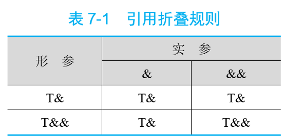
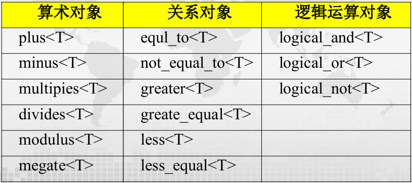

<span style="font-family: 'Times New Roman';">

# Chapter6 模板与STL

***

## 6.1 模板（template）

某些程序除了所处理的数据类型等之外，代码和功能几乎一致，甚至完全相同。如何只写一次代码，却可以处理不同数据类型？我们需要使用模板。

模板分为**函数模板（function template）** 和 **类模板（class template）**。

!!! Note
    变量→类型  
    对象→类  
    类→类模板  
    函数→函数模板  

$~$

***

## 6.2 函数模板

$~$

```cpp linenums="1"
template <typename T1,typename T2,...>
返回类型 函数名(参数列表)
{
    函数体
}
```

`template`和`typename`为关键字，`T1`、`T_2`等为模板参数，模板参数传递的实参是一种数据类型。

!!! Example
    **求两数最小值的函数模板。**

    ```cpp linenums="1"
    template <class T> //class和typename可以互换，二者都是关键字
    T min(T a,T b)
    {
        return a<b?a:b;
    }

    int main()
    {
      double a=2,b=3.4;
      float c=2.3,d=3.2;
      cout<<min(2,3)<<endl;     //调用int类型的min，结果为2
      cout<<min(a,b)<<endl;     //调用double类型的min，结果为2
      cout<<min('a','b')<<endl; //调用char类型的min，结果为'a'
      cout<<min(c,d)<<endl;     //调用float类型的min，结果为2.3
    }
    ```

注意事项：

* `template`语句和函数模板定义之间不能有其他语句；
* 函数模板可以出现确定类型参数，称为**非类型参数（non-type template parameter）**，如：

```cpp linenums="1"
template <typename T1,typename T2,typename T3,int T4>
T1 fx(T1 a,T2 b,T3 c,int d)
{
    ...
}
```

* 在传递实参时，非类型参数只能使用常量，例如上面的`T4`和`d`；
* 模板的声明和定义必须保存在同一文件中；
* 非类型参数不允许使用浮点型、双精度型、类对象或`void`类型。

$~$

**实例化（instantiation）：**

模板实例化发生在调用函数模板时。编译器根据调用语句中实参的类型来确定模板参数的数据类型，并加以替换，得到模板函数。例如：

```cpp linenums="1"
int x=min(2,3);
int y=min(3,9);
int z=min(8,5);
```

三者实际类型相同，编译器只在第一次调用时生成模板函数，之后相同类型的调用直接使用第一次生成的函数代码。

以上接触到的均为**隐式实例化（implicit instantiation）**，即编译器自行判断模板参数类型。如果无法判断，则需要**显式实例化（explicit instantiation）**，即在调用函数模板时，显示指定模板参数类型。例如：

```cpp linenums="1"
template <class T> T max(T a,T b)
{
    ...
}

int i=max(1,'2');       //错误，编译器无法判断模板参数类型
int i=max<int>(1,'2');  //正确，显式实例化模板参数类型为int
```

$~$

**模板参数的匹配问题：**

将模板参数替换成调用实参的类型时，不会进行参数类型的任何转换。

例如上面的隐式实例化`max(1,'2')`，并不会进行隐式类型转换，从而产生编译错误。

解决方法一：在调用模板时进行参数类型的强制转换：

```cpp linenums="1"
max(1,int('2'))
```

解决方法二：显式实例化：

```cpp linenums="1"
max<int>(1,'2')
```

解决方法三：指定多个模板参数：

```cpp linenums="1"
template <class T1,class T2>
T1 max(T1 a,T2 b)
{
    return a>b?a:b;
}
```

$~$

***

## 6.3 类模板

$~$

类模板可用于设计结构和成员函数完全相同，但所处理的数据类型不同的通用类，如栈等。

```cpp linenums="1"
template <typename T1,typename T2,...>
class 类名
{
    ...
};
```

**类模板的成员函数定义：**

方法一：模板内定义，与常规方法相同。

方法二：模板外定义：

```cpp linenums="1"
template <模板参数列表>
返回值类型 类模板名 <模板参数名称列表>::成员函数名(参数列表)
{
    函数体
}
```

!!! Example
    **设计一个堆栈的类模板`Stack`，在模板中用类型参数`T`表示栈中存放的数据，用非类型参数`MAXSIZE`表示栈的大小。**

    ```cpp linenums="1"
    template <class T,int MAXSIZE>
    class Stack
    {
        private:
            T elems[MAXSIZE];
            int top;
        public:
            Stack() {top=0;}
            void push(T e);
            T pop();
            bool empty(){return top==0;}
            bool full(){return top==MAXSIZE;}
    };

    template <class T,int MAXSIZE>
    void Stack<T,MAXSIZE>::push(T e)
    {
        if(top==MAXSIZE)
        {
            cout<<"栈已满！"<<endl;
            return;
        }
        elems[top++]=e;
    }

    template <class T,int MAXSIZE>
    T Stack<T,MAXSIZE>::pop()
    {
        if(top<=0)
        {
            cout<<"栈已空！"<<endl;
            return 0;
        }
        return elems[--top];
    }
    ```

$~$

**类模板的实例化：**

当用类模板定义对象时，引起类模板的实例化，得到模板类。类模板在使用时一定要显式指明模板参数类型。

例如，对于上面定义的`Stack`类模板，下面的定义将引起实例化：

```cpp linenums="1"
Stack<int,10> iStack;
```

这个时候，将会有：

* 数据成员实例化：将所有类型参数`T`替换成`int`，将所有非类型参数`MAXSIZE`替换成10，生成一个`int`类型的模板类
* 成员函数实例化：用`int`替换`T`实例化出被调用的构造函数，但**未被调用的成员函数不被实例化**

$~$

## 6.4 模板设计相关问题

$~$

**传值模板参数：**

```cpp linenums="1"
template<typename param>
r_type f(param p,...)
{...}
```

调用`f()`时，编译器根据传递给`p`的实参类型推导出模板参数`param`的实际类型。

在推导过程中，会去除所有加在实参上的类型限定符，包括`const`，`&`和`&&`等，体现函数的值形参语义。

例如：

```cpp linenums="1"
int i1=0;
int& i2=i1;
const int& i3=i1+8;
int&& i4=5+7;
int* i5=new int(1);
unique_ptr<int> i6 {new int};
```

对于上面的`fun`函数模板，使用：

```cpp linenums="1"
f(2);   //判断param为int
f(i1);  //判断param为int
f(i2);  //判断param为int
f(i3);  //判断param为int
f(i4);  //判断param为int
f(i5);  //判断param为int*
f(i6);  //错误，unique_ptr不能被复制
```

$~$

**左值引用模板参数：**

```cpp linenums="1"
template<typename param>
r_type f(param& p,...)
{...}
```

在这种情况下，如果判断出来`p`为左值引用，则函数实际传递的是实参。如果实参是`const`类型，则保留`const`限定。

但是，这个时候不能传递字面常量和临时变量。

同样考虑上面的例子：

```cpp linenums="1"
f(2);           //错误，不能传递字面常量
f(i1);          //p为int&
f(i2);          //p为int&
f(i3);          //p为const int&
f(i4);          //p为int&（引用折叠）
f(i5);          //p为int*&
f(i6);          //p为unique_ptr<int>&
f(move(i6));    //错误，move(i6)是右值
```

当类型参数为左值引用时，无论实参是左值还是右值，推断出来的模板参数都是左值。

$~$

**右值引用模板参数：**

```cpp linenums="1"
template<typename param>
r_type fun(param&& p,...)
{...}
```

既可以接受左值引用实参，又可以接受右值引用实参，又被称为**转发引用（forwarding reference）**。

当类型参数是右值引用时，只有当实参也是右值时，推断出来的模板参数才是右值引用。



$~$

**内联函数与常量函数模板：**

函数模板可以定义为内联函数模板或常量函数模板：

```cpp linenums="1"
template <class T>
inline T min(T a, T b)
{
    return (a<b)?a:b;
}

template <class T>
constexpr T min(T a, T b)
{
    return (a<b)?a:b;
}
```

$~$

**默认模板实参：**

模板参数可以指定默认值。遵守与函数默认值同样的规则：一旦指定了默认值，则后面的参数都必须指定默认值。

!!! Example
    **设计比较两个不同类型数字大小的函数模板`compare`，第二个模板参数的类型默认为`double`。**

    ```cpp linenums="1"
    template <typename T,typename D=double>
    int compare(T t=0,D u=0)
    {
        if(t>u) return 1;
        else if(t<u) return -1;
        else return 0;
    }

    int main()
    {
        cout<<compare(10,'a')<<endl;        //解释为compare<int,char>(10,'a')
        cout<<compare<int,char>()<<endl;    //解释为compare<int,char>(0,0)
        cout<<compare(20)<<endl;            //解释为compare<int,double>(20,0)
        cout<<compare<int>()<<endl;         //解释为compare<int,double>(0,0)
        cout<<compare()<<endl;              //错误
    }
    ```

$~$

**模板与仿函数：**

!!! Example
    **设计一个通用求和、求积的函数模板`accumulate()`，调用类模板`Add`和`Mul`的仿函数计算数据区间的和或积。**

    ```cpp linenums="1"
    template <typename T>
    class Add
    {
        public:
            T operator()(const T& x,const T& y) {return x+y;}
    };

    template <typename T>
    class Mul
    {
        public:
            T operator()(const T& x,const T& y) {return x*y;}
    };

    template <typename iter,typename T,typename function>
    T accumulate(iter begin,iter end,T init,function f)
    {
        for(iter it=begin;it!=end;++it)
        {
            init=f(init,*it);
        }
        return init;
    }

    int main()
    {
        vector v1=(2.1,3.1,4.1,5.1,7.1);
        vector<double> v2={2.0,3.0,4.0,5.0,7.0}
        double sum=accumulate(v1.begin(),v1.end(),0.0,Add<int>());  //注意这里怎么传递函数类型
        double mul=accumulate(v2.begin(),v2.end(),1.0,Mul<double>());
        cout<<sum<<" "<<mul<<endl;      //输出21和840
    }
    ```

$~$

**成员模板（member template）：**

类中的（成员函数）模板称为成员模板。

成员模板是类的成员，不能是虚函数。

!!! Example
    **`OutArray`是一个数组输出的代理类，为其设计一个成员模板，用于输出指定大小的不同类型数组值。**

    ```cpp linenums="1"
    class OutArray
    {
        private:
            ostream& os;
        public:
            OutArray(ostream& o=cout):os(o){};
            template <typename T>   //成员模板
            void operator()(T* a,int n)
            {
                for(int i=0;i<n;i++)
                {
                    os<<a[i]<<"\t";
                }
                os<<endl;
            }
    };

    int main()
    {
        double d[]={1.2,3.4,5.6,7,8,9};
        const char* c[]={"abc","def","ghi","jkl"};
        OutArray out;
        out(d,6);   //输出：1.2 3.4 5.6 7 8 9
        out(c,4);   //输出：abc def ghi jkl
    }
    ```

$~$

**可变参数函数模板：**

参数类型和个数个数都不确定的函数模板称为可变参数函数模板。

```cpp linenums="1"
template<typename T1,typename... T2>
{
    r_type f(T1 p,T2... arg)
    {
        ...
    }
}
```

其中，`T2`为可变模板参数，称为**参数包**，可以是零个或多个类型不同的模板参数。

!!! Example
    **设计`mymax`函数模板，能从任意多个数字中计算出最大值。**

    

    ```cpp linenums="1"
    template <typename T>   //结束条件：当只有一个参数时返回
    T mymax(T t)
    {
        return t;
    }

    template <typename T1,typename... T2>
    T mymax(T1 p,T2... arg)
    {
        T ret=mymax(arg...);   //包扩展
        if(p>ret) return p;
        else return ret;
    }

    int main()
    {
        cout<<mymax(1,12,3,4,20)<<endl;     //输出：20
        cout<<mymax('5',32,'2',23.0)<<endl; //输出：53（'5'的ASCII）
        cout<<mymax('a','z',2)<<endl;       //输出：122（'z'的ASCII）
        cout<<mymax(2,3.2)<<endl;           //输出：3.2
    }
    ```

    可变参数模板的运行过程和递归程序相似，需要定义结束模板递归的函数模板。

$~$

**模板重载：**

同函数重载的规则相同，重载的同名函数模板必须具有不同的形参表：

```cpp linenums="1"
template <typename T>
inline T const& max(T const& a,T const& b)
{
    return a>b?a:b;
}

template <typename T>
inline T const& max(T const& a,T const& b,T const& c)
{
    return max(max(a,b),c);
}
```

$~$

**模板特化（template specialization）：**

让一个模板实现对全部数据类型的正确处理不一定能做得到。例如，上例的`max`函数模板不能正确计算字符串类型的最大值，因为字符串类型的比较使用的是`strcmp()`函数。

为了解决这一问题，c++允许为模板定义针对某种数据类型的替代版本，称为模板特化：

```cpp linenums="1"
template <>
```

其中，`<>`中不需要任何内容。

这样，针对上例的`max`函数模板，我们可以定义一个字符串类型的特化版本，用`const char*`替换原本模板中的`T`：

```cpp linenums="1"
template <>
const char* const& max(const char* const& a,const char* const& b)
{
    return strcmp(a,b)>0?a:b;
}
```

!!! Note
    函数调用顺序：  
    先选择形参匹配最精确的函数（模板函数算最精确的匹配）。如果精确度一样，则优先级为：  
    **普通函数→特化函数→模板函数**

$~$

***

## 6.5 STL

STL全称Standard Template Library，即为**标准模板库**，本质上是一些容器、算法等组件的集合。

$~$

**函数对象：**

STL为每个算术运算和关系运算都定义了一个对应的运算模板类，称为函数对象，定义在`<function>`头文件中。



使用方法如下：

```cpp linenums="1"
plus<int> iadd;
int s=iadd(2,3);            //s=5

minus<double> dminus;
double d=dminus(25,5);      //d=20.0

less<int> iless;
if(iless(5,7)) cout<<"5<7"; //输出：5<7

int a[]={1,3,-2,0};
sort(a,a+4,greater<int>()); //降序排序：3,1,0,-2
```

$~$

**容器（container）：**

容器是用来存储其他对象的对象。

* **顺序容器（sequence container）：** 向量（vector）、链表（list）、双端队列（deque）
* **关联容器（associative container）：** 集合（set）、多重集合（multiset）
* **容器适配器（container adapter）：** 堆栈（stack）、队列（queue）、优先队列（priority queue）

STL中的容器及头文件名：


所有容器都具有的成员函数：


顺序容器和关联容器共同支持的成员函数：


$~$

**vector:**

vector在插入或删除数据时，能自动扩展和压缩大小；可以用类似数组的`[]`来访问指定元素，但其与数组相比更加灵活，因为其大小动态可变。


$~$

**list:**

list是双向链表，只支持顺序访问。链表节点的访问常常通过迭代器进行。


链表构造：

```cpp linenums="1"
list<T> c;                      //创建空链表c
list<T> c1(c2);                 //用c2的值创建c1
list<T> c(n);                   //创建有n个元素的链表c，元素值由默认构造函数产生
list<T> c(n,e);                 //创建有n个元素的链表c，每个元素都是e
list<T> c(iter_left,iter_right);//创建链表c，并用另一容器一定范围内的元素（迭代器形式，左闭右开）初始化
```

链表赋值：

```cpp linenums="1"
c1=c2;                          //将c2的全部元素赋给c1
c.assign(n,e);                  //将元素e拷贝n次赋给c
c.assign(iter_left,iter_right); //将另一容器一定范围内的元素（迭代器形式，左闭右开）赋给c
c1.swap(c2);                    //将c1和c2的元素互换
```

!!! Note
    这里的赋值是完全覆盖原本的内容，相当于销毁原来的再变成新的。

链表存取：

```cpp linenums="1"
c.front();  //返回第一个元素，不检查是否存在
c.back();   //返回最后一个元素，不检查是否存在
```

链表增删：

```cpp linenums="1"
c.insert(p,e);                      //在迭代器p所指元素前面插入e
c.insert(p,n,e);                    //在迭代器p所指元素前面插入n个e
c.insert(p,iter_left,iter_right);   //在迭代器p所知元素前面插入另一容器一定范围内的元素（迭代器形式，左闭右开）
c.push_back(e);                     //末尾添加e
c.push_front(e);                    //开头添加e
c.pop_back();                       //删除末尾元素
c.pop_front();                      //删除开头元素
c.remove(v);                        //删掉所有值为v的元素
c.remove_if(op);                    //删掉所有谓词op为false的元素
c.erase(p);                         //删掉迭代器p所指元素
c.erase(iter_left,iter_right);      //删掉迭代器范围内的元素（左闭右开）
c.resize(n);                        //若n比当前尺寸大，则补0；否则截断
c.clear();                          //清空
```

特殊操作：

```cpp linenums="1"
c.unique();                         //删除相邻重复元素，只留一个
c.unique(op);                       //删除相邻使谓词op为true的元素，只留第一个
c1.splice(p,c2);                    //将c2所有元素插到c1的迭代器p指向元素之前，c2清空
c1.splice(c1_p,c2,c2_p);            //将c2中c2_p指向元素插到c1中c1_p所指元素之前
c1.splice(p,c2,c2_ileft,c2_iright); //将c2迭代器范围内元素插到c1的迭代器p指向元素之前
c.sort();                           //升序排序
c.sort(op);                         //根据谓词op排序
c1.merge(c2);                       //c1与c2合并，二者必须有序，c2变为空
c.reverse();                        //反序
```

$~$

**stack：**

可以用list或vector实现stack。

* `push()`：入栈
* `pop()`：出栈
* `top()`：返回栈顶元素值，但不像`pop()`那样删除元素

$~$

**queue和priority_queue：**

queue同样也有和stack类似的`push`、`pop`、`top`函数。区别在于，queue的`push`发生在队尾，`pop`和`top`发生在队头。

priority_queue和queue的区别在于，其队头元素总是最大的——即执行`pop`操作时，删除的总是最大的元素；执行`top`操作时，返回的是最大元素的引用。priority_queue的实现通常使用堆排序，但其内部并非完全有序。

$~$

**string:**

string是一种特殊类型的容器，因为其既可以作为字符类型的容器，本身又可以视作字符串这一类型。

```cpp linenums="1"
s.substr(n1,n);             //从n1下标开始，取出n个字符作为新的字符串
s1.swap(s2);                //交换字符串内容
s.size(); s.length();       //字符串长度，不计'\0'（因为string没有）
s.capacity();               //不再分配内存的情况下，字符串可用长度，一般比size长（字符串会预留额外空间来优化内存管理）
s.max_size();               //不断分配内存后字符串可达到的最大长度
s1.find(s2);                //s1中找s2子串，返回第一次出现的索引
s1.rfind(s2);               //从后往前找，但注意索引还是s2字串的开头
s1.find_first_of(s2);       //s1中找第一个属于s2的字符，返回索引
s1.find_last_of(s2);        //s1中找最后一个属于s2的字符，返回索引
s1.replace(n1,n,s2);        //从s1的n1下标开始的n个字符被替换成s2
s1.replace(n1,n,s2,n2,m);   //从s1的n1下标开始的n个字符被替换成从s2的n2下标开始的m个字符
s1.insert(n,s2);            //在下标n之前插入s2
s1.insert(n1,n,s2,n2,m);    //在s1的n1之前插入s2从下标n2开始的m个字符
```

`string`与`char*`有所区别，`string`不需要结束符`\0`，而`char*`需要，因此不能将`string`直接赋值给`char*`。

将`string`转换成`const char*`，需要使用`string`的`data()`成员函数；将`char*`赋值给`string`，可用`string`的`copy()`成员函数。

```cpp linenums="1"
string s1="ABCDEFGH";
const char* cs1;
cs1=s1.data();          //data函数只适用于赋值给const char*
char* cs2;
int len=s1.length();
cs2=new char[len+1];
s1.copy(cs2,len,0);
cs2[len]=0;             //cs2最后需要加上`\0`
```

$~$

**迭代器（iterator）：**

迭代器是一个对象，常用于遍历容器取得元素，可以理解成一个更强大的指针。

主要操作：

* `*`：获得当前位置的元素值
* `++`：前进到下一位置
* `--`：回退到前一位置
* `==`/`!=`
* `=`：赋值
* `begin()`：指向容器第一个元素位置
* `end()`：指向容器最后一个元素的后一个位置
* `rbegin()`：指向容器最后一个元素位置
* `rend()`：指向容器第一个元素的前一个位置

$~$

**pair和tuple:**

pair只能有两个元素，tuple可以有多个元素，且tuple的元素可以是其他容器。

tuple的构造：

```cpp linenums="1"
tuple<T1,T2,...,Tn> t;                  //默认构造函数
tuple<T1,T2,...,Tn> t(v1,v2,...,vn);    //使用指定值初始化（实际调用的是构造函数，可以隐式转换）
tuple<T1,T2,...,Tn> t{v1,v2,...,vn};    //使用值列表初始化（实际调用的是列表初始化，无法隐式转换）
tuple<T1,T2,...,Tn> t={v1,v2,...,vn};   //错误用法，tuple的构造函数是explicit的
auto t=make_tuple(v1,v2,...,vn);        //使用指定值初始化。等价于第二种写法
```

tuple的访问：

```cpp linenums="1"
get<n>(t);   //返回t的第n个元素
```

$~$

**关联容器：**

关联容器中的每个元素都有一个键和一个值，set的键就是值，map的键和值分开形成映射。

关联容器的元素按键值顺序排列，实现结构为红黑树或者哈希表。

$~$

**set和multiset:**

set和multiset类似，它和multiset的差别在于set中不能有重复的元素。multiset的成员函数set中也都有。

不能直接修改set中的元素，因为元素被修改后，容器并不会自动重新调整顺序，于是容器的有序性就会被破坏。正确的做法是删除原元素，然后插入修改后的新元素。

set/multiset的定义：

```cpp linenums="1"
set c;                      //创建空集合
set c(op);                  //创建空集合，指定排序规则，op可以是less<>（从小到大）或greater<>（从大到小）之一，应用时要在<>写上类型，如less<int>，默认排序方式为less<>
set c1(c2);                 //用c2的值创建c1
set c(begin,end);           //用迭代器范围内的元素创建集合c
```

set/multiset的容量计算：

```cpp linenums="1"
c.size();                   //返回集合中元素个数
c.empty();                  //判断集合是否为空
c.max_size();               //返回集合中能保存的最大元素个数
```

set/multiset的常用操作：

```cpp linenums="1"
c.count(e);                 //返回集合中值为e的元素个数
c.find(e);                  //返回集合中第一个值为e的元素的迭代器
c.lower_bound(e);           //返回集合中第一个值大于等于e的元素的迭代器
c.upper_bound(e);           //返回集合中第一个值大于e的元素的迭代器
c.insert(e);                //插入元素e
insert(pos,e);              //在迭代器pos所指元素之前插入元素e，但实际上pos只是一个提示迭代器，最终还是会按照顺序优化
c.insert(begin,end);        //将迭代器范围内的元素插入集合
c.erase(e);                 //删除集合中所有值为e的元素
c.erase(pos);               //删除迭代器pos所指元素
c.erase(begin,end);         //删除迭代器范围内的元素
c.clear();                  //清空集合
c.begin();                  //返回集合中第一个元素的迭代器
c.end();                    //返回集合中最后一个元素的后一个迭代器
```

$~$

**map和multimap:**

map和multimap的区别在于map不允许多个值对应同一个键，而multimap允许。

同样地，不能直接修改map和multimap中的键。

map和multimap的元素都是pair对象。

map和multimap提供了两个数据成员：

* `first`：用于访问键
* `second`：用于访问值