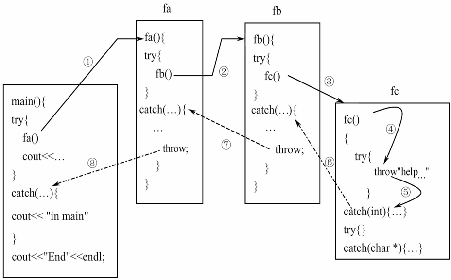
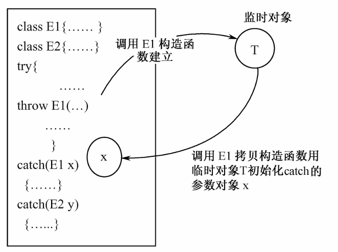

<span style="font-family: 'Times New Roman';">

# Chapter7 异常

***

c++处理异常的思想是：**将异常发生和异常处理放在不同的函数中**。

$~$

***

## 7.1 异常处理的结构

$~$

异常处理的程序结构（`try`-`throw`-`catch`）：

```cpp linenums="1"
try{
    if err1 throw xx1;
    if err2 throw xx2;
    ...
    if errN throw xxN;
}
catch(type1 arg){...}
catch(type2 arg){...}
...
catch(typeN arg){...}
```

当程序执行到`try`模块时，将进入`try`模块并按照正常顺序执行其中的语句。

如果`try`模块中所有的语句都正常执行，没有发生异常，那么就不会有异常被`throw`。这个时候，程序将忽略所有的`catch`模块。

如果`try`模块中发生了异常并用`throw`抛出，则程序控制流程转移到`catch`模块，`try`模块中`throw`后面的语句不再执行。

程序将按照`catch`模块出现的顺序，用异常的数据类型与每个参数表对照，只要匹配就立刻执行该`catch`模块，并将异常值传递给它作为参数（如果有的话）。其他`catch`模块被忽略。（隐含拷贝构造函数）

如果没有任何`catch`模块与异常匹配，则将调用系统默认的异常处理程序（直接终止）。

如果要进入`catch`模块，先要将`try`模块中的所有局部对象析构（栈展开, stack unwinding）；如果`try`模块没有抛出异常，那么模块正常执行完后再析构局部对象。

!!! Example
    ```cpp linenums="1"
    int main()
    {
        cout<<"1--befroe try block..."<<endl;
        try{
            cout<<"2--Inside try block..."<<endl;
            throw 10;
            cout<<"3--After throw ...."<<endl;
        }
        catch(int i) {
            cout<<"4--In catch block1 ... exception..errcode  is.."<<i<<endl;
        }
        catch(char * s) {
            cout<<"5--In catch block2 ... exception..errcode is.."<<s<<endl;
        }
        cout<<"6--After Catch...";
    } 
    ```

    输出为：

    ```
    1--befroe try block...
    2--Inside try block...
    4--In catch block1 ...errcode is..10
    6--After Catch...
    ```

$~$

**异常捕获：**

`catch`模块必须紧跟在与之对应的`try`模块后面。

`catch`模块在进行参数匹配时不会进行数据类型的默认转换。

$~$

**函数处理异常：**

第一种写法：

```cpp linenums="1"
void temperature(int t)
{
    try
    {
        if(t==100) throw "沸点！";
        else if(t==0) throw "冰点！";
        else cout<<"the temperature is OK..."<<endl;
    }
    catch(int x) {cout<<"temperature="<<x<<endl;}
    catch(char* s) {cout<<s<<endl;}
}

int main()
{
    temperature(0);
    temperature(10);
    temperature(100);
}
```

第二种写法：

```cpp linenums="1"
void temperature(int t)
{
    if(t==100) throw "沸点！";
    else if(t==0) throw "冰点！";
    else cout<<"the temperature is OK..."<<endl;
}

int main()
{
    try
    {
        temperature(0);
        temperature(10);
        temperature(100);
    }
    catch(int x){cout<<"temperature="<<x<<endl;}
    catch(char* s){cout<<s<<endl;}
}
```

$~$

***

## 7.2 异常处理的几种特殊情况

$~$

**`noexcept`:**

如果确定某个函数能正常运行，保证不会产生问题，则可以用`noexcept`来修饰该函数。

```cpp linenums="1"
rtype f(...) noexcept
{
    ...
}
```

`noexcept`实际上可以接受一个`bool`类型的参数：

```cpp linenums="1"
rtype f(...) noexcept(e)
{
    ...
}
```

其中，`e`是一个逻辑表达式，若结果为`true`，则表示该函数不会抛出异常；若结果为`false`，则表示该函数可能会抛出异常。

`noexcept`同时也是一个可以用来判断函数是否会产生异常的运算符，例如：

```cpp linenums="1"
noexcept(f(4)+g(6));
```

$~$

**捕获所有异常：**

`catch`模块可以设置成捕获全部异常：

```cpp linenums="1"
catch(...)
{
    ...
}
```

$~$

**再次抛出异常：**

`catch`模块如果无法处理捕获的异常，可以将其再次抛出，只需在该`catch`模块中添加不带任何参数的`throw`即可：

```cpp linenums="1"
try
{
    Errhander(...);
    ...
}
catch(...){...} //L1

void Errhandler(int n)
{
    try
    {
        ...
    }
    catch(...)
    {
        ...
        throw;  //L2
    }
}
```

L2处的`throw`将其所在`catch`模块中无法处理的异常交到L1处的`catch`模块进行处理（如果参数匹配的话）。

$~$

**异常的嵌套调用：**

一个`try`模块中可以包括另一个`try`模块。

!!! Example
    ```cpp linenums="1"
    void fc()
    {
        try{throw "help...";}
        catch(int x) {cout<<"in fc..int handler"<<endl;}
        try{cout<<"no error handle..."<<endl;}
        catch(char* px) {cout<<"in fc...char* handler"<<endl;}
    }

    void fb()
    {
        int* q=new int[10];
        try
        {
            fc();
            cout<<"return from fc()"<<endl;
        }
        catch(...)
        {
            delete[] q;
            throw;
        }
    }

    void fa()
    {
        char* p=-new char[10];
        try
        {
            fb();
            cout<<"return from fb()"<<endl;
        }
        catch(...)
        {
            delete[] p;
            throw;
        }
    }

    int main()
    {
        try
        {
            fa();
            cout<<"return from fa"<<endl;
        }
        catch(...){cout<<"in main"<<endl;}
        cout<<"End"<<endl;
    }
    ```

    输出为：

    ```
    in main
    End
    ```

    调用过程如下：

    

$~$

***

## 7.3 异常和类

$~$

**构造函数和异常：**

由于构造函数没有返回类型，因此无法通过检查构造函数的返回类型来检查异常。以下是几种常见的处理方法：

* 返回一个处于错误状态的对象，外部程序检查该对象状态，决定是否抛出异常；
* 设置一个全局变量标识对象构造是否正确，外部程序检查该变量值，决定是否抛出异常；
* 在构造函数中不进行对象的初始化工作，而是专门设计一个成员函数负责函数的初始化。

!!! Example
    **B类有一个A类的对象数据`obj`，B类的构造函数进行了自由存储空间的过量申请，导致资源耗尽，产生异常，异常将调用`obj`的析构函数，回收占用空间。**

    ```cpp linenums="1"
    class A
    {
        int a;
        public:
            A(int i=0):a(i){}
            ~A(){cout<<"in A destructor..."<<endl;}
    };

    class B
    {
        A obj[3];
        double* pb[10];
        public:
            B(int k)
            {
                cout<<"int B constructor..."<<endl;
                for(int i=0;i<10;i++)
                {
                    pb[i]=new double[20000000];
                    if(pb[i]==0) throw i;
                    else cout<<"Allocated 20000000 doubles in pb["<<i<<"]"<<endl;
                }
            }
    };

    int main()
    {
        try{B b(2);}
        catch(int e){cout<<"catch an exception when allocated pb["<<e<<"]"<<endl;}
    }
    ```

    输出为：

    ```
    int B constructor...
    Allocated 20000000 doubles in pb[0]
    Allocated 20000000 doubles in pb[1]
    Allocated 20000000 doubles in pb[2]
    Allocated 20000000 doubles in pb[3]             //这里运行到i等于几是不确定的，取决于计算机配置
    in A destructor...
    in A destructor...
    in A destructor...
    catch an exception when allocated pb[4]
    ```

$~$

**异常类：**

!!! Example
    **设计一个堆栈，当入栈元素超出了堆栈容量时，抛出“栈满”异常；当栈已空但还要从栈中弹出元素时，抛出“栈空”异常。**

    ```cpp linenums="1"
    const int MAX=3;
    class Full{};
    class Empty{};

    class Stack
    {
        private:
            int s[MAX];
            int top;
        public:
            void push(int a);
            int pop();
            Stack(){top=-1;}
    };
    void Stack::push(int a)
    {
        if(top>=MAX-1) throw Full();
        s[++top]=a;
    }
    int Stack::pop()
    {
        if(top<0) throw Empty();
        return s[top--];
    }

    int main()
    {
        Stack s;
        try
        {
            s.push(10);
            s.push(20);
            s.push(30);
            s.push(40);
            cout<<"stack(0)="<<s.pop()<<endl;
            cout<<"stack(1)="<<s.pop()<<endl;
            cout<<"stack(2)="<<s.pop()<<endl;
            cout<<"stack(3)="<<s.pop()<<endl;
        }
        catch(Full){cout<<"Exception:Stack Full"<<endl;}
        catch(Empty){cout<<"Exception:Stack Empty"<<endl;}
    }
    ```

    输出为：

    ```
    stack(0)= 30
    stack(1)= 20
    stack(2)= 10
    Exception: Stack Full
    ```

由异常类建立的对象称为**异常对象**，异常类的处理过程实际上就是异常对象的生成与传递过程。

