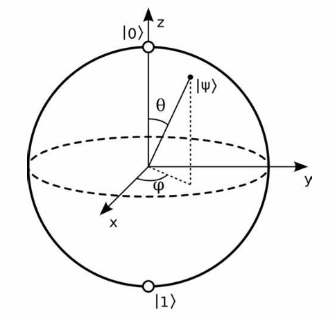
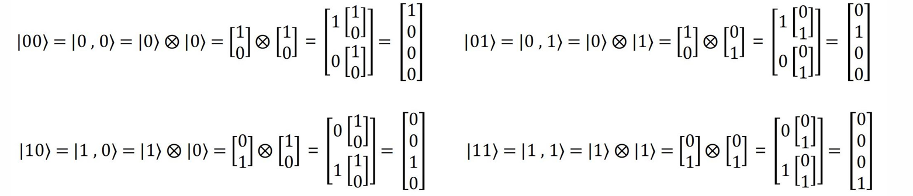
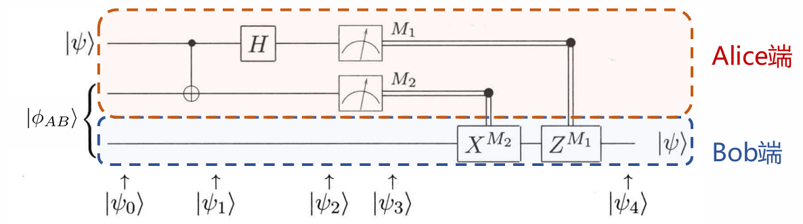
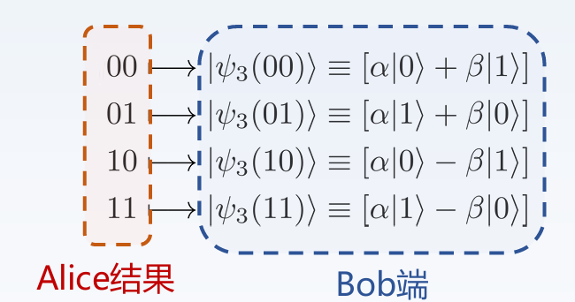
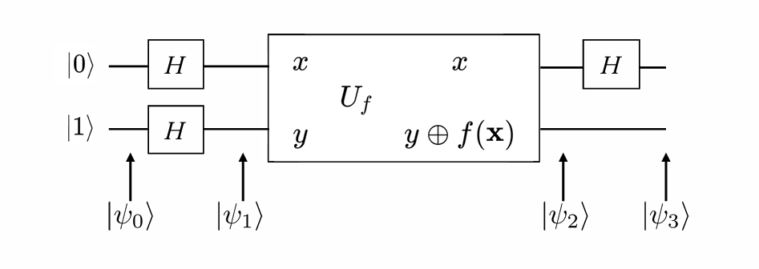

# Chapter1 量子比特与量子门

***

## 量子术语

量子术语|线代术语
---|---
态矢量|向量
本征态|特征向量
本征值|特征值
右矢 $\|a\rangle$|列向量
左矢 $\langle a\|$|行向量
基态|对应最小特征值的特征向量
算符|矩阵
幺正算符|幺正矩阵（$A^{\dagger}=A^{-1}$，$A^{\dagger}$ 表示共轭转置矩阵）
厄米算符|自伴矩阵（$A^{\dagger}=A$）

在量子计算中，所有涉及的算符均为**幺正算符**。

***

## 单量子比特

### 量子态基础

量子比特是状态的线性组合，被称为**叠加态**：

$$|\psi\rangle = \alpha|0\rangle + \beta|1\rangle$$

* $\alpha$ 和 $\beta$ 为复系数，又称**振幅**
* $|0\rangle$ 和 $|1\rangle$ 为该叠加态的**基矢态**，是一组单位正交基，任意两个单位正交基都可以作为基矢态

如果用坐标表示（又称 **bra-ket 表示法**），那么

$$|0\rangle=\begin{bmatrix}
    1 \\\
    0
\end{bmatrix}$$

$$|1\rangle=\begin{bmatrix}
    0 \\\
    1
\end{bmatrix}$$

$$|\psi\rangle=\begin{bmatrix}
    \alpha \\\
    \beta
\end{bmatrix}$$

如果对 $|\psi\rangle$ 进行测量，则会有 $|\alpha|^2$ 的概率得到 $0$ 态，$|\beta|^2$ 的概率得到 $1$ 态。因此，存在**归一化条件**：

$$|\alpha|^2 + |\beta|^2 = 1$$

### Bloch 球表示法

单量子比特的量子态可以可视化在一个称为 **Bloch 球**的表面上。给定量子态：

$$|\psi\rangle=c_0|0\rangle + c_1|1\rangle$$

通过欧拉公式可以改写两个复系数，得到

$$|\psi\rangle=r_0e^{i\varphi_0}|0\rangle + r_1e^{i\varphi_1}|1\rangle$$

我们有结论：若 $|e^{i\varphi}|=1$，则 $|\psi\rangle=e^{i\varphi}|\psi\rangle$。因此，上式可以直接提出一个 $e^{i\varphi_0}$ 并扔掉，并记 $\varphi=\varphi_1-\varphi_0$，得到

$$|\psi\rangle=r_0|0\rangle + r_1e^{i\varphi}|1\rangle$$

考虑到归一化条件，可以进一步改写为

$$|\psi\rangle=\cos(\frac{\theta}{2})|0\rangle+e^{i\varphi}\sin(\frac{\theta}{2})|1\rangle$$

综上，对于每一个 $|\psi\rangle$，最终都可以找到唯一的一对 $(\theta,\varphi)$ 来描述。因此，可以将其放到一个球面上，其三维坐标为

$$\begin{cases}
    x=\sin\theta\cos\varphi \\\
    y=\sin\theta\sin\varphi \\\
    z=\cos\theta
\end{cases}$$

***

## 多量子比特

考虑双量子比特：

$$|\psi\rangle=\alpha_{00}|00\rangle + \alpha_{01}|01\rangle + \alpha_{10}|10\rangle + \alpha_{11}|11\rangle$$

$$|\alpha_{00}|^2+|\alpha_{01}|^2+|\alpha_{10}|^2+|\alpha_{11}|^2=1$$

### 张量积（克罗内克积）

$$V\otimes W$$

!!! Example
    $$
    \begin{bmatrix}
        1 & 2
    \end{bmatrix}\otimes
    \begin{bmatrix}
        1 & 2 \\\
        3 & 4
    \end{bmatrix}=
    \begin{bmatrix}
        1\cdot\begin{bmatrix}
            1 & 2 \\\
            3 & 4
        \end{bmatrix} & 2\cdot\begin{bmatrix}
            1 & 2 \\\
            3 & 4
        \end{bmatrix}
    \end{bmatrix}=
    \begin{bmatrix}
        1 & 2 & 2 & 4 \\\
        3 & 4 & 6 & 8
    \end{bmatrix}
    $$

张量积可用于获得多个量子态的复合量子态：

更一般地：

$$|\psi\rangle=\alpha|0\rangle + \beta|1\rangle$$

$$|\phi\rangle=\gamma|0\rangle + \delta|1\rangle$$

$$
\begin{align}
|\psi\phi\rangle=|\psi\rangle \otimes |\phi\rangle & =\alpha\gamma(|0\rangle\otimes|0\rangle)+\alpha\delta(|0\rangle\otimes|1\rangle)+\beta\gamma(|1\rangle\otimes|0\rangle)+\beta\delta(|1\rangle\otimes|1\rangle) \\\
& =\alpha\gamma|00\rangle + \alpha\delta|01\rangle + \beta\gamma|10\rangle + \beta\delta|11\rangle
\end{align}$$

### 纠缠态

若一个复合量子态不能表示为各个量子态的张量积形式，则称该复合量子态为**纠缠态**。

**贝尔态：**

贝尔态是双量子比特中重要的纠缠态：

$$|\phi^+\rangle=\frac{1}{\sqrt{2}}(|00\rangle + |11\rangle)$$

$$|\phi^-\rangle=\frac{1}{\sqrt{2}}(|00\rangle - |11\rangle)$$

$$|\psi^+\rangle=\frac{1}{\sqrt{2}}(|01\rangle + |10\rangle)$$

$$|\psi^-\rangle=\frac{1}{\sqrt{2}}(|01\rangle - |10\rangle)$$

***

## 单量子门

### 量子非门（X 门）

互换复系数：

$$X=\begin{bmatrix}
    0 & 1 \\\
    1 & 0
\end{bmatrix}$$

除了 X 门， 还有 Y 门和 Z 门：

$$Y=\begin{bmatrix}
    0 & -i \\\
    i & 0
\end{bmatrix}$$

$$Z=\begin{bmatrix}
    1 & 0 \\\
    0 & -1
\end{bmatrix}$$

这三个门统称为 **Pauli 门**，在 Bloch 球上分别对应绕 $x$ 轴、$y$ 轴和 $z$ 轴旋转 $\pi$ 的角度。

### Hadamard 门（H 门）

将 $|0\rangle$ 和 $|1\rangle$ 转变为叠加态：

$$
H=\frac{1}{\sqrt{2}}
\begin{bmatrix}
    1 & 1 \\\
    1 & -1
\end{bmatrix}$$

$$H|0\rangle=\frac{1}{\sqrt{2}}(|0\rangle+|1\rangle)$$

$$H|1\rangle=\frac{1}{\sqrt{2}}(|0\rangle-|1\rangle)$$

### 相位旋转门

改变量子态的相对相位，但不改变其概率分布。常见的相位旋转门有 **P 门**：

$$P=\begin{bmatrix}
    1 & 0 \\\
    0 & e^{i\phi}
\end{bmatrix}$$

在 Bloch 球上对应绕 $z$ 轴旋转 $\phi$ 的角度。

P 门的两个特例是 **S 门**（$\phi=\frac{\pi}{2}$）和 **T 门**（$\phi=\frac{\pi}{4}$）：

$$S=\begin{bmatrix}
    1 & 0 \\\
    0 & i
\end{bmatrix}$$

$$T=\begin{bmatrix}
    1 & 0 \\\
    0 & e^{i\frac{\pi}{4}}
\end{bmatrix}$$

### 参数旋转门

绕对应轴旋转 $\theta$ 的角度：

$$R_X(\theta)=\begin{bmatrix}
    \cos(\frac{\theta}{2}), & -i\sin(\frac{\theta}{2}) \\\
    -i\sin(\frac{\theta}{2}), & \cos(\frac{\theta}{2})
\end{bmatrix}$$

$$R_Y(\theta)=\begin{bmatrix}
    \cos(\frac{\theta}{2}), & -\sin(\frac{\theta}{2}) \\\
    \sin(\frac{\theta}{2}), & \cos(\frac{\theta}{2})
\end{bmatrix}$$

$$R_Z(\theta)=\begin{bmatrix}
    e^{-i\frac{\theta}{2}}, & 0 \\\
    0, & e^{i\frac{\theta}{2}}
\end{bmatrix}$$

***

## 多量子门

在多量子比特的情况下，可以将多个单量子门视作一个整体，通过张量积得到总体的多量子门。

!!! Note
    若出现有的量子比特没有进行操作的情况，可以在对应位置使用单位矩阵 I 来表示。

### CNOT 门

CNOT 门是一种**受控门**，第一个量子比特（控制比特）的状态决定了第二个量子比特（目标比特）是否翻转。若前者为 $|1\rangle$，则后者翻转；若前者为 $|0\rangle$，则后者保持不变。前者一直保持不变。

$$CNOT=\begin{bmatrix}
    1 & 0 & 0 & 0 \\\
    0 & 1 & 0 & 0 \\\
    0 & 0 & 0 & 1 \\\
    0 & 0 & 1 & 0
\end{bmatrix}$$

若

$$|\psi\rangle=\begin{bmatrix}
    \alpha_{00} \\\
    \alpha_{01} \\\
    \alpha_{10} \\\
    \alpha_{11}
\end{bmatrix}$$

则

$$CNOT|\psi\rangle=\begin{bmatrix}
    \alpha_{00} \\\
    \alpha_{01} \\\
    \alpha_{11} \\\
    \alpha_{10}
\end{bmatrix}$$

由于CNOT 门无法拆解成矩阵的张量积形式，因此它常用于制备纠缠态。

### 量子隐形传态

问题描述：

Alice 和 Bob 各自有一个量子比特，这一对量子比特处于贝尔态：

$$|\phi_{AB}\rangle=\frac{1}{\sqrt{2}}|00\rangle+\frac{1}{\sqrt{2}}|11\rangle$$

现在，Alice 还有一个量子比特 $|\psi\rangle=\alpha|0\rangle+\beta|1\rangle$，她想把这个量子态传送给 Bob，应该如何传送？（不能直接观测，否则会坍缩）

解决方法：

构造如下图所示的量子电路：

初始状态：

$$|\psi_0\rangle=\frac{\alpha}{\sqrt{2}}|0\rangle(|00\rangle+|11\rangle)+\frac{\beta}{\sqrt{2}}|1\rangle(|00\rangle+|11\rangle)$$

Alice 将其要发送的量子比特（控制比特）以及持有的纠缠的量子比特（目标比特）经过 CNOT 门：

$$|\psi_1\rangle=\frac{\alpha}{\sqrt{2}}|0\rangle(|00\rangle+|11\rangle)+\frac{\beta}{\sqrt{2}}|1\rangle(|10\rangle+|01\rangle)$$

Alice 再将要发送的量子比特经过 H 门：

$$
\begin{align}
    |\psi_2\rangle & =\frac{\alpha}{2}(|0\rangle+|1\rangle)(|00\rangle+|11\rangle)+\frac{\beta}{2}(|0\rangle-|1\rangle)(|10\rangle+|01\rangle) \\\
    & =\frac{1}{2}[|00\rangle(\alpha|0\rangle+\beta|1\rangle)+|01\rangle(\alpha|1\rangle+\beta|0\rangle)+|10\rangle(\alpha|0\rangle-\beta|1\rangle)+|11\rangle(\alpha|1\rangle-\beta|0\rangle)]
\end{align}$$

这个时候，只需要测量 Alice 的两个量子比特，就可以知道 Bob 的量子比特处于哪种状态：

例如，如果 Alice 的两个量子比特测量结果为 $00$，那么 Bob 的量子比特就是原本待传送的量子比特，Bob 不需要做任何事；如果测量结果为 $01$，那么 Bob 需要用 X 门来修正；如果测量结果为 $10$，那么 Bob 需要用 Z 门来修正；如果测量结果为 $11$，那么 Bob 需要用 X 门和 Z 门来修正。

### Deutsch 算法

**常数函数 & 平衡函数：**

* 常数函数：对于所有输入，输出值相同（全部为 $0$ 或全部为 $1$）
* 平衡函数：对于所有输入，输出值有一半为 $0$，另一半为 $1$

**问题描述：**

若一个函数要么是常数函数，要么是平衡函数，如何通过尽可能少的查询次数来确定该函数的类型？

**解决方法：**

这里仅考虑最简单的 $f:\\{0,1\\}\rightarrow\\{0,1\\}$

初始状态：

$$|\psi_0\rangle=|01\rangle$$

对每个量子比特应用 H 门：

$$|\psi_1\rangle=(\frac{|0\rangle+|1\rangle}{\sqrt{2}})(\frac{|0\rangle-|1\rangle}{\sqrt{2}})$$

然后，通过一个量子黑盒 $U_f$，$U_f$ 的效果为将 $|y\rangle$ 转变为 $|y\rangle\oplus f(x)$，其中，$\oplus$ 表示异或操作。

当 $f(x)=0$ 时

$$|y\oplus f(x)\rangle=\frac{|0\oplus 0\rangle-|1\oplus 0\rangle}{\sqrt{2}}=\frac{|0\rangle-|1\rangle}{\sqrt{2}}$$

当 $f(x)=1$ 时

$$|y\oplus f(x)\rangle=\frac{|0\oplus 1\rangle-|1\oplus 1\rangle}{\sqrt{2}}=-\frac{|0\rangle-|1\rangle}{\sqrt{2}}$$

因此

$$
\begin{align}
    |\psi_2\rangle & =(\frac{|0\rangle+|1\rangle}{\sqrt{2}})[(-1)^{f(x)}\frac{|0\rangle-|1\rangle}{\sqrt{2}}] \\\
    & =[\frac{(-1)^{f(0)}|0\rangle+(-1)^{f(1)}|1\rangle}{\sqrt{2}}] (\frac{|0\rangle-|1\rangle}{\sqrt{2}})
\end{align}$$

最后，再对第一个量子比特施加 H 门。

如果 $f(0)=f(1)$（常数函数），则

$$|\psi_3\rangle=\pm|0\rangle(\frac{|0\rangle-|1\rangle}{\sqrt{2}})$$

如果 $f(0)\neq f(1)$（平衡函数），则

$$|\psi_3\rangle=\pm|1\rangle(\frac{|0\rangle-|1\rangle}{\sqrt{2}})$$

也就是说，如果 $f$ 是常数函数，那么测量第一个量子比特的结果一定是 $0$；如果 $f$ 是平衡函数，那么测量结果一定是 $1$。

综上，我们不需要得到 $f(0)$ 和 $f(1)$ 具体是多少，只要知道全局性质即可。经过一次查询，我们就能确定函数的类型。