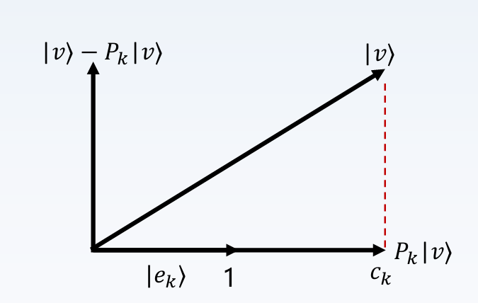
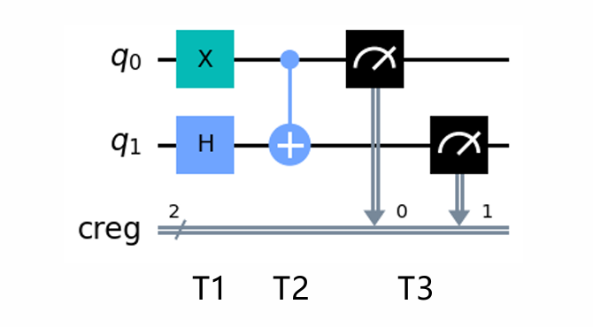

# Chapter2 量子测量

***

## 线性代数基础

### 特征值分解

矩阵乘法对应一个变换，使原向量发生旋转和伸缩。

如果矩阵 $A$ 对于某个向量只进行伸缩变换，而不产生旋转效果，则这个向量是这个矩阵的**特征向量**（$v$），伸缩的比例称为**特征值**（$\lambda$）。

$$Av = \lambda v$$

$A$ 可以进行**特征值分解（谱分解）**：

$$A=Q\Sigma Q^{-1}$$

其中，$\Sigma$ 是由特征值组成的对角矩阵，$Q$ 是由对应的特征向量组成的矩阵。

如果得到矩阵的前 $N$ 个特征向量，那么就对应了这个矩阵最主要的 $N$ 个变化方向。利用这 $N$ 个变化方向，就可以近似这个矩阵（变换）。

若 $A$ 是**正规矩阵**（$A^{\dagger}A=AA^{\dagger}$），特征值集合为 $\\{\lambda_i\\}$，对应的标准正交基为 $\\{e_i\\}$（正规矩阵对应于不同特征值的特征向量正交），则由特征值分解可以进一步推导出

$$A=\sum\limits_{i=1}^n\lambda_i|e_i\rangle \langle e_i|$$

### 完备性方程

$$\sum\limits_{i=1}^n|e_i\rangle \langle e_i| = I$$

完备性方程常用来检验一组向量是否为标准正交基。

### 投影算子

$$P_k=|e_k\rangle \langle e_k|$$

这样的投影算子集合 $\\{P_k=|e_k\rangle \langle e_k|\\}$ 满足以下性质：

* $P_k^2=P_k$
* 若 $k\neq j$，则 $P_kP_j=0$
* $\sum P_k=I$

$P_k$ 作用在 $|v\rangle$ 上，得到 $|e_k\rangle$ 方向上的投影：

$$P_k|v\rangle=|e_k\rangle \langle e_k|v\rangle\equiv c_k|e_k\rangle$$

其中，$c_k=\langle e_k|v\rangle$ 为 $|v\rangle$ 在 $|e_k\rangle$ 方向上的投影长度。

回到原本的特征值分解，可以改写成：

$$A=\sum\limits_{i=1}^n\lambda_iP_i$$

因此，$A$ 作用于任何向量，相当于将该向量投影到 $A$ 的各个特征向量方向上，再以特征值为系数线性组合起来。

***

## 量子测量

### 投影测量

对量子态 $|\psi\rangle$ 进行投影测量，得到第 $i$ 个结果（对应第 $i$ 个基矢态）的概率为：

$$p(i)=\langle \psi|P_i|\psi\rangle$$

测量后，量子态坍缩为：

$$\frac{P_i|\psi\rangle}{\sqrt{p(i)}}$$

### 单比特测量

若我们要测量

$$|\psi\rangle=\alpha|0\rangle+\beta|1\rangle$$

使用的投影算子为

$$P_0=|0\rangle\langle0|=\begin{bmatrix}
    1 & 0 \\\
    0 & 0
\end{bmatrix}$$

$$P_1=|1\rangle\langle1|=\begin{bmatrix}
    0 & 0 \\\
    0 & 1
\end{bmatrix}$$

当使用 $P_0$ 作用在 $|\psi\rangle$ 上时，得到 $0$ 态的概率为

$$p(0)=\langle \psi|P_0|\psi\rangle=|\alpha|^2$$

测量后，量子态坍缩为

$$\frac{P_0|\psi\rangle}{\sqrt{p(0)}}=\frac{\alpha}{|\alpha|}|0\rangle$$

同理，使用 $P_1$ 作用在 $|\psi\rangle$ 上时，得到 $1$ 态的概率为

$$p(1)=\langle \psi|P_1|\psi\rangle=|\beta|^2$$

测量后，量子态坍缩为

$$\frac{P_1|\psi\rangle}{\sqrt{p(1)}}=\frac{\beta}{|\beta|}|1\rangle$$

### 双比特测量

假设初始状态为 $|00\rangle$，前面细节不表，到测量之前，量子态演化为 $\psi=\frac{1}{\sqrt{2}}(|10\rangle+|11\rangle)$。

**整体测量：**

使用投影算子 $M_{00}=|00\rangle\langle00|$，得到

$$P(|00\rangle)=\langle\psi|M_{00}|\psi\rangle=0$$

使用投影算子 $M_{01}=|01\rangle\langle01|$，得到

$$P(|01\rangle)=\langle\psi|M_{01}|\psi\rangle=0$$

使用投影算子 $M_{10}=|10\rangle\langle10|$，得到

$$P(|10\rangle)=\langle\psi|M_{10}|\psi\rangle=\frac{1}{2}$$

使用投影算子 $M_{11}=|11\rangle\langle11|$，得到

$$P(|11\rangle)=\langle\psi|M_{11}|\psi\rangle=\frac{1}{2}$$

**部分测量：**

若只对第一个量子比特进行测量，则投影算子为：

$$M_0^{q_0}=\sum\limits_{i\in\\{0,1\\}}M_{0i}=\begin{bmatrix}
    1 & 0 & 0 & 0 \\\
    0 & 1 & 0 & 0 \\\
    0 & 0 & 0 & 0 \\\
    0 & 0 & 0 & 0
\end{bmatrix}$$

$$M_1^{q_0}=\sum\limits_{i\in\\{0,1\\}}M_{1i}=\begin{bmatrix}
    0 & 0 & 0 & 0 \\\
    0 & 0 & 0 & 0 \\\
    0 & 0 & 1 & 0 \\\
    0 & 0 & 0 & 1
\end{bmatrix}$$

通过测量，得到第一个量子比特结果为 $0$ 和 $1$ 的概率分别为：

$$p_{q_0}(|0\rangle)=\langle\psi|M_0^{q_0}|\psi\rangle=0$$

$$p_{q_0}(|1\rangle)=\langle\psi|M_1^{q_0}|\psi\rangle=1$$

测量后，量子态坍缩为：

$$\frac{M_1^{q_0}|\psi\rangle}{\sqrt{p_{q_0}(|1\rangle)}}=|\psi\rangle$$

保持不变。

若只对第二个量子比特进行测量，则投影算子为：

$$M_0^{q_1}=\sum\limits_{i\in\\{0,1\\}}M_{i0}=\begin{bmatrix}
    1 & 0 & 0 & 0 \\\
    0 & 0 & 0 & 0 \\\
    0 & 0 & 1 & 0 \\\
    0 & 0 & 0 & 0
\end{bmatrix}$$

$$M_1^{q_1}=\sum\limits_{i\in\\{0,1\\}}M_{i1}=\begin{bmatrix}
    0 & 0 & 0 & 0 \\\
    0 & 1 & 0 & 0 \\\
    0 & 0 & 0 & 0 \\\
    0 & 0 & 0 & 1
\end{bmatrix}$$

通过测量，得到第二个量子比特结果为 $0$ 和 $1$ 的概率分别为：

$$p_{q_1}(|0\rangle)=\langle\psi|M_0^{q_1}|\psi\rangle=\frac{1}{2}$$

$$p_{q_1}(|1\rangle)=\langle\psi|M_1^{q_1}|\psi\rangle=\frac{1}{2}$$

测量后，量子态坍缩为：

$$\frac{M_0^{q_1}|\psi\rangle}{\sqrt{p_{q_1}(|0\rangle)}}=|10\rangle$$

或

$$\frac{M_1^{q_1}|\psi\rangle}{\sqrt{p_{q_1}(|1\rangle)}}=|11\rangle$$