

# Chapter3 量子算法

***

## 量子傅里叶变换（QFT）

**基础定义：**

QFT 将量子态从计算基 $\\{|j\rangle\\}$ 映射到频域基 $\\{|k\rangle\\}$，对应的振幅序列 $\\{x_j\\}$ 变换到 $\\{y_k\\}$：

$$\sum\limits_{j=0}^{N-1}x_j|j\rangle\xrightarrow{QFT}\sum\limits_{k=0}^{N-1}y_k|k\rangle$$

其中

$$y_k=\frac{1}{\sqrt{N}}\sum\limits_{j=0}^{N-1}x_je^{\frac{2\pi i}{N}\cdot j\cdot k}$$

QFT 作为量子算符定义为

$$\text{QFT}(|j\rangle)=\frac{1}{\sqrt{N}}\sum\limits_{k=0}^{N-1}e^{\frac{2\pi i}{N}\cdot j\cdot k}|k\rangle$$

!!! Note
    这里的 $N$ 通常是 $2^n$，其中 $n$ 是量子比特的数量。

    ${|j\rangle}$ 和 ${|k\rangle}$ 本质上是同一种基矢态符号（例如双比特系统中都是 $|00\rangle$、$|01\rangle$、$|10\rangle$ 和 $|11\rangle$）。这样看来，QFT 从数学角度上只是对振幅进行了变换。但是，就像一个四维向量经过变换，使用的“索引”依然是 0、1、2、3，但索引对应的含义已经改变。

**张量积形式：**

基态 $|j\rangle$ 可以表示为 $|\overline{j_1j_2\dots j_n}\rangle$，即 $j=2^{n-1}j_1+2^{n-2}j_2+\dots+2^0j_n$。（将原本为 01 串的 $j$ 看作二进制对应的数）

用 $\overline{0.j_1j_2\dots j_n}$ 表示小数 $2^{-1}j_1+2^{-2}j_2+\dots+2^{-n}j_n$

有了这两种表示法，可以将 QFT 写成张量积形式：

$$\text{QFT}|\overline{j_1j_2\dots j_n}\rangle=\frac{1}{\sqrt{2^n}}(|0\rangle+e^{2\pi i\cdot\overline{0.j_n}}|1\rangle)(|0\rangle+e^{2\pi i\cdot\overline{0.j_{n-1}j_n}}|1\rangle)\cdots(|0\rangle+e^{2\pi i\cdot\overline{0.j_1j_2\dots j_n}}|1\rangle)$$

!!! Tip "Proof"
    $$
    \begin{align}
    \text{QFT}|j\rangle & =\frac{1}{\sqrt{N}}\sum\limits_{k=0}^{N-1}e^{\frac{2\pi i}{N}\cdot jk}|k\rangle \\\
    & =\frac{1}{\sqrt{2^n}}\sum\limits_{k_1=0}^1\dots\sum\limits_{k_n=0}^1e^{\frac{2\pi i}{2^n}\cdot j\sum\limits_{l=1}^nk_l2^{n-l}}|k_1\dots k_n\rangle \\\
    & =\frac{1}{\sqrt{2^n}}\sum\limits_{k_1=0}^1\dots\sum\limits_{k_n=0}^1e^{2\pi ij\sum\limits_{l=1}^nk_l2^{-l}}|k_1\dots k_n\rangle \\\
    & =\frac{1}{\sqrt{2^n}}\sum\limits_{k_1=0}^1\dots\sum\limits_{k_n=0}^1\bigotimes\limits_{l=1}^n(e^{2\pi ijk_l2^{-l}}|k_l\rangle) \\\
    & =\frac{1}{\sqrt{2^n}}\bigotimes\limits_{l=1}^n\sum\limits_{k_l=0}^1e^{2\pi ijk_l2^{-l}}|k_l\rangle \\\
    & =\frac{1}{\sqrt{2^n}}\bigotimes\limits_{l=1}^n(|0\rangle+e^{2\pi ij2^{-l}}|1\rangle) \\\
    & =\frac{1}{\sqrt{2^n}}(|0\rangle+e^{2\pi i\cdot\overline{0.j_n}}|1\rangle)(|0\rangle+e^{2\pi i\cdot\overline{0.j_{n-1}j_n}}|1\rangle)\cdots(|0\rangle+e^{2\pi i\cdot\overline{0.j_1j_2\dots j_n}}|1\rangle)
    \end{align}
    $$

**量子电路实现：**

$$R_k=\begin{bmatrix}
    1 & 0 \\\
    0 & e^{\frac{2\pi i}{2^k}}
\end{bmatrix}$$

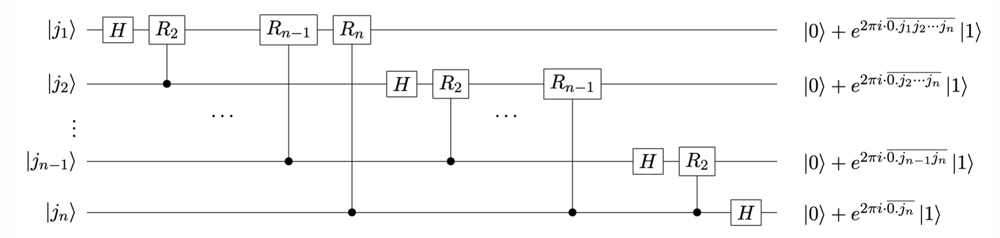

先看第一位 $|j_1\rangle$。

经过一个 H 门后，变为

$$\frac{1}{\sqrt{2}}(|0\rangle+e^{2\pi i\overline{0.j_1}}|1\rangle)$$

经过一个 $R_2$ 门后，变为

$$\frac{1}{\sqrt{2}}(|0\rangle+e^{2\pi i\overline{0.j_1j_2}}|1\rangle)$$

以此类推，最终变为

$$\frac{1}{\sqrt{2}}(|0\rangle+e^{2\pi i\overline{0.j_1j_2...j_n}}|1\rangle)$$

其余位同理。

!!! Note
    电路末端的量子态与张量积形式顺序相反，因此还要再加一系列 SWAP 门。

***

## 量子相位估计（QPE）

**问题描述：**

对于一个酉矩阵 $U$，若已知其本征态 $|\mu\rangle$，其对应的本征值记为 $e^{2\pi i\varphi}$，其中 $0\leq \varphi<1$。QPE 的目标是估计 $\varphi$ 的值。

!!! Note
    酉矩阵的本征值的模长均为 1，因此可以表示为 $e^{2\pi i\varphi}$ 的形式。

### 算法流程

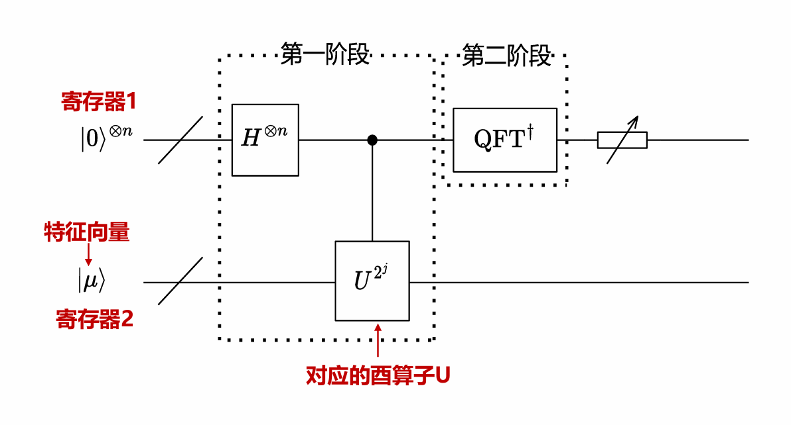

* 初始化
* 作用 H 门
* 作用受控 U 门
* 作用逆 QFT
* 测量

**初始化：**

寄存器 1 是 $n$ 个量子比特，均初始化为 $|0\rangle$，$n$ 为自行选择的精度参数。

寄存器 2 是 $m$ 个量子比特，初始化为已知的本征态 $|\mu\rangle$，$m$ 取决于 $U$ 的维度。

**作用 H 门：**

对寄存器 1 的每个量子比特作用 H 门，每一位都变成叠加态 $\frac{1}{\sqrt{2}}(|0\rangle+|1\rangle)$。

**作用受控 U 门：**

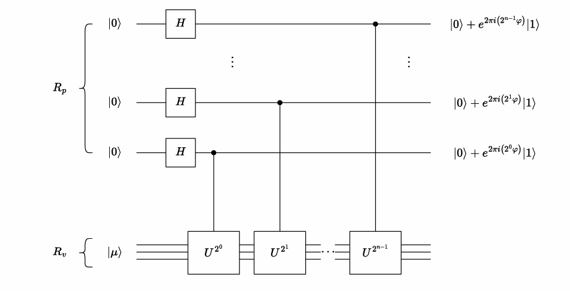

我们设寄存器 1 从下往上的量子态分别为 $|j_1\rangle,|j_2\rangle,\dots,|j_n\rangle$ （经过 H 门后），每一个量子比特 $|j_k\rangle$ 都控制着对寄存器 2 作用 $U^{2^{k-1}}$：

$$|j_k\rangle|\mu\rangle\xrightarrow{CU^{2^{k-1}}}|j_k\rangle U^{j_k2^{k-1}}|\mu\rangle$$

由本征值的定义：

$$U|\mu\rangle=e^{2\pi i \varphi}|\mu\rangle$$

因此：

$$|j_k\rangle U^{j_k2^{k-1}}|\mu\rangle=\frac{1}{\sqrt{2}}(|0\rangle+e^{2\pi i \varphi2^{k-1}}|1\rangle)|\mu\rangle$$

**作用逆 QFT：**

经过前面的所有步骤，整体量子态变为：

$$\frac{1}{\sqrt{2^n}}(|0\rangle+e^{2\pi i\varphi 2^{n-1}}|1\rangle)(|0\rangle+e^{2\pi i\varphi 2^{n-2}}|1\rangle)\cdots(|0\rangle+e^{2\pi i\varphi 2^0}|1\rangle)|\mu\rangle$$

回忆之前 QFT 的变换效果：

$$\text{QFT}|\overline{j_1j_2\dots j_n}\rangle=\frac{1}{\sqrt{2^n}}(|0\rangle+e^{2\pi i\cdot\overline{0.j_n}}|1\rangle)(|0\rangle+e^{2\pi i\cdot\overline{0.j_{n-1}j_n}}|1\rangle)\cdots(|0\rangle+e^{2\pi i\cdot\overline{0.j_1j_2\dots j_n}}|1\rangle)$$

若将 $\varphi$ 写成二进制小数形式 $\overline{0.\varphi_1\varphi_2\dots\varphi_n}$，则有

则

$$e^{2\pi i \varphi2^k}=e^{2\pi i(\overline{0.\varphi_{k+1}\dots\varphi_n}+\text{整数})}=e^{2\pi i\overline{0.\varphi_{k+1}\dots\varphi_n}}$$
因此，对寄存器 1 作用逆 QFT 后，整体量子态变为

$$|\overline{\varphi_1\varphi_2\dots\varphi_n}\rangle|\mu\rangle$$

**测量：**

最后，我们只需要测量寄存器 1，就能得到 $\varphi$ 的二进制表示，然后转换成小数形式即可。

**精度问题：**

考虑相位旋转门

$$P(\phi)=\begin{bmatrix}
    1 & 0 \\\
    0 & e^{i\phi}
\end{bmatrix}$$

其本征态之一为 $|1\rangle$，对应的本征值为 $e^{i\phi}$。

若 $\phi=\frac{\pi}{4}$，则运行 QPE，测量结果为 $001$，对应的小数为 $0.001_2=\frac{1}{8}$，$e^{2\pi i\varphi}=e^{i\frac{\pi}{4}}=e^{i\phi}$，结果正确。

若 $\phi=\frac{2\pi}{3}$，理论上测量结果应为 $\frac{1}{3}$ 对应的 $01010101\dots$，但寄存器 1 只有有限的位数 $n$，因此存在误差。

可以考虑多次运行电路，测量得到某个值的概率越大，其与真实值越接近。

**特征向量线性组合：**

若 $U$ 的特征向量集合为 $\\{|\mu_j\rangle\\}$，对于任意一个特征向量的线性组合 $|b\rangle=\sum\limits_{j=1}^n\beta_j|\mu_j\rangle$，其输入到 QPE 电路后，测得 $|\mu_j\rangle$ 对应的本征值的相位的概率为

$$P_j=|\beta_j|^2$$

***

## Shor 算法

### RSA 加密

**逆元：**

若 $ab\equiv 1\mod n$，则 $b$ 是 $a$ 模 $n$ 的逆元。

**阶：**

$a$ 模 $n$ 的阶是使得下面式子成立的最小正整数 $r$，记为 $\text{ord}_na$：

$$a^r\equiv 1\mod n$$

**欧拉函数：**

欧拉函数 $\varphi(n)$：表示小于 $n$ 且与 $n$ 互质的正整数的个数。

* 若 $n$ 是质数，则 $\varphi(n)=n-1$
* 若 $\gcd(a,b)=1$，则 $\varphi(ab)=\varphi(a)\varphi(b)$

**RSA 加密：**

制造公钥和私钥的步骤：

* 获得两个大质数 $p_1$ 和 $p_2$
* 令 $n=p_1p_2$，则 $\varphi(n)=(p_1-1)(p_2-1)$
* 取与 $\varphi(n)$ 互质的正整数 $e$
* 求 $e$ 模 $\varphi(n)$ 的逆元 $d$

此时，公钥为 $(e,n)$，私钥为 $(d,n)$。

当发送方要发送信息 $a$ 时，先用公钥对 $a$ 进行加密：

$$C=a^e \mod n$$

接收方收到密文 $C$ 后，使用私钥进行解密：

$$a=C^d \mod n$$

因此，如果手头仅有公钥，要破解 RSA 加密，需要知道私钥，步骤为：

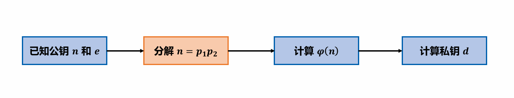

传统方法使用**试除法**，即从小到大尝试除数，直到找到 $n$ 因数为止，非常耗时。

### Shor 算法前置

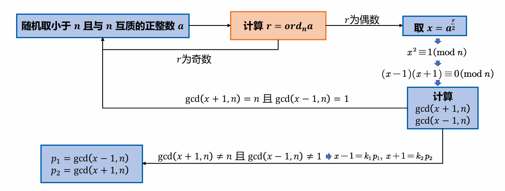

其中，要使用量子电路的部分为**计算 $r=\text{ord}_n a$**。

**定义酉变换：**

设 $|y\rangle$ 为多个量子比特组成的寄存器（量子比特数不超过 $\log_2n$），已知参数 $a$ 和 $n$，定义酉变换 $U$：

$$U|y\rangle=|ay \mod n\rangle$$

!!! Note
    例如，$|y\rangle=t_1|000\rangle+ t_2|001\rangle + \cdots + t_n|111\rangle$，则对 $|y\rangle$ 作用 $U$ 得到的效果是 $t_1|0a\mod n\rangle+t_2|1a\mod n\rangle + \cdots + t_n|7a\mod n\rangle$。

$U$ 有以下性质：

$$U^t|y\rangle=|a^t y \mod n\rangle$$

**定义量子态 $|u_s\rangle$：**

$$|u_s\rangle=\frac{1}{\sqrt{r}}\sum\limits_{k=0}^{r-1}e^{-\frac{2\pi isk}{r}}|a^k\mod n\rangle$$

其中，$a$ 和 $n$ 已知，$r$ 未知待求。$|u_s\rangle$ 有两个性质：

性质一：

$$U|u_s\rangle=e^{\frac{2\pi is}{r}}|u_s\rangle$$

!!! Tip "Proof"
    $$U|u_s\rangle=\frac{1}{\sqrt{r}}\sum\limits_{k=0}^{r-1}e^{-\frac{2\pi isk}{r}}|a^{k+1}\mod n\rangle$$

    用 $k'=k+1$ 替换得到：

    $$\frac{1}{\sqrt{r}}\sum\limits_{k'=1}^re^{-\frac{2\pi is(k'-1)}{r}}|a^{k'}\mod n\rangle=\frac{1}{\sqrt{r}}e^{\frac{2\pi is}{r}}\sum\limits_{k'=1}^re^{-\frac{2\pi isk'}{r}}|a^{k'}\mod n\rangle$$

    考虑最后一项：

    $$e^{-\frac{2\pi isr}{r}}|a^r\mod n\rangle$$

    指数上是整数，因此 $e^{-\frac{2\pi isr}{r}}=1=e^{-\frac{2\pi is\cdot 0}{r}}$；并且有 $a^r\equiv 1\equiv a^0\mod n$（定义），因此，最后一项等价于第一项：

    $$\frac{1}{\sqrt{r}}e^{\frac{2\pi is}{r}}\sum\limits_{k'=1}^re^{-\frac{2\pi isk'}{r}}|a^{k'}\mod n\rangle=\frac{1}{\sqrt{r}}e^{\frac{2\pi is}{r}}\sum\limits_{k'=0}^{r-1}e^{-\frac{2\pi isk'}{r}}|a^{k'}\mod n\rangle=e^{\frac{2\pi is}{r}}|u_s\rangle$$

性质二：

$$\frac{1}{\sqrt{r}}\sum\limits_{s=0}^{r-1}|u_s\rangle=|1\rangle$$

!!! Tip "Proof"
    要证明：

    $$\frac{1}{\sqrt{r}}\sum\limits_{s=0}^{r-1}|u_s\rangle=|1\rangle$$

    如果两边同乘 $U^k$，那么我们可以去等价地证明：

    $$\frac{1}{\sqrt{r}}\sum\limits_{s=0}^{r-1}e^{\frac{2\pi isk}{r}}|u_s\rangle=|a^k\mod n\rangle$$

    我们用左式一步一步推出右式。

    利用 $|u_s\rangle$ 的定义：

    $$\frac{1}{\sqrt{r}}\sum\limits_{s=0}^{r-1}e^{\frac{2\pi isk}{r}}|u_s\rangle=\frac{1}{r}\sum\limits_{l=0}^{r-1}\sum\limits_{s=0}^{r-1}e^{\frac{2\pi is(k-l)}{r}}|a^l\mod n\rangle$$

    其中：

    $$\sum\limits_{s=0}^{r-1}e^{\frac{2\pi is(k-l)}{r}}=\begin{cases}
        r & k=l \\\
        0 & k\neq l\text{ （等比数列求和）}
    \end{cases}$$

    因此：

    $$\frac{1}{\sqrt{r}}\sum\limits_{s=0}^{r-1}e^{\frac{2\pi isk}{r}}|u_s\rangle=\frac{1}{r}\sum\limits_{l=0}^{r-1}\delta_{k,l}|a^l\mod n\rangle=|a^k\mod n\rangle$$

性质一说明：$|u_s\rangle$ 是 $U$ 的特征向量。

性质二说明：$|1\rangle$ 是 $|u_s\rangle$ 等概率的叠加态，因此可以规避制备 $|u_s\rangle$。

### 量子电路实现

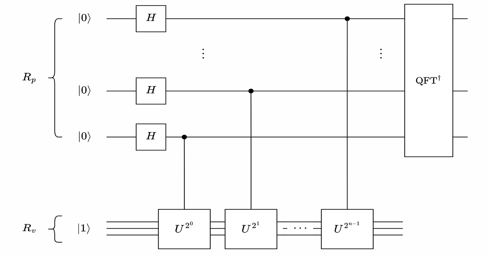

Shor 算法的量子电路实现和 QPE 一致，寄存器 1 全部初始化为 $|0\rangle$，寄存器 2 初始化为 $|1\rangle$。

!!! Note
    这里的 $|1\rangle$ 更准确地说是 $|00\cdots01\rangle$，即最低位为 1，其余位为 0。

回忆 QPE，其实现的效果是给定酉矩阵 $U$ 和其特征向量 $|\mu\rangle$，估计其对应的特征值的相位。

现在，我们有酉矩阵 $U$，其特征向量为 $|u_s\rangle$，对应的特征值为 $e^{\frac{2\pi is}{r}}$（利用性质一），我们只需要通过 QPE 的电路估计相位 $\frac{s}{r}$，就可以得到 $r$。

回忆 QPE 电路中的特征向量线性组合，由于 $|1\rangle$ 是 $|u_s\rangle$ 的等概率叠加态（利用性质二），这样子可以等概率测量得到 $\frac{0}{r},\frac{1}{r}, \frac{2}{r}, \ldots, \frac{r-1}{r}$。

### 举例

若 $a=7$，$n=15$，则通过 Shor 算法可以观测到等概率的相位输出：

$$0,0.25,0.5,0.75$$

问题转化为：已知 $\\{\frac{1}{r},\frac{2}{r},\dots,\frac{r-1}{r}\\}$ 的小数形式，如何求 $r$：

解法：

将（非零）小数转化为分数：

$$\frac{1}{4},\frac{1}{2},\frac{3}{4}$$

然后取所有分母的最小公倍数即可。

!!! Note
    这里不能直接通过有多少种观测结果，就认为 $r$ 就是这个数，因为 QPE 会有精度误差（见前文）。

而对于 $U$ 的构造方法也很简单：

$$f(x)=ax\mod n$$

$$U=\sum\limits_{x=0}^{n-1}|f(x)\rangle\langle x|$$

***

## Grover 算法

Grover 算法常用于搜索问题，将 $O(N)$ 的算法加速至 $O(\sqrt{N})$。例如，寻找 $24$ 的因子。

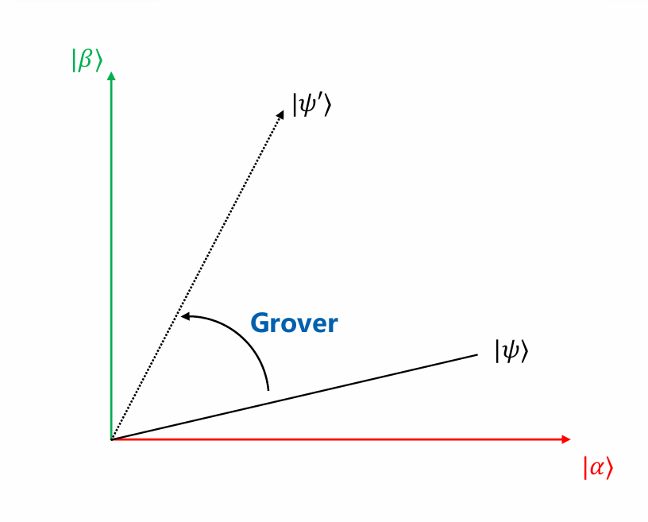

设 $|\alpha\rangle$ 表示所有错解的叠加态（$5,7,9,10,13\dots$），$|\beta\rangle$ 表示所有正确解的叠加态（$1,2,3,4,6\dots$）。

Grover 算法用过旋转初始量子态，使其逐渐接近 $|\beta\rangle$。

### 量子电路实现

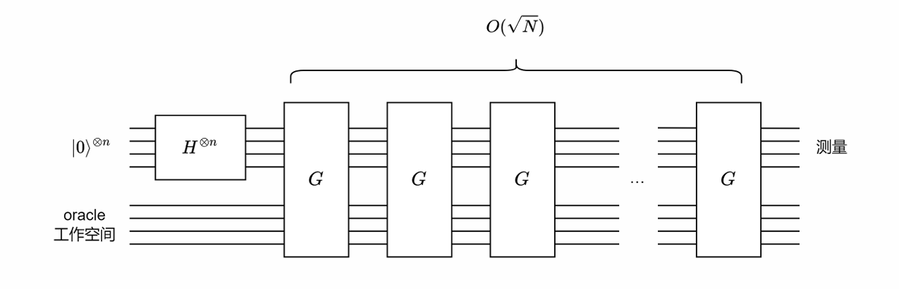

首先，初始状态有 $n$ 个量子比特，全部初始化为 $|0\rangle$，经过 H 门后，得到均匀叠加态：

$$|\psi\rangle=\frac{1}{\sqrt{N}}\sum\limits_{x=0}^{N-1}|x\rangle$$

然后，反复地作用一个记作 $G$ 的 Grover 算子，展开为

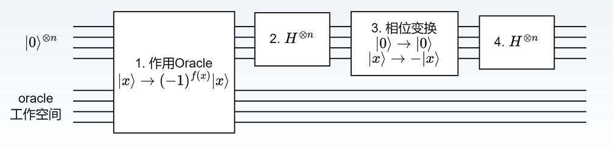

第一步是一个 oracle（可以不细究其实现），效果为

$$|x\rangle\xrightarrow{oracle}(-1)^{f(x)}|x\rangle$$

其中，$x$ 为正解时 $f(x)=1$，否则 $f(x)=0$。也就是说，这个 oracle 会翻转正解的相位。

第二、三、四步合并起来，对应的算子为

$$2|\psi\rangle\langle\psi|-I$$

### G 迭代的几何意义

设总共有 $N$ 个解，其中有 $M$ 个正确解，初始态经过 H 门后为

$$
\begin{align}
    |\psi\rangle & =\frac{1}{\sqrt{N}}\sum\limits_{x=0}^{N-1}|x\rangle \\\
    & =\frac{1}{\sqrt{N}}(\sum\text{正解})+\frac{1}{\sqrt{N}}(\sum\text{错解}) \\\
    & = \frac{1}{\sqrt{N}}\sqrt{M}(\sum\frac{1}{\sqrt{M}}\text{正解})+\frac{1}{\sqrt{N}}\sqrt{N-M}(\sum\frac{1}{\sqrt{N-M}}\text{错解}) \\\
    & = \sqrt{\frac{N-M}{N}}|\alpha\rangle+\sqrt{\frac{M}{N}}|\beta\rangle
\end{align}$$

第一步：作用 oracle 算子：

设 $a=\sqrt{\frac{N-M}{N}}$，$b=\sqrt{\frac{M}{N}}$，则

$$O(a|\alpha\rangle + b|\beta\rangle)=a|\alpha\rangle-b|\beta\rangle$$

从几何上看，就是以 $|\alpha\rangle$ 为对称轴做对称操作：

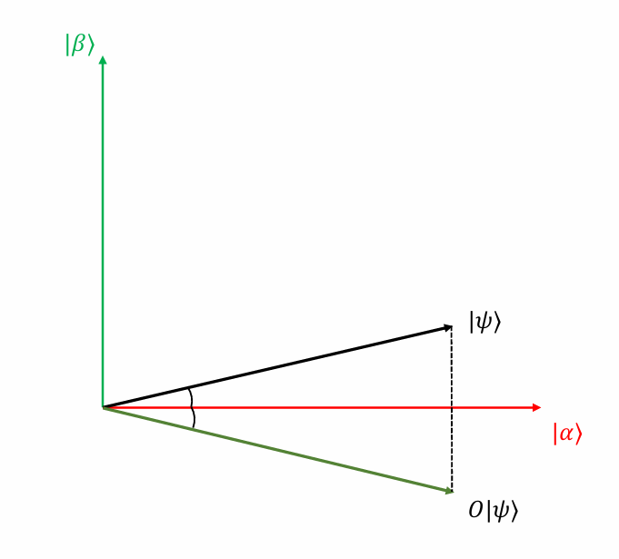

第二、三、四步：

若量子态表示为：

$$|v\rangle=p|\psi\rangle+q|\psi\rangle_{\perp}$$

则

$$(2|\psi\rangle\langle\psi|-I)|v\rangle = p|\psi\rangle - q|\psi\rangle_{\perp}$$

从几何上看，就是以 $|\psi\rangle$ 为对称轴做对称操作：

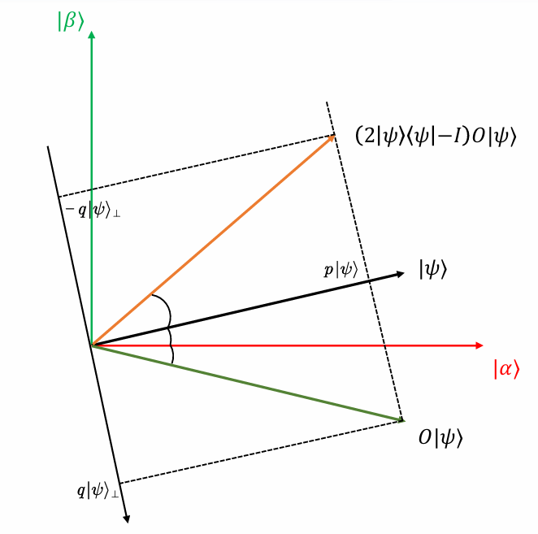