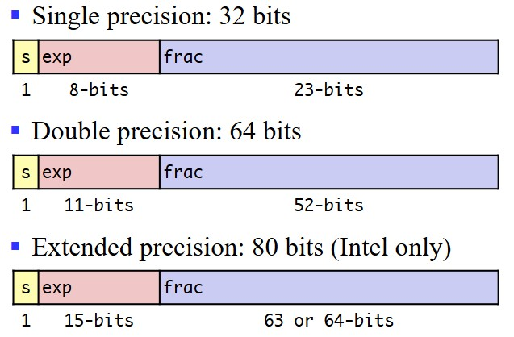

# Chapter1 Computer System and Information Representation

***

## 1.1 Introduction to Computer Systems

**Von-Neumann Model（冯·诺伊曼模型）:**

* CPU
* Memory
* I/O System

* ALU：算数逻辑单元
* PC：程序计数器
* IR：指令寄存器
* MAR：地址寄存器
* MDR：数据寄存器
* CU：控制器

**Translator:**

* Assembler：汇编器，将汇编语言翻译成机器语言，一般而言，生成的是目标代码，需要经过链接器生成可执行代码才可以执行
* Compiler：编译器，将源代码，即高级程序设计语言翻译成汇编语言或者机器语言，但不会执行
* Interpreter：解释器，直接读取源代码，即高级程序设计语言将其转换成计算机指令后立即执行

***

## 1.2 Binary Number Representation

**Internal Data:**

**Carry Counting System（进位计数系统）:**

将数字符号按序排列成数位，并遵照由低位到高位进位的方法进行计数，来表示数值的方法。

* 数位：数字在一个数中所处的位置
* 基数（radix）：每个数位上所能使用的数码的个数
* 位权：每个数位上的数码所代表的数值的大小

对于形如如下表示的数

$$A_{n-1}A_{n-2}···A_1A_0.A_{-1}A_{-2}···A_{-m+1}A_{-m}$$

其中$0\leqslant A_i<r$，每个$A_i$表示一个数码，或者说是数字符号，则这个数实际的大小为

$$(\sum\limits_{i=0}^{i=n-1}A_i·r^i)+(\sum\limits_{j=-m}^{j=-1}A_j·r^j)$$

前一部分为整数，后一部分为小数。

十进制转化二进制：

整数部分：连除

小数部分：连乘

!!! Note
    并不是所有小数都能转化为二进制，如 0.65=0.1010011001001···

八进制/十六进制转化为二进制：

1 位八进制对应 3 位二进制  
1 位十六进制对应 4 位二进制

**Special Powers of 2:**

* Kilo（K）：$2^{10}$
* Mega（M）：$2^{20}$
* Giga（G）：$2^{30}$
* Tera（T）：$2^{40}$

多义性：

***

## 1.3 Arithmetic Operations

**Addition with Carry:**

**Subtraction with Borrow:**

***

## 1.4 Representation of Numeric Data

**Original Code（原码）:**

对于有符号数，原码的最高位用于表示符号，1 为正， 0 为负。剩余的位即表示绝对值的大小. 因此，相反数只差一个最高位。

局限性：
* 有两种方法表示 0 
* 二进制加法不成立. 例如：0111 表示 +7，1010 表示 -2，其十进制相加本应为 +5，但二进制相加得到 0111，表示 +1.
* 负数不能符号扩展，否则会改变原本的数值

**Inverse Code（反码）:**

正数与原码表示相同. 对于负数，最高位依旧为 1 ，但其余位相比于原码全部取反。

局限性：

* 还是有两种方法表示 0
* 计算还是有问题，但比原码好一点

但是负数的符号扩展有效。

**Complement Code:**

正数与原码表示相同. 对于相同的表示负数的二进制码，补码表示的值比反码小 1。所有原码和反码的局限性均消除。

对于任意需要表示的数值$X_T$，其补码为

$$[X_T]_C=M+X_T(\mod M)$$

其中，若数值为 n 位，则 $M$ 为 $2^n$。

真值转化为补码：

* 正数：最高位为 0 ，其余位直接翻译
* 负数：最高位为 1 ，将绝对值对应的二进制码取反，然后加 1

补码转化为真值：

* 若最高位为 0 ，则表示正数，其余位直接翻译
* 若最高位为 1 ，则表示负数，先将其余位取反，然后加 1

补码的正负变换：

无论从正到负，还是从负到正，都是取反加 1。

**Frameshift Code（移码）:**

用于表示浮点数。

对于同一真值，对其补码的符号位取反得到其移码。

***

## 1.5 Representation of Integers in C

在 C 语言中，有符号整数和无符号整数可以相互转换，转换前后二进制码没变，但翻译方式改变。

**Bit-Level Operations:**

&，|，~，^

对于 long，int，short，char，unsigned 都适用

**Logic Operations:**

&&，||，！

0 为 False，非 0 为 True。

存在截断，即若第一个判断已经可以决定整个式子的真假，则不进行第二个式子的判断。

**Shift Operations:**

<<，>>

* 左移：右边全补 0
* 逻辑右移：左边全补 0
* 算术右移：左边全补符号位

**Terminology:**

!!! Example
    对于二进制表示$X=x_{w-1}x_{w-2}···x_1x_0$：  
    $$B2T(X)=-x_{w-1}·2^{w-1}+\sum\limits_{i=0}^{w-2}x_i·2^i$$

**Relation between Signed & Unsigned:**

$ux=\begin{cases}
    x,x\geqslant 0\\\
    x+2^w,x<0
\end{cases}$

在 C 语言中，默认情况下都是有符号数，如果是无符号数，则在数字后带有“U”。

如果在单一表达式（<，>，==，<=，>=）中既有有符号数又有无符号数，则有符号数隐式转换为无符号数。

**Signed Extension:**

Expanding：short int $\rightarrow$ int

* 无符号数：补 0
* 有符号数：符号扩展

**Others:**

TAdd 和 UAdd 在二进制层面是相同的。

$UAdd_w(u,v)=\begin{cases}
    u+v,u+v\leqslant 2^w\\\
    u+v-2^w,u+v\geqslant 2^w
\end{cases}$

$TAdd_w(u,v)=\begin{cases}
    u+v+2^w,u+v<TMin_w\\\
    u+v,TMin_w\leqslant u+v\leqslant TMax_w\\\
    u+v-2^w,TMax_w<u+v
\end{cases}$

## 1.6 Floating-point Number Representation

**IEEE Standard:**

* 符号位：决定正负
* 尾数：在$[1,2)$的数
* 指数：对尾数乘SS 2 的幂次进行偏移

编码：

其中：

* s 编码符号位
* exp 编码指数，但不等于指数
* frac 编码尾数，但不等于尾数

**Normalized Values:**

对于exp：

首要条件：exp≠000···000或111···111

指数的实际大小：exp 得到的无符号数-偏移量，其中偏移量为$2^{k-1}-1$，$k$为 exp 的位数. 例如：单精度的偏移量为 127，双精度的偏移量为 1023。

对于 frac：

由于尾数的范围$[1,2)$，因此整数位必为 1，小数位后的数字编码到 frac 中. 因此，frac 最小表示为 000···000，此时尾数为 1。

**Denormalized Values:**

exp=000···000 的情况：

此时指数应该被编码为 1-偏移量（不是 0-偏移量）

此时尾数小数点前的正数默认为 0（不是 1）

* exp=000···000，frac=000···000
  则表示0
* exp=000···000，frac≠000···000
  则表示十分接近 0 的数字

**Special Values:**

exp=111···111 的情况：

* 如果 frac=000···000，则表示无穷
* 如果 frac≠000···000，则表示非数字（NaN），如虚数，无穷乘上零等

**Rounding（舍入）:**

-|1.4|1.6|1.5|2.5|-1.5
---|---|---|---|---|---
Towards zero（向0舍入）|1|1|1|2|-1
Round down（向下舍入）|1|1|1|2|-2
Round up（向上舍入）|2|2|2|3|-1
Nearest even（最近舍入）|1|2|2|2|-2

其中，最近舍入又叫向偶数舍入，是 IEEE 默认的舍入模式，它和四舍五入只有一点不同，对.5的舍入上，采用取偶数的方式。

**Rounding Binary Numbers（二进制数的舍入）:**

以$xx.xxxxx_2$为例，假设要保留到小数点后 2 位，则要考虑后 3 位的大小，若后 3 位以 0 开头，则小于一半，直接舍掉，不进位. 若后 3 位比 100 大，则大于一半，进一位. 若后 3 位恰好为 100，则要看前面的数的奇偶，若前面的数是偶数，即小数点后第 2 位为 0，则直接舍弃，若为 1，则进位。

**Floating Point in C:**

* int：32位
* float：32位
* double：64位

float/double$\rightarrow$int:

扔掉小数部分，类似于向0舍入

int/double$\rightarrow$float:

可能会舍入

int/float$\rightarrow$double:

能够保留精确数值

**Binary Codes for Decimal Digits（BCD）:**

用 4 位二进制数表示 10 个十进制数码。

***

## 1.7 Representation of Non-numeric Data

**ASCII:**

一共 7 位，可以表示 94 个可显示字符和 34 个非显示字符。

* $0:48_{10}$
* $A:65_{10}$
* $a:97_{10}$

**UNICODE:**

将 ASCII 扩展成 16 位，支持更多语言的字符。

***

## 1.8 Data Width and Storage

**Data Width and Unit:**

一个系统多少位，表示的是 CPU 的地址总线宽度和数据总线为多少位。

!!! Example
    对于32位系统，地址总线宽度为 32 位，可以对应到$2^{32}$个地址，即 4GB。注意：每个地址锁定的最小可寻址单元为字节B。