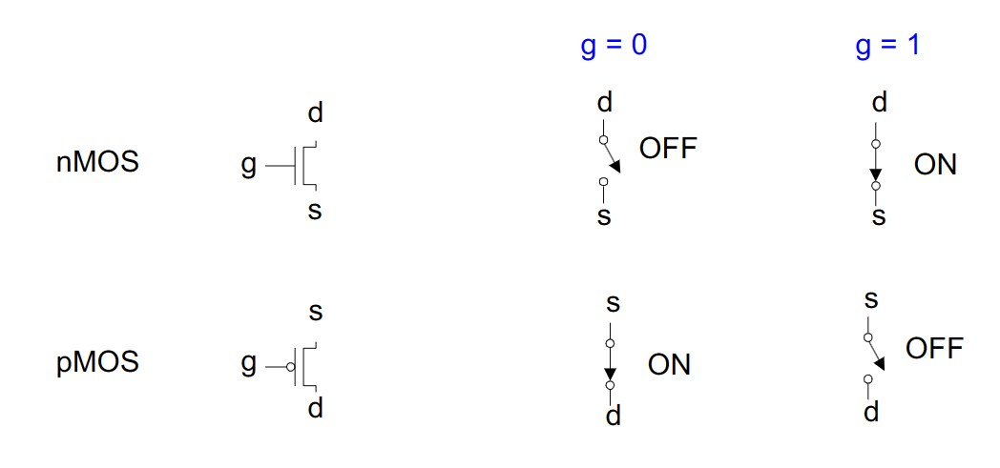
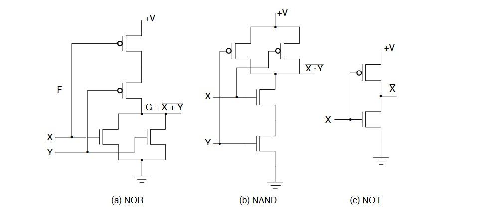
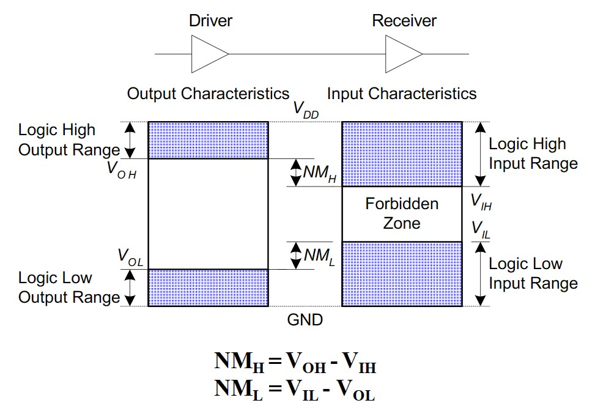
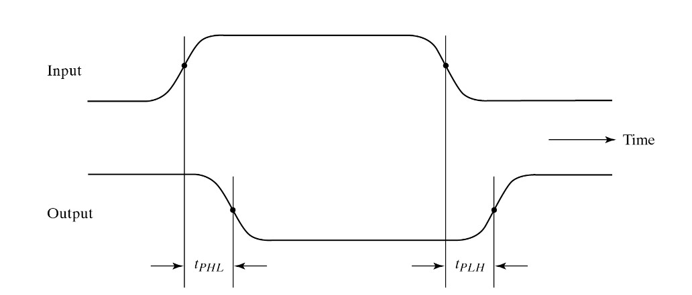
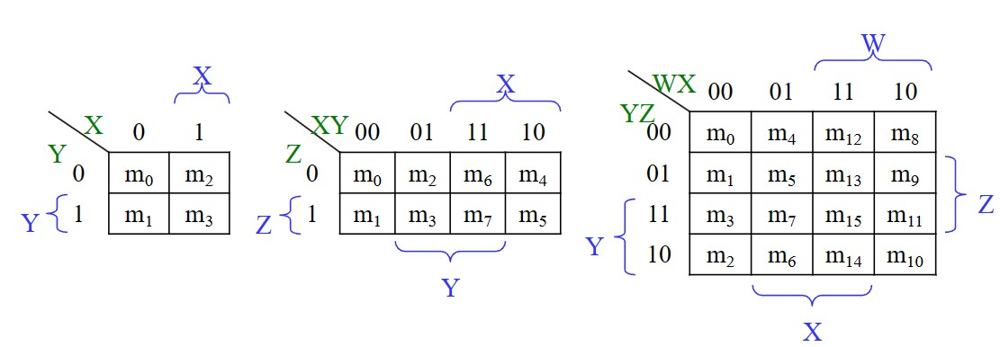
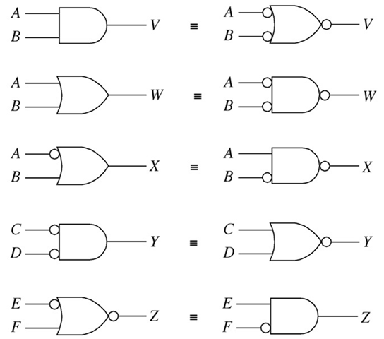

# Chapter2 Foundations of Digital Logic

***

## 2.1 Transistors

**Buffer（缓冲区）:**

Buffer的主要功能是作为电路的缓冲区，起一个延时的作用，因此输入为 0 ，输出为 0 ；输入为 1 ，输出为 1 。

**Relay（继电器）$\rightarrow$ Vacuum Cube（真空管）$\rightarrow$ Transistor（晶体管）:**

* Relay: 
switches are opened and closed by magnetic fields produced by energizing coils（通电线圈）
* Vacuum Cube: 
open and close current paths electronically
* Transistor: 
be used as electronic switches that open and close current paths

**Metal Oxide Silicon（MOS）Transistors（金属氧化物半导体场效应管）:**

MOS管的管脚有三个：
* 源极 S（Source）
* 栅极 G（Gate）
* 漏极 D（Drain）

MOS管分为两种：
* pMOS  
    Gate 为 1 时断开，Gate 为 0 时接通  
    电流从 S 到 D   
* nMOS  
    Gate 为 0 时断开，Gate 为 1 时接通  
    电流从 D 到 S 

***

## 2.2 Some IC Parameters

**Integrated Circuit（IC）Parameters（集成电路参数）:**

* $V_{CC}$：接入电路的电压，在高速CMOS电路中常为5V
* $GND$：接地点
* $V_{DD}$：既可表示芯片工作电压，又可表示CMOS器件的漏极
* $V_{ss}$：既可表示接地点，又可表示CMOS器件的源极

**Noise:**

Definition: anything that degrades the signal

!!! Example 
    A gate (driver) outputs 5 V but, because of resistance in a long wire, receiver gets 4.5 V.

**Noise Margin（噪声容限）:**

指在前一级输出为最坏的情况下，为保证后一级正常工作，所允许的最大噪声幅度，噪声容限越大说明容许的噪声越大，电路的抗干扰性越好。

**Propagation Delay（传播时延）:**

电路从input变化到output变化所经历的延迟。

* $T_{PHL}$：导通延迟时间，即 $V_{out}$ 从高电平到低电平对应的延迟时间
* $T_{PLH}$：截止延迟时间，即 $V_{out}$ 从低电平到高电平对应的的延迟时间
* $T_{PD}$：平均延迟时间，$T_{PD}=\frac{T_{PHL}+T_{PLH}}{2}$

**Transition Time（过渡时间）:**

指信号从高电平转化到低电平或者低电平转化到高电平所花费的时间，也称作 slew rate （电压变化速率，压摆率）

**Power Dissipation（功耗）:**

* 静态功耗  
  此时电路的输出不变，电路中存在静态电流 $I_{DD}$  
  $P_S=I_{DD}·V_{CC}$

* 动态功耗
  $P_D=(C_{PD}+C_L)·V_{CC}^2·f$  
  其中$C_{PD}$ 为电容，$C_L$ 为 output 的容性负载，$f$ 为传输频率  

**Fan-in / Fan-out（扇入 / 扇出）:**

* Fan-in refers to the maximum number of input signals that feed the input equations of a logic cell  
  例如：一个典型与门的扇入为2

* Fan-out refers to the maximum number of output signals that are fed by the output equations of a logic cell  
  即从输出设备馈送输入信号的电路数量  
  例如：一个与门的输出只能分出有限条电路（数量即为扇出）

***

## 2.3 Boolean Algebra

**Notation:**

* $X·Y$：与
* $X+Y$：或
* $\overline{X}$：非

**Generalized Idempotent Theorem（广义幂等定理）:**

* $X+X+···+X=X$
* $X·X·……·X=X$

**De Morgan’s Theorem（德摩根定理）:**

* $\overline{X_1·X_2·……·X_n}=\overline{X_1}+\overline{X_2}+···+\overline{X_n}$
* $\overline{X_1+X_2+···+X_n}=\overline{X_1}·\overline{X_2}·……·\overline{X_n}$

**Shannon's Theorem（香农定理）:**

* $F(X_1,X_2,···,X_n)=X_1·F(1,X_2,···,X_n)+\overline{X_1}·F(0,X_2,···,X_n)$
* $F(X_1,X_2,···,X_n)=[X_1+F(0,X_2,···,X_n)]·[\overline{X_1}+F(1,X_2,···,X_n)]$

**Karnaugh Maps（K-map）（卡诺图）:**

* 每个 1 都要被圈到
* 每个圈在每个方向上的长度均为 2 的幂次
* 每个圈越大越好
* 圈可能跨过边界
* X 可圈可不圈，怎样方便怎样来

**Bubble Pushing:**

* Begin at output, then work toward inputs
* Push bubbles on final output back 
* Draw gates in a form so bubbles cancel

**Cost Criterion:**

* Literal cost（L）：一个逻辑式中出现的字面量（不管是不是同一个变量）

* Gate input cost（G）：所有与门和或门输入的总个数

* Gate input cost with NOTs（GN）：G 的个数加上非的变量个数
  
!!! Example
    $F=BD+A\overline{B}C+A\overline{C}\overline{D}$中，$L=8$，$G=11$，$GN=14$