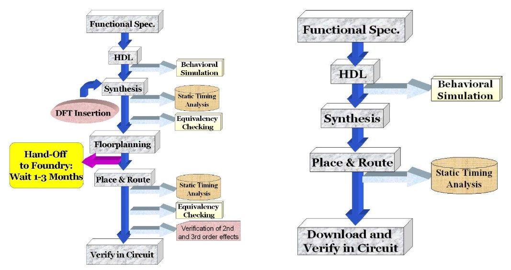
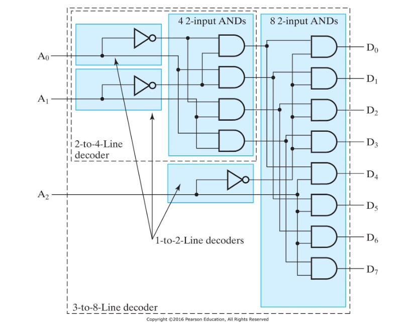
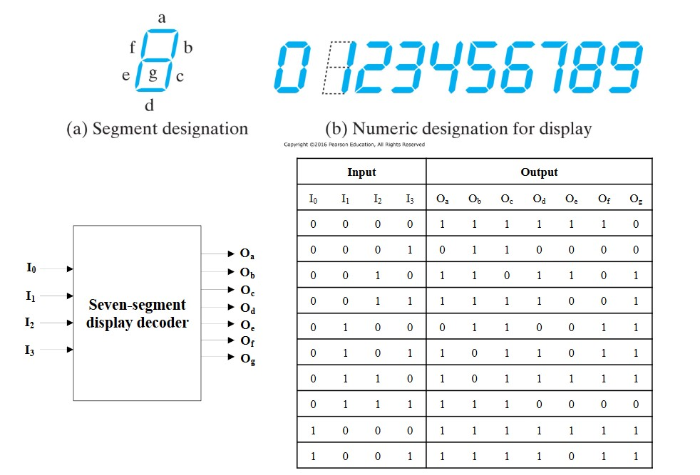
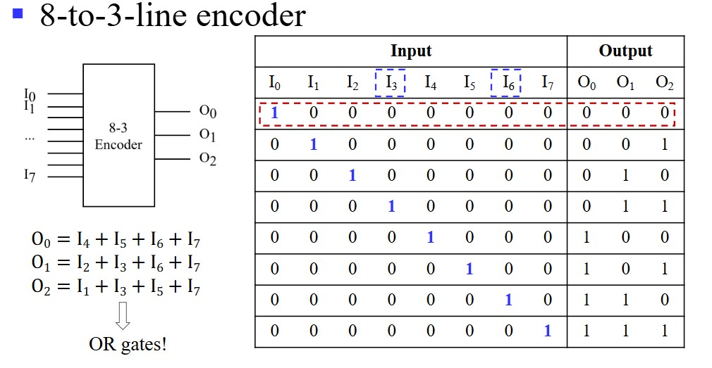
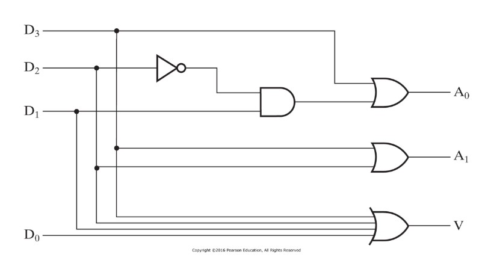
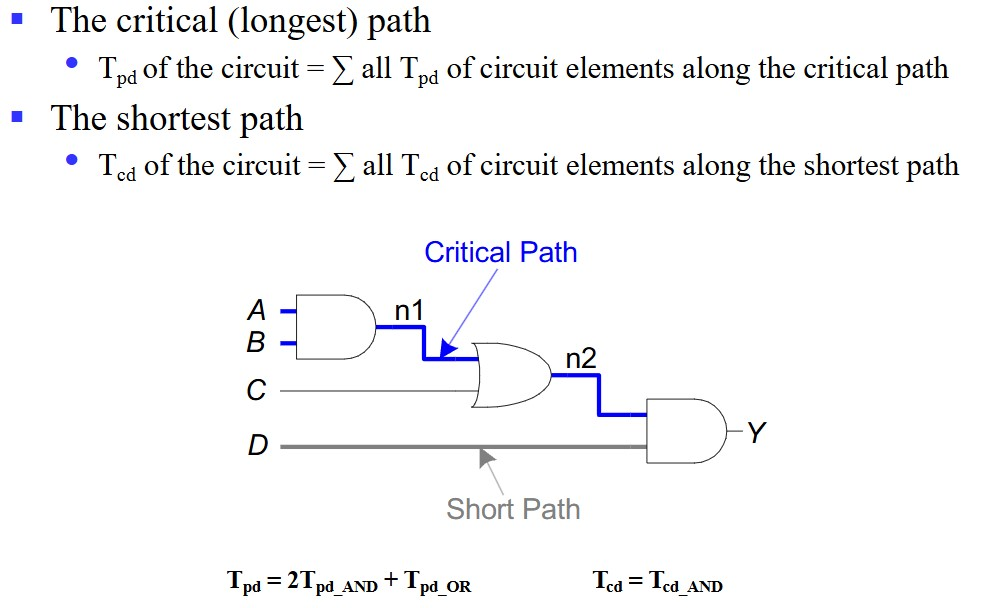
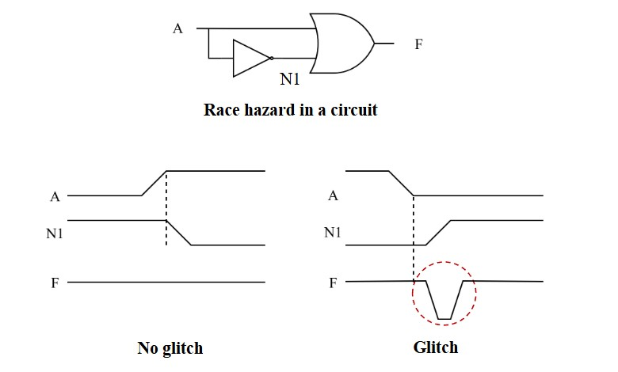

# Chapter3 Combinational Logic Design

***

## 3.1 Introduction to Verilog HDL

**Digital Circuit Design:**

* FPGA：现场可编程门阵列，可通过编程来改变内部结构
* ASIC：专用集成电路，内部逻辑电路固定
  

**Lexical Conventions（词汇规定）:**

Sized numbers
* size：位数（十进制表示）
* base：b/d/o/h，分别对应二/十/八/十六进制
* number：每一位具体的值

例如：4’b1111，12’habc，16’d255

X or Z values
* x 表示未知的值
* z 表示高阻态的值
  
例如：12’h13x，6’hx，32’bz

数位扩展：

若 size 的值大于赋值的位数，则剩余高位的补全规则为：

* 最高位为 x ，则剩余位数用 x 补全
* 最高位为 z ，则剩余位数用 z 补全
* 最高位既不是 x 又不是 z ，则剩余位数用 0 补全

**Modeling Methods:**

* 结构描述法  
  模块层面，门级层面，开关层面
* 数据流描述法  
  适合描述组合逻辑电路，常使用 assign
* 行为描述法  
  常使用 always

***

## 3.2 About Combinational Logic Circuits

**Three_state Gate（三态门）:**

* 使能信号为 0：门电路断开，呈高阻态
* 使能信号为 1：门电路导通，呈正常的 0/1 输出

***

## 3.3 Some Classic Designs

**Decoder（译码器）and Demultiplexer（解复用器）:**

**Encoder（编码器）and Multiplexer（多路复用器）:**

**Priority Encoder（优先编码器）:**

用于判断数据最高位 1 出现的位置，其中$V$用来判断有没有 1 的出现，$D_3D_2D_1D_0$是一个四位的数，$A_1A_0$表示最高位 1 出现位置（0,1,2,3）

**Half Adder（半加器）and Full Adder（全加器）:**

区别：半加器输入只有$A$和$B$，不考虑进位输入，输出为结果$F$和进位$C$；全加器输入有加数$A$，$B$和进位$C_{in}$，输出为结果$F$和进位$C_{out}$。

***

## 3.4 Timing Analysis

**Delay:**

* Propagation delay（$T_{pd}$）：从输入到输出的最大延迟
* Contamination delay（$T_{cd}$）：从输入到输出的最小延迟

**Race Hazard（竞争危害）and Glitch（毛刺）：**

单一输入变化造成输出多次变化。

