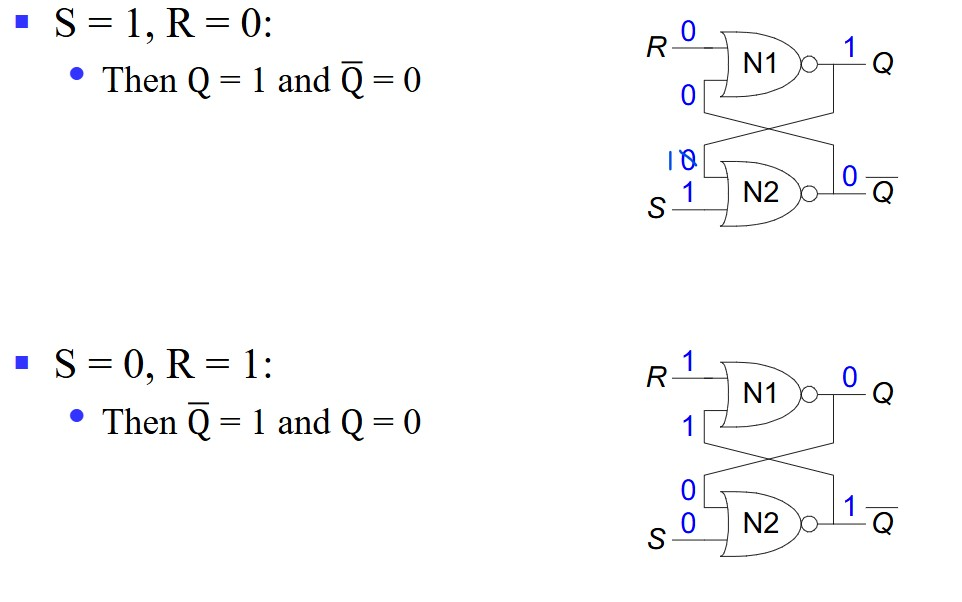

# Chapter4 Sequential Logic Design

***

## 4.1 Introduction to Sequential Circuits

**Trigger/Sensitive:**

* Level-triggered（水平触发）：  
  当输入信号保持在某个特定水平（通常是高电平或低电平）时，触发器或系统会被触发. 只要信号保持在该水平，触发器就会保持在触发状态，直到信号发生变化。
* Edge-triggered（边缘触发）：  
  边缘触发是在输入信号的边沿（上升沿或下降沿）发生变化时触发的。这意味着只有在信号的变化瞬间触发器才会被触发，而不是在信号保持某个特定水平时。

注：触发器是边缘触发的，时钟锁存器是水平触发的

**Sequential Circuit Analysis:**

布尔表达式：

状态表：

状态图：

***

## 4.2 Basic Sequential Logic Elements

**Bistable Circuit（双稳态电路）:**

构成锁存器和触发器的基础，有两个输出$Q$和$\overline{Q}$，但没有输入。

**SR Latch（Set/Reset锁存器）:**

由两个或非门组成，$R$为$Reset$信号，$S$为$Set$信号，如果$R=S=0$，则输出$Q$保持上一个状态，这个时候就达到了存储的效果。

如果用两个与非门，则可以构成$\overline{SR}$ latch，其效果与一般的 SR latch 类似，只是不同信号的对应关系有所不同。

在$\overline{SR}$ latch 上再加上两个与非门和一个时钟信号，则可以构建时钟锁存器（clocked SR latch），其时序特征与一般的 SR latch 类似，只不过只有有时钟信号的时候$S$和$R$才有效。

**D Latch（Data锁存器）:**

D latch 相当于在原本的时钟锁存器的基础上，将$S$和$R$信号替换为$D$和$\overline{D}$信号，使得只由一个信号控制，不能同时为 1 或者 0。

* $C$：控制什么时候$Q$能改变
* $D$：控制$Q$改变成什么

**Pulse-Triggered Flip-Flop（脉冲触发触发器）:**

SR触发器由两个SR锁存器组成，两个锁存器的时钟保持相反
当时钟信号为 1 时，第一个锁存器输出的$Q$可以改变，但第二个的不行；当时钟信号为 0 时则相反。

之前使用单个SR锁存器时，如果将输出$Q$直接作为其输入信号的话，那么在时钟信号为 1 的这一段时间内，信号会不停地跳转，然而，使用SR触发器后就不会有这种问题了，因为其最后的输出被时钟周期延迟了。

**Edge-Triggered Flip-Flop（边沿触发触发器）:**

D触发器相比于上一个SR触发器，将锁存器的两个信号$S$，$R$输入换成一个信号$D$，下图为上升沿触发示例图：

辨析：D latch 和 D flip-flop

前者的输出在时钟信号为 1 时会随输入的改变而改变；后者的输出只有在时钟信号从 0 到 1 的瞬间才会根据当时的输入而改变

***

## 4.3 Sequential Logic Design

**Equivalent State（等效状态）:**

* 对于同样的输入，对应的输出相同
* 对于同样的输入，对应的下一个状态相同

等效状态在有限状态机示意图中可以合并。

**Moore Model:**

输出只和当前状态有关。

**Mealy Model:**

输出和当前状态及输入都有关。

**State Assignment:**

以下图为例：

第一种状态编码方法：顺序编码

对于以上编码方法，采用卡诺图进行化简，要注意：卡诺图的最后两行要交换一下（卡诺图中以格雷码排序）。

第二种状态编码方法：格雷码

对于格雷码用卡诺图化简同理，但不需要换行了，因为本身就是格雷码。

总结：以下情况的状态编码最好临近：

* 对于同一输入有同样的下一状态的
* 都可能是同一状态的下一状态的
* 对于同一输入有同样输出的

!!! Example
    

    从这张图我们可以看出，一共三个寄存器$A$，$B$，$C$，一共能表示 8 种状态，还有一个输出$Z$. 分析每个寄存器$D$的连线，可以得到：

    * $A(t+1)=BC$
    * $B(t+1)=\overline{B}C+B\overline{C}$
    * $C(t+1)=\overline{A}\overline{C}$
    * $Z=A$

    因此可得状态表：

    

**Flip-Flop Timing:**

考虑D flip-flop：

* $t_{setup}$：输入信号在时钟周期变化前需要保持稳定的时长
* $t_{hold}$：输入信号在时钟周期变化后需要保持稳定的时长
* $t_{ffpd}$：从时钟周期变化到输出信号变化之间的延迟时间

接下来对整个时序电路分析：

首先，当时钟上升沿到来时，触发器输出需要经过一个$t_{ffpd}$的时间才能变化完成，该变化完成后，对应的组合逻辑部分也要经过一个$t_{comb}$的延迟才能更新完毕，接下来，对于外界输入会有一段相对空闲的时间setup-time margin，之后外界输入改变，就需要维持$t_{setup}$时间的稳定，直到下一个时钟上升沿。

***

## 4.4 Classic Sequential Logic Elements

**Microoperation:**

对寄存器的数进行的初级操作，例如：将一个寄存器的数加载到另一个寄存器上，将两个寄存器的数相加，增大寄存器中的数等。

最常用的四个操作：

* transfer（转移）
* arithmetic（算数）
* logic（逻辑）
* shift（移位）

**Register Transfer Structures:**

基于多路选择器的转换：

每个寄存器的输出都连接到多路选择器的输入，同时一个寄存器配对一个多路选择器。

基于总线的转换：

所有的寄存器都直接连到总线上。

三态总线：

基于总线的升级版。

**Ripple Counter（行波计数器）:**

把上一个触发器的输出，作为下一个触发器的时钟，达到延时的效果。

这样，随着时间流逝，$(B,A)=(0,0),(0,1),(1,0),(1,1),(0,0),(0,1)···$循环往复，达到计数器的效果. 如果再来一个$C$，则可以记 0 到 7，以此类推。

对于每两个触发器之间都会有$t_{phl}$的延时，因此，对于$n$bit，最坏情况的延时为$n·t_{phl}$。

**Synchronous Counter（同步计数器）:**

每个触发器的时钟接口都和同一个时钟信号连接，采用组合电路的方式达到同步效果。

第一种电路：

第二种电路：更类似于行波计数器，但不会有行波计数器的延迟。

