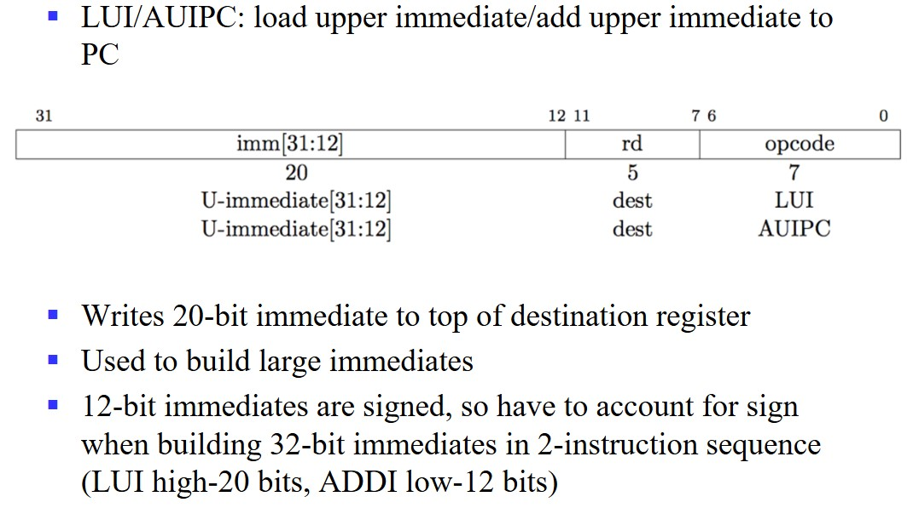
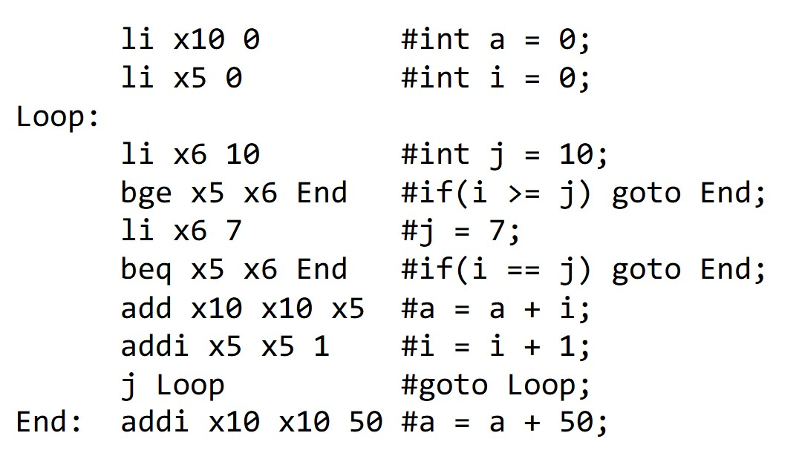

# Chapter5 Instruction Set Architecture

***

## 5.1 Operands and Addressing Modes

**n-Operand Instructions:**

对于同一个赋值语句：

$$Y=(A-B)/(C+(D*E))$$

0操作数：使用栈：

1操作数：

2操作数：

3操作数：

**Addressing:**

* 立即数取址  
  例如：`ADD #5`  
  表示直接将数字 5 加到某个数上

* 直接取址  
  例如：`ADD 100`  
  表示将地址为 100 的内存中的数加到某个数上

* 间接取址  
  例如：`ADD [100]`  
  表示内存地址为 100 的地方存的是另一个地址，再根据这个地址找到对应的数加到某个数上

* 寄存器直接取址  
  例如：`ADD R5`  
  表示将 5 号寄存器中的值加到某个数上

* 寄存器相对取址  
  例如：`ADD [R3]`  
  表示存在 3 号寄存器中的值是一个地址，再根据这个地址找到对应的数加到某个数上  

***

## 5.2 Evolution and Classification

**CISC（复杂指令系统计算机）:**

强化指令功能，减少指令条数。

代表：X86

**RISC（精简指令系统计算机）:**

减少指令种类，规范指令格式。

代表：ARM，MIPS

***

## 5.3 RISC-Ⅴ ISA

**Processor State:**

* 程序计数器（`pc`）
* 32个整数寄存器（`x0`-`x31`）
* 32个浮点数寄存器（`f0`-`f31`）
* 状态寄存器（`fcsr`）

**RISC-V Hybrid Instruction Encoding:**

指令长度有16，32，48，64……最基础的指令长度为 32 位，固定，最低两位为 11，所有的分支和跳转保证最低为 16 位。

**Four Core RISC-V Instruction Formats:**

**R-Type:**

将寄存器`rs1`和`rs2`中的值进行某个操作，将操作结果存到寄存器`rd`。

**I-Type:**

将寄存器`rs1`和立即数进行某个操作，将操作结果存到寄存器`rd`。 

**U-Type:**

LUI:在已有的常数上构建新的常数，并存到寄存器中

AUIPC:用于构建 PC 相对地址，将立即数重新构建后与 PC 相加，并存到寄存器中

**I/S-Type:**

`ld`:从`rs1`取出数据，与立即数相加得到地址，根据该地址取出内存的数据，存到`rd`中

`sd`:从`rs1`中取出数据，与立即数相加得到地址，将`rs2`的数据存到内存的对应地址

**J-Type:**

跳转指令

**B-Type:**

比较跳转指令

B 类型和 J 类型没有分支延迟槽。

!!! Success "Definition"
    **分支延迟槽**是一种处理器设计技术，主要用于解决由于条件分支指令引起的流水线停顿问题，当遇到一个条件语句时，CPU 不确定下一次执行的是下一条语句还是某个目标位置的语句，这就会导致一个时钟周期的延迟。  
    为了解决这个问题，就有了分支延迟槽技术，这种技术默认执行下一条语句，当条件分支语句的下一条语句计算出来的时候，再决定走哪条语句。  
    但是 RISCⅤ 架构已经放弃了分支延迟槽。  

**Privileged ISA（特权指令集架构）:**

指那些只能在特定的操作模式（如内核模式或超级用户模式）下执行的指令。

RISCⅤ 提供了三个等级的特权，称为 modes。

其中，machine mode 的等级最高，是唯一必选模式 required mode。

处理器大部分的执行时间都花在最低特权模式下，但中断和异常会将控制权转移到更高特权的模式。

***

## 5.4 RISC-Ⅴ Assembly Language

`t0`,`t1`,`t2`：临时寄存器
`sp`：stack pointer 栈指针，指向内存地址的起点

**Converting C Code to RISC-Ⅴ:**

寄存器的大小比内存小很多，但寄存器的读写速度比内存快很多。

内存是以字节为单位寻址的，但`lw`和`sw`指令一次访问一个 word（4B）。

内存可以存储那些不能存在寄存器中的变量，但速度很慢，因此尽量减少使用 load 和 store。

**控制流汇编:**

**函数调用汇编:**

内存模型：

* Code/Text
* Static/Data
* Heap
* Stack

RISC-Ⅴ 的指令存在 Text 中，为 32 位，因此，下一条指令要往后 4 个 Byte。

PC 寄存器放置当前执行的指令的地址。

对于 J 型跳转指令，会跳转至对应的 Label，但会在寄存器 rd 中保存 PC+4。

对于栈的地址从上往下依次减小，栈是向下生长的。

函数调用会自动创建一个栈，如果函数里调用函数则会继续往下建栈。

`sp`寄存器叫做 stack pointer，一直指向栈底，栈的创建就是依靠移动`sp`来实现的。

在`sp`上面的是另一套函数，由于`sp`指的是当前的函数开头而不是另一套函数，因此未经允许不得修改它。

通过减小`sp`，即让它往下走，即指向更小的地址，可以分配更多的空间给函数。

在函数调用结束后，`sp`应设置回调用的地方。

对于函数调用：

* `a0`：存放输入的变量 i，之后还有再次利用，存放返回的值
* `ra`：存放返回的地址
* `sp`：栈指针
* `t0`：存放临时的值
* `s0`，`s1`：存放不变的值

一般情况下的约定俗成：

`jal Label`实际表示的是`jal ra Label`

`ret`实际表示的是`jr ra`

`zero`表示的是`x0`寄存器，存储的是 0

`ra`表示的是`x1`寄存器，存储的是返回地址

Callee Saved Registers：

指再函数调用过程中，被调用者需要保证在返回调用者之前保存并恢复这些寄存器的值。

* `sp`：`x2`寄存器
* `s0`~`s11`

Caller Saved Registers：

指在函数调用过程中，如果调用者希望在函数调用后恢复这些寄存器的值，那么调用者需要负责保存这些寄存器的值。

* `ra`
* `a0`~`a7`，用于函数变量，其中`a0`和`a1`可用于函数输出
* `t0`~`t6`：临时寄存器