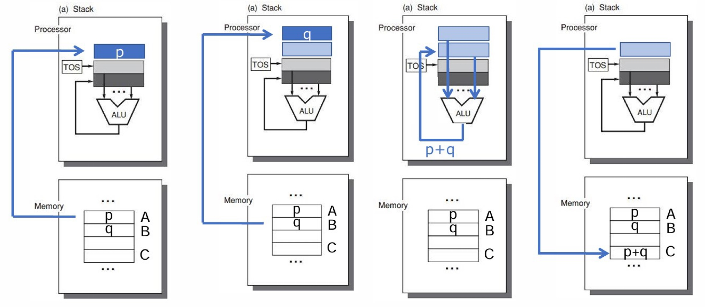
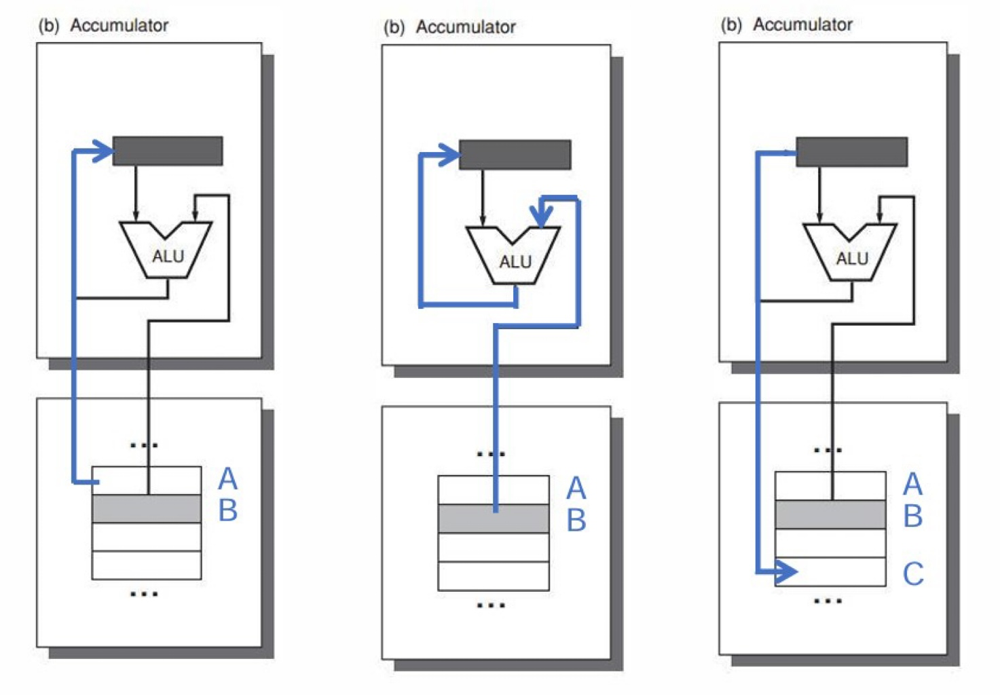
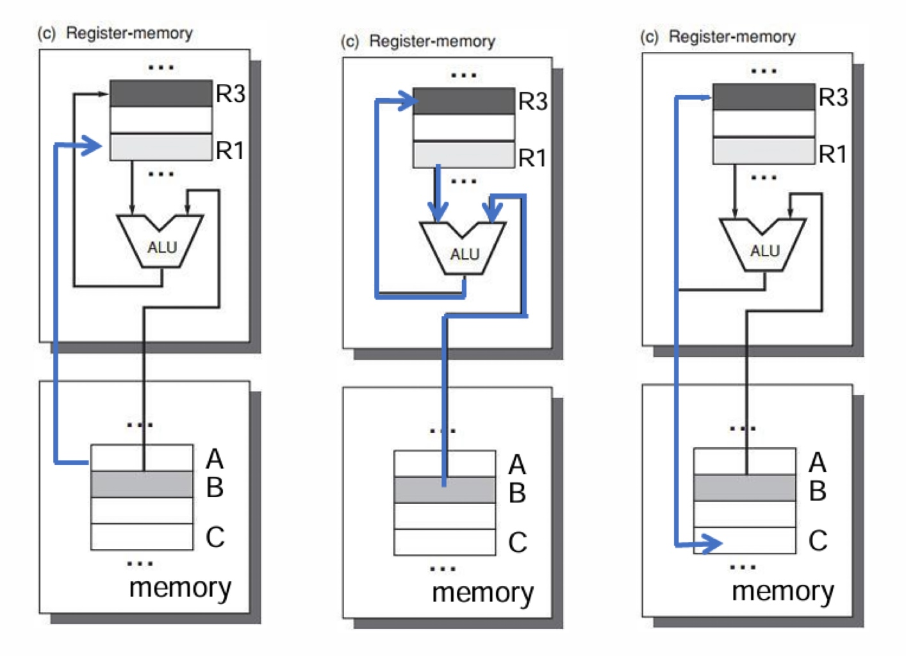
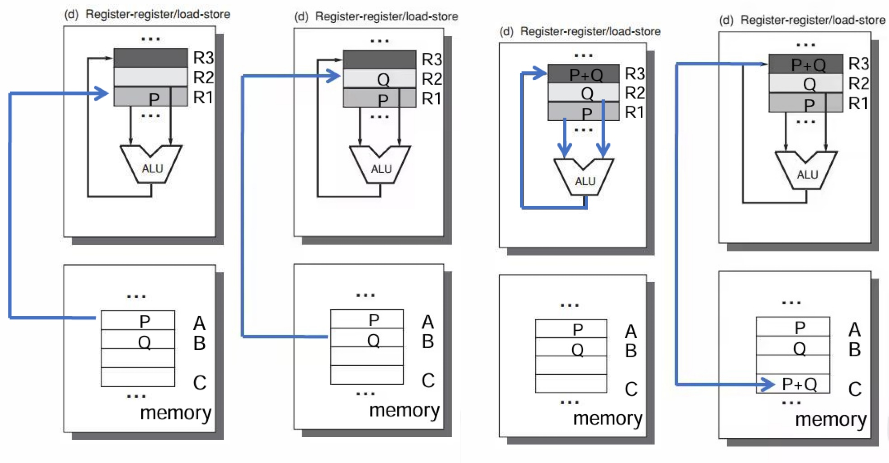
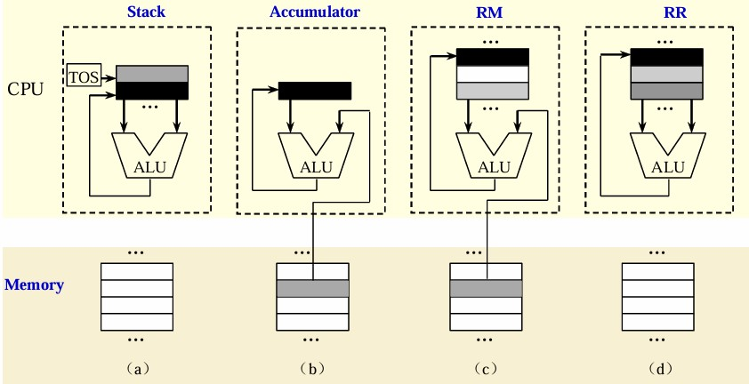
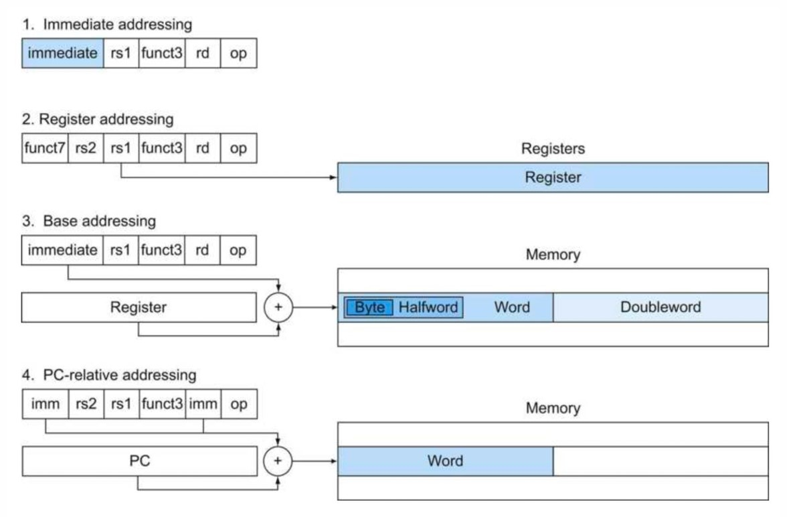
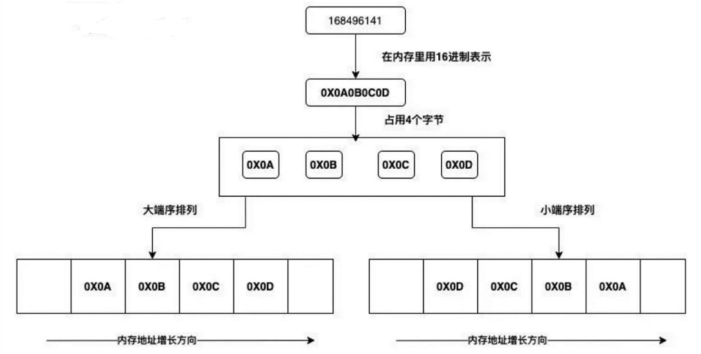
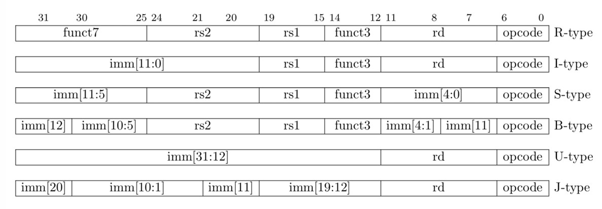
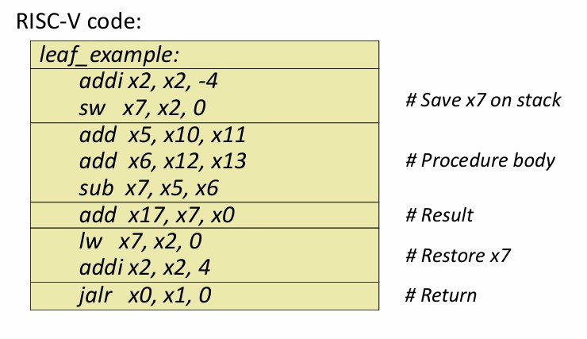
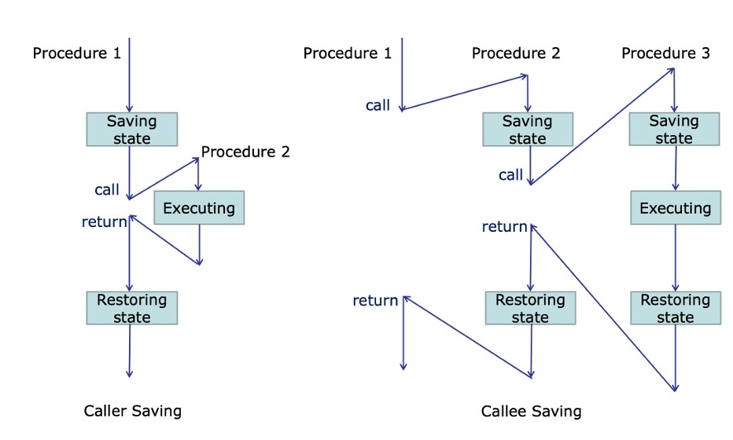

<span style="font-family: 'Times New Roman';">

# Chapter1 ISA

***

## 1.1 Instruction Set Principles

**Basic Principles：**

* compatibility 兼容性
* versatility 多功能性
* high efficiency 高效性
* security 安全性

**Internal Storage：**

* register 寄存器
* stack 栈
* accumulator 累加器

**Stack 栈：**

操作数是隐式的，为栈顶元素（TOS）。

!!! Example
    **例1：执行`C=A+B`**

    `Push A`  
    `Push B`  
    `Add`  
    `Pop C`  

      

!!! Example
    **例2：执行`D=A*(B+C)`**

    `Push A`  
    `Push B`  
    `Push C`  
    `Add`  
    `Mul`  
    `Pop D`  

**Accumulator 累加器：**

一个操作数是隐式的（来自累加器），一个操作数是显式的（来自内存）。

!!! Example
    **执行`C=A+B`**

    `Load A`  
    `Add B`  
    `Store C`

    

**GPR 通用寄存器：**

只有显式操作数，来自寄存器或者内存。

GPR分为：

* register-memory arch（任何指令都能访存）
* load-store arch（只有Load和Store能够访存）
* memory-memory arch

**Register-Memory Arch：**

!!! Example
    **执行`C=A+B`**

    `Load R1,A`  
    `Add R3,R1,B`  
    `Store R3,C`  

    

**Load-Store Arch：**

!!! Example
    **执行`C=A+B`**

    `Load R1,A`  
    `Load R2,B`  
    `Add R3,R1,R2`  
    `Store R3,C`  

    

**Memory-Memory Arch：**

**不同内存方式的比较：**



!!! Example
    **执行`D=A*B-(A+C*B)`**

    **stack:**

    `Push A`  
    `Push B`  
    `Mul`  
    `Push A`  
    `Push C`  
    `Push B`  
    `Mul`  
    `Add`  
    `Sub`  
    `Pop D`  

    **accumulator:**  

    `Load C`  
    `Mul B`  
    `Add A`  
    `Store D`  
    `Load A`  
    `Mul B`  
    `Sub D`  
    `Store D`  

    **register-memory arch:**  

    `Load R1,A`   
    `Mul R1,B`    
    `Load R2,C`   
    `Mul R2,B`    
    `Add R2,A`    
    `Store R2,D`    
    `Sub R1,D`    
    `Store R1,D`    

    **load-store arch:**

    `Load R1,&A`  
    `Load R2,&B`  
    `Load R3,&C`  
    `Mul R7,R3,R2`  
    `Add R8,R7,R1`  
    `Mul R9,R1,R2`  
    `Sub R10,R9,R8`  
    `Store R10,D`  

    **memory-memory arch (3 operands):**

    `Mul D,A,B`  
    `Mul E,C,B`  
    `Add E,A,E`  
    `Sub D,D,E`  

    **memory-memory arch (2 operands):**  

    `Mov D,A`  
    `Mul D,B`  
    `Mov E,C`  
    `Mul E,B`  
    `Add E,A`  
    `Sub D,E`  

***

## 1.2 More about ISA

**Addressing Modes：**

* immediate  
  `Add R1,#3`表示`Regs[R1]=Regs[R1]+3`
* register  
  `Add R1,R2`表示`Regs[R1]=Regs[R1]+Regs[R2]`
* displacement  
  `Add R1,100(R2)`表示`Regs[R1]=Regs[R1]+Mem[100+Regs[R2]]`



**Interpret Memory Address：**



RISC-Ⅴ常用小端序。

**Formats of Instruction：**



**Register Operands：**

* `x0`：constant 0
* `x1`：link register
* `x2`：stack pointer
* `x3`：global pointer
* `x4`：thread pointer
* `x5`-`x7`,`x28`-`x31`：temporary
* `x8`-`x9`,`x18`-`x27`：save
* `x10`-`x17`：parameter/result

**Procedure Call Instructions：**

`jal x1,offset`：

无条件跳转到PC+offset，并将其保存到`x1`。

`jalr x2,x1,offset`：

无条件跳转到`Regs[x1]`+offset，并将其保存到`x2`。

!!! Example
    ```c
    int leaf_example (int g, h, i, j)
    {
        int f;
        f = (g + h) - (i + j);
        return f;
    }
    ```
    其中，参数依次位于`x10`-`x13`，`f`位于`x7`，结果位于`x17`。  
    
    

**Save Registers：**



