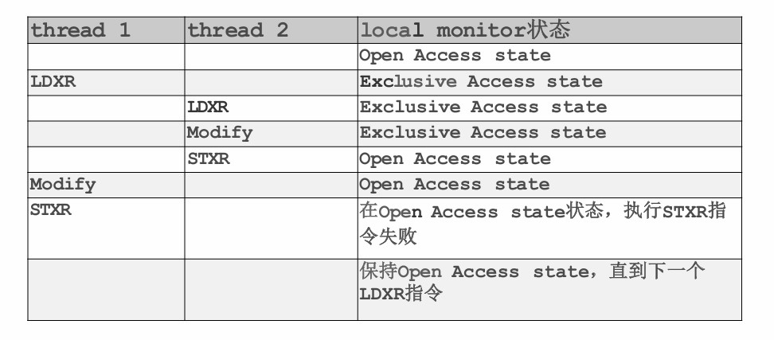

<span style="font-family: 'Times New Roman';">

# Chapter10 Synchronization

***

## 10.1 基本概念

!!! note 声明
    此章节统一使用**线程**表示线程/进程。
    （在Linux的kernel中，有很多竞争，可以把整个OS看作一个大的进程，其中运行的所有进程可以看作OS进程的线程）

**Example 典例：**

```c linenums="1"
int counter=0;
static int loops=1e6;

void *worker(void *arg)
{
    int i;
    for(i=0;i<loops;i++)
    {
        counter++;
    }
    return NULL;
}

int main()
{
    pthread_t p1,p2;
    pthread_create(&p1,NULL,worker,"A");
    pthread_create(&p2,NULL,worker,"B");
    pthread_join(p1,NULL);
    pthread_join(p2,NULL);
    printf("%d\n",counter);
}
```

理论上最后输出应为2000000，但实际上最后输出并不到2000000，且每次输出不同。

原因：

`counter++`实际分成了三步：

* `mov 0x8049a1c,%eax`：从内存读入寄存器
* `add $0x1,%eax`：寄存器自增
* `mov %eax,0x8049a1c`：从寄存器写回内存

如果Thread1在执行完`add`后中断，切换到Thread2，则会出现错误，详情见下图（在counter=50的情况下，本来两线程各自自增1应该得到52，但最后只有51）：


**Race Condition 竞态：**

当多个线程同时对同一数据进行操作时，最终结果取决于这些操作的特定顺序。

竞态在Linux中很常见。例如，当两个线程同时调用`fork`创建子线程时，可能会得到相同的`next_available_pid`（下一个可用的ID），导致创建出的两个child的ID一样。


**Critical Section 临界区：**


每个线程的代码都有一个**critical section临界区**，其中的代码涉及改变全局变量、写文件等会发生冲突的操作。

同一时刻只能有一个线程处于其临界区内，一个线程若想进入其临界区，需要在其**entry section 入口区**发送请求，在其**exit section 出口区**结束请求。

对于单核系统，一个线程处于临界区时可以设置为不被中断，这样可以确保没有其他进程能打断当前进程的执行；但对于多核系统不适用，因为就算关掉一个线程的中断，同时可能还会有其他线程在操作同一区域。

对于临界区的处理（同步问题），必须满足3个要求：

* **mutual exclusion 互斥访问：** 在同一时刻，最多只有一个线程可以执行其临界区
* **progress 空闲让进：** 当没有线程在执行临界区代码时，必须在请求进入临界区的
线程中选择一个，允许其执行临界区代码，保证程序执
行的进展
* **bounded waiting 有限等待：**  当一个线程请求进入临界区后，必须在有限的时间内获得许可并进入临界区，不能无限等待

***

## 10.2 Synchronization Tools

### Peterson's Solution

只能解决两个线程之间的同步问题。

假定`load`和`store`指令都是原子性的，即执行期间无法中断。

两个线程共享两个关键的变量：

* `boolean flag[2]`：表示线程是否请求进入临界区
* `int turn`：表示哪个线程可以进入临界区

$P_0$：

```c linenums="1"
do 
{ 
    flag[0] = TRUE;
    turn = 1;
    while (flag[1] && (turn == 1));
    /*critical section*/
    flag[0] = FALSE;
    /*remainder section*/
} while (TRUE);
```

$P_1$：

```c linenums="1"
do 
{ 
    flag[1] = TRUE; 
    turn = 0; 
    while (flag[0] && (turn == 0)); 
    /*critical section*/ 
    flag[1] = FALSE; 
    /*remainder section*/ 
} while (TRUE);
```

以$P_0$为例，如果$P_0$想要进入临界区，首先其要先发送请求（`flag[0]=TRUE`），然后先把使用权限给对方（`turn=1`），看对方如何表示，如果对方有需求且权限在对方手上（`flag[1]&&(turn==1)`），则一直等待，直到对方完成任务后没有需求或者对方把权限让给自己，然后才执行临界区的代码。执行完后需要结束请求（`flag[0]=FALSE`）。

我们可以证明Peterson's solution满足上述3个要求。

对于mutual exclusion：

假设$P_0$进入临界区，则说明`flag[1]=0`或`turn=0`。

若`flag[1]=0`，说明$P_1$没有请求，因此$P_1$不在临界区。

若`turn=0`，则$P_1$处于循环中，不在临界区。

对于progress：

当两个线程都请求进入临界区时，由于`turn`要么为0要么为1，因此两个线程都不会处于无限循环的状态，必然有一个能进入临界区。

若只有一个线程请求进入临界区，则其自然会进入。

对于bounded waiting：

两个线程能否进入临界区都是由对方牵制的，任意一个线程都无法一直处于循环之中，因为一旦在临界区内的线程完成任务，其请求就会取消，此时另一处于循环中的线程就能进入临界区。

实际上，Peterson's solution无法实际运用，因为以下几点：

* 只适用于两个线程
* 假设`load`和`store`指令都是原子性的
* 假设指令顺序执行（但实际上编译器或者CPU会优化，更换顺序）

!!! Example
    例如，对于以下两个线程：  
      
    理论上输出应为100，但Thread2可能被优化，上下指令的顺序互换，此时输出变为0。  

### Memory Barriers 内存屏障

**memory model内存模型**定义了计算机体系结构对应用程序所做的内存保证，即如何在多处理器环境下管理内存操作的可见性和顺序。其具体可以分为：

* **strongly ordered：** 一个处理器对内存的修改会立刻对其他处理器可见，有更好的一致性
* **weakly ordered：** 一个处理器对内存的修改并不会立刻对其他处理器可见，有更好的性能优化

内存屏障是一条指令，强制任何内存的改变都传递到其他处理器，要求在此之前的所有内存操作完成后才能继续之后的内存操作。（针对的是上述优化重排序的情况）


例如，在之前例子的线程中插入`memory_barrier()`指令，对于Thread1，保证了只有`flag`的值变化后，`x`的值才会输出。

对于Thread2，保证了在`flag`的值变化前，`x`的修改会先传递到其他处理器。

当引入多核和缓存时，内存屏障会变得十分复杂。X86架构支持以下两种：

* **store memory barrier 写内存屏障：** 让写入缓存中最新数据更新写入内存中，让其他线程可见
* **load memory barrier 读内存屏障：** 让高速缓存中的数据失效，强制重新从内存中加载数据

### Test-and-Set Instruction（TAS）

一种原子指令，能够在不中断的情况下修改一个变量。其输入是一个地址，将地址上的值置为1，然后返回旧值。具体表示如下：

```c linenums="1"
bool test_and_set (bool *target)
 {
    bool rv = *target;
    *target = TRUE;
    return rv;
 }
```

使用方法：

```c linenums="1"
bool lock = FALSE;
do 
{
    while (test_and_set(&lock));
    /*critical section*/
    lock = FALSE;
    /*remainder section*/ 
} while (TRUE);
```

一开始的`lock`是`FALSE`的状态，表示未加锁。

`while(test_and_set(&lock));`如果是未加锁的情况，则不会进入循环，而是进入临界区，且在`test_and_set(&lock)`将`lock`置为了1，表示上锁；如果是加锁的情况，则等待。

Test-and-Set满足mutual exclusion和progress，但不满足bounded-waiting。

!!! Example
    假设有三个线程$T_0$，$T_1$，$T_2$。一开始$T_0$处于临界区，$T_1$和$T_2$在等待，当$T_0$完成后，释放锁，先被$T_1$抢占，进入临界区，$T_0$和$T_2$在等待（$T_0$的等待是下一循环的），当$T_1$完成后，释放锁，又被$T_0$抢占。综上，很有可能$T_0$和$T_1$交替进入临界区，但$T_2$一直在无限等待。
    


解决方法：有序选择执行等待中的线程。

```c linenums="1"
do
{
    waiting[i]=true;                        //Ti发送请求
    while(waiting[i]&&test_and_set(&lock));     //lock为0时（未加锁）则变为1（上锁）进入CS，否则（已上锁）等待
    waiting[i]=false;                       //Ti结束请求
    /*critical section*/
    j=(i+1)%n;
    while((j!=i)&&!waiting[j])              //寻找下一个发送请求的Tj
    {
        j=(j+1)%n;
    }
    if(j==i)                                //若没找到，则解锁
    {
        lock=false;
    }
    else                                    //若找到，则将锁传下去
    {
        waiting[j]=false;
    }
    /*remainder section*/
}while(true);
```

### Compare-and-Swap Instruction（CAS）

一种原子指令，能够在不中断的情况下比较和修改变量。其输入为待检查的地址`value`，用于比较的数`expected`和更新的数`new_value`，如果`*value`与`expected`相等，则更新为`new_value`，返回旧值。具体表示如下：

```c linenums="1"
int compare_and_swap(int *value, int expected, int new_value)
{
    int temp = *value;
    if (*value == expected)
    *value = new_value;
    return temp;
}
```

使用方法：

```c linenums="1"
int lock = 0;
while (TRUE) 
{
    while (compare_and_swap(&lock,0,1));
    /*critical section*/
    lock = 0;
    /*remainder section*/ 
}
```

初始时是未上锁状态，对于一个线程，如果未上锁，则`lock`为0，`compare_and_swap(&lock,0,1)`返回0，同时`lock`变为1（上锁），进入临界区；如果已上锁，则`lock`为1，则陷入循环等待。

在X86架构中，使用`cmpxchg`指令来表示`compare_and_swap`，通过锁总线来达到原子操作的目的。

在ARM64中，通过互斥指令来达到原子操作的目的。

* **`LDXR`：** 加载排他寄存器的指令，用于加载内存位置的值并将其设置为独占状态。意味着该内存地址的值被当前处理器锁定，其他处理器不能修改它，直到锁被释放
* **`STXR`：** 存储排他寄存器的指令，用于将一个新的值存储到之前通过`LDXR`指令加载的内存位置，并结束独占状态。
* **`Modify`：** 对内存位置的值进行修改



第一行：某一内存区域处于自由访问状态；

第二行：Thread1执行`LDXR`，该内存区域被Thread1独占；

第三行：Thread2执行`LDXR`，能读到值，但该内存区域依然被Thread1独占；

第四行：Thread2执行`Modify`，无效该内存区域依然被Thread1独占；

第五行：Thread2执行`STXR`，该内存区域回到自由访问状态；

第六行：Thread1执行`Modify`，成功，该区域依然处于自由访问状态；

第七行：Thread1执行`STXR`，自由访问状态无法执行`STXR`，因为并没有独占。

**Atomic Variables 原子变量：**

TAS、CAS等指令常用于构建其他同步工具,例如原子变量，其更新时无法中断。

例如：以下对于原子变量`sequence`的`increment`操作可以保证变量更新时无法中断：

```c linenums="1"
void increment(atomic_int *v) 
{
    int temp;
    do 
    {
        temp = *v;
    } while (temp != (compare_and_swap(v,temp,temp+1)));
 }
```

### Mutex Locks 互斥锁

实际上在介绍TAS和CAS时，二者参与实现的代码就是互斥锁的具体表现形式。我们这里对两种实现进行归纳和封装：互斥锁其保护临界区的方式是先`acquire`一个锁，再`release`一个锁，`acquire`和`release`操作通过TAS或CAS实现原子性：

```c linenums="1"
while(true)
{
    acquire lock
    critical section
    release lock
    remainder section
}
```

```c linenums="1"
acquire()
{
    while(compare_and_swap(&lock,false,true));//或者while (test_and_set(&lock));
}

release()
{
    lock=false;
}
```

不难发现，这种解决方法需要**busy waiting 忙等待**，因此该锁也被称为**spinlock 自旋锁**。

然而，互斥锁存在一定的不足。处于等待之中的线程每一次进行循环的条件判断都相当于是在检查一次锁，因此，一个等待的线程就是在不断地循环检查锁，依然占用CPU资源。

并且，考虑以下两个线程$T_0$，$T_1$。假设$T_0$获得了锁，然后中断，这个时候$T_1$就要一直等待，直到中断回到$T_0$，$T_0$完成任务释放锁之后，$T_1$才能拿到锁。假设在$T_0$拿到锁之后和其完成任务之前之一段时间内不断地中断，那么$T_1$就要等待很长时间，而在中断的时候，$T_0$持有锁却没有利用CPU。

综上：互斥锁会带来大量CPU资源的浪费。

我们可以考虑，让那些处于等待状态的线程不要一直去检查锁有没有释放，而是将其从running状态转移到waiting状态（sleeping）。

具体的实现方式是：新增一条与锁相关的waiting queue，当上锁时，处于忙等待的线程进入waiting状态，入队，再进行调度。

### Semaphore 信号量

当使用semaphore作为同步工具时，设置整数变量$S$为semaphore，其只能被`wait`和`signal`这两个原子操作改变。

```c linenums="1"
wait(S)//用于请求进入临界区
{
    while(S<=0);
    S--;
}

signal(S)//用于结束请求，表示已出临界区
{
    S++;
}
```

semaphore$S$表示剩余可用的资源量，若一次只有一个线程能进入临界区，则使用**binary semaphore**，这时就和互斥锁一样；若需要对资源进行计数或者允许多线程操作，则使用**counting semaphore**。

例如：对于线程$T_1$和$T_2$，若要让$T_1$的操作$S_1$先于$T_2$的操作$S_2$，则可以创建一个初始化为0的二值semaphore`sem`：

```c linenums="1"
P1:
    S1;
    signal(sem);

P2:
    wait(sem);
    S2;
```

对于每个semaphore，都有一个对应的waiting queue，结构如下：

```c linenums="1"
typedef struct { 
int value; 
struct list_head * waiting_queue; 
} semaphore; 
```

涉及两个操作：

* `block`：将对应线程放入waiting queue
* `wakeup`：将对应线程从waiting queue移到ready queue

因此，对于`wait`和`signal`，其更具体的形式如下：

```c linenums="1"
wait(semaphore *S) 
{
    S->value--;
    if (S->value < 0)
    {
        add this process to S->list;
        block();
    }
}

signal(semaphore *S) 
{
    S->value++;
    if (S->value <= 0) 
    {
        remove a proc.P from S->list;
        wakeup(P);
    }
 }
```

!!! Note
    是`S->value<=0`而不是`S->value>0`，说明waiting queue里有线程在等。

!!! Note
    注意：这里`S->value`的变化也需要互斥。

对于semaphore，`wait`和`signal`也要是原子操作，通过互斥锁来实现。


通过使用semaphore，在临界区不会发生等待，而`wait`和`signal`仍会发生等待（因为其使用了互斥锁），但远比单纯使用互斥锁快得多。

!!! Example
      
    在如图所示的代码中，`guard`对`flag`进行保护，`guard`为0表示可以修改`flag`，反之则不能修改，相当于保证了`flag`的改变是原子性的。此处的`flag`就是一个semaphore。  
    `lock`函数用于请求进入临界区。  
    首先，要获得semaphore的读写权，因此需要`while(TestAndSet(&m->guard,1)==1)`的忙等待。  
    获得读写权后，如果`m->flag==0`，说明没有锁，可以进入临界区，于是上锁（`m->flag=1`），并且释放读写权（`m->guard=0`）。  
    如果`m->flag==1`，说明已被锁，这个时候将该线程加到waiting queue中。先释放读写权再调度。  
    注意，这里释放读写权和调度的顺序不能换，因为如果先被调度，则该线程sleep，但`guard`还没被释放，因此之后的线程都无法读写`m->flag`，无法执行。  
    `unlock`函数用于取消进入临界区的请求，释放权限。  
    同样的，先要获取`m->flag`的读写权。  
    如果waiting queue为空，则释放锁，因为没有线程想要执行。  
    否则，依然保持上锁，并允许waiting queue中的一个线程进入临界区。  
    同样的，最后要释放读写权。  
      

**Comparison between Mutex and Semaphore：**

mutex lock：

* 优点：没有阻塞
* 缺点：等待时浪费CPU资源
* 适用于临界区短的线程

semaphore：

* 优点：没有循环
* 缺点：上下文切换耗时
* 适用于临界区长的线程

!!! Note
    这里临界区长短的衡量标准是与上下文切换的耗时比较。

***

**Deadlock 死锁：**

两个或多个线程在等待彼此释放资源，从而进入一种无限等待的状态，导致所有线程都无法继续执行。


**Starvation 饥荒：**

一个线程长时间得不到所需资源，导致其无法继续执行，而其他线程不断获得资源。

**Priority Inversion 优先级倒置：**

高优先级的线程被低优先级的抢占。

低优先级的线程持有锁，但由于优先级低，因此无法使用CPU，于是无法完成也无法释放锁。

高优先级的线程永远在等待锁。

例如，三个线程的优先级$T_L<T_M<T_H$，$T_H$请求锁，但此时$T_L$持有，因此$T_H$被阻塞；由于$T_M$的优先级高于$T_L$，因此$T_L$被抢占，但其锁无法释放，于是$T_H$继续被阻塞，而$T_M$在运行，因此$T_H$和$T_M$的相对优先级倒置了。

解决方法：**priority inheritance 优先级继承**

将当前等待中的最高优先级的线程（$T_H$）暂时赋予当前持有锁的低优先级线程（$T_L$）。这样，$T_L$将以较高的优先级运行，直至释放锁，从而防止$T_H$阻塞。

**Linux Synchronization：**

* atomic integers
* spinlocks
* semaphores
* reader-writer locks

***

## 10.3 Synchronization Examples

### Bounded-Buffer Problem

**问题描述：**

有两种进程，分别为**producer**和**consumer**，其共享$N$个**buffer**。

producer生成数据放入buffer，consumer读取数据移出buffer。

现在要确保：如果buffer已满，则producer不能生成数据放入；如果buffer已空，则consumer不能读取数据移出。

**解决思路：**

定义三个semaphore：

* **mutex：** 表示对buffer的锁，初始化为1（1表示未上锁能使用，0表示已上锁不能使用）
* **full-slots：** 表示已经存放数据的buffer数，初始化为0
* **empty-slots：** 表示空着的buffer数，初始化为$N$

**producer：**

```c linenums="1"
do
{
    /*produce an item*/
    wait(empty-slots);
    wait(mutex);
    /*add the item to the buffer*/
    signal(mutex);
    signal(full-slots);
 }while(TRUE);
```

`wait(emtpy-slots)`：producer将`empty-slots`减1，检查当前buffer是否有空的，如果没有则进入对应的waiting queue；如果有则继续执行。

`wait(mutex)`：producer将`mutex`减1，检查当前的锁是否可以使用，如果是则进入CS（上锁的过程在`mutex`减1时实现）；如果不是则进入对应的waiting queue。

`signal(mutex)`：producer将`mutex`加1。如果对应的waiting queue内没有其他进程，则`mutex`加1后为1，表示没有锁的状态；反之，将执行下一个等待锁的进程，`mutex`加1后仍<1，表示依然上锁，延续到下一进程。

`signal(full-slots)`：producer将`full-slots`加1。如果对应的waiting queue内仍有进程，则一定是consumer，那么将执行等待的consumer。

`wait(empty-slots)`和`wait(mutex)`不能调换，否则producer会先带着锁再等待空buffer。假如一直没有空槽，producer就会一直等待，而consumer因为拿不到锁所以无法创造空buffer，后续都无法执行。

**consumer：**

```c linenums="1"
do
{   
    wait(full-slots);
    wait(mutex);
    /*remove an item from  buffer*/
    signal(mutex);
    signal(empty-slots);
    /*consume the item*/
}while(TRUE);
```

`signal(empty-slots)`不能放在循环的第一行，否则，假如consumer在未将数据移出的情况下就示意增加了空buffer，那么如果其在将数据移出前中断，那么旧的数据还留在buffer里；但producer收到有空槽的信号后就把数据写了上去，新值覆盖了旧值，这样会导致consumer最终读到的数据不是想要的。

如果consumer停在第一行`wait(full-slots)`，则producer最后一行会唤醒consumer，这个时候consumer会被调度，从`full-slots`对应的waiting queue调度到ready queue。

假设buffer为全空，有$N$个producer，$N$个consumer，则producer会先被执行，consumer会被挂在`full-slots`对应的waiting queue里，`full-slots`的值为$-N$，waiting queue的长度为$N$。

### Readers-Writers Problem

**问题描述：**

有两种进程，分别为**reader**和**writer**，其共享一个**data set**。

reader只能从data set读取数据，无法对其修改；writer既能读又能写。

允许多个reader同时读取数据，但只要有一个writer在写数据，则其他writer和reader都不能操作。

**解决思路：**

定义三个semaphore：

* **mutex：** 表示对readcount的锁，初始化为1（1表示未上锁能使用，0表示已上锁不能使用）
* **write：** 表示对data set的锁，初始化为1（1表示无writer能使用，0表示有writer不能使用）
* **readcount：** 表示当前的reader数，初始化为0，`readcount`严格大于0时，来一个reader可以进（能共存），来一个writer不能进（会互斥）

***

**writer：**

```c linenums="1"
do
{
    wait(write);
    /*write the shared data*/
    signal(write);
}while(TRUE);
```

`wait(write)`：若`write`为1，则说明当前没有其他writer在执行，没有上锁，可以执行，因此`write`减1表示上锁，然后执行；否则进入waiting queue，在此之前也需要`write`减1，表示等待write的进程又增加一个。

`signal(write)`：若waiting queue里没有其他进程，则`write`加1后变为1，说明释放了锁；若有其他进程，则`write`加1表示出队了一个进程，执行出队的进程，此时`write`依然没有到1，说明锁没有释放，而是继承给了下一个执行的进程。

**reader：**

```c linenums="1"
do
{
    wait(mutex);
    readcount++;
    if(readcount==1)
    {
        wait(write);
    }
    signal(mutex)
    /*reading data*/
    wait(mutex);
    readcount--;
    if(readcount==0)
    { 
        signal(write);
    }
    signal(mutex);
 }while(TRUE);
```

如果有writer正在写，这时候来了第一个reader，则其会先对`readcount`上锁（使用`mutex`），然后让`readcount`加1，之后等待在`write`对应的waiting queue中。

这个时候，如果又来了第二个reader，则其会等待在`mutex`对应的waiting queue中，也就是在等待修改`readcount`。

之后来的reader与第二个reader同理。综上，在writer写数据的过程中，如果总共来了$N$个reader，则除了第一个reader等待在`write`对应的waiting queue中，其他reader都等待在`mutex`对应的waiting queue中。

等到writer写完数据后，其会通过修改`write`来释放data set的权限，此时，第一个reader会被唤醒，通过修改`mutex`释放`readcount`的权限后开始读数据；而剩余等在`mutex`对应的waiting queue里的reader会有一个被随机唤醒修改`readcount`，修改完后再换下一个。这样，如果前面的reader读数据比较久，后面的reader也能一起读。

若先来的是reader，则其会先用`mutex`锁上`readcount`，再用`write`锁上data set，在释放`readcount`之前进来第二个reader，则其会等待在`mutex`对应的waiting queue中。

当第一个reader进入读数据的阶段时，`readcount`的控制权已经被释放，第二个reader也能修改`readcount`并读数据。

**变体：**

本质是不同的优先策略：

* **reader first：**
  * 除非有writer在写数据，否则reader不会等待data set的释放
  * 如果data set的控制权在reader手上，则之后不管有没有writer，新的reader都会来读数
  * writer可能会有starvation
* **writer first：**
  * 一旦writer准备就绪，就尽快写数据
  * 如果data set的控制权在reader手上，则新的reader要排在writer后面

之前的代码实现的是reader first，两种策略其实都会有starvation。