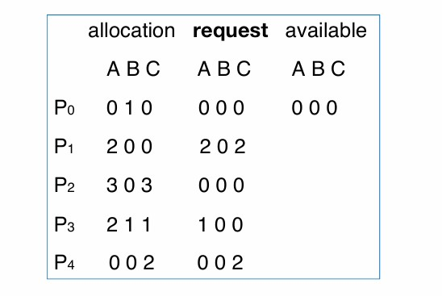

# Chapter11 Deadlocks

***

## 11.1 Deadlock Problem

死锁指的是一组进程中，每一个进程都持有一定的资源，但又都请求其他进程持有的资源，于是所有的进程都跑不了。

死锁与starvation的关系是，starvation只针对一个进程，如果所有的进程都处于starvation，即为死锁。

大多数OS并不预防或者处理死锁。

!!! Example
    例如：在下图的代码中有两个锁和两个线程。假如第一个线程执行`pthread_mutex_lock(&first_mutex);`，同时第二个线程执行`pthread_mutex_lock(&second_mutex);`，则两个锁同时被上锁；接下来，第一个线程会在`pthread_mutex_lock(&second_mutex);`等待第二个锁，而第二个线程会在`pthread_mutex_lock(&first_mutex);`等待第一个锁，二者都无法继续执行。

    

二者关系可用**resource allocation graph**来表示：

***

## 11.2 System Model

**system model：**

记资源为$R_1,R_2,···,R_m$，每一个$R_i$表示不同的资源类型，如CPU，内存，I/O设备等，每一个$R_i$又可以再分为$W_i$个instance，如打印机为一个$R_i$，但可用的打印机数量为$W_i$。

进程对于资源的使用分为以下三种模式：

* request
* use
* release

**死锁的四个条件：**

* **mutual exclusion：** 互斥，资源的instance一次只能被一个进程使用
* **hold and wait：** 进程持有资源时会等待其他资源，而这些资源被其他进程持有
* **no preemption：** 资源无法抢占，只能在持有的进程完成任务后被主动释放
* **circular wait：** 进程之间的相互依赖与等待形成闭环

**resource allocation graph：**

两种节点：

* 方形节点表示资源种类$R_1,R_2,···,R_m$
* 圆形节点表示进程$P_1,P_2,···,P_n$

两种边：

* request edge：$P_i\rightarrow R_j$，表示进程请求某种资源
* assignment edge：$R_j\rightarrow P_i$，表示资源正在被某些进程占用

!!! Note
    方形节点中的小方框表示该资源拥有的实例。

!!! Example
    **例一：**  
      
    $P_1$占用$R_2$的一个实例，等待$R_1$；  
    $P_2$占用$R_1$的一个实例和$R_2$的一个实例，等待$R_3$；  
    $P_3$占用$R_3$的一个实例。  
    不存在死锁。  

!!! Example
    **例二：**  
      
    存在死锁。  

!!! Example
    **例三：**  
      
    不存在死锁。  
  可以先执行$P_2$和$P_4$，然后执行$P_3$和$P_1$。  

综上：

* 图中无环路：没有死锁
* 图中有环路：
  * 环路中每个资源只有一个instance：死锁
  * 环路中有资源有不止一个instance：可能死锁

***

## 11.3 Handling Deadlocks

### Prevention

打破死锁的四个条件。

防止mutual exclusion：

对于可共享的资源不需要保持互斥，但对于不可共享的资源需要保持互斥。

防止hold and wait：

要求进程在执行之前不占用任何资源，先请求所有需要的资源；如果拿不全所有需要的资源，则释放掉所有手头上的资源。

但是这样会导致资源的利用率低下，容易造成starvation。

防止no preemption：

如果一个进程请求的资源不可用，则其会释放当前占用的所有资源，这些被释放的资源会被进程记录下来，以便后续重新请求，该进程只有得到所有请求的资源后才能重新开始执行。

依然会有starvation。

防止circular wait：

对资源进行排序，规定进程在请求资源时要按照顺序，例如进程已经持有了$R_i$，就不能去请求$R_1\sim R_{i-1}$，只能请求$R_{i+1}\sim R_m$。这样就不可能形成环路。

现在很多OS采用这种策略，是打破四个条件中最常见的。但问题是进程的需求是不确定的，可能某个进程占用$R_2$后才发现其需要$R_1$。

!!! Example
      
    上面的代码实现了从一个账户转账到另一个账户。如果我们给两个账户的锁进行排序，则其只能满足单向的转账。  

### Avoidance

计算会不会出现死锁，具体需要计算每个进程请求哪些资源，以保证系统不会进入环路。

但只是理论上的，因为需要提前计算。

资源分配的状态包括：

* 可用的和已被分配的资源数量
* 进程的最大需求

**safe state：**

系统所处的一个状态，所有的进程都能请求到资源，并被满足。其需要在一开始被计算。

safe state能够保证一定没有死锁，但就算是unsafe state也不一定会有死锁，因为是否安全的界限划分是按照进程所需资源的最大值来计算的，相当于是最坏情况。

!!! Example
    假设总共12个资源，当前可用3个，三个进程的占用情况和需求如下：  

    $~$|max need|current have|extra need  
    ---|---|---|---  
    $P_0$|10|5|5  
    $P_1$|4|2|2  
    $P_2$|9|2|7  

    安全序列为：$P_1\rightarrow P_0\rightarrow P_2$

    $P_1$还需2个，剩余可用的有3个，因此满足要求，$P_1$先执行，执行完后返回占用的资源，此时剩余可用的有5个，其满足$P_0$需求，因此$P_0$接着执行，执行完释放资源后剩余可用的有10个，最后执行$P_2$。

    若一开始剩余可用的资源只有2个，则不存在safe state，因为执行完$P_1$后剩余可用的资源只有4个，无论是$P_0$还是$P_2$都满足不了。

**Single-instance Deadlock Avoidance：**

如果每种资源都只有一个instance，则使用resource allocation graph计算解决。

加入新的一种边：**claim edge**

$P_i\rightarrow R_j$，表示进程$P_i$可能会用到$R_j$，用虚线表示。

当进程向资源发出请求时，claim edge转化成request edge。

当资源被分配给进程时，request edge转化成assignment edge。

当资源被进程释放后，assignment edge转化成claim edge。

引入claim edge之后，如果将claim edge转化成assignment edge后也不会形成环路，则说明处于safe state。

!!! Example
    

    如上图，其转化后会成环，因此不是safe state。

**Banker's Algorithm：**

如果资源可能有多个instance，则使用banker's algorithm解决。

!!! Example
    与之前的例子类似，只不过现在有三种资源$A$，$B$，$C$，分别有10、5、7个实例。经过计算，执行顺序可以为$P_1\rightarrow P_3\rightarrow P_4\rightarrow P_2\rightarrow P_0$，因此是safe state。

    

### Detection

在系统已经进入死锁的状态下检测出来。

**Single Instance Resources：**

若资源都只有单一实例，则使用**wait-for graph**来进行检测。

wait-for graph是在原本resource allocation graph的基础上进行修改的，将全部的资源节点移除，将进程节点直接相连，如下图所示：

每隔一段时间都需要使用检测算法检测wait-for graph，如果出现回路则说明存在死锁，这个算法的时间复杂度是$O(N^2)$。

**Multi-instance Resources：**

若有资源有多个实例，则使用与banker's algorithm类似的方法检测，不同之处在于一开始没有剩余可用的资源，而是全部分配好，检查是否可以顺利执行。

!!! Example
    

    可以按照$P_0\rightarrow P_2\rightarrow P_3\rightarrow P_1\rightarrow P_4$的顺序执行，但假设$P_2$的request变成0 0 1，则出现死锁。

### Recovery

将系统从死锁中恢复，有以下两种方法：

**OptionⅠ：**

* 结束所有死锁的进程
* 一个一个结束，直到没有死锁

**OptionⅡ：**

选择一个进程释放资源，让其等待。