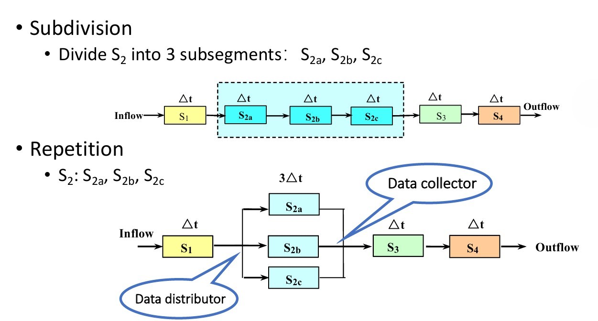

# Chapter2 Pipelining

***

## 2.1 What is Pipelining

**Three Modes of Execution：**

* **Sequential Execution 顺序执行**

* **Single Overlapping Execution 单重叠执行**

* **Twice Overlapping Execution 双重叠执行**

当IF阶段时长很短时，IF阶段和ID阶段可以合并，双重叠变成单重叠。

**Pipelining 流水线：**

一种指令重叠执行的实现，划分出来的阶段称为**stage/segment**，阶段数称为流水线的**depth**。

**Characteristics of Pipelining：**

流水线将一个进程划分为多个子进程，每一个由一个功能单元执行。

流水线每个阶段的时长应尽可能相等，否则容易阻塞中断，最长的阶段为流水线的**bottleneck**。

每一个功能单元需要一个**pipelining register（latch）**。

流水线适用于大量、重复、顺序执行的进程，只有任务源源不断地进入流水线时，其效率才能最大化。

* **pass time 通过时间：** 第一个任务从进入流水线到结束（流水线充满）的时间
* **empty time 排空时间：** 最后一个任务从进入流水线（流水线开始空闲）到结束的时间

***

## 2.2 Classes of Pipelining

**分类一：**

* **single function pipelining 单功能流水线：** 只能实现单一功能，比如加法之类的
* **multi function pipelining 多功能流水线：** 可以实现多种功能，比如既能加法又能乘法之类的

**分类二：**

* **static pipelining 静态流水线：** 不同功能的指令无法重叠
* **dynamic pipelining 动态流水线：** 不同功能的指令可以重叠

**分类三：**

* **component level pipelining 算术逻辑层级流水线：** 将处理器的算术逻辑运算划分为不同阶段，比较少见
* **processor level pipelining 指令级流水线：** 通常认知里的流水线
* **inter processor pipelining 宏流水线：** 将完整任务分成若干部分，由不同处理器或处理器的各个核分别执行，最后汇总

**分类四：**

* **linear pipelining 线性流水线：** 没有回环，指令从头到尾执行，即从第一个阶段依次执行到最后一个阶段
* **nonlinear pipelining 非线性流水线：** 可能有回环，比如做到第三个阶段需要某个器件，而这个器件出现在第一个阶段，因此需要回到第一个阶段，会产生很多冲突，需要调度

**分类五：**

* **ordered pipelining 循序流水线：** 指令流入流水线和流出流水线的相对顺序不变
* **disordered pipelining 乱序流水线：** 指令流入流水线和流出流水线的相对顺序改变，比如晚流入流水线的任务反而会先流出流水线

**分类六：**

* **scalar processor 标量处理器：** 处理标量
* **vector processor 矢量处理器：** 处理矢量（GPU）

***

## 2.3 An Implementation of Pipelining

五级流水线：**IF，ID，EXE，MEM，WB**

* IR寄存器：保存指令
* NPC寄存器：保存下一条指令地址
* A寄存器和B寄存器：保存两个操作数
* ALU output寄存器：保存ALU计算的结果（数据或者地址）
* Cond寄存器：保存比较信号
* LMD寄存器：保存访存结果

***

## 2.4 Performance Evaluation of Pipelining

**Single-Cycle vs. Pipelined Performance：**

时钟周期：

单周期：看total time的最大值，为800ps。

流水线：看五个阶段的最大值，为200ps。

总执行时间：

考虑连续3条`load`型指令。

单周期：

$$800*3=2400$$

流水线：

$$200*7=1400$$

### Throughput(TP) 吞吐量

单位时间内完成的指令数。

$$TP=\frac{n}{T}$$

其中，$n$为指令数，$T$为总时长。

对于上图所示的最佳重叠，$m$为流水线的深度，假设每个阶段耗时均为$\Delta t_0$，则总时长

$$T=(m+n-1)\Delta t_0$$

因此，得到吞吐量

$$TP=\frac{n}{(m+n-1)\Delta t_0}$$

当$n\gg m$时，$TP$趋向于上界

$$TP_{max}=\frac{1}{\Delta t_0}$$

若$m$阶流水线中，每个阶段的时长不等，分别为$\Delta t_1,\Delta t_2,···,\Delta t_m$。

则$TP$应该修正为

$$TP=\frac{n}{\sum\limits_{i=1}^m\Delta t_i+(n-1)\max\\{\Delta t_1,\Delta t_2,···,\Delta t_m\\}}$$

$TP_{\max}$应该修正为

$$TP_{\max}=\frac{1}{\max
\\{\Delta t_1,\Delta t_2,···,\Delta t_m\\}}$$

$\max
\\{\Delta t_1,\Delta t_2,···,\Delta t_m\\}$被称为流水线的**bottleneck**，对应的阶段为**bottleneck segment**。

解决bottleneck可以使用：

* **subdivision 再细分：** 将bottleneck segment再细分为更多更小的阶段
* **repetition 重复：** 添加bottleneck segment对应的功能单元

以下为repetition对应的时空图：

### Speedup(Sp) 加速比

对于相同数量的指令，单周期总耗时与流水线总耗时的比值。

$$Sp=\frac{T_{single}}{T_{pipeline}}$$

假设有$n$条指令，分为$m$个阶段，每个阶段时长均为$\Delta t_0$，则单周期总耗时

$$T_{single}=n m\Delta t_0$$

流水线总耗时

$$T_{pipeline}=(m+n-1)\Delta t_0$$

因此，得到加速比

$$Sp=\frac{nm}{m+n-1}$$

当$n\gg m$时，$Sp\rightarrow m$。

### Efficiency(η) 效率

时空资源利用的比率，可理解为时空图中阶段方块与完整矩形面积的比值。

$$\eta=\frac{nm\Delta t_0}{m(m+n-1)\Delta t_0}=\frac{n}{m+n-1}$$

当$n\gg m$时，$\eta\rightarrow 1$。

!!! Example
    **如下图所示为静态双功能流水线：**

    

    **其中，$1\rightarrow 2\rightarrow 3\rightarrow 5$是加法流水线，$1\rightarrow 4\rightarrow 5$是乘法流水线，每个阶段时长均为$\Delta t$。**
    **现在有两个向量$\vec{A}=(a_1,a_2,a_3,a_4)$，$\vec{B}=(b_1,b_2,b_3,b_4)$，利用该流水线求$\vec{A}\cdot\vec{B}$，计算$TP$，$Sp$和$\eta$。**

    

    由于是静态流水线，因此不同功能的指令无法重叠

    $$TP=\frac{7}{15\Delta t}=\frac{0.47}{\Delta t}$$

    $$Sp=\frac{4\times 3\Delta t+3\times 4\Delta t}{15\Delta t}=1.6$$

    $$\eta=\frac{4\times 3\Delta t+3\times 4\Delta t}{5\times 15\Delta t}=32\%$$

    **现在假设流水线是动态的，即不同功能的指令可以重叠：**

    

    **其中，$1\rightarrow 3\rightarrow 4\rightarrow 5$是加法流水线，$1\rightarrow 2\rightarrow 5$是乘法流水线，阶段二的时长变为$2\Delta t$。**

    

    $$TP=\frac{7}{18\Delta t}$$

    $$Sp=\frac{4\times 4\Delta t+3\times 4\Delta t}{18\Delta t}=1.56$$

    $$\eta=\frac{4\times 4\Delta t+3\times 4\Delta t}{5\times 18\Delta t}=31\%$$

**Why Pipelining：**

减少总体的运行时间，提高TP和η。

如果流水线的阶段划分过多，则复杂度大幅提升，控制逻辑更加庞大，需要的中间寄存器也更多。

在流水线工作时，以下因素会影响到其效率：

* 总有阶段处于空闲状态，因为对应的指令不需要使用此处的硬件
* 流水线开始启动的时候也有阶段处于空闲状态
* bottleneck的限制
* 指令切换时要清空流水线
* 上下指令的数据依赖性
* 寄存器延迟和时钟偏差的开销