

# Chapter3 Hazard

***

## 3.1 Structural Hazard 结构冲突

**Problem：**

某个硬件资源在一个周期内被多条指令请求。

!!! Example
    在同一个时钟周期内访问内存（一条指令取数据，一条指令取指令），但在冯诺依曼架构下，指令内存和数据内存为同一个，只有一个输出端。  

    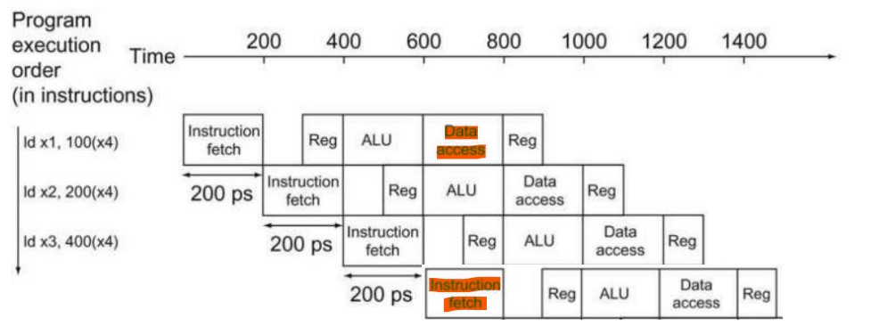

**Solution：**

* 让指令轮流使用硬件资源，部分指令需要stall；
* 增加硬件资源（一直可以解决结构冲突）。

***

## 3.2 Data Hazard 数据冲突

**Problem：**

某条指令的操作与前面指令的读写结果相关联。

!!! Example
    `add x1,x2,x3`  
    `sub x4,x1,x5`  
    `sub`指令的`x1`寄存器的值需要`add`指令先计算出来。  

    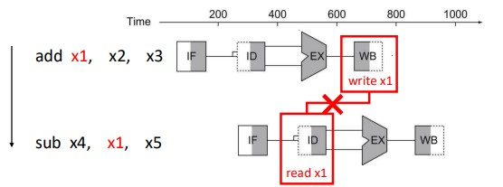

**Solution：**
  
使用**forwarding 前递**，增加额外硬件，提前取出接下来需要的数据。

### 简单数据冲突

**Detecting：**

* 前一条指令的目的操作数和后一条指令的源操作数冲突  
  `EX/MEM.rd==ID/EX.rs1`（相邻R-type）  
  `EX/MEM.rd==ID/EX.rs2`（相邻R-type）  
  `MEM/WB.rd==ID/EX.rs1`（隔一行的R-type或Load）  
  `MEM/WB.rd==ID/EX.rs2`（隔一行的R-type或Load）  
* 上一条指令涉及写回（例如其他没有冲突的指令，其译码出的立即数也可能恰好等于后面指令的源操作数，从而引发冲突信号）  
  `EX/MEM.we_reg==1`（相邻R-type）  
  `MEM/WB.we_reg==1`（隔一行的R-type或Load）  
* `rd`不为`x0`（无效写入）  
  `EX/MEM.rd!=0`（相邻R-type）  
  `MEM/WB.rd!=0`（隔一行的R-type或Load）  

**Forwarding Paths：**

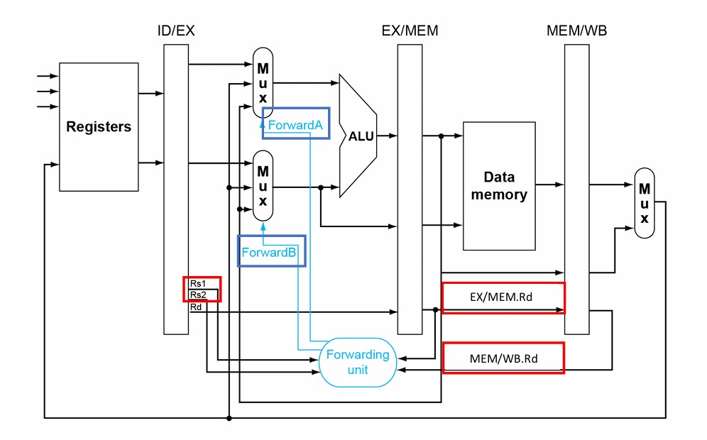

**Forwarding Conditions：**

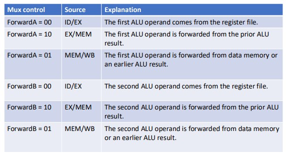
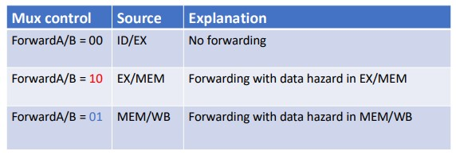

!!! Example
    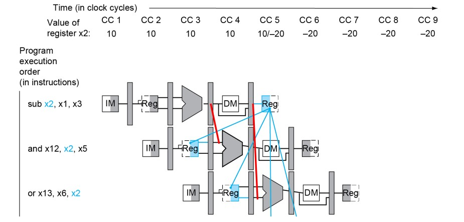  

    第一条指令和第二条指令：**EX冲突**  
    `(EX/MEM.rd==ID/EX.rs1)&&(EX/MEM.we_reg==1)&&(EX/MEM.rd!=0)`  
    对应选择：`ForwardA==10`  

    第一条指令和第三条指令：**MEM冲突**  
    `(MEM/WB.rd==ID/EX.rs1)&&(MEM/WB.we_reg==1)&&(MEM/WB.rd!=0)`  
    对应选择：`ForwardA==01`  

### 双重数据冲突

`add x1,x1,x2`  
`add x1,x1,x3`  
`add x1,x1,x4`  

与之前情况不同的是，第三条指令的`rs1`在第一条和第二条指令中均作为`rd`存在，倘若使用上面的判断方法，则会同时触发EX冲突和MEM冲突，但实际上需要的是来自第二条指令的结果，因此，有必要引入新的判断条件来处理双重数据冲突：**出现MEM冲突的同时不能有EX冲突，否则MEM冲突不成立**。

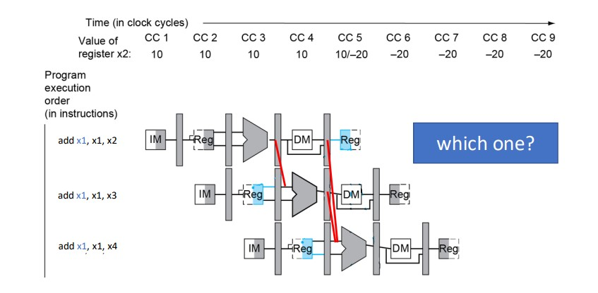

**对MEM冲突判断的修正：**

`(MEM/WB.rd==ID/EX.rs1)&&(MEM/WB.we_reg==1)&&(MEM/WB.rd!=0)&&not[(EX/MEM.rd==ID/EX.rs1)&&(EX/MEM.we_reg==1)&&(EX/MEM.rd!=0)]`

!!! Note
    中括号内是EX冲突的判断条件，请注意前面的`not`。  

**Forwarding Paths：**

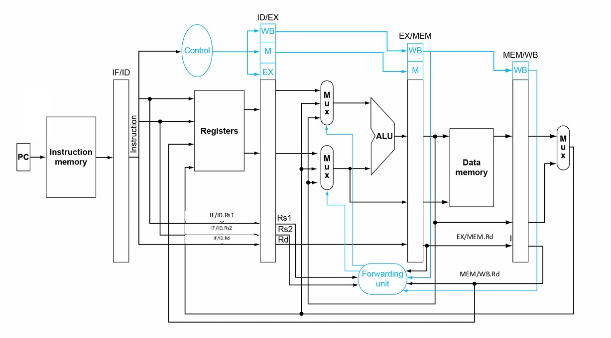

### Load数据冲突

`ld x2,20(x1)`  
`and x4,x2,x5`

此时的情况又与之前不同，`ld`指令载入`x2`的数据要在MEM阶段运行结束后得到，但下一条`and`指令同时进入EXE阶段，`x2`的数据要作为运行开始的输入，二者产生无法用forwarding解决的矛盾，因此：针对这种情况要有新的判断，解决方法为**stall一个时钟周期**。

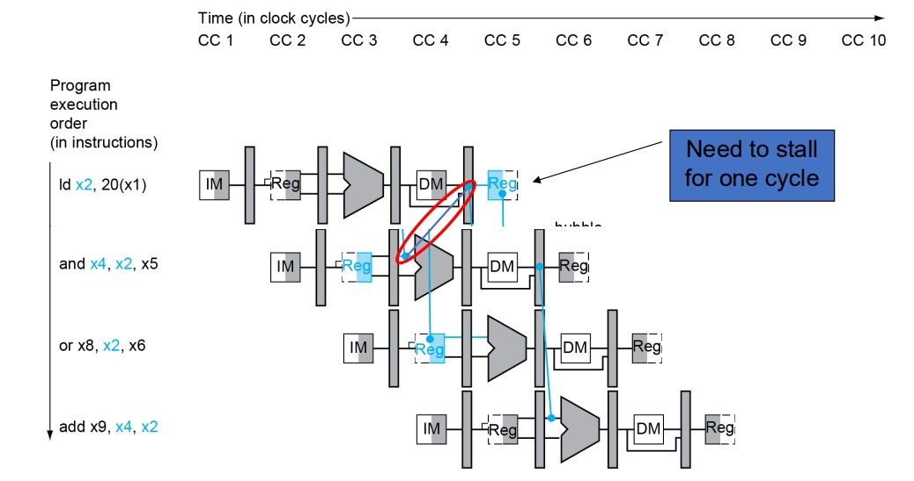

**判断修正：**

`(ID/EX.MemRead==1)&&(ID/EX.rd==IF/ID.rs1)`

* 第一个判断点：上一条指令是load指令
* 第二个判断点：前后两条指令使用的寄存器相同

!!! Note
    此时信号取`ID/EX.rd==IF/ID.rs1`而不是`EX/MEM.rd==ID/EX.rs1`的原因：  
    如果是后者，那么判断在`and`指令的EX阶段给出，错误的数据已经在ALU中计算出来并等待下一个时钟周期流到EX/MEM寄存器，当判断在下一个时钟周期上升沿起到stall的作用时，这一瞬间错误的计算结果会传入EX/MEM寄存器，所以会导致stall没起到拦截的作用。  

    不需要判断`ID/EX.rd!=0`的原因：  
    load指令不会将数据载入`x0`寄存器。  

    不需要判断`ID/EX.we_reg==1`的原因：  
    load指令的寄存器写使能信号一直为0。  

**stall具体操作：**

* 将ID/EX寄存器置为0
* 将IF/ID寄存器置为原本ID/EX寄存器的内容（Using instruction is decoded again）
* 将pc的值置为`and`指令的下一条指令（Following instruction is fetched again）

stall一个周期之后可以与之前一样使用forwarding。

**Forwarding Paths：**

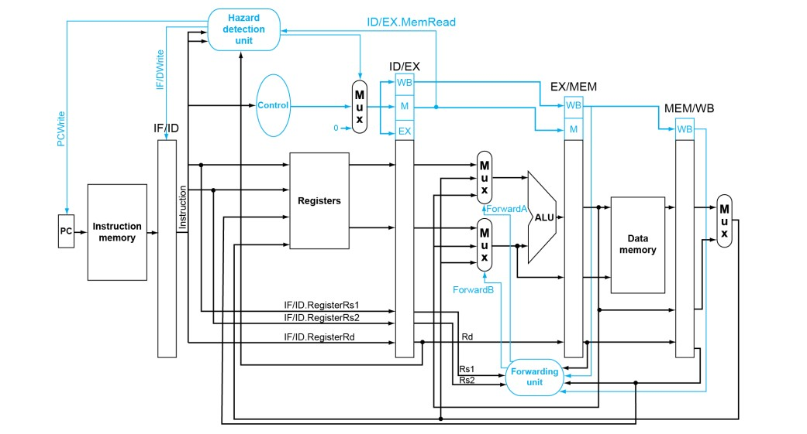

**软硬协同：** 

stall时不一定要补一个bubble，可以把接下来某一个完全独立的指令先拿过来执行一下，防止影响性能效率。

***

## 3.3 Control Hazard 控制冲突

**Problem：**

遇到需要跳转的指令（B型或J型），影响指令的执行流。

!!! Example
    `beq`指令在EXE阶段才会出来结果，决定是否跳转，但在这之前已经有新的指令载入。 

    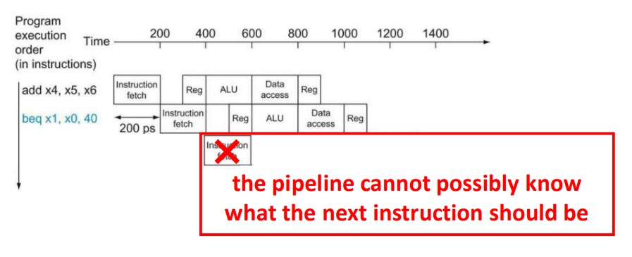

**Solution：**

当遇到Branch指令时，在其跳转结果出来之前都不再载入新的指令。

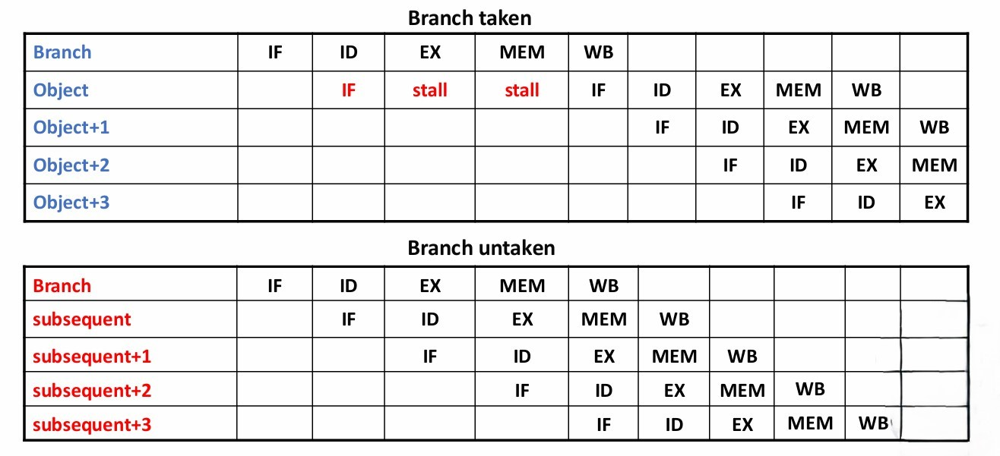

假如Branch指令在MEM阶段得到结果，这样会导致很多的stall，因此还可以考虑在ID阶段增加硬件（target address adder和register comparator），提前进行比较。在ID阶段得到结果不需要stall。

**Forwarding Paths：**

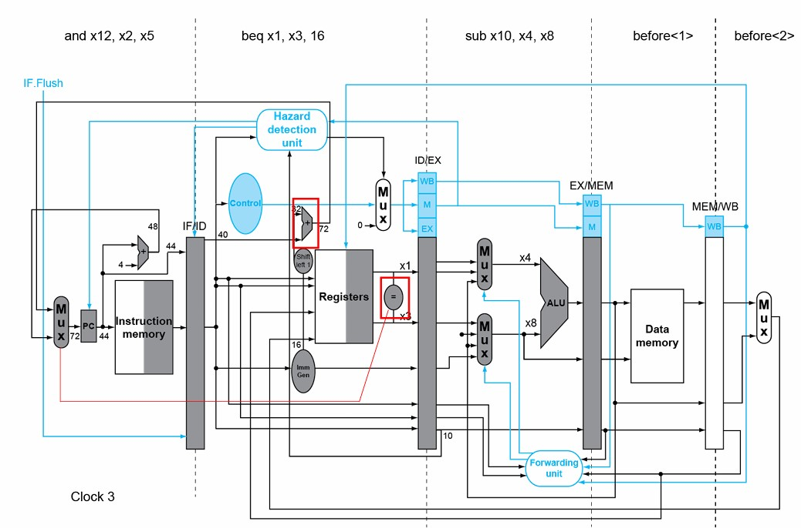

**Data Hazards for Branches：**

如果将分支判断提前到ID阶段，则之前的数据冲突的解决方法不再适用，因为之前的源操作数在EX阶段才使用，这里相当于又提前了一个周期。

当Branch指令的上上条指令、上上上条指令为R-type，且目标操作数与源操作数一致时，则依然可以用forwarding解决。

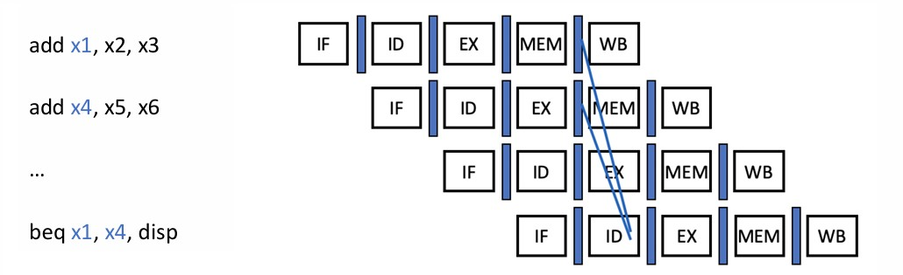

当Branch指令的上一条指令为R-type，或者上上条指令为Load，且目标操作数与源操作数一致时，无法直接forwarding，需要一个stall。

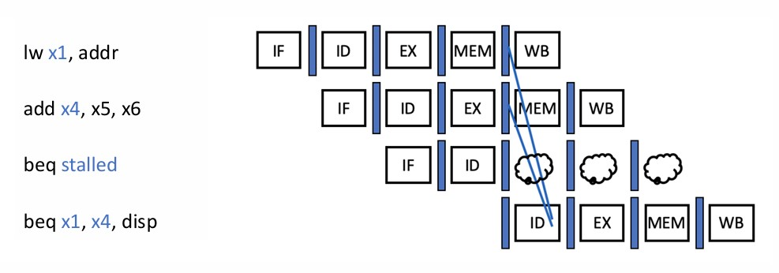

当Branch指令的上一条指令为Load，且目标操作数与源操作数一致时，无法直接forwarding，需要两个stall。

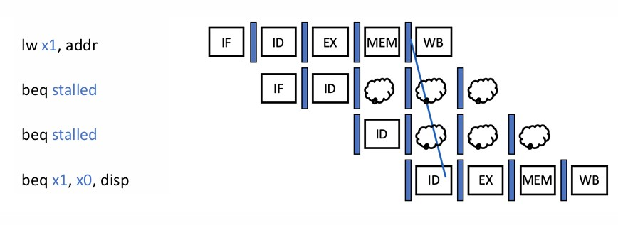

综上，就算硬件实现在ID阶段就进行分支跳转的检测，当遇到数据冲突时依然有可能需要stall，只是减少了stall的数量而已。

**Branch Delay Slot：**

对Branch指令的分支跳转进行预测，只有预测失败才会stall。在RISC-Ⅴ中，一般预测不会跳转，也就是Branch指令之后的指令依然流入流水线。

假如我们如上进行预测，当结果为需要跳转时，Branch指令的下一条指令已经进入了流水线，如果将其stall住，则相当于浪费了一个周期。

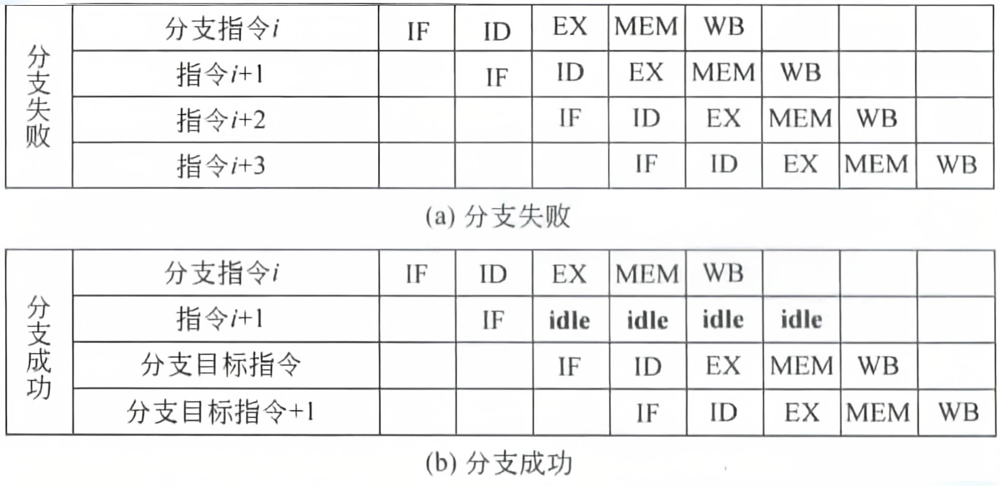

因此，我们的考虑是，既然Branch指令进入流水线到出现分支跳转结果前，一定有接下来的指令会流入流水线，无论是否正确，那么，为什么不在Branch指令之后放一些无论如何都要执行的指令呢？

于是设置延迟槽，无论之后是否需要跳转，延迟槽里的指令都会在Branch指令之后进入流水线。

以下为三种延迟槽的调度方法：

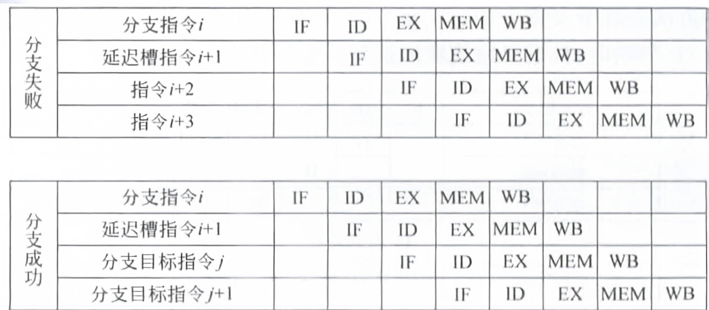

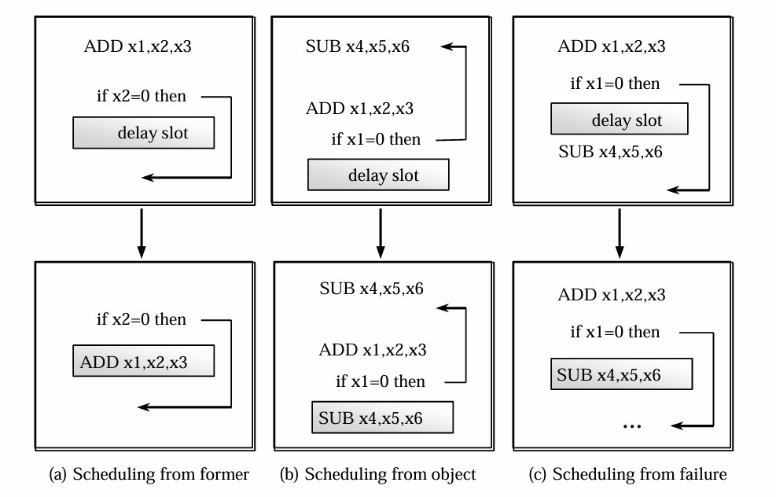

**Dynamic Branch Prediction：**

* 每次执行Branch指令时，将是否跳转以及跳转地址等信息储存在**branch history table**中
* 当下一次遇到Branch指令时，会根据branch history table上一次的记录来作出预测，并预取对应的指令
* 如果预测错误，则flush掉流水线并修改branch history table

**1-Bit Predictor：**

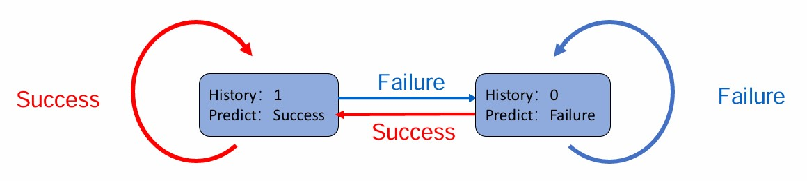

!!! Note
    这里的success指的是发生跳转，failure指的是不发生跳转。

但是，在以下情况时，1-bit predictor一定预测错。考虑双重循环，内循环的最后一次判断一定会出错，因为之前一直判断仍然跳转到内循环，但最后一次判断会跳出内循环，继续到外循环；内循环的第一次判断也一定会出错，因为上一次刚从内循环跳出。

**2-Bit Predictor：**

只有连续两次预测出错才会改变预测。

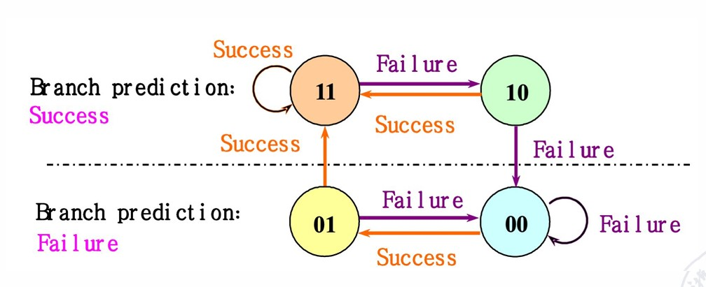

这样，针对上面双重循环的例子，只会有一次预测出错，即内循环的最后一次判断。

**Branch-Target Buffers：**

类似于一个缓存，index为之前出现过的Branch指令，content为对应的B型指令上一次的跳转地址（或者PC+4）。当下一次有Branch指令时，可以查表来进行预测，有利于减少重复计算的时延。

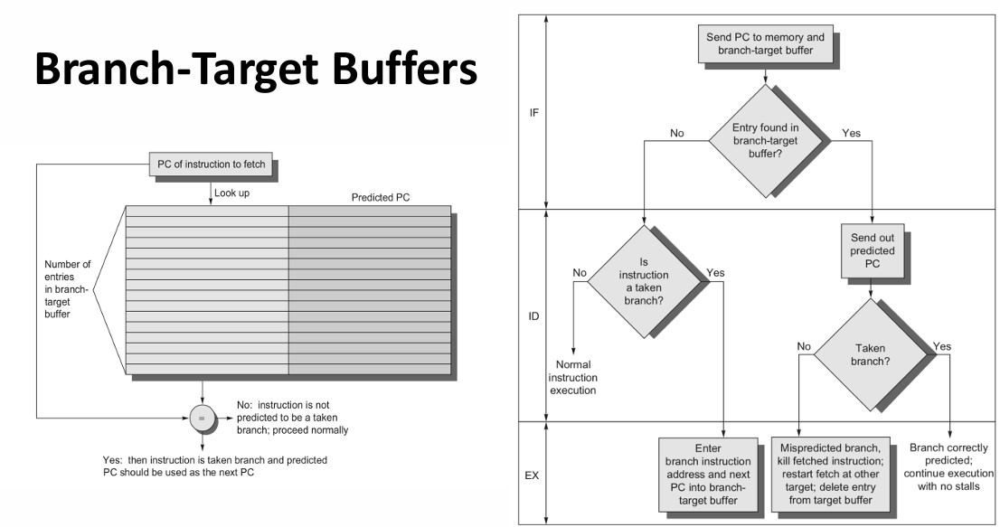

**Integrated Instruction Fetch Units：**

整合以下功能：

* 分支预测
* 指令预取
* 指令访存和缓冲