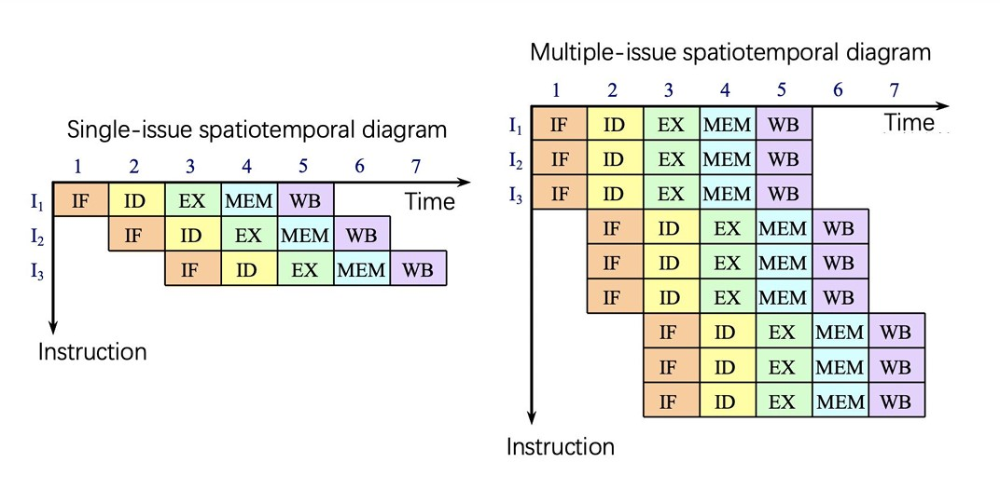
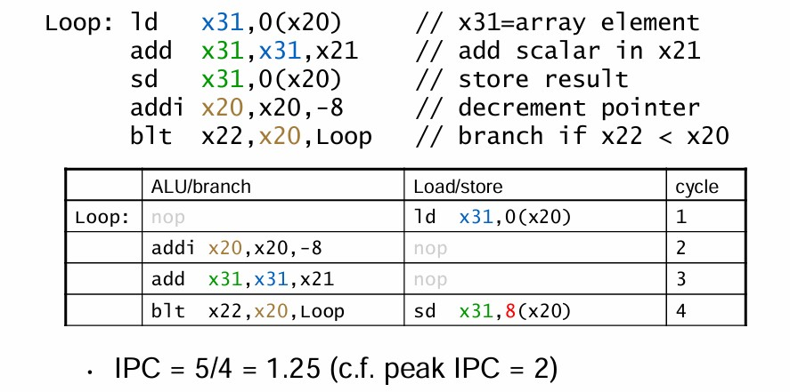
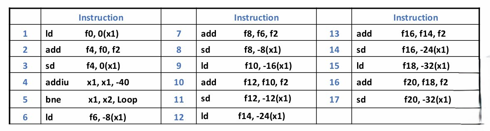

# Chapter4 Inst Scheduling

***

## 4.1 Scheduling of Nonlinear pipelining

**Reservation Table 预约表：**

给出一张非线性流水线的示意图，我们无法确定一条指令的执行要经过哪些阶段，具体的执行顺序如何，因此，需要预约表辅助说明。

如上图，预约表的横向为时钟周期，纵向为阶段，可以看出，一条指令需要7个时钟周期，且在第二个时钟周期同时经过阶段$S_2$和$S_3$。结合示意图和预约表，可知一条指令的执行顺序为：

$$S_1\rightarrow\begin{pmatrix}
    S_2\\
    S_3
\end{pmatrix}\rightarrow S_4\rightarrow S_1\rightarrow S_2\rightarrow S_3\rightarrow S_1$$

***

## 4.2 How to Schedule Nonlinear Pipeline

**initial conflict vector$\rightarrow$conflict vector$\rightarrow$state transition graph$\rightarrow$circular queue$\rightarrow$shortest average interval**

以下面预约表所对应的五级非线性流水线为例：

**Initial Conflict Vector 初始冲突向量：**

初始冲突向量从预约表导出，表征指令对资源的互相占用情况。

第一条指令的资源占用情况正如预约表所示。假如下一条指令相差1个周期进入（T=2），则在T=3时会和上一条指令冲突；假如下一条指令相差2个周期进入（T=3），不会和上一条指令冲突；假如下一条指令相差3个周期进入（T=4），则也不会和上一条指令冲突……

从相差1个周期到相差8个周期（由于一条指令需要9个周期，因此相差9个周期开始完全不重叠，无需考虑），我们发现相差1、5、6、8个周期时会冲突，因此，这些数字构成**prohibit set 禁止集**：

$$F=\\{1,5,6,8\\}$$

初始冲突向量表示初始情况下的下一条指令有哪些间隔数是不可行的。第$i$位若为1，则表示当前情况下在相差$i$个周期时进入下一条指令会冲突。记一条指令所需周期数为$N$，则（初始）冲突向量有$N-1$位。在本例中：

$$C_0=(10110001)$$

!!! Note
    最右边是第1位，对应相差1个周期。

**Conflict Vector 冲突向量：**

每一个时钟周期都有一个对应的冲突向量，表示在当前情况下哪些间隔数放下一条指令会冲突。我们也可以将其记为**CCV=current conflict vector**。

$1\rightarrow$表示进入第一条指令，此时对于第一条指令，对应冲突向量即为初始向量，而因为当前只有只有一条指令，因此CCV也即为初始向量。

接下来，我们需要确定相差多少个周期可以进入第二条指令。确定的依据是CCV，发现其第2、3、4、7位为0，说明相差2、3、4、7个周期进入第二条指令不会引起冲突，有多个选择，我们暂时采用贪心的策略，相差2个周期进入第二条指令。

第二条指令的冲突向量为初始冲突向量，但第一条不是，因为相差的2个周期（第一条指令运行了2个周期），因此其对应的冲突向量需要更新，右移2位，得到$(00101100)$。于是，我们可以得知：当第三条指令相差1、5、6、8个周期进入时，会和第二条指令冲突；相差3、4、6个周期进入时，会和第一条指令冲突。两个冲突向量按位或，得到CCV为$(10111101)$，即当第三条指令相差1、3、4、5、6、8个周期进入时，会和当前流水线中的指令冲突。

以此类推，由CCV可知，第三条指令只能相差2或7个周期进入，这里相差2个周期进入，类似的方法可以得到CCV。

第四条指令只能相差7个周期进入，我们发现得到的CCV和初始的CCV（即初始冲突向量）一致，那么接下来将进入循环。

综上，我们得到的一种调度方式是2，2，7，即循环相差2，2，7个周期放入指令。

!!! Note
    事实上，每进入一条新的指令，并不需要按照已有指令右移→按位或得到CCV→确定接下来可行的间隔来计算，而是可以直接将CCV右移来计算。详情见state transition graph。  

    CCV并不需要变成初始冲突向量才意味着完成一轮循环，变成之前出现过的也可以。详情见state transition graph。

**State Transition Graph 状态转移图：**

画状态转移图的步骤可归纳如下：

* 画出初始冲突向量$(10110001)$

* 由初始冲突向量可知间隔可为2、3、4、7，分别右移对应的位数可得$(00101100)$、$(00010110)$、$(00001011)$、$(00000001)$，分别再与初始冲突向量按位或得到$(10111101)$、$(10110111)$、$(10111011)$、$(10110001)$，画出对应的箭头

* 再对每个新的冲突向量进行类似的操作，直到没有新的冲突向量产生（找可行间隔→分别右移→与初始冲突向量按位或）

**Circular Queue 循环队列：**

找到状态转移图中所有的环路：

可以计算得到平均间隔最短为3.5，对应的循环队列为3，4（4，3）。

***

## 4.3 Multiple Issue

**Instruction-Level Parallelism(ILP) 指令并行性：**

提高指令并行性的方法：

* 增加流水线的深度：划分更多阶段，使用更短周期
* 多发射：多条流水线同时工作，同一周期内同时开始执行多条指令，此时CPI<1，因此更多使用其倒数IPC

**Multiple Issue 多发射：**

多发射可分为：

* 静态多发射：  
  由**编译器**决定一个时钟周期内发射几条、哪几条指令，把要发射的指令包装到issue slots里（包内没有依赖性，包之间可能存在依赖性）  
  由编译器处理冲突  
* 动态多发射：  
  由**CPU**决定一个时钟周期内发射几条、哪几条指令
  由CPU处理冲突  
  编译器可协助对指令进行重排序，但也可完全不参与  

**Speculation：**

预测在多发射中很常见，目的是尽早开始操作，如果预测正确则继续执行，否则重新开始。

在Branch指令中要进行预测，预测分支是否跳转，跳转到哪里；在Load指令中也要进行预测，因为涉及到缓存，要载入的内容是否在缓存中是不确定的。

预测可以是compiler speculation（静态猜测），例如调整指令顺序，引入弥补错误预测的修正指令等。

预测也可以是hardware speculation（动态预测），例如预取指令，将预测执行的结果存于buffer中，直到被确认才保存，预测失败则刷新buffer等。

**Superscalar 超标量：**

一种多发射处理器。

每个时钟周期发射的指令数不固定，取决于代码的性质，有上界。

若上界为n，则被称为n-issue。

可以被静态或动态实现，现在的大部分处理器都使用超标量。

**Very Long Instruction Word(VLIW) 超长指令字：**

一种多发射处理器。

每个时钟周期发射的指令数固定（4-16），这些指令被合并到一起，组成一条超长指令。例如如果是4发射，则取出四条32位指令，拼成128位，一起发射。

指令调度由编译器静态执行，支持功能有限，主要用于数字信号处理领域。

**Super-Pipeline 超流水线：**

流水线的每个阶段被进一步划分，但时钟周期并没有因此缩短（与更深的流水线的区别），只是在这个周期内发射不同步而已。若每个时钟周期能进入$n$条指令，则这$n$条指令并不是同时发射，而是每$\frac{1}{n}$个周期发射一条指令。

下图为$n=2$时的超流水线：

下图为$n=3$时的超流水线：

下图为普通流水线、超标量、超长指令字和超流水线的比较：

**Multi-issue Technology Based on Static Scheduling 基于静态调度的多发射技术：**

以超标量为例。

指令按照顺序流出，同时进行冲突检测，以保证流水线没有冲突。例如：对于一个4-issues的静态调度的超标量处理器，在取址阶段，流水线会从取址元件处得到1-4条指令（issue packets）。然后检测。在一个时钟周期内，这些指令可能全部流出，也可能只有部分流出。

冲突检测实际分成两个阶段：

* 第一阶段：在指令流出时进行检测，选择能被发射的指令
* 第二阶段：在执行过程中检测

假设每个周期流出两条指令，一条整数指令+一条浮点数指令。假设浮点数指令的EX阶段需要两个时钟周期。

我们需要对硬件进行修正。

两条浮点数指令的EX阶段看似有结构冲突，但EX阶段分两个周期，每个周期使用的硬件不同，所以实际上没有结构冲突。

访存的结构冲突通过增加新的内存接口来解决。

**RISC-V with Static Dual Issue：**

一个包里最多放两条指令，一条ALU/Branch指令，另一条Load/Store指令。

考虑如下指令：

`add x10,x0,x1`  
`ld x2,0(x10)`

这时候不能将其放入一个包内。当指令很多时，会有更多类似的冲突，因此需要编译器进行指令重排。

!!! Example
    

**Loop Rolling：**

对于循环，可以考虑将其重复展开，以获得更多并行的可行性。

具体的实现需要对每次重复的寄存器重命名。

!!! Example
    仍以之前的循环为例，考虑以四次循环为单位展开：  

    

    原本的`x31`只是作为一个中间变量使用，因此可以使用寄存器重命名，为`x30`，`x29`，`x28`。

**VLIW：**

!!! Example
    假设VLIW处理器每个周期能同时处理5条指令：2条访存指令 + 2条浮点数指令 + 1条整数/Branch指令。给定待执行的指令序列：

    

    则将其改变顺序并打包，得到：

    

    相关计算：

    总共运行8个时钟周期  
    每个阶段平均需要1.6个时钟周期（8/5）  
    每个时钟周期平均执行2.1条指令（17/8）  
    一共有40个**operating slots**（5*8），利用率为42.5%（17/40）  

存在的问题：

* 合并后的代码长度显著增加，因为`nop`也是占空间的
* 需要大量的loop unrolling
* operating slot不能被完全填满
* 机器代码的兼容性变差

**From Static to Dynamic：**

两类多发射处理器中，只有superscalar可以动态执行。

好处：透明（因为有硬件兜底，写程序时无需考虑）；未经过编译器优化的代码也能运行（虽然效果相对较差）。