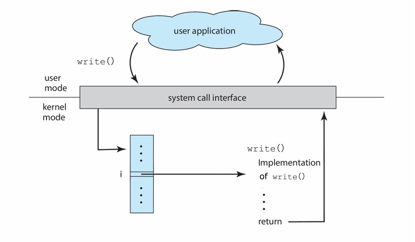
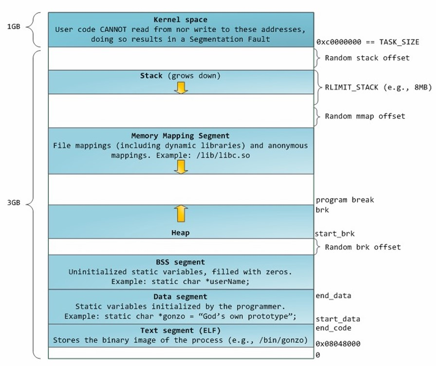
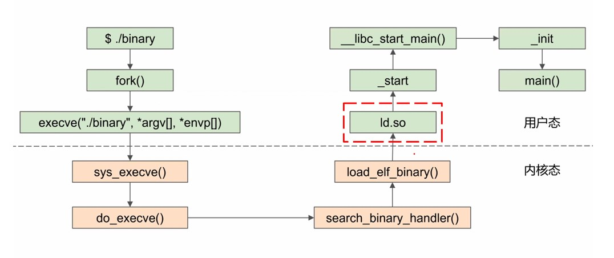
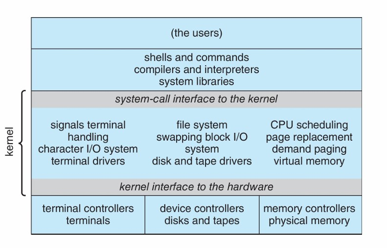
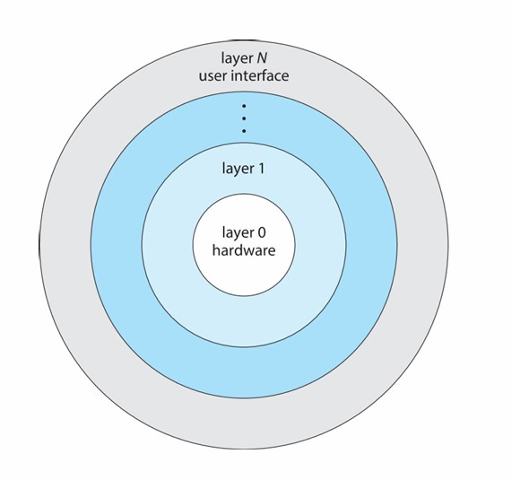
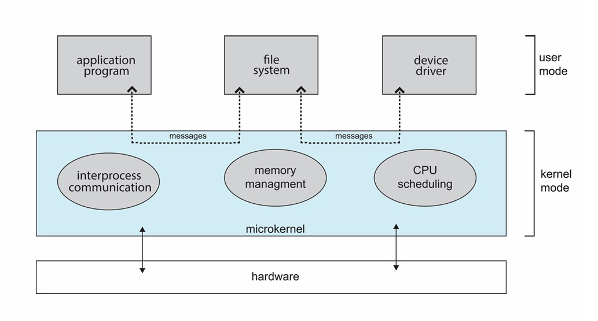

<span style="font-family: 'Times New Roman';">

# Chapter5 OS Structures

***

## 5.1 OS Services 操作系统服务


**Helpful to users:**

* program execution 程序执行
* I/O operations 输入/输出操作
* file systems 文件系统（提供文件抽象）
* communications 交互（内存共享，信息传递）
* error detection 错误检测

**Better efficiency/operation:**

* resource allocation 资源分配
* accounting 记账（统计用户的资源使用情况，可产生限制）
* protection and security 保护与安全

***

## 5.2 User and Operating System Interface 用户与操作系统的交互界面

* GUI 图形用户界面
* batch 批处理
* CLI 命令行

**CLI 命令行：**

CLI有时在内核中实现，有时通过系统程序实现。

命令分为**内置**（在命令解释器shell内部实现，如`ls`，`cd`等）和**外置**（系统中的可执行文件/外部程序，位于文件系统的某个位置，如`gcc`，`python`等），对于外置指令，添加新功能时不需要修改shell本身。

!!! Success "Definition"
    **batch 批处理：**  
    一种自动化执行一系列命令或任务的方法，通常通过脚本文件实现。  
    用户编写脚本，定义一组命令，这些命令按顺序自动执行，而无需用户交互。  

***

## 5.3 System Calls 系统调用

操作系统提供给应用程序的最底层的接口，用于**请求操作系统内核执行特定的服务或操作**。

通常用高级语言编写（C/C++）。

被更高一层的API调用，而不是被直接调用。

!!! Success "Definition"
    **API 应用程序接口：**  
    应用程序之间交互的一组定义和协议，提供更高层次的抽象，使得应用程序不需要了解底层实现细节，只需使用定义好的接口来实现功能。  
    系统调用是最底层的接口，由操作系统内核直接提供，而 API 则可以是更高层次的接口，可能会调用多个系统调用以实现复杂的功能。  
    例如：`open()`，`read()`，`write()`，`close()`是syscall；  
    `fopen()`，`fread()`，`fwrite()`，`fclose()`是API。  

**syscall实例：**

```c linenums="1"
//vesion1:
# include<stdio.h>
int main()
{
    printf("hello world\n");
}

//version2:
#include<unistd.h>
int main()
{
    write(1,"hello world\n",13);
}
```

上面两段代码的功能完全一样，区别与要点在于：

* version1使用标准输入输出库`stdio.h`，version2使用POSIX标准库`unistd.h`（POSIX是Linux的API）
* version1的`printf`函数是高级别的C标准库函数，version2的`write`函数是低级别的syscall，直接与kernel交互
* `write`的第一个参数“1”表示文件描述符，“13”表示要写入的字符数

**`write`的执行流：**

首先，从`main`进入`__libc_write`；

然后，在`__libc_write`中使用`syscall`指令，在这之前会将系统调用号1传入`%eax`；

`syscall`指令会将控制权从用户转交给内核，即切换上下文，进入`kernel_entry`；

内核会调用`write`系统调用对应的handler进行处理，结束后调用`ret_to_user`，这个时候再次切换特权态，并进行上下文切换。

!!! Note
    `syscall`指令是x86-64的名称，在32-bit x86上为`int $0x80`，在arm64上为`svc`。



**syscall number 系统调用号&syscall table 系统调用表：**

**syscall number**是操作系统内核用于区分不同系统调用的一种数字标识。当应用程序发出一个系统调用请求时，它会将对应的系统调用号传递给内核，以告知内核需要执行的具体操作（通过查**syscall table**得到）。

**系统调用号就是系统调用表的下标索引。**

* `read`:0
* `write`:1
* `open`:2
* `close`:3

事实上，操作系统接口的大部分细节通过API隐藏，具体通过**run-time support library**实现。

!!! Success "Definition"
    **run-time support library 运行时支持库：**  
    一组在程序运行时提供支持的函数库。这些库通常包含在编译器中，并在程序的执行期间被加载使用。  

**文件描述符：**

操作系统用来标识和访问打开的文件或I/O资源的整数。

* 标准输入`stdin`:0
* 标准输出`stdout`:1
* 标准错误输出`stderr`:2

**`strace`命令：**

`strace`用来展示程序在执行时需要调用的syscall种类和数量。

**`time`命令：**

`time`用来得到程序执行的时间。

* real time：总时间，即通俗意义上的耗时
* user time：在user mode下的时间
* system time：在kernel mode下的时间

理论上：real time = user time+system time

若real time < user time + system time，则是因为有并行执行（多核）；

若real time > user time + system time，则是因为有不算在user mode或kernel mode的卡顿的读取。

**syscall的参数传递：**

除了系统调用号，还有许多其他参数需要传递。

* 传值调用：将值放入寄存器，最简单，但有时参数数量多于寄存器
* 传引用调用：将指针地址放入寄存器
* 使用栈

后两者对参数的数量或者长度没有限制。

**syscall的种类：**

* Process control 进程控制
* File management 文件管理
* Device management 设备管理
* Information maintenance 信息维护
* Communications 交互
* Protection 保护

***

## 5.4 System Services 系统服务

上文提到的`strace`，`time`都属于System Services。

* File manipulation 
  新建、删除、复制、重命名等
* Status information 
  查询得到日志、debugging信息等
* Programming language support
  如编译器、汇编器等
* Program loading and execution
  绝对加载器、可重定位加载器、链接编辑器等
* Communications
* 网页浏览、远程登录、文件传输等
* Background services
  服务、子系统、守护进程等
* Application programs
  应用程序

***

## 5.5 Linkers and Loaders 链接器和加载器

**Linker 链接器：**

将多个目标文件和库文件链接在一起，生成最终的可执行文件。

注意，这个时候可执行文件暂时位于**secondary storage 二级存储器**（如硬盘等）。

**Loader 加载器：**

在程序执行时将可执行文件加载到内存中，并准备程序运行，在加载过程中，**重定位**会为程序的各个部分分配最终的地址，并调整代码和数据以匹配这些地址。


**ELF 可执行与可链接格式：**

是一种可执行、可链接的标准文件格式。

组成（section 节）：

* ELF header 文件头：包含ELF的基本信息，如文件类型，架构类型，程序头表和节头表的位置和大小等
* Program header table 程序头表：描述程序段的信息，指导loader加载进内存
* .text：存储可执行代码
* .rodata：存储只读数据
* .data：存储已初始化的可读写的数据
* .bss：存储未初始化的可读写的数据
* Section header table 节头表：描述各个节的信息，用于连接和重定位

!!! Note
    .bss单独分出来是为了节省空间。

**静态链接与动态链接：**

静态链接：在编译时将库的代码直接合并到可执行文件中。（可移植性好）

动态链接：在运行时将库文件加载到内存中，程序依赖这些外部库。（节约空间）

**`.interp`节：**

`.interp`是ELF文件中的一个特殊节，它保存了需要使用的动态链接器的路径。动态链接器负责在程序运行时加载和链接动态库。

静态链接的ELF没有`.interp`节，动态链接的ELF有`.interp`节。

**memory layout 内存布局:**



当我们要执行一个ELF时，我们会将其不同的section映射到如图所示的BSS segment, Data segment, Text segment处。对于动态链接，其动态库的文件等会被映射到Memory Mapping Segment，而静态链接没有这一映射。

对于静态链接的ELF，如果我们运行并使用`strace`查看调用syscall的情况，我们发现其调用了

* `execve`：用于执行一个新的程序，用新的程序替换当前进程的内存映像。
  
* `brk`：用于调整数据段的结束地址，从而改变进程的堆空间大小（分配内存）

* `write`

!!! Note
    * 将ELF映射到内存的是**kernel（`exec` syscall）**  
    * 初始化栈和堆的是**kernel（`exec` syscall）**  
    * 将动态库文件映射到内存的是**loader**

!!! Note
    `exec`是一组用于在操作系统中执行新程序的系统调用，它们使当前进程的地址空间被新程序替换。`exec`系列系统调用包括`execl`, `execv`, `execle`, `execve`等，每个都有略微不同的参数形式，但基本功能相同。  

**栈和堆：**

* 操作系统中的栈和堆：栈用于存储函数调用的临时数据，包括局部变量、函数参数和返回地址；堆用于动态内存分配

* 数据结构中的栈和堆：用于特定算法和数据处理

**ELF是如何开始被执行的：**

系统调用`execve`后，通过一系列调用会来到`load_elf_binary`，通过检查`elf_interpreter`来判断动态/静态链接。

如果是静态链接，最后会调用`start_thread`，`start_thread`会使用**entry point address**（存放于ELF的`header`节）作为程序开始地址，即为`_start`入口点，是第一个在用户空间执行的代码，`_start`进入`__libc_start_main`，其会设置好环境与栈，最后会调用`main`。


如果是动态链接，在`load_elf_binary`中会被检查出来，于是传给`start_thread`的需要跳转的地址参数不同，并不像静态链接一样从`start_thread`跳到entry point address（`_start`），而是跳到`ld.so`（loader）作为程序开始地址。



***

## 5.6 Why Applications are Operating System Specific 为什么应用是OS对应的

在一个OS上能执行的App在其他OS上往往不能执行，因为不同的OS使用不同的syscall。

然而，以下情况不然：

* App使用解释型语言（如Python等），且有合适的interpreter
* App使用Java等跨平台语言，其在虚拟机（VM）上运行
* App使用标准语言（如C等），在不同的OS上分别编译运行

!!! Note
    **ABI 应用程序二进制接口：**  
    ABI（Application Binary Interface）和API（Application Programming Interface）都是用于定义软件组件之间交互的接口，但API定义的是源代码级别（上层）的接口，ABI定义的是二进制级别（底层）的接口。  

***

## 5.7 Operating-System Design and Implementation OS设计与实现

**设计理念：**

对于用户：
方便学习使用，安全迅速

对于程序员：
方便设计维护，灵活有效

* **Policy 策略：** 做什么
* **Mechanism 机制：** 怎么做

核心理念：**Separation of Policy from Mechanism 策略机制分离**

!!! Example
    例如：Policy：选这门课的同学进这个教室  
    Mechanism1：锁与钥匙  
    如果改变Policy为：实验好的同学不需要来了，则需要向所有目标回收钥匙，但有很多突发情况，此时Policy和Mechanism相关性很强，并不是一个好方法  
    Mechanism2：刷脸  
    改变Policy时，Mechanism改变很方便，是一个好方法  

**实现：**

早期OS用汇编语言实现；
中期OS用Algol，PL/1实现
当代OS用C，C++实现

事实上，OS有多种语言参与，低层级用汇编语言实现，主体用C实现，脚本用PERL，Python等实现。

更高层次的语言更易移植到其他硬件，但更慢。

通过**仿真**可以让OS在非原生硬件上运行。

!!! Note
    OS不能用Java写的原因：  
    OS需要直接与硬件交互，但Java是高级语言，依赖于虚拟机（JVM），其设计初衷是屏蔽底层硬件细节，提供跨平台能力。

***

## 5.8 Operating System Structure OS结构

* MS-DOS采用**简单结构（Simple Structure）**：
  没有模块区分，不分user和kernel
* Unix，Linux采用**单片结构（Monolithic）**：
  分为kernel和systems programs，集中服务
* **层次结构（Layered）**
* Mach使用**微内核结构（Microkernel）**

**单片结构：**

Unix架构：



Linux架构：


**层次结构：**

层次结构下，OS分为多层，每一层建立在其低一层的基础之上，只使用比其低层的函数。最底层是硬件，最高层是用户界面。



**微内核结构：**

微内核结构**将尽可能多的功能从内核移动到用户空间**，用户模块之间通过**message passing**进行交流。

微内核结构的优点：

* 易扩展
* 易移植
* 更可靠
* 更安全

微内核结构的缺点：

* 内核与用户频繁切换的开销



**LKM 可加载内核模块：**

操作系统内核根据需要动态加载和卸载模块，与layer类似，但更加灵活。

特点：

* 面向对象
* 核心组件独立
* 通过已知接口进行通信
* 按需加载

**Hybrid Systems 混杂系统：**

操作系统并不是一直采取单一结构，而是多种结构的混杂。例如，Linux和Solaris内核基于单片结构，但也会使用LKM；Windows内核基于单片结构，但也会使用微内核。

***

## 5.9 Building and Booting an Operating System OS启动

从零开始生成OS：

* 编写OS
* 配置OS：需要根据OS将要运行的具体硬件系统进行配置，包括设置硬件参数、指定设备驱动程序、配置内存管理等
* 编译OS
* 安装OS：将OS的可执行文件载入硬盘等存储介质
* 启动OS

**boot loader：**

位于固定内存（ROM或EEPROM）的一段程序，用于初始化硬件、定位操作系统内核并将其加载到内存中启动。

有时启动分为两步，首先由ROM的代码加载位于固定位置的boot block，然后boot block加载boot loader。

boot loader通常允许进入各种启动状态，例如单用户模式。

***

## 5.10 Operating System Debugging OS调试

OS会生成包含错误信息的**log文件**。

* **core dump文件：** 应用出错，包含进程内存的信息
* **crash dump文件：** OS出错，包含内核内存的信息

**performance tuning 性能优化：**

通过减少bottleneck来优化性能。

* **trace listing 链路追踪：** 记录活动用于分析
* **profiling 分析：** 周期性采样指令指针来观察系统行为，寻找统计趋势。

相关指令与工具：

* `strace`：追踪进程的系统调用
* gdb
* perf：Linux上的性能分析工具
* tcpdump：命令行网络协议分析工具，捕获并检查网络中传输的数据包