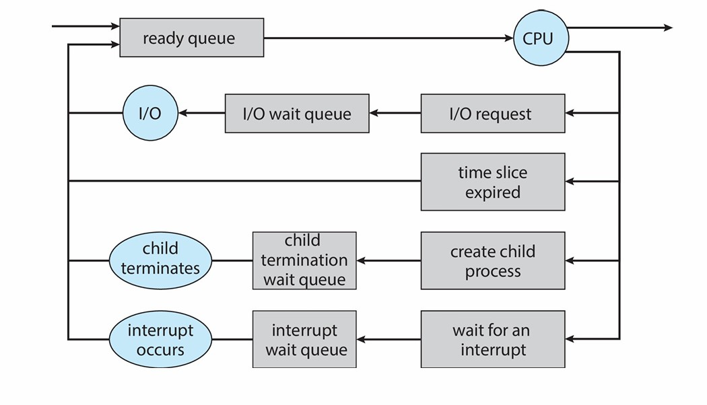
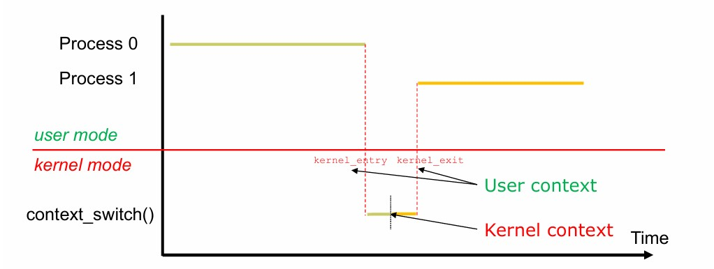

<span style="font-family: 'Times New Roman';">

# Chapter6 Processes

***

## 6.1 Process Concept 进程的概念

**resource allocation and protection 资源的分配与保护单元**

进程是一个执行中的程序，一个未执行的程序仅仅是硬盘上的ELF，ELF载入内存后就变成了进程。

同一个程序可以对应多个进程。例如，在一个共享服务器上，每个用户可以启动相同程序的一个实例（如文本编辑器、Shell等）。

一个运行的系统包含多个进程，比如OS进程和user进程等。

**进程包含的内容：**

* code（text）section：代码内容
* data section：全局变量，包括`.bss`段和`.data`段的内容
* program counter（pc）：指向下一条待执行的指令
* stack：与函数调用相关
* heap：与动态分配内存相关
* PCB：进程控制块，包含进程信息


上图为user space的进程的内存布局。

**stack 运行时栈：**

与函数/方法调用相关，调用时会长，返回时会缩，其对应的内存空间称为**stack frame 栈帧**，保存于调用相关的信息，如返回地址、局部变量等，完全由编译器进行管理。

!!! Note
    栈帧又称activation records。

对于一个被调用的函数，其需要：

* caller传递的参数
* 局部变量
* 返回地址
* 返回值

在调用之前，caller也需要保存寄存器的相关状态。

运行时栈是从高往低处（从高地址往低地址）长的，如果长得过多（递归）会导致stack overflow，会和heap冲突（静态）或者和lib冲突（动态）。

**heap 运行时堆：**

运行时堆在栈之后发明，弥补了栈没有办法长期维持一块内存的问题。大块内存（动态分配）在堆上，有自己的生命周期。

如果没有及时释放堆的内存，则会导致memory leak，而栈一般不会。

**同一程序的两个进程比较：**


两个对应程序一样且同时的进程，`text`段和`data`段的大小一样（ELF映射），`text`段的内容一样，但`data`段的内容可能不一样，因为global valuable可变。栈和堆的大小和内容都不一样。


***

## 6.2  Process Control Block(PCB) 进程控制块

PCB本质上是内存的一块内容，存放对应进程的信息，一个进程只有一个PCB，在进程创建时分配，在进程结束时释放。

PCB存放的信息：

* 进程号PID：唯一标识进程
* 进程状态：running、waiting等
* PC：下一条待执行指令的地址
* CPU寄存器：与该进程相关的寄存器的内容
* CPU调度信息：如优先级、调度队列指针等
* 内存管理信息：如分配给该进程的内存区域等
* 计数信息：如CPU占用情况，耗时，时间限制等
* I/O信息：如分配给该进程的I/O设备，待打开文件等

!!! Note
    在Linux中PCB用C语言表示为`task_struct`。
```c linenums="1"
pid t_pid;                  /* process identifier */ 
long state;                 /* state of the process */ 
unsigned int time_slice     /* scheduling information */ 
struct task_struct *parent; /* this process’s parent */ 
struct list_head children;  /* this process’s children */ 
struct files_struct *files; /* list of open files */ 
struct mm_struct *mm;       /* address space of this process */
```

***

## 6.3 Process State 进程的状态


* **New：** 进程被创建
* **Running：** 进程的指令在执行
* **Waiting：** 进程在等待事件发生
* **Ready：** 进程在等待被分配给处理器
* **Terminated：** 进程结束

### New：Process Creation


一个进程能创建新的进程，此时前者为parent，后者为child，child的ppid指的是其parent的pid。

child可能会从其parent处继承一些信息，可能是parent的复制，也可能全新。

parent能向child传递参数。创建child后，parent可以继续执行，也可以等待child执行。

!!! Note
    Linux的一号进程是`systemd`（很多进程的parent），二号进程是`kernelthread`，他们的parent都是零号进程，零号进程是`swapper`（IDLE）（系统启动的最初进程）。

**`folk`系统调用：**

`folk`系统调用用于创建一个新的进程，创建的child是parent的复制，接下来会和parent从同一位置一起执行（`folk`系统调用的下一句），但pid和ppid不同，resource utilization（资源利用率）初始化为0。

`folk`会返回两个不同的值，给parent返回child的pid，给child返回0。每个进程可以调用`getpid()`得到自己的pid，调用`getppid()`得到自己的ppid。

所有进程系统调用`folk`后，依然会继续执行。

```c linenums="1"
pid = fork();
if (pid < 0) {
fprintf(stdout, "Error: can’t fork()\n");
perror(“fork()”);
}
if (pid != 0) {
fprintf(stdout, "I am parent and my child has pid %d\n",pid);
while (1);
} else {
}
fprintf(stdout, "I am child, and my pid is %d\n", getpid());
while (1) ;
```

!!! Example
    例1：下列代码最后会输出多少？child的a最后为多少？  
    ```c
    int a = 12;
    pid = fork();
    if (pid) { // PARENT
    // ask the OS to put me in waiting
    sleep(10);
    fprintf(stdout,”a = %d\n”,a);
    while (1);
    } else { // CHILD
    a += 3;
    while (1);
    }
    ```

    解：12；15

!!! Example
    例2：下列代码最后会打印多少次“hello”？
    ```c linenums="1"
    pid1 = fork();
    printf("hello\n");
    pid2 = fork();
    printf("hello\n");
    ```

    解：6  
    第一个进程在第1行创建第二个进程，这两个进程各自打印2次；这两个进程在第3行各自创建第三个进程和第四个进程，这两个进程各自打印1次。

!!! Example
    例3：下列代码最后会形成多少个进程？  

    ```c linenums="1"
    int main (int argc, char *arg[])
    {
        fork ();
        if (fork ()) 
        {
            fork ();
        }
        fork (); 
    }
    ```

    解：12

    

`folk`得到的进程是一模一样的，看似没用，需要`exec` 系统调用用在`folk`之后才有用。

**`exec`系统调用：**

`exec`系统调用将当前进程的内存空间替换为新的内容。

只有出现错误，`exec`才会有返回值。

!!! Note
    `exec`实际上是一个系列，包括`execl`， `execle`，`execlp`，`execv`，`execve`和`execvp`，可以指定可执行文件路径、命令行参数、环境变量等。


如果在一个进程中先系统调用 `exec`，再调用`print`函数，`print`函数不会被执行，也不会输出任何内容。

原因是：当`exec`系统调用成功时，它会用新程序的映像完全替换当前进程的映像。这意味着，之后的代码将不会被执行，因为当前进程已经被新程序取代了。`execv`只有在执行失败时才会返回，而在这种情况下，后续的代码才会被执行。

**`fork`+`exec`进程创建的优劣：**

优点：

* 简洁
* 分工明确：`folk`搭起骨架，`exec`赋予灵魂
* 保持进程之间的联系

缺点：

* 复杂：涉及两个系统调用
* 性能差
* 安全性问题

### Terminated：Process Terminations

**`exit`系统调用：**

`exit`系统调用用于终止所在进程，其输入为一个exit code，OS负责释放该进程的所有资源（物理/虚拟内存、I/O buffer，open files等）

!!! Success "Definition"
    **exit code 退出码：**  
    常规情况：`exit(0)`  
    出现错误：`exit(i)`（i非零）  
    其既可以作为输入，也可以作为输出返回给parent。  

**`wait`和`waitpid`系统调用：**

`wait`系统调用被parent使用，等待其**任意**一个child结束，返回值为结束的child的pid和exit code。

`waitpid`系统调用等待**特定**的child结束（以child的pid作为输入），其还有一个参数输入叫作status，如果status为`WNOHANG`，则如果pid指定的child没有结束，则返回0；否则则返回child的pid。（non-blocking）

**Signal：**

signal是来自软件的中断，发送给进程，属于进程在某种程度上不得不响应的异步事件。

signal可以用于处理进程同步。

!!! Example
    * ^C会向运行的命令发送`SIGNT`signal  
    * 段错误会向运行的进程发送`SIGBUS`signal  
    * 一个进程会向另一个进程发送`SIGKILL`signal  

每一种signal都会导致进程的对应默认行为，例如，`SIGINT`signal会导致进程终止。

对于大多数signal，可以忽略或者通过用户指明的handler来处理，但像`SIGKILL`和`SIGSTOP`一类的signal无法被user忽略或者处理（出于安全考虑）。

`signal`系统调用允许进程指明如何处理signal，例如：

* `signal(SIGINT,SIG_IGN)`：忽略`SIGINT`
* `signal(SIGINT,SIG_DFL)`：为`SIGINT`设置默认处理方式
* `signal(SIGINT,my_handler)`：将`SIGINT`交给自定义的handler处理

**Zombie进程：**

如果一个child进程已经结束，并不占用CPU，但没有释放掉资源（如`.text`、`.data`、PCB等），则变为zombie。

如果zombie越来越多，则会耗尽内存，导致`folk`失败。因此，zombie需要parent帮忙释放（例如系统调用`wait`获取exit code，或者使用handler）。

只有zombie的parent调用`wait`或者parent没了，zombie才能消失。当child退出时，其parent会接收到`SIGCHLD`signal。

典型处理方法：

* parent将`SIGCHLD`signal连接到一个handler
* handler调用`wait`
* 等待识别所有child的终止

**Orphan进程：**

如果一个child进程的parent没了，则这个child变为orphan。

在Linux中，orphan进程会被第一进程（init进程）收养（orphan的parent设置为一号进程）。与之前同理，一号进程也会将`SIGCHLD`signal连接到一个handler，handler调用`wait`，等待识别所有orphan的终止，因此，没有orphan会变成zombie。

***

## 6.4 Process Scheduling 进程的调度

进程调度的目的是通过快速切换进程来最大化CPU的使用效率。

**process scheduler 调度程序**在处于ready状态的进程中选择即将执行的，也负责决定何时执行，执行多长时间等。

如果CPU只有一个core，则处于running状态的进程只会有一个，而ready和waiting状态会有很多个，用**scheduling queue**组织这两个状态。（new和terminated状态的时间很短，不需要组织）

scheduling queue分为**ready queue**（待执行，只有一条）和**wait queues**（等待event，有很多条），若进程等待的对象不一样，则放入不同的wait queue，比如要等待硬盘的进程放一起，要等待lock的进程放一起，相当于分类。



**scheduling queue的组织：**


每一条scheduling queue的每一个进程都对应一个**list head**，存放两个指针，分别指向前一个和后一个list head，list head减去一个偏移量再进行强制转换得到对应的进程的PCB。

### Context Switch 上下文切换


当进程$P_0$切换到进程$P_1$时，由于寄存器只有一套，因此$P_0$对应的寄存器的值应当保存到其PCB中，然后寄存器载入$P_1$对应的值。

上下文切换是overhead的，因此需要尽量减少。如果OS和PCB的内容越复杂，则上下文切换的耗时越长。

**相关代码：**

该代码对应的是两个kernel space的进程的上下文切换。


`cpu_switch_to`接收两个参数，分别是$P_0$和$P_1$的`task_struct`的地址，分别保存在`x0`和`x1`寄存器中。

`mov x10,#THREAD_CPU_CONTEXT`  
`add x8,x0,x10`：将$P_0$的`task_struct`的地址加上一段偏移量得到存放寄存器的地址`cpu_context`，该地址保存在`x8`寄存器中。

`mov x9,sp`：此时`sp`寄存器保存的是$P_0$的栈顶地址，上下文切换时同样需要保存，保存在`x9`寄存器中。

`stp x19,x20,[x8],#16`：类似的指令都是在保存$P_0$相关寄存器的值，存放的起始地址即为`x8`保存的地址。

`str lr,[x8]`：`lr`寄存器保存返回地址。在这一条指令中，内存保存了$P_0$调用`cpu_switch_to`下一条本来要执行的指令地址，也即从$P_1$切换回$P_0$后要接着执行的指令地址。

`add x8,x1,x10`：将$P_1$的`task_struct`的地址加上一段偏移量得到存放寄存器的地址`cpu_context`，该地址保存在`x8`寄存器中。

`ldp x19,x20,[x8],#16`：类似的指令都是在载入$P_1$相关寄存器的值，来源的地址即为`x8`保存的地址。

`ldr lr,[x8]`：将$P_1$上一次运行到一半到达的指令地址（位于内存的`[x8]`位置）载入`lr`寄存器，这个时候返回地址即为`lr`的值。

`mov sp,x9`：$P_1$的栈顶指针现已经载入`x9`寄存器，再次将其转移到`sp`寄存器，即更新栈顶指针。

`msr sp_e10,x1`：将`x1`寄存器的值移动到特殊寄存器`sp_e10`中，可暂时不考虑。

`ret`：返回到`lr`寄存器中保存的地址，即从$P_1$上一次没执行完的地方接着往下执行。

!!! Note
    这一段代码用汇编而不用C的原因：  
    C的编译器会优化，代码改变，可能引起问题。  

假设$P_0$在第755行调用`schedule`，则最终会返回到`schedule`的下一条指令，即第756行。

**kernel space进程的内存布局：**


栈顶为**pt_regs**，保存对应user space进程的寄存器状态；栈底为**thread_info**，指向对应进程的`task_struct`。

!!! Note
    注意与user space的内存布局区分。

**上下文切换情景：**

对于kernel space的进程的上下文切换：


* When：`cpu_switch_to`
* Where：PCB的`cpu_context`

对于user space的进程的上下文切换：

上下文切换依然要进入内核态，因为OS要进行资源分配。

从user space到kernel space也发生了上下文切换。



user的context保存：

* When：`kernel_entry`
* Where：kernel stack中的`pt_regs`

kernel的context保存：

* When：`cpu_switch_to`
* Where：PCB的`cpu_context`

**`folk`返回值：**

`folk`系统调用会进入内核，有两套进程，对应两个`pt_regs`，`folk`的返回值（parent对应child的pid，child对应0）会保存在各自的`pt_regs`中（`pt_regs[0]`），再通过上下文切换返回给parent和child。

当`folk`完成后，child处于ready状态，通过上下文切换进入running状态，从`ret_from_fork`开始（也保存在`pt_regs`中，顺序为`ret_from_folk`$\rightarrow$`ret_to_user`$\rightarrow$`kernel_exit`）；而parent原本处于running状态，通过上下文切换可能进入ready状态，也可能进入waiting状态。