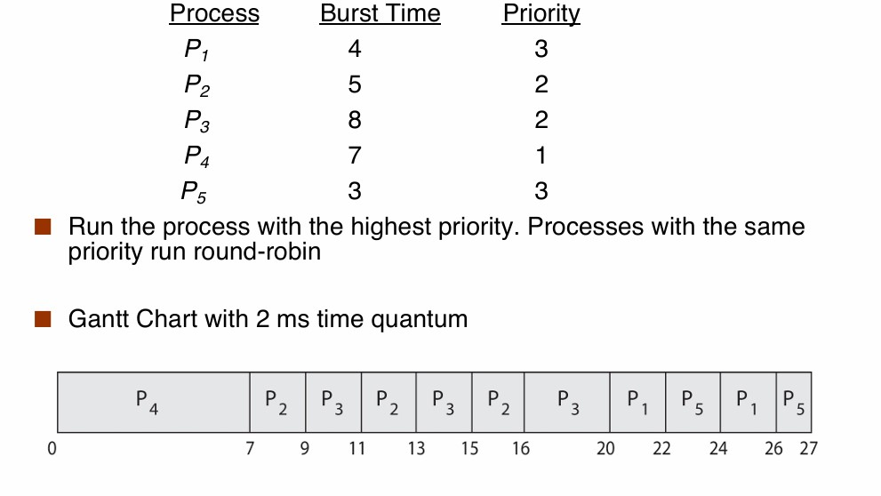
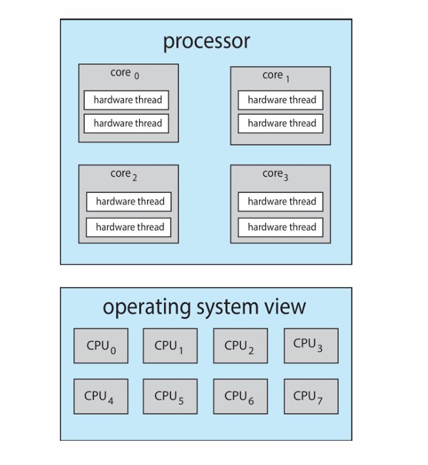
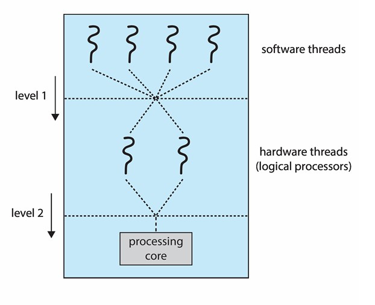

# Chapter7 CPU Scheduling

***

## 7.1 基本概念

**定义：**

OS决定处于ready状态的进程哪个先执行，执行多久，在multi-programming和time-sharing时很关键。

* policy：scheduling strategy
* mechanism：**dispatcher分配器**

**CPU-I/O burst cycle：**

大部分进程会在CPU相关操作和I/O相关操作中来回跳转（a sequence of bursts），一个典型的进程会以CPU burst开始，以CPU burst终止。

* **I/O-bound进程：** 主要等待I/O操作，存在很多短暂的CPU burst，如复制文件等；
* **CPU-bound进程：** 主要执行CPU操作，仅存在很少短暂的I/O burst，如图像处理、AI炼丹、死循环等。

对于一个进程的CPU burst，大部分为short bursts，小部分为longer bursts。

**CPU Scheduler：**

当CPU处于IDLE空闲状态时，必须选择一个处于ready状态的进程执行。

* **non-preemptive scheduling 非抢占式调度：**  又称cooperative scheduling，一个进程一直占用CPU，直到其主动让出，优点是不会卡死
* **preemptive scheduling 抢占式调度：** 一个进程的CPU资源会被另一进程抢占，被动中止，优点是对硬件有更强的把控能力

现代OS使用preemptive scheduling。

**调度什么时候会发生：**

* running到waiting：如等待I/O等
* running到ready：如发生中断等
* waiting到ready：如I/O完成等
* running到terminated
* new到ready
* ready到waiting

non-preemptive scheduling没有running到ready或者ready到waiting。

preemptive scheduling没有ready到waiting。

**调度的目的：**

* 最大化**CPU utilization CPU利用率** ：CPU处于忙碌状态的时间占比
* 最大化**throughput 吞吐量** ：单位时间内完成的有效工作
* 最小化**turnaround time 周转时间** ：从进程创建到结束的时间间隔
* 最小化**waiting time 等待时间** ：进程在ready状态的时间
* 最小化**response time 响应时间** ：从进程创建到获得CPU响应的时间间隔

**dispatcher 分配器模块：**

dispatcher将CPU的控制权转交给scheduler选择的进程：

* 切换到内核态
* 上下文切换
* 切换到用户态
* 跳到合适位置启动进程

**dispatch latency：** dispatcher从停止一进程到启动另一进程的耗时。

***

## 7.2 Scheduling Algorithms 调度算法

### First-Come First-Served Scheduling（FCFS）

字面意思，先到的进程先执行。

假设进程的**burst time 执行时间**如下：

Process|Burst Time
---|---
$P_1$|24
$P_2$|3
$P_3$|3

假设三个进程在$t=0$时刻同时到达，且顺序为$P_2$，$P_3$，$P_1$，则对应的**Gantt Chart**如下：

**waiting time = start time - arrival time**

$$P_1=6-0=6$$

$$P_2=0-0=0$$

$$P_3=3-0=3$$

average waiting time：

$$\frac{6+0+3}{3}=3$$

**turnaround time = finish time – arrival time**

$$P_1=30-0=30$$

$$P_2=3-0=3$$

$$P_3=6-0=6$$

average turnaround time：

$$\frac{30+3+6}{3}=13$$

假设三个进程在$t=0$时刻同时到达，且顺序为$P_1$，$P_2$，$P_3$，则对应的**Gantt Chart**如下：

average waiting time：

$$\frac{0+24+27}{3}=17$$

average turnaround time：

$$\frac{24+27+30}{3}=27$$

我们发现，这种顺序比上一顺序更差。此即为**convoy effect**，即短进程如果在长进程后面，则总体会被延缓。

### Shortest-Job First Scheduling（SJF）

需要根据所有进程的burst time来进行调度，burst time越短的进程越先被执行。这是一种最优的调度方法，可以得到最小的average waiting time，无论是non-preemptive还是preemptive。

**non-preemptive的例子：**

我们发现，在$P_1$执行的时间内，$P_2$，$P_3$，$P_4$依次到达，但由于burst time为$P_4<P_2<P_3$，因此执行顺序也依此改变。

average waiting time：

$$\frac{0+10+14+5}{4}=7.25$$

average turnaround time：

$$\frac{10+16+21+7}{4}=13.5$$

**preemptive的例子：**

这里的抢占依据是**shortest-remaining-time-first**，又称**shortest remaining processing 
time（SRPT）**。

average waiting time：

$$\frac{15+2+6+0}{4}=5.75$$

!!! Note
    由于进程会中断，因此这里的waiting time = finish time - arrival time - burst time

average turnaround time：

$$\frac{25+8+13+2}{4}=12$$

SJF只是理论上的最优，实际上并不可行，因为我们无法提前知道进程的burst time。

但是，我们可以基于先前的burst time来预测下一次的burst time，例如对先前的burst time求**exponential averaging 指数平均**：

$$\tau_{n+1}=\alpha t_n+(1-\alpha)\tau_n=\alpha t_n+(1-\alpha)\alpha t_{n-1}+···+(1-\alpha)^j\alpha t_{n-j}+···+(1-\alpha)^{n+1}\tau_0$$

其中：

* $\tau_{n+1}$：预测的第$n+1$次的burst time
* $\tau_n$：预测的第$n$次的burst time
* $t_n$：实际的第$n$次的burst time
* $\alpha$：权重，$0\leqslant\alpha\leqslant1$。$\alpha=0$表示不关注最新的实际情况，$\alpha=1$表示只关注最新的实际情况。

### Round-Robin Scheduling（RR）

轮询调度（RR）是preemptive的，基于time-sharing进行设计。

其定义一个**time quantum 时间片**，除非ready状态只有一个进程，否则每个进程最多只会跑一个时间片的时间。（但如果进程的burst time小于时间片，则可以提前跑完，切换下一进程）

由于ready queue是一个先进先出（FIFO）的结构，因此时间片用完的进程会被放到队尾。

设置时间片为4，假设$t=0$时刻$P_1$，$P_2$，$P_3$同时进入ready queue，按照$P_1\rightarrow P_2\rightarrow P_3$的顺序进行轮询，$P_2$，$P_3$的burst time比时间片短，因此提前结束，之后只有$P_1$不断执行。

average waiting time：

$$\frac{6+4+7}{3}=5.67$$

通常情况下，RR的average waiting time比SJF差，但响应时间response time更好。

相比于SJF，RR不会出现starvation的情况（对于SJF，如果一个进程前不断插入更短的进程，则该进程永远无法执行），且等待时间是有上限的。

**关键点：怎么选择时间片**

* 短时间片：响应效果好，每个进程都可以很快获得CPU响应
* 长时间片：进程切换的次数少，降低overhead（当时间片足够长时，RR退化为FCFS）

!!! Example
    假如Linux用到mobile端和server端，则前者用更短的时间片，因为需要更好的响应时间，不然要等一个进程很久才能到另一个进程，会卡；后者用更长的时间片。

实际上，CPU花在上下文切换的时间是远小于时间片的。

### Priority Scheduling

人为地给每个进程分配优先级，优先级越高则越先被执行，用小数字还是大数字表示优先级高没有规定（Linux用小数字，Windows用大数字）。

优先级分为显性的和隐性的。上文所述即为显性的，而在SJF中是隐性的，为（预测）burst time，因此SJF也可以算是一种priority scheduling。

假设这五个进程在$t=0$时刻同时进入ready queue。

average waiting time：

$$\frac{6+0+16+18+1}{5}=8.2$$

我们还可以将priority scheduling与RR结合，即**优先+轮询**：

设置时间片为2。

在优先+轮询的调度算法下，先考虑优先级，优先级高的先跑完（如$P_4$），优先级一样的则按照RR的方式进行（如$P_2$和$P_3$，$P_1$和$P_5$）。

优先级算法的问题是容易出现starvation，即优先级低的永远被抢占，永远无法执行。

!!! Note
    优先级最低的是0号进程（pid0），叫作IDLE进程（空闲进程），为了简化scheduling的算法而存在。

解决方法：**priority aging**

等的越久优先级提高越多。

### Multilevel Queue Scheduling

根据优先级的大小分成相应的队列，调度分为：

* **scheduling within queues 队内调度**：不同的队列有不同的调度算法，例如，高优先级的队列可能使用RR，低优先级的队列可能使用FCFS。
* **scheduling between queues 队外调度**：通常情况下采用preemptive priority scheduling的方式，即对于一个进程，只有比其优先级高的队列均为空时才可以运行；
  或者可以采用**time slicing**的方式，即每个队列都有一个时间片，时间片用完后会切换执行下一个队列，高优先级的队列可能会分到更长的时间片。

### Multilevel Feedback Queue Scheduling

为multilevel queue的改良版，允许进程在队列之间的移动，有利于实现priority aging。

例如，当一个新的进程到来，被放置在$Q_0$队列中，给予一个长度为8的时间片。

如果该进程没有用完这个时间片就跑完了，说明其可能是一个I/O-bound进程，确实应该对应更高的优先级。

如果该进程用完了这个时间片还没有跑完，则将其放置在$Q_1$队列中，给予一个长度为16的时间片。

如果该进程也没有用完这个时间片，说明其可能是一个CPU-bound进程，再将其放置在$Q_2$队列中，这个时候，该进程只有在没有non-CPU-intensive进程时才有机会运行。

这很好地体现了CPU调度的哲学：non-CPU-intensive进程应该在需要CPU时尽快使用（虽然需要的很少），因为其很有可能是需要快速响应的交互式进程。

multi-level feedback queue scheduling是非常通用的调度方法，因为其具有高度的可配置性，队列的数量，队内调度的算法，队外调度的算法，改变进程优先级的策略等都可以配置。

然而，这种需要大量参数进行配置的调度方法也很难实现，计算的需求也很大。

***

## 7.3 Multiple-Processor Scheduling 多处理器调度

多处理器调度包括：

* **Multi-core CPUs：** 一个CPU包含多个核心，每个核心可以单独执行进程
* **Multi-threaded cores：** 一个核心可以同时处理多个线程

**symmetric multiprocessing (SMP)** 允许多处理器调度，通过共享内存和操作系统，实现多任务并行处理。以下是两种ready queue的形式：

* 单队列：调度简单
* 多队列：冲突较少，不用上锁

**Multithreaded Multicore System：**

对于一个线程，其在访存时CPU是相对空闲的，因此可以让另一个线程使用CPU，两个线程交错着执行，一般由硬件维护，又称**hyperthreading 超线程**。

例如，对于一个系统，其物理意义上的核心只有四个，但是通过超线程技术，可以让每个核心同时执行两个线程，因此在操作系统中看到的是八个逻辑核心。

这里涉及到两个层面的调度：OS决定在逻辑层面的CPU上执行哪个软件线程，而硬件决定在物理层面的CPU上执行哪个硬件线程。

