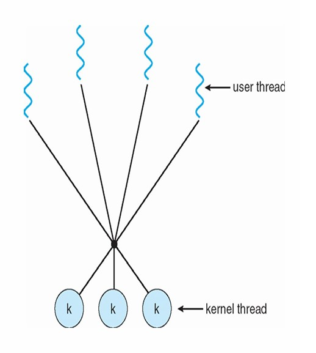

# Chapter9 Threads 

***

## 9.1 基本概念

线程是一个进程的**执行单元**。

每个线程有自己的：

* 线程ID
* PC程序计数器
* 寄存器组相关信息
* 运行时栈（因为栈中有变量和函数链，每个线程调用的函数不一样）

在同一进程中，所有的线程共享：

* code section
* data section
* 运行时堆
* open files和signals

线程具有**cocurrency 并发性**，即对于一个多线程的进程，这些线程可以同时开始执行任务。

**Advantages of Threads 线程的优点：**

Economy：

* 创建线程比创建进程更加轻量级，因为所有的资源都已经位于内存中，只需要新开一个栈即可
* 线程的上下文切换也比进程更加轻量级，因为大量数据不变，所以没有cache flush缓存刷新

Resource Sharing：

* 线程自然而然地共享内存，不需要IPC
* 线程有利于并行（但也会带来一定风险）

Responsiveness：

* 程序如果有并行的线程会有更好的响应，一个线程在等待事件的同时另一线程可以工作。例如，在client-server中，可以创建一个线程来响应用户的请求，其他线程来处理其他任务。
* 对于进程来说虽然也有较好的响应，但线程的economy和resource sharing更优
  

Scalability

**Drawbacks of Threads 线程的缺点：**

* 线程之间缺少隔离，一旦一个线程挂掉，其他线程乃至整个进程都有可能挂掉
* 线程可能受到比进程更严格的内存限制，因为每个进程分到的内存空间有限，因此线程之间的内存约束就更加严格
* 同步比较困难

***

## 9.2 User Threads and Kernel Threads 用户线程和内核线程

用户线程可以在user space实现，不需要内核的直接支持，由某些用户级线程库进行管理；内核线程由内核进行管理，内核具有处理线程的数据结构和功能。

事实上，Linux对进程和线程不作过多区分，其使用相同的数据结构。

**Many-to-One Model 多对一模型：**

多个用户线程映射到一个内核线程，主要在user space实现。

优点：

内核简单，user space的多线程效率高，开销低，无需syscall（线程管理在user space进行）

缺点：

* 由于所有用户线程映射到一个内核线程，因此整个进程只能在一个核心上运行，无法利用多核架构
* 一个线程阻塞后，其他线程也会阻塞

例子：

* Java Green Threads
* GNU Portable Threads

**One-to-One Model 一对一模型：**

优点：

解决了many-to-one model的缺点

缺点：

创建新的线程需要内核参与，没有many-to-one model快，且占用更多资源

例子：

* Linux
* Windows
* Solaris 9 and later

**Many-to-Many Model 多对多模型：**

当一个用户线程阻塞时，内核可以创建一个新的内核进程避免其他线程的阻塞。

创建新的用户线程并不一定要创建新的内核线程。

在多核机器上可以实现并行。

优点：

解决了many-to-one model和one-to-one的缺点

缺点：

过于复杂

例子：

* Solaris 9 and earlier
* Win NT/2000 with the ThreadFiber package

**Two-Level Model 两级模型：**

可以是many-to-many model，但如果一个用户线程比较重要，可以将其设置为one-to-one model。

例子：

* IRIX, HP-UX, Tru64 UNIX
* Solaris 8 and earlier

**Thread Libraries 线程库：**

线程库允许用户在自己的程序中创建并使用线程。

* Pthreads and Win32 threads：用于C/C++，由内核实现
* OpenMP：用于C/C++，在Pthreads上层
* Java Threads：用于Java，由JVM实现（依赖于内核实现的线程）

**Semantics of `fork` and `exec`：**

当一个线程调用`folk`时，有以下两种可能：

* 创建一个新的进程，只包含一个线程（即parent线程的复制）
* 创建一个新的进程，包含了parent线程所在进程的所有线程

有些OS对于以上两种方案都有提供，但Linux使用第一种方案。

当一个线程调用`exec`时，该线程所在进程下的所有线程都会清空（只留下单线程）。

**Signals：**

对于一个多线程的进程，当其接收到signal时，会有以下选择：

* 将signal传递给适用的线程
* 将signal传递给所有线程
* 将signal传递给特定的线程
* 安排一个特殊的线程来接收所有signal

在大多数Unix版本中，一个线程可以决定接收哪些signal。Linux的实现是用户自己选择设置。

**Safe Thread Cancellation 安全取消线程：**

取消一个线程有两种可能的方法：

* **asynchronous cancellation 异步取消：** 由其他的线程来即时取消该进程，但该进程正在执行时被取消可能会有同步问题
* **deferred cancellation 延迟取消：** 该线程每隔一段时间检查自己是否应该被取消，直到合适的时机（cancellation point），但问题是比较笨拙

通常默认的方式是deferred，涉及cleanup handler，在Linux上通过signal处理。

**Thread Scheduling 线程调度：**

当OS支持线程时，只进行线程调度，而不考虑进程调度。

线程调度分为：

* **process-contention scope (PCS)：** 在进程内部对线程进行调度
* **system-contention scope (SCS)：** 系统下所有线程一起参与调度（Linux使用）

**Windows Threads：**

Windows的每个线程都包含自己的ID，寄存器组数据，运行时栈（分user mode和kernel mode），专有数据存储区域（供实时库和动态链接使用），这些被称为一个线程的context。

线程的数据结构包含：

* **ETHREAD（executive thread block）：** 位于kernel space，包括所属进程的指针和指向KTHREAD的指针
* **KTHREAD（kernel thread block）：** 位于kernel space，包括调度信息，同步信息，kernel node的栈和指向TEB的指针
* **TEB（thread environment block）：** 位于user space，包括线程ID，user mode的栈和相关存储数据

**Linux Threads：**

在Linux中，一个线程也被叫做一个**light-weight process（LWP）**。

Linux使用`clone`系统调用来创建线程或者进程，child与parent共享执行信息。（`folk`和`exec`是Unix系列都有的，而`clone`是Linux特有的）

`folk`的线程被放到ready queue，被调度后执行，`clone`的线程同理。

Linux中不区分PCB和TCB，统一使用`task_struct`，跟每个线程对应，进程用leader线程的`task_struct`，且进程和leader线程的ID一致。

`thread_group`（一种list head）可以遍历一个进程中的所有线程。先从`thread_group`找到`next`（`thread_group.next`），减去偏移量后到达另一个线程的`task_struct`。

在Linux中，一个进程对应的线程共享一个`mm_struct`（进程在内存中的信息）。