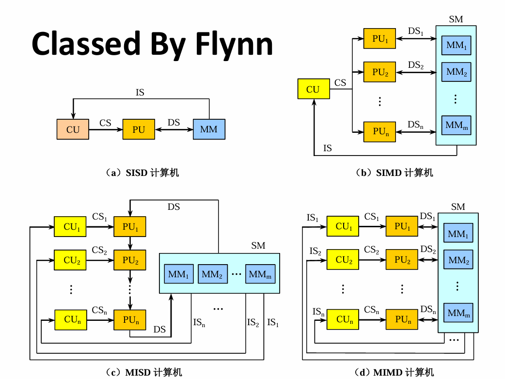
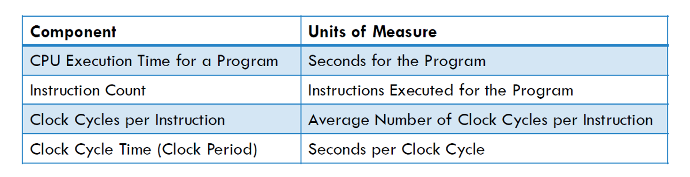

# Chapter1 Fundamentals of Quantitative Design and Analysis

***

## 1.1 Classes of Computers

**Classes by Flynn:**

* SISD: 单指令单数据流
* SIMD: 单指令多数据流
* MISD: 多指令单数据流
* MIMD: 多指令多数据流

**Classes by Textbook:**

* Desktop computers  
  个人电脑，又称PC
* Server computers  
  服务器，存放大量数据，有专用的硬件和软件
* Embedded computers  
  嵌入式，如各种家用电器等
* Personal mobile devices  
  移动端，如手机、平板等
* Supercomputers  
  超算，如神威太湖之光，有很多的小节点，每个小节点都是一台计算机

!!! Note
    国外要求嵌入式不能装第三方应用，但国内可以。这就导致国内的embedded computers和personal mobile devices归为一类。

***

## 1.2 Performance

**What Affects Performance:**

* Algorithm
* Programming language, compiler, architecture
* Processor and memory system
* I/O system and OS

**Measuring Performance:**

For single users on a PC:

* Minimization of response time
* Minimization of execution time

For large data:

* Maximization of throughput

!!! Success "Definition"
    **Response time 响应时间：**   
    又称Elapsed time，是从用户发出请求到系统做出响应的时间，包括处理I/O，调度等。  
    **Execution time 执行时间：**   
    又称CPU time，是CPU执行程序的时间，可分为**User CPU time**（在应用程序本身花的时间）和**System CPU time**（OS代表程序处理任务的时间）。

**Performance:**

$$\text{Performance}=\frac{1}{\text{Execution Time}}$$

If $x$ is $n$ times faster than $y$, then:

$$\frac{\text{Performance}_x}{\text{Performance}_y}=\frac{\text{Execution Time}_y}{\text{Execution Time}_x}=n$$

$$\text{Execution Time}=\text{CPU Clock Cycles}\times\text{Clock Time}=\frac{\text{CPU Clock Cycles}}{\text{Clock Rate}}$$

$$\text{CPI}=\frac{\text{CPU Clock Cycles}}{\text{IC}}$$

$$\text{Execution Time}=\frac{\text{IC}\times\text{CPI}}{\text{Clock Rate}}$$

!!! Example
    **Computer A: Cycle Time = 250ps, CPI = 2.0**
    **Computer B: Cycle Time = 500ps, CPI = 1.2**
    **Same ISA**
    **Which is faster, and by how much?**

    $\text{Execution Time}_A=\text{IC}\times\text{CPI}_A\times\text{Cycle Time}_A=1\times 2.0\times 250\text{ps}=500\text{ps}$
    $\text{Execution Time}_B=\text{IC}\times\text{CPI}_B\times\text{Cycle Time}_B=1\times 1.2\times 500\text{ps}=600\text{ps}$
    $\frac{\text{Performance}_A}{\text{Performance}_B}=\frac{600}{500}=1.2$

**CPI in More Detail:**

If different instruction classes take different numbers of cycles:

$$\text{Clock Cycles}=\sum_{i=1}^{n}\text{CPI}_i\times\text{IC}_i$$

Weighted average CPI:

$$\text{CPI}=\frac{\text{Clock Cycles}}{\text{IC}}=\sum_{i=1}^{n}(\text{CPI}_i\times\frac{\text{IC}_i}{\text{IC}})$$

!!! Note
    $\frac{\text{IC}_i}{\text{IC}}$称为**Relative frequency**。

!!! Example
    Class|A|B|C
    ---|---|---|---
    CPI for class|1|2|3
    IC in sequence1|2|1|2
    IC in sequence2|4|1|1

    sequence1:  
    IC = 5  
    Clock Cycles = 2 × 1 + 1 × 2 + 2 × 3 = 10  
    Avg.CPI = 10/5 = 2.0  

    sequence2:  
    IC = 6  
    Clock Cycles = 4 × 1 + 1 × 2 + 1 × 3 = 9  
    Avg.CPI = 9/6 = 1.5  

**Performance Summary:**

$$\text{Execution Time}=\frac{\text{Instructions}}{\text{Program}}\times\frac{\text{Clock Cycles}}{\text{Instruction}}\times\frac{\text{Seconds}}{\text{Clock Cycle}}$$

* Algorithm:  
  affects IC, CPI
* Programming language:  
  affects IC, CPI
* Compiler:  
  affects IC, CPI
* ISA:  
  affects IC, CPI, T

***

## 1.3 Amdahl's Law

$$\text{Improved Execution Time}=\frac{\text{Affected Execution Time}}{\text{Amount of Improvement}}+\text{Unaffected Execution Time}$$

$$T_{\text{improved}}=\frac{T_{\text{affected}}}{\text{improvement factor}}+T_{\text{unaffected}}$$

!!! Example
    **Multiply accounts for 80s/100s. How much improvement in multiply performance to get 5× overall?**

    $\frac{100}{5}=\frac{80}{n}+20$, impossible

从中可见Amdahl's Law还可以评估优化是否可行。

Amdahl's Law主要关注两个方面：

* $\text{Fraction}_{\text{enhanced}}$
* $\text{Speedup}_{\text{enhanced}}$

**Speedup:**

$$\text{Speedup}=\frac{\text{Performance for entire task}\_{\text{Using enhancement}}}{\text{Performance for entire task}\_{\text{Without enhancement}}}=\frac{\text{Total execution time}\_{\text{Without enhancement}}}{\text{Total execution time}\_{\text{Using enhancement}}}$$

以上是speedup的直接定义，若要考虑整体：

$$\text{Execution time}\_{\text{new}}=\text{Execution time}\_{\text{can not be enhanced}}+\text{Execution time}\_{\text{enhanced}}$$

$$=\text{Execution time}\_{\text{old}}\times[(1-\text{Fraction}\_{\text{enhanced}})+\frac{\text{Fraction}\_{\text{enhanced}}}{\text{Speedup}\_{\text{enhanced}}}]$$

$$\text{Speedup}\_{\text{overall}}=\frac{\text{Execution time}\_{\text{old}}}{\text{Execution time}\_{\text{new}}}=\frac{1}{(1-\text{Fraction}\_{\text{enhanced}})+\frac{\text{Fraction}\_{\text{enhanced}}}{\text{Speedup}\_{\text{enhanced}}}}$$

我们发现：不管怎样提高$\text{Speedup}\_{\text{enhanced}}$，$\frac{\text{Fraction}\_{\text{enhanced}}}{\text{Speedup}\_{\text{enhanced}}}$这一项始终大于0，因此可以得到重要推论：

$$\text{Speedup}\_{\text{overall}}<\frac{1}{1-\text{Fraction}\_{\text{enhanced}}}$$