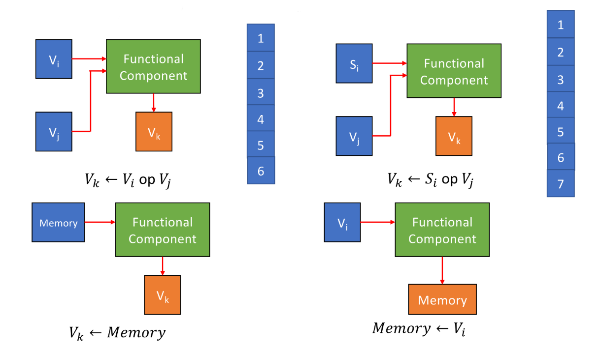
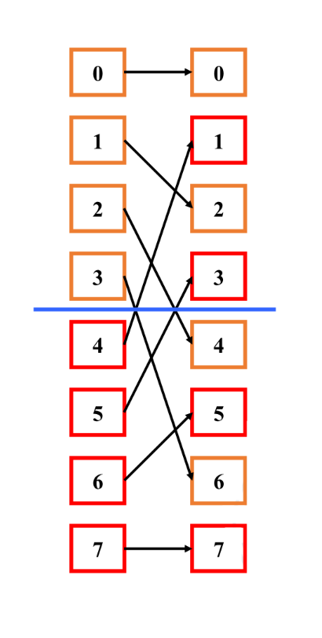

<span style="font-family: 'Times New Roman';">

# Chapter10 DLP and SIMD

***

## 10.1 Vector Processor

**Processing Methods:**

* horizontal processing method: 按顺序依次处理
* vertical processing method: 同一层级的计算并行处理
* vertical and horizontal processing method: 对长向量进行划分，每一部分内部纵向处理，整体上横向处理

例如，计算$D=A\times(B+C)$，每一个向量长度为$N$。

horizontal processing method:

* $d_1\leftarrow a_1\times(b_1+c_1)$
* $d_2\leftarrow a_2\times(b_2+c_2)$
* ...
* $d_N\leftarrow a_N\times(b_N+c_N)$

每一个$d_i$的计算涉及到一次加法和一次乘法，加法和乘法之间有数据依赖。总共有$N$个数据依赖，进行$2N$次功能切换。

vertical processing method:

* $K\leftarrow B+C$
* $D\leftarrow A\times K$

向量内部的每一个元素的计算可以并行执行。总共有$1$个数据依赖，进行$2$次功能切换。

vertical and horizontal processing method:

假设每$n$个元素一组，$N=S\times n+r$，则一共$S+1$组。总共有$S+1$次数据依赖，进行$2S+2$次功能切换。

$~$

**CRAY-1:**


$~$

**Instruction Types:**

* 向量与向量的运算（6拍）
* 向量与标量的运算（7拍）
* 从内存中读向量（6拍）
* 向内存中写向量（6拍）



!!! Note
    这里的拍数指的是得到第一个元素/转移第一个元素的时间。由于向量处理器内部是有流水线的，因此在第一个元素计算出来之后，每过一拍出下一个元素。例如，单纯考虑一个操作，$N$位的向量相加一共需要$6+(N-1)$拍。

$~$

**Improve the Performance of Vector Processor:**

* 对于不同功能单元增加硬件数量
* 向量链接技术（vector chaining technology）
* 循环开采技术（recycling mining technology）
* 多处理器系统

$~$

**Vector Chaining Technology:**

将多个向量指令的执行过程重叠，前一条指令的部分结果可立即被下一条指令使用，无需等待全部完成。

仍以之前的$D=A\times(B+C)$为例，假设$B$和$C$都已经提前存放到寄存器$V_0$和$V_1$中，总共需要以下三条指令：

* $V_3\leftarrow\text{memory}$：从内存中读向量$A$到寄存器$V_3$。
* $V_2\leftarrow V_0+V_1$：将寄存器$V_0$和$V_1$中的向量相加，结果存放到寄存器$V_2$。
* $V_4\leftarrow V_3\times V_2$：将寄存器$V_3$和$V_2$中的向量相乘，结果存放到寄存器$V_4$。


!!! Note
    这里还有假设：

    * 把向量元素转移到功能单元需要额外一拍；
    * 将计算结果存回寄存器需要额外一拍；
    * 访存操作前的延迟需要额外一拍。

    简单来说，就是每条指令在原有基础之上前后各增加一拍。

如果三条指令顺序执行：

$$[(1+6+1)+(N-1)]+[(1+6+1)+(N-1)]+[(1+7+1)+(N-1)]=3N+22$$

如果指令1和指令2并行，然后顺序执行指令3：

$$\max\\{[(1+6+1)+(N-1)],[(1+6+1)+(N-1)]\\}+[(1+7+1)+(N-1)]=2N+15$$

如果在上面的基础上采用向量链接技术：

当$V_0+V_1$的第一个元素计算出来后就可以参与指令3，而无需等待$V_0+V_1$的所有元素都计算出来。

$$\max\\{(1+6+1),(1+6+1)\\}+(1+7+1)+(N-1)=N+16$$

!!! Warning
    不知道为什么指令3在例题中需要7拍，而不是6拍。

$~$

***

## 10.2 Array Processor

多核系统下，不同CPU由阵列机组织在一起。

最常见的结构如下：


处理器形成8×8的处理器阵列，指令通过广播的方式传递。

$~$

**Processor and Memory:**

distributed memory：每个处理器都有一个高优先级的内存。


centralized shared memory：每个处理器对于所有内存的访问优先级相同。


$~$

### Interconnection Network

网络的作用是连接不同的处理器和内存。

$~$

**Classification of Interconnection Network:**

* static network: 初始化后就无法改变网络连接情况
* dynamic network：随着系统运行可以改变网络连接情况

$~$

### Single-Stage Interconnection Network

形式化定义：$N$个节点，函数$f$将其连接，使得任意两个节点直接或间接相连，这里的节点可以是处理器，也可以是内存。

$~$

**Cube Network:**

将$N$编码为二进制，一共$n$位（$n=\log N$），因此每一个节点表示为$P_{n-1}...P_i...P_1P_0$

函数$f$一共有$n$个，其中$0\leqslant i\leqslant n-1$：

$$Cube_i(P_{n-1}...P_i...P_1P_0)=P_{n-1}...\overline{P_i}...P_1P_0$$

我们以8个节点为例：

首先根据$Cube_0$进行连接：


然后根据$Cube_1$进行连接：


最后根据$Cube_2$进行连接：


通过以上三次连接，每个节点都与其他节点直接或间接相连，最远相差$3$条线，推广到一般情况是$n$条线：


通过这个例子，我们也可以得知“Cube”这个名字的由来。

$~$

**PM2I Network:**

同样使用上面定义的$n$，函数$f$一共有$2n$个，但实际上$i=n-1$时对应的两个一样，其中$0\leqslant i\leqslant n-1$：

$$PM2_{+i}(j)=(j+2^i)\mod N$$

$$PM2_{-i}(j)=(j-2^i)\mod N$$

仍然以8个节点为例：


每两个节点最远相差$2$条线，推广到一般情况是$n-1$条线。

$~$

**Shuffle Exchange Network:**

同样使用上面定义的$n$，函数$f$分成shuffle和exchange两部分。

对于shuffle部分：

$$shuffle(P_{n-1}P_{n-2}...P_1P_0)=P_{n-2}...P_1P_0P_{n-1}$$

只需要进行一次shuffle：



对于exchange部分，实际上就是$Cube_0$：

$$exchange(P_{n-1}P_{n-2}...P_1P_0)=P_{n-1}...P_1\overline{P_0}$$

也只需要进行一次exchange，得到结果：


每两个节点最远相差$2n-1$条线，也就是最小的节点和最大的节点之间的距离。

$~$

### Multi-Stage Interconnection Network

将单极网络串联在一起就形成了多级网络。


$~$

**Switch:**

一个记为$m\times n$的开关有$m$个输入端口和$n$个输出端口。

一个$2\times 2$的双功能开关：


一个$2\times 2$的四功能开关：


$~$

**Three-Stage Cube Network:**


三层对应的$f$分别是$Cube_0$，$Cube_1$和$Cube_2$。

这里假设开关都是$2\times 2$的双功能开关，并且采用级控制（每一层的开关状态保持一致），那么整体的网络连接布局一共有$2^3=8$种。


纵轴表示节点，横轴表示开关状态，因此表格展示的是在不同开关状态下的节点连接情况。

$~$

**Loop-Level Parallelism:**

循环有时候可以看作向量的运算，只要循环之间没有依赖就行。

例如：

```c
for(i=999;i>=0;i--)
    x[i]=x[i]+s;
```

这个循环之间就是没有依赖的。

```c
for(i=0;i<100;i++)
{
    A[i+1]=A[i]+C[i];
    B[i+1]=B[i]+A[i+1];
}
```

这个循环之间就是有依赖的。

我们可以通过改写，将有依赖的循环改成无依赖的循环。例如：

```c
//改写前：有依赖
for(i=0;i<100;i++)
{
    A[i]=A[i]+B[i];
    B[i+1]=C[i]+D[i];
}

//改写后：无依赖
A[0]=A[0]+B[0];
for(i=0;i<99;i++)
{
    B[i+1]=C[i]+D[i];
    A[i+1]=A[i+1]+B[i+1];
}
B[100]=C[99]+D[99];
```