

# Chapter11 TLP and MIMD

***

## 11.1 Shared Memory System

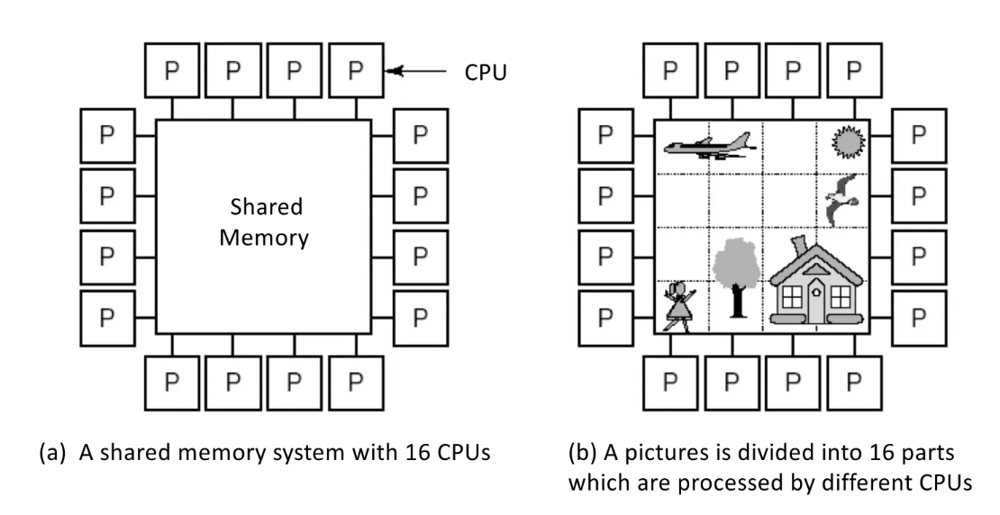

$~$

**Uniform Memory Access (UMA):**

所有处理器对任何内存的访问都没有偏好。

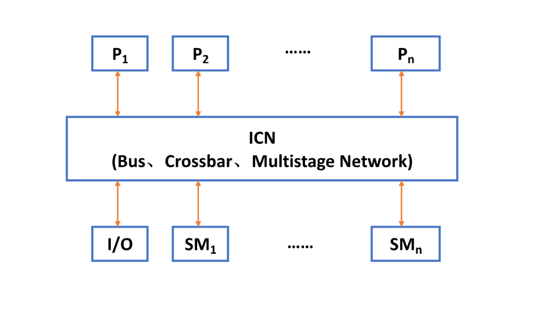

$~$

**Non Uniform Memory Access (NUMA):**

每个处理器都有自己对应的本地内存，虽然能访问所有内存，但访问本地内存的速度更快。

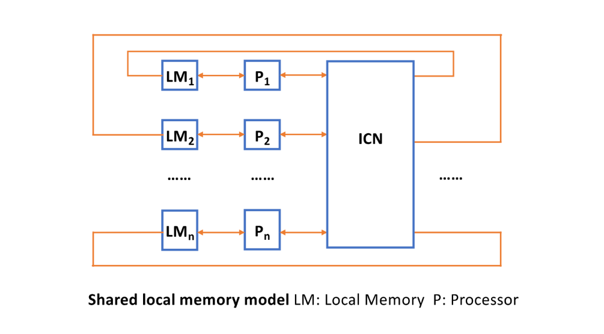

NUMA又分成**NC-NUMA**和**CC-NUMA**。前者没有缓存，后者有缓存。

!!! Note
    关于UMA和NUMA，在不同书中有不同的叫法。UMA又称为**symmetric multiprocessor (SMP)**或**centralized shared-memory multiprocessor**，NUMA又称为**distributed shared-memory multiprocessor (DSP)**。

$~$

**Cache Only Memory Access (COMA):**

没有内存，只有缓存。

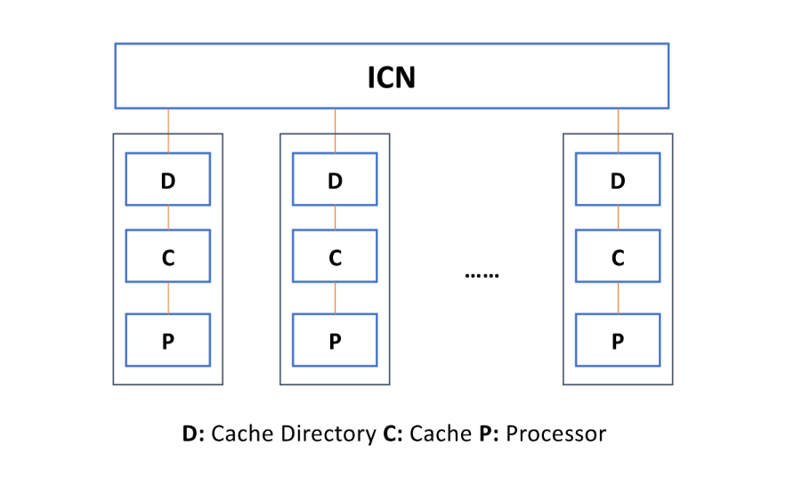

$~$

***

## 11.2 Message Passing System

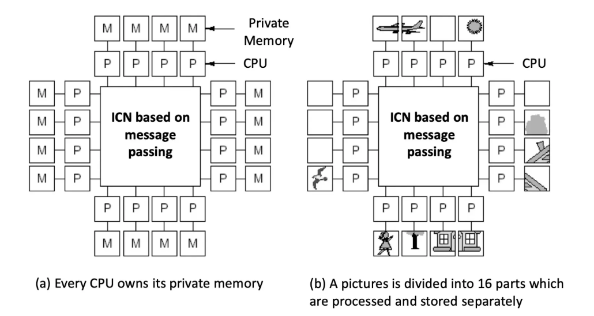

$~$

***

## 11.3 Cache Coherence

**memory consistency**和**cache coherence**中文翻译过来都被笼统地称为一致性，但两者有很大差别。

memory consistency指的是不同CPU对内存的访问有读写顺序的约束。例如，本来第一个CPU写数据，第二个CPU读数据，读到的是之前写入的数据；但如果第二个CPU错误地先进行了读取，就会破坏一致性。

cache coherence见下面的例子：

例如，CPU A和B有各自的缓存和公共的内存。A和B先后从内存读出数据X的内容（0）写到缓存上，之后A修改X的内容为1，采用write through的策略同时更改了自己的缓存和内存，然而此时B的缓存中X的值仍为0，这就造成了不一致的情况。

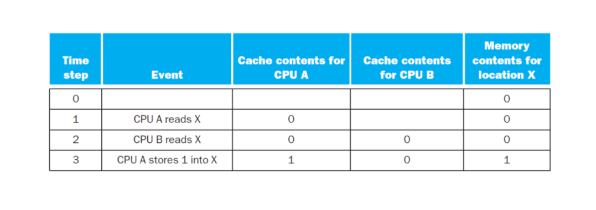

$~$

**Snoopy Coherence Protocol:**

适用于处理UMA的cache coherence问题的协议。

如果采用write through的策略，会有以下四种读写情况：

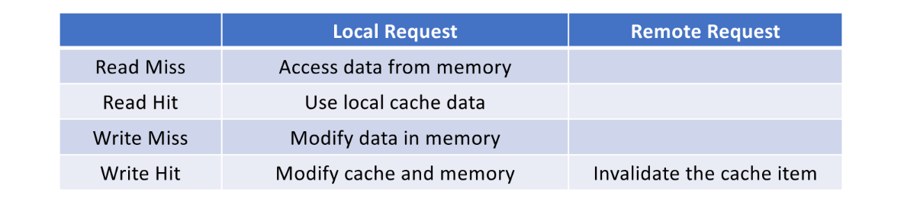

如果采用write back的策略：

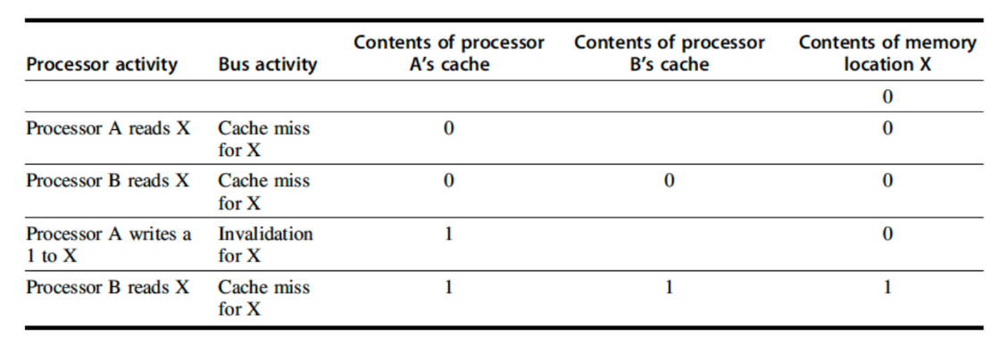

前三行和之前一致。第四行A只更新了自己的缓存，然后通过总线传递X无效的信号。第五行B要读的时候，发现自己的缓存中X无效了，因此miss，然后去内存上读，发现也无效，这个时候需要将A的缓存中的X写回内存，B再去读。

具体要怎么实现？这里我们给每一个cache的block加上状态（**MSI protocol**）：

* invalid：该block未被使用或者数据不是最新的
* shared：该block持有和内存一致的数据且为最新
* modified (exclusive)：该block持有最新数据，但和内存不一致

!!! Note
    对于同一个地址的数据，当一个cache中是modified状态时，其他cache中就不可能有对应的shared状态存在；当一个cache中是shared状态时，其他cache中就不可能有对应的modified状态存在。

    但是，两个cache中同一个位置的block可能一个是shared状态，另一个是modified状态，因为二者的对应地址可能不同。

!!! Note
    这里的状态只是针对数据的有效性和一致性，对于是否命中没有关联，因为需要考虑地址冲突。例如shared状态的block中的数据是和内存一致且最新的，但不一定就是想要的数据，因为多个地址可能对应到同一个block，然后在判断tag时发现不是目标地址。（shared block中的是地址A的最新数据而不是地址B的）

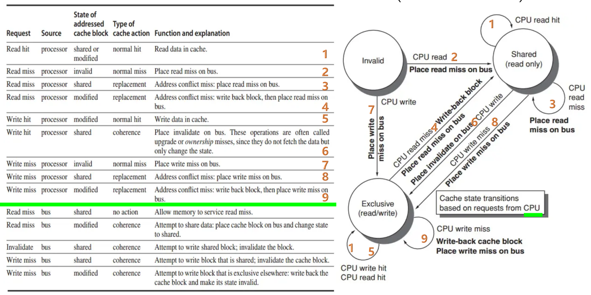

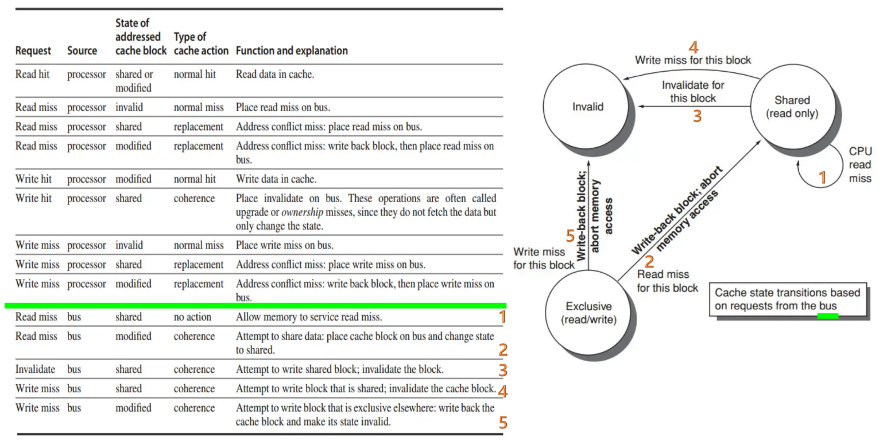

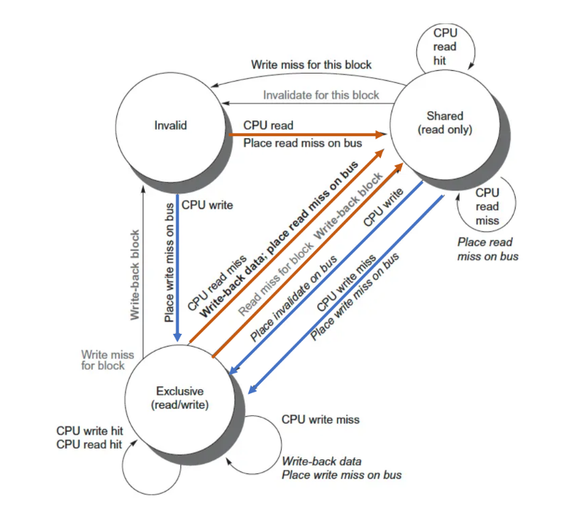

!!! Example
    **在下图的整体状态下，分别执行：**

    * **C0, R, A100**
    * **C0, R, A10C**
    * **C1, W, A104, 0204**
    * **C0, W, A118, 0308**

    **会发生怎样的改变，注意这些指令不是顺序执行，而是分别考虑。**

    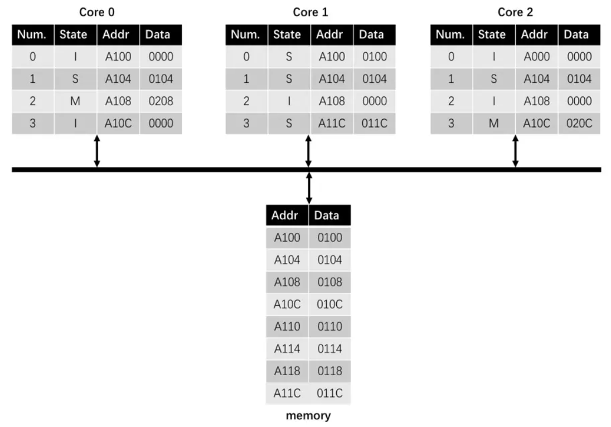

    **C0, R, A100:**

    C0 read miss  
    memory returns 0100 to c0  
    C0.0(S, A100, 0100)  

    **C0, R, A10C:**

    C0 read miss  
    C2 write back A10C  
    memory A10C, 010C → 020C  
    C2.3(S, A10C, 020C)  
    memory returns 020C to C0  
    C0.3(S, A10C, 020C)  
    
    **C1, W, A104, 0204:**

    C1 write hit  
    C0 invalidation  
    C0.1(I, A104, 0104)  
    C2 invalidation  
    C2.1(I, A104, 0104)  
    C1.1(M, A104, 0204)  

    **C0, W, A118, 0308:**

    C0 write miss  
    C0 write back A108  
    memory A108, 0108 → 0208  
    memory returns 0118 to C0  
    C0.2 (M, A118, 0118)  
    C0.2 (M, A118, 0308) a

**Directory Protocol:**

适用于处理NUMA的cache coherence问题的协议。