<span style="font-family: 'Times New Roman';">

# Chapter2 Instruction-Level Parallelism (ILP)

***

## 2.1 Instruction Conflicts

**Data Dependences:**

```asm
FLD F0, 0(R1)
FADD.D F4, F0, F2
```

前面指令的目标寄存器是后面指令的源寄存器（`F0`），这种依赖关系称为**RAW (Read After Write)**。

**Name Dependences:**

情况一：

```asm
FDIV.D F2, F6, F4
FADD.D F6, F0, F12
FSUB.D F8, F6, F14
```

前面指令的源寄存器是后面指令的目标寄存器（`F6`），这种依赖关系称为**WAR (Write After Read)**。

这种情况的name dependence称为**anti-dependence（反相关）**，对于顺序执行的流水线没有问题，但乱序会有问题。解决方法之一是重命名：

```asm
FDIV.D F2, F6, F4
FADD.D S, F0, F12
FSUB.D F8, S, F14
```

情况二：

```asm
FDIV.D F2, F6, F4
FADD.D F6, F0, F12
FSUB.D F2, F6, F14
```

前面指令的目标寄存器是后面指令的目标寄存器（`F2`），这种依赖关系称为**WAW (Write After Write)**。

这种情况的name dependence称为**output-dependence（输出相关）**，对于顺序执行的流水线没有问题，但乱序会有问题。解决方法之一同样也是重命名：

```asm
FDIV.D F2, F6, F4
FADD.D F6, F0, F12
FSUB.D S, F6, F14
```

**Hazards:**

* Structure hazards
* Data hazards  

    * RAW
      ```asm
      FADD.D F6, F0, F12
      FSUB.D F8, F6, F14
      ```
    * WAR
      ```asm
      FDIV.D F2, F6, F4
      FADD.D F6, F0, F12
      ```
    * WAW
      ```asm
      FDIV.D F2, F0, F4
      FSUB.D F2, F6, F14
      ```

* Control hazards

**Dynamic Branch Prediction:**

* branch prediction buffer (BPB)  
  存储branch预测结果（branch history table）
* branch target buffer (BTB)  
  存储branch目标地址
* translation lookaside buffer (TLB)  
  虚拟内存地址转换

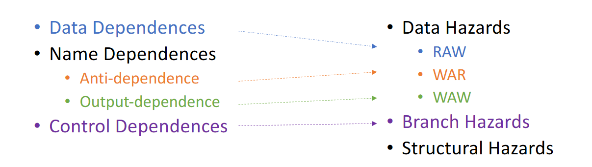

***

## 2.2 Scoreboard Algorithm

Scoreboard Algorithm是一种指令乱序执行的算法。

**操作一：**

**将EX阶段的计算元件进行拆分，得到执行单一功能的元件，从而允许并行。**

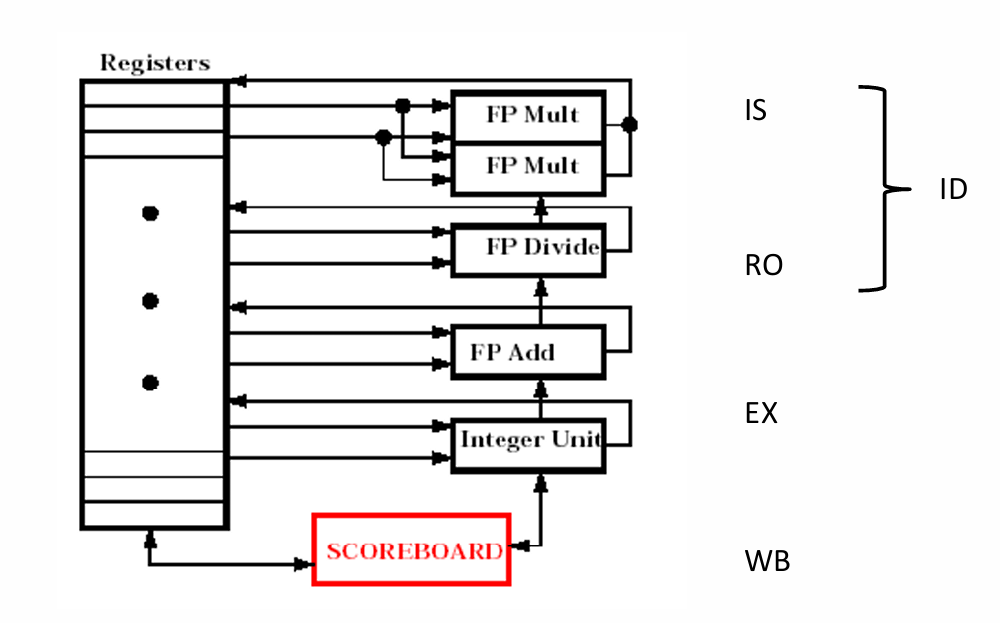

如上图所示，一共有以下几个功能部件：

* Integer unit：处理整数运算
* FP add：处理浮点数加减法
* FP mult：处理浮点数乘法
* FP div：处理浮点数除法

!!! Note
    上图中的乘法部件有两个，这是因为乘法的计算时间较长，更多部件能加快计算。  
    除法虽然与乘法一样有很长的计算时间，但由于除法使用较少，因此只有一个除法部件。

**操作二：**

**将ID阶段拆分成两个阶段：**

* IS (Issue):
  只有当前指令与其他指令没有**结构冲突**时才能进入IS阶段
* RO (Read Operands):
  只有当前指令与其他指令没有**数据冲突**时才能进入RO阶段

假设有以下指令：

```asm
① FLD     F6,34(R2)
② FLD     F2,45(R3)
③ FMUL.D  F0,F2,F4
④ FSUB.D  F8,F6,F2
⑤ FDIV.D  F10,F0,F6
⑥ FADD.D  F6,F8,F2
```

现在来考虑其乱序执行过程。

首先，指令①依次完成IS、RO、EX、WB阶段，**直到WB阶段完成后才能释放部件**。这时指令②才不会有结构冲突，才能进入IS阶段，因为指令②和指令①使用相同的部件（Integer unit）。

接下来，指令②依次完成IS、RO、EX阶段。假设其WB阶段的时间较长，一直处在WB阶段，我们来观察其他指令的情况。

指令③没有结构冲突，因此完成IS阶段；但指令③的源寄存器`F2`和指令②的目标寄存器`F2`发生数据冲突（指令②还没有将正确的值写入`F2`），因此指令③停在IS阶段。

指令④和指令⑤同理，其都没有结构冲突，但都有数据冲突，因此都停在IS阶段。

指令⑥与指令④使用相同的部件（FP add），指令④占用着资源但并没有完成，因此产生结构冲突，指令⑥无法进入IS阶段。

**操作三：**

**绘制三张表：**

①指令状态表：表示每条指令的执行情况。


②功能部件状态表：表示每个功能部件的占用情况。

* Name列：功能部件
* Busy列：当前是否被占用
* Op列：如果被占用，占用的指令（操作）是什么
* Fi列：目标寄存器
* Fj、Fk列：源寄存器
* Qj、Qk列：源寄存器的值是否需要等待，若已经就绪则为空，否则标明需要从哪个功能部件上获取
* Rj、Rk列：
  * yes：表示值已经准备就绪，只是还没读（可能还在等其他操作数就绪）
  * no+对应的Q为空：表示值已读
  * no+对应的Q非空：表示值还没有准备就绪

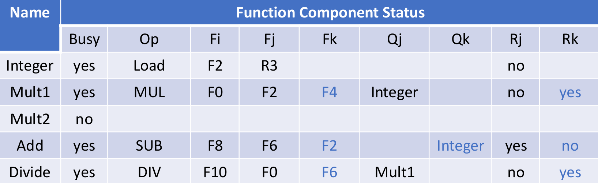

③目标寄存器状态表：表示每个目标寄存器的对应情况，实际上都包含在功能部件状态表中。

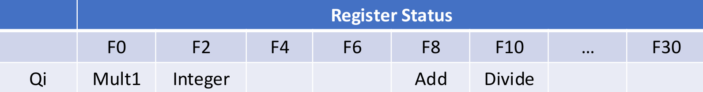

假设指令②完成了WB阶段，并且指令③完成了IS、RO、EX阶段，处在WB阶段正在写回，我们来观察其他指令的情况。

指令④此时没有数据冲突（因为指令②已经将正确的值写入`F2`），因此其能够进入RO阶段，如果其运行的速度够快，则有可能比指令③更早完成WB阶段（假设确实如此）。

指令⑤此时依然有数据冲突，因为指令③还没有将正确的值写入`F0`，因此其停在IS阶段。

指令⑥此时没有结构冲突或数据冲突（因为我们假定指令④已经完成），因此其能够完成IS、RO、EX阶段，但其不能进入WB阶段，因为如果其将结果写入`F6`，会导致指令⑤出错。


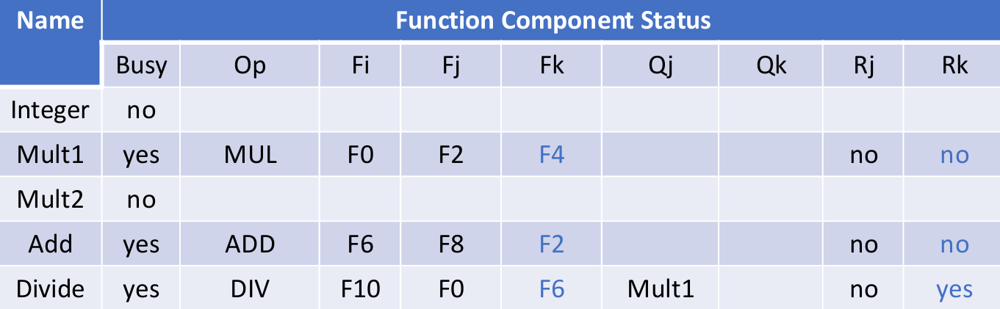


假设指令③完成了WB阶段，如果指令⑤完成了IS、RO、EX阶段，停在WB阶段准备读写，由于指令⑤的`F6`在RO阶段已经读取，因此指令⑥可以完成WB阶段，比指令⑤更早完成。

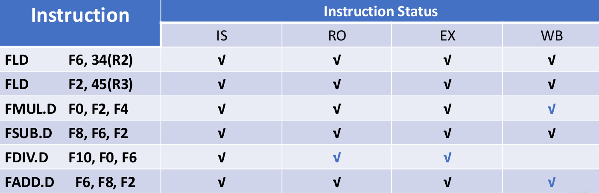

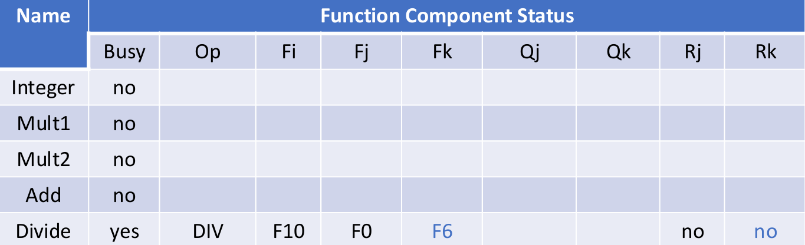

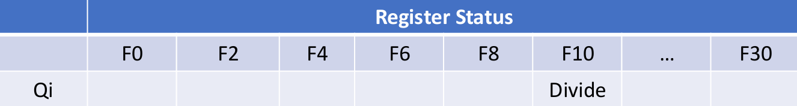

!!! Example
    **假设对于EX阶段，`Add`操作需要2个时钟周期，`Multiply`操作需要10个时钟周期，`Divide`操作需要40个时钟周期，`Load`操作需要1个时钟周期。考虑以下指令：**

    ```asm
    ① FLD     F6,34(R2)
    ② FLD     F2,45(R3)
    ③ FMUL.D  F0,F2,F4
    ④ FSUB.D  F8,F6,F2
    ⑤ FDIV.D  F10,F0,F6
    ⑥ FADD.D  F6,F8,F2
    ```

    **总共需要多少个时钟周期？**

    $~$|IS|RO|EX|WB
    :---:|:---:|:---:|:---:|:---:
    **①**|1|2|3|4
    **②**|5|6|7|8
    **③**|6|9|10|20
    **④**|7|9|10|12
    **⑤**|8|21|22|62
    **⑥**|13|14|15|22

    注：表格中的数字表示该指令在第几个周期进入该阶段。

    

!!! Note
    要点：

    * 进入IS阶段要判断：是否有空闲的功能部件
    * 进入RO阶段要判断：源寄存器是否有数据冲突，即之前的指令还没有将其正确值写入
    * 进入EX阶段无需判断
    * 进入WB阶段要判断：如果写回目标寄存器是否会影响之前指令的正误

    注意：

    * 指令只有完成WB阶段后才会释放资源，而不是在完成EX阶段后
    * IS阶段一个周期只能进入一条指令，并且要按照顺序，而RO、EX、WB阶段可以同时进入指令
  
***

## 2.3 Tomasulo Algorithm

Tomasulo Algorithm是Scoreboard Algorithm的一种改进，分为结构冲突和数据冲突两个方面的改进。

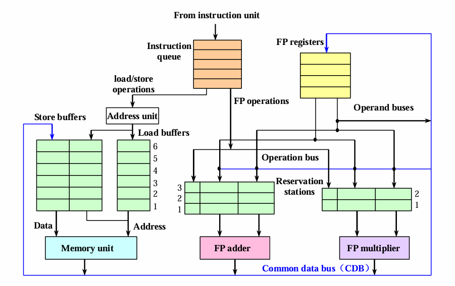

**结构冲突的改进：保留栈**

绿色的buffer为每一种执行部件对应的**保留栈**。当一条指令被译码之后，便能得知其对应的部件。在原本的Scoreboard Algorithm中，如果对应的部件被占用，那么就算占用的指令的源操作数还没准备好，当前的指令也还是需要等待。而在Tomasulo Algorithm中，只要对应部件的保留栈有空位，那么当前这条指令就可以被放入保留栈。

各个部件从各自的保留栈中寻找可以执行的指令，保留栈中的所有指令如果有哪个的源操作数已经准备好，就执行哪一个。Tomasulo Algorithm在这里实现了乱序执行。

!!! Note
    乘法器的保留栈比加法器更小，是因为加法操作比乘法操作更常见。

**数据冲突的改进：CDB总线**

蓝色的线是**CDB总线**，在得到计算结果后像广播一样将其传到所有需要更新的地方，包括寄存器和保留栈上某些指令的源操作数。实现了从集中控制到分布控制。

Tomasulo Algorithm只有IS、EX和WB三个阶段，当保留栈有空位时进入IS阶段，当源操作数就位时进入EX阶段。

* IS阶段：
  * 指令顺序流入
  * 如果当前指令对应的保留栈有空位，则放入保留栈；否则表示结构冲突，无法进入IS阶段
  * 如果源操作数已经准备就绪，则直接载入对应的值；如果源操作数还要等待之前指令的计算与写入，则用等待的指令所在保留栈的名称替换源寄存器的名称，相当于重命名
* EX阶段：
  * 当源操作数准备就绪后，进入EX阶段
  * Load指令和Store指令的EX阶段需要两步：第一步是计算有效地址，第二步是将有效地址放入对应的buffer中
* WB阶段：
  * 得到有效的计算结果后，通过CDB总线同时传递到对应的寄存器和保留栈上

例如：假设有先后两条指令`MUL`和`ADD`。

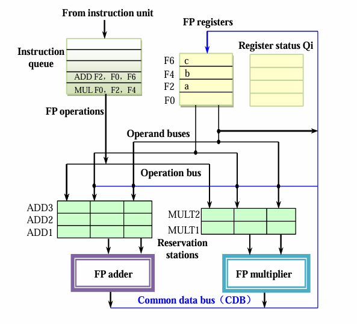

由于FP multiplier的保留栈有空位，因此`MUL`载入保留栈MULT1。

由于`MUL`的源操作数已经准备就绪，因此`F2`的值a和`F4`的值b也被载入保留栈。

`MUL`的目标寄存器为`F0`，其对应的Register status Qi（结果寄存器表）记录下MULT1，相当于记录下MULT1和`F0`的对应关系。    

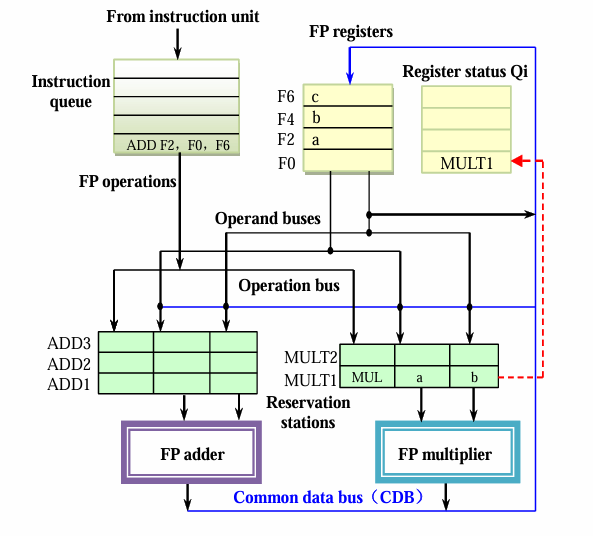

由于FP adder的保留栈有空位，因此`ADD`载入保留栈ADD1。
    
由于`ADD`的其中一个源操作数`F6`的值c已经准备就绪，因此该值直接载入保留栈；另一个源操作数为MULT1的结果，因此`ADD`的另一个源操作数重命名为MULT1。
    
同理，记录下ADD1和`F2`的对应关系。    

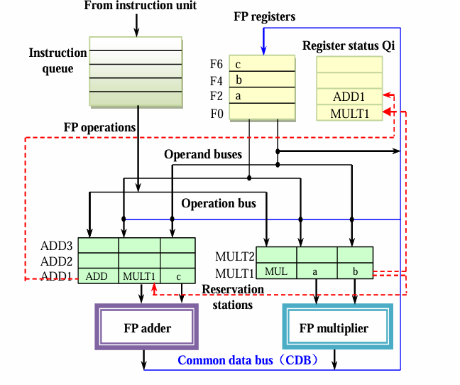

当`MUL`计算完成后，通过CDB总线将所有引用MULT1的地方都换成计算结果e，一个是ADD1的源操作数，另一个是`F0`寄存器的值。

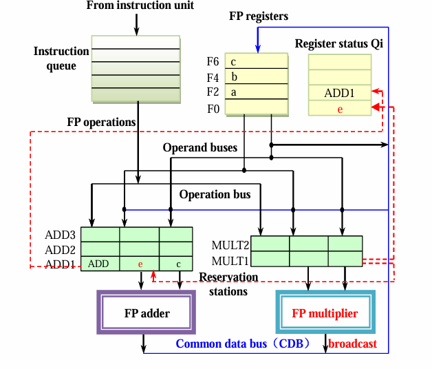


假设有以下指令：

```asm
① FLD     F6,34(R2)
② FLD     F2,45(R3)
③ FMUL.D  F0,F2,F4
④ FSUB.D  F8,F6,F2
⑤ FDIV.D  F10,F0,F6
⑥ FADD.D  F6,F8,F2
```

现在来考虑其乱序执行过程。

首先，假设指令①依次完成IS、EX、WB阶段。指令②依次完成IS、EX阶段，但还没有完成WB阶段。

后面的指令能否进入IS阶段，取决于保留栈是否有空位，与前面的指令无关。假设保留栈无限，那么后面四条指令都可以被载入保留栈，即进入IS阶段，指令③、④、⑤、⑥所在的保留栈（指令重命名）分别为MULT1、ADD1、MULT2、ADD2。

但每条指令的源操作数都有需要等待的部分，因此都无法进入EX阶段。

Tomasulo Algorithm同样需要三张表，分别为指令状态表、保留栈状态表和目标寄存器状态表。

其中，保留站状态表与Scoreboard Algorithm的功能部件状态表存在一定差别：

* Name列：保留栈名称
* Busy列：当前是否被占用
* Op列：如果被占用，占用的指令（操作）是什么
* Vj、Vk列：可以直接载入的源操作数
* Qj、Qk列：需要等待的重命名的源操作数
* A列：访存的有效地址（针对Load和Store）

以下为当前状态对应的三张表：

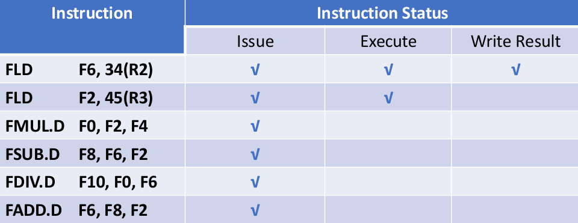

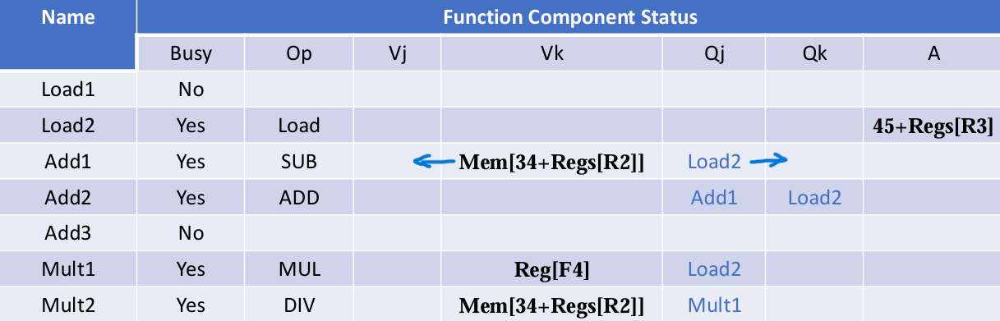

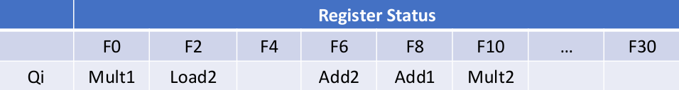

接着，假设指令②完成WB阶段，指令③能够进入并完成EX阶段，假设其还没有完成WB阶段。

指令④的源操作数都得到了，可以进入EX阶段，假设其完成了EX阶段和WB阶段，则其就比指令③更快，也就完成了乱序（假设确实如此）。

指令⑤还在等指令③的`F0`，因此其仍无法进入EX阶段。

指令⑥的源操作数都得到了，可以进入EX阶段，也能够完成EX阶段和WB阶段，比指令⑤更早完成。这里与Scoreboard Algorithm的不同之处在于，指令⑥的写回无需等待，因为指令⑤的源操作数在IS阶段已经从`F6`中读到了。

以下为当前状态对应的三张表：

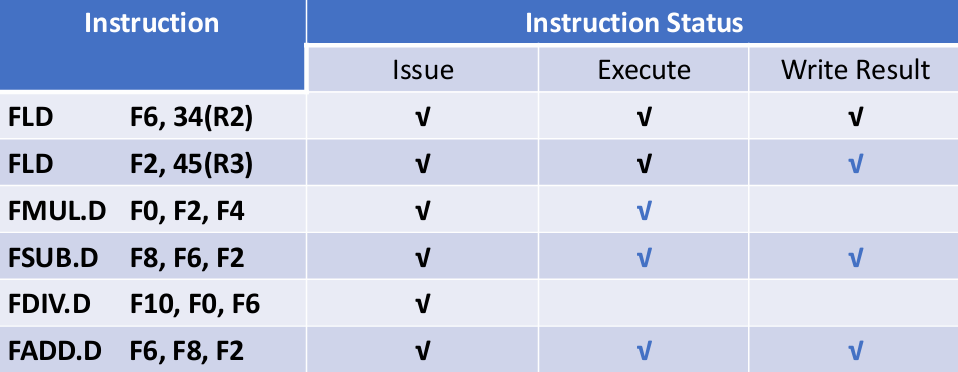

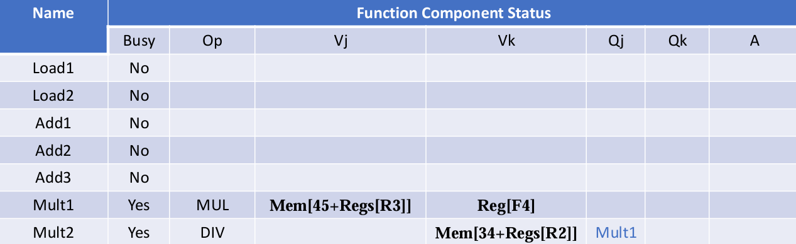

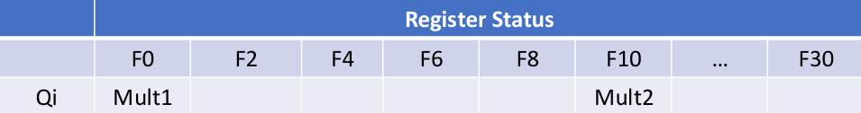

!!! Example
    **假设对于EX阶段，`Add`操作需要2个时钟周期，`Multiply`操作需要10个时钟周期，`Divide`操作需要40个时钟周期，`Load`操作需要1个时钟周期。假设保留栈无限（没有结构冲突），`Load`操作在原有的基础上会多一个时钟周期（在EX阶段会有一个额外的地址计算）。考虑以下指令：**

    ```asm
    ① FLD     F6,34(R2)
    ② FLD     F2,45(R3)
    ③ FMUL.D  F0,F2,F4
    ④ FSUB.D  F8,F6,F2
    ⑤ FDIV.D  F10,F0,F6
    ⑥ FADD.D  F6,F8,F2
    ```

    **总共需要多少个时钟周期？**

    $~$|IS|EX|WB
    :---:|:---:|:---:|:---:
    **①**|1|2|4
    **②**|2|3|5
    **③**|3|6|16
    **④**|4|6|8
    **⑤**|5|17|57
    **⑥**|6|9|11

    注：表格中的数字表示该指令在第几个周期进入该阶段。

    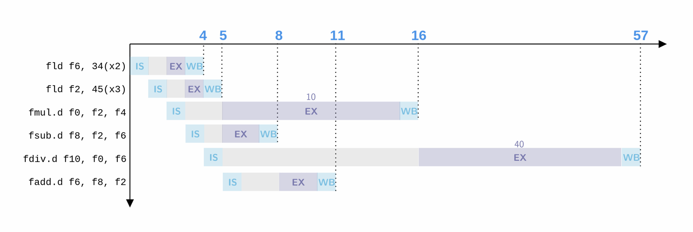

!!! Note
    要点：
    
    * 进入IS阶段要判断：对应的保留栈是否有空位
    * 进入EX阶段要判断：源操作数是否准备就绪，对应的功能部件是否空闲
    * 进入WB阶段无需判断

***

## 2.4 Hardware-Based Speculation

Hardware-Based Speculation是在Tomasulo Algorithm基础上的进一步改进，能够使指令乱序执行，但顺序流出。

硬件上的变化是，在执行之后新增了一个buffer；

逻辑上的变化是，在WB阶段后新增了一个Commit阶段。

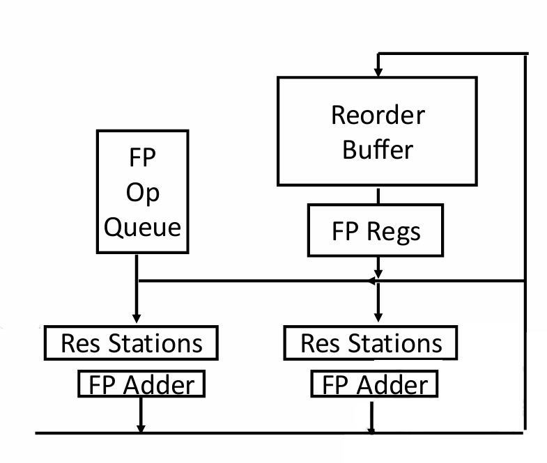

计算结果通过CDB总线进行传播，其中，原本指向寄存器的分支现在指向了**Reorder Buffer（ROB）**。

在ROB中的结果写回到寄存器是有顺序的，按照指令最开始的顺序依次写回，起到顺序流出的功能。

!!! Note
    ROB不仅保存着指令执行的结果，还有指令执行的所有状态。

硬件上的变化带来的是程序执行上的变化。在Tomasulo Algorithm中，WB阶段就能将结果写回寄存器，但在Hardware-Based Speculation中，WB阶段只是将结果写入ROB，Commit阶段才将ROB中的结果写回寄存器，且要等序号在前的指令提交完才能进行。

在Hardware-Based Speculation中，指令可以预先处理完再等待提交，如果发现问题，可以选择不提交，这就是预测的意义。

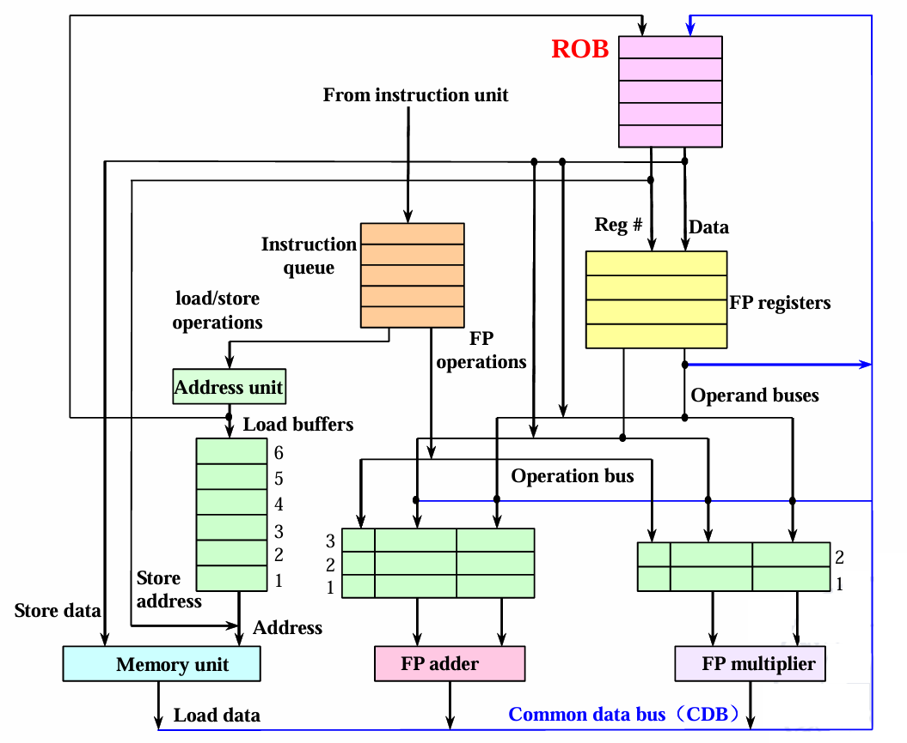

!!! Note
    在保留栈的指令的目标操作数要对应到ROB。

为什么要在Tomasulo Algorithm的基础上进行Hardware-Based Speculation？主要针对的是动态分支预测的加速。

假设有以下指令：

```asm
① FLD     F6,34(R2)
② FLD     F2,45(R3)
③ FMUL.D  F0,F2,F4
④ FSUB.D  F8,F6,F2
⑤ FDIV.D  F10,F0,F6
⑥ FADD.D  F6,F8,F2
```

现在来考虑其乱序执行过程。

首先，假设指令③正处于WB阶段，也就是正在传输数据结果。

由于指令③需要用到`F2`，所以指令①和指令②一定已经完成了。

由于保留栈有空位，因此指令④、⑤、⑥可以进入IS阶段。由于指令④和指令⑥并不依赖指令③的数据，因此没有数据冲突，顺利的话可以直接完成EX阶段和WB阶段，但停留在Commit阶段，因为指令③还没有提交。

指令⑤依赖指令③的数据，因此其还停留在IS阶段。

此时此刻，保留栈中还剩两条指令。一条是指令③，因为正在写回；另一条是指令⑤，因为还没有进入EX阶段。

Hardware-Based Speculation同样需要三张表，分别为保留栈状态表、ROB状态表（相当于指令状态表）和目标寄存器状态表。


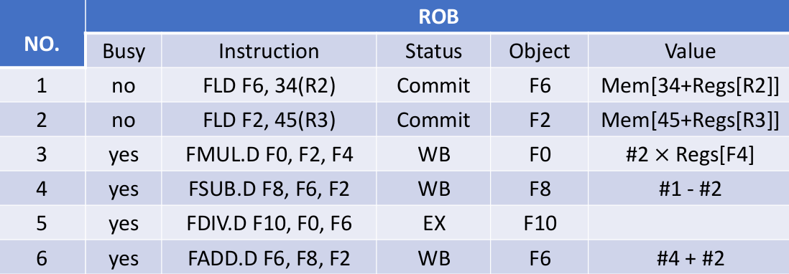

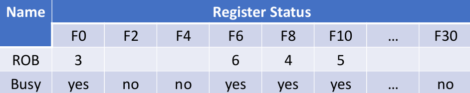

!!! Example
    **假设对于EX阶段，`Add`操作需要2个时钟周期，`Multiply`操作需要10个时钟周期，`Divide`操作需要40个时钟周期，`Load`操作需要1个时钟周期。假设保留栈无限（没有结构冲突），`Load`操作在原有的基础上会多一个时钟周期（在EX阶段会有一个额外的地址计算）。考虑以下指令：**

    ```asm
    ① FLD     F6,34(R2)
    ② FLD     F2,45(R3)
    ③ FMUL.D  F0,F2,F4
    ④ FSUB.D  F8,F6,F2
    ⑤ FDIV.D  F10,F0,F6
    ⑥ FADD.D  F6,F8,F2
    ```

    **总共需要多少个时钟周期？**

    $~$|IS|EX|WB|Commit
    :---:|:---:|:---:|:---:|:---:
    **①**|1|2|4|5
    **②**|2|3|5|6
    **③**|3|6|16|17
    **④**|4|6|8|18
    **⑤**|5|17|57|58
    **⑥**|6|9|11|59

    注：表格中的数字表示该指令在第几个周期进入该阶段。

!!! Note
    要点：

    * IS、EX、WB阶段与Tomasulo Algorithm相同
    * 进入Commit阶段要等：上一条指令提交、当前指令写回