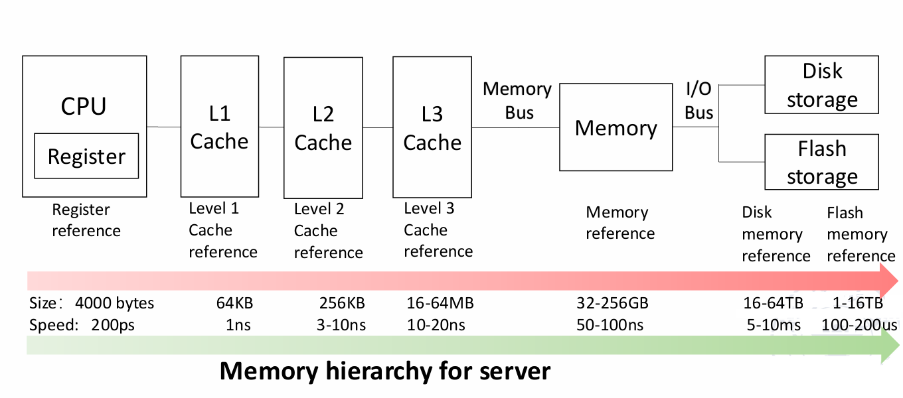
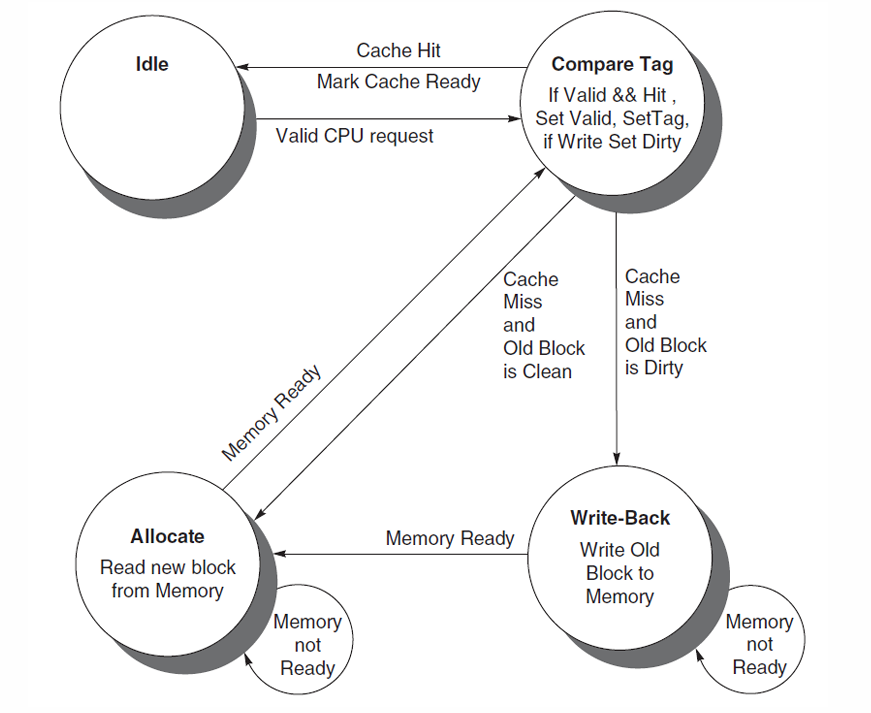
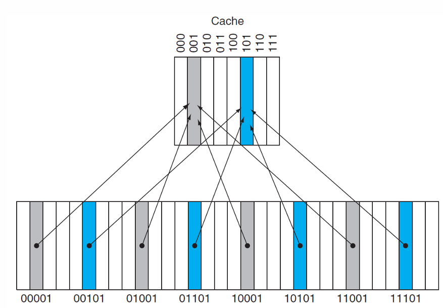
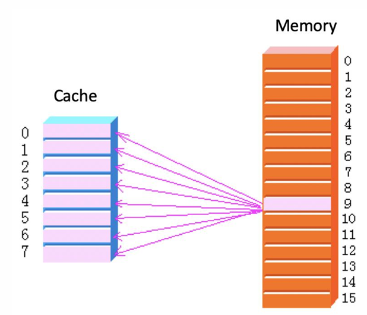
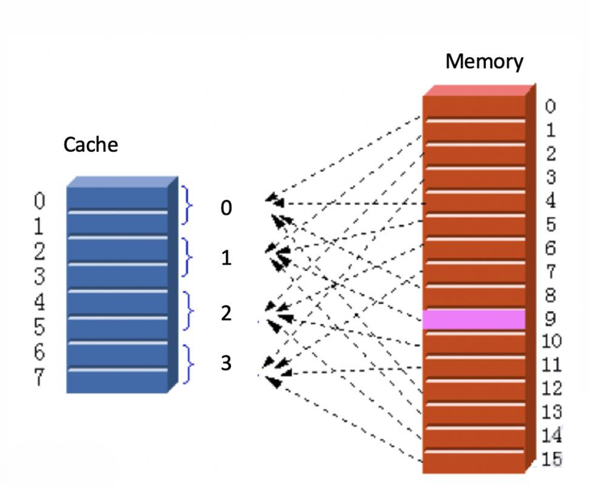
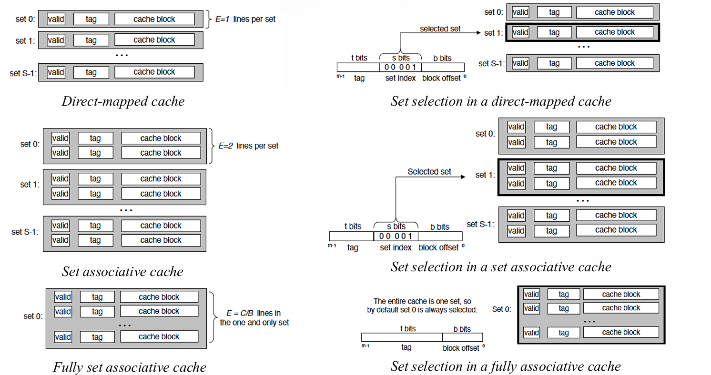
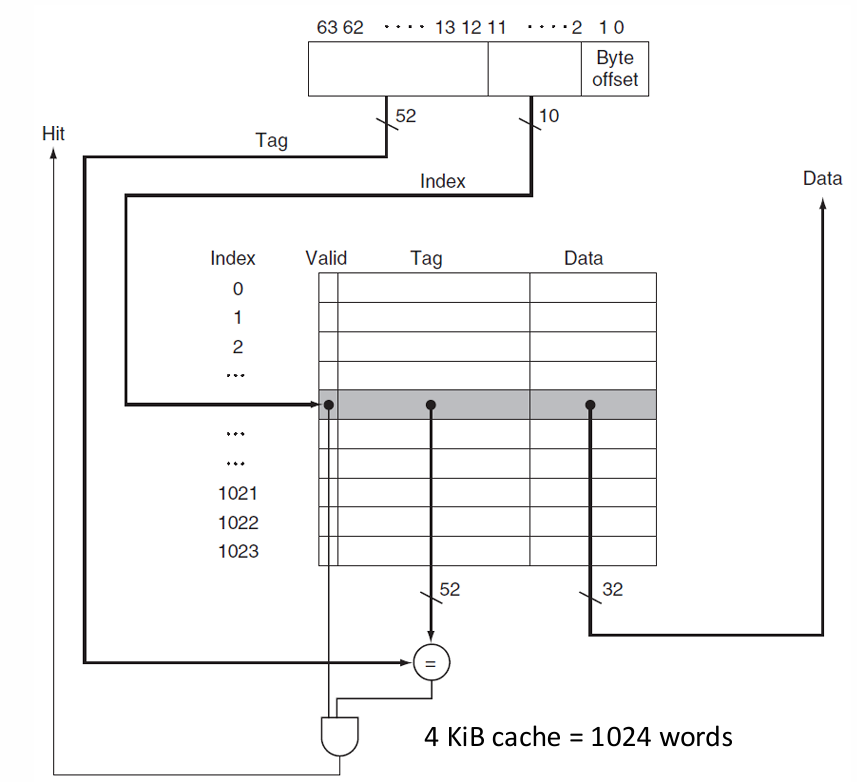
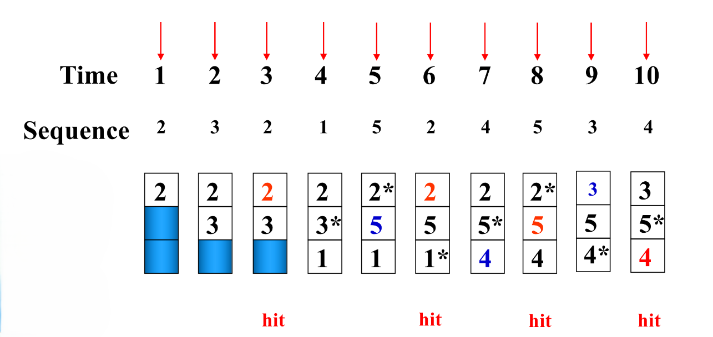
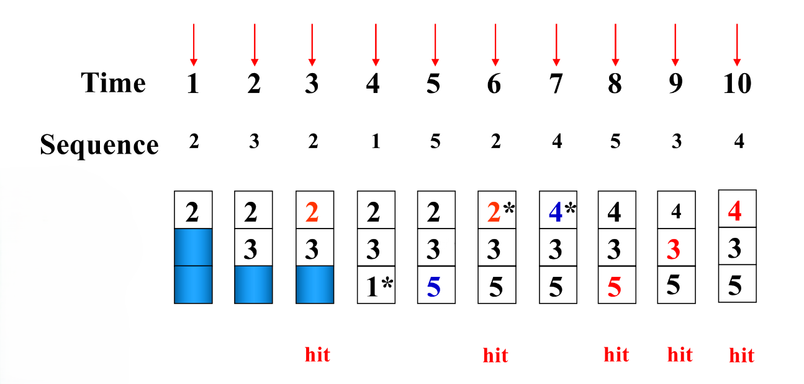
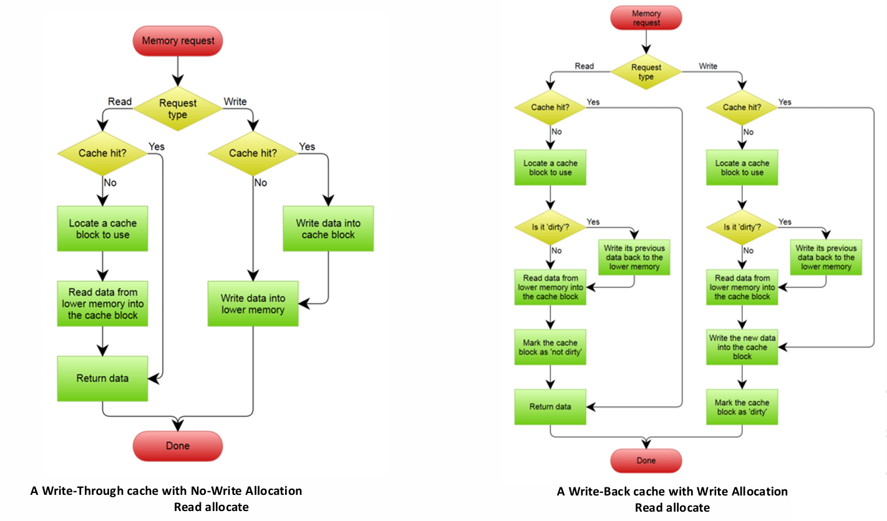

# Chapter3 Memory Hierarchy

***

## 3.1 Basic Concepts

**Locality:**

* temporal locality 时间局部性
  如果一个数据刚被访问，那么其有很大的可能性被再次访问。
* spatial locality 空间局部性
  如果一个数据被访问，那么与其相邻的数据有很大的可能性被访问。

**Memory Hierarchy:**

规律：

* 离CPU越近，容量越小
* 离CPU越近，访问速度越快
* 离CPU越近，价格越贵

**Cache:**

**A safe place for hiding or storing things.**

cache是一种存储形式，用于临时保存经常使用或近期使用的数据，当下一次需要使用这些数据时，能更快地获取。

CPU有访问memory的需求时，会先访问cache，如果cache有对应的数据，则称为**hit**，否则称为**miss**。

对于hit的情况，从开始寻找到获得数据的时间称为**hit time**；对于miss的情况，CPU需要再去memory或者storage寻找数据，这段延迟的时间称为**miss penalty**。

hit的比例称为**hit rate**，miss的比例称为**miss rate**，两者之和为1。

miss penalty主要取决于：

* latency: 找到目标的时间
* bandwidth: 传输数据的时间

导致miss的原因主要有：

* compulsory: 第一次访问时必然miss
* capacity: cache容量有限
* conflict: 多个地址映射到同一个block

cache的基本单位是**block**。

**Finite State Machine:**

cache的设计实际上可看作一种有限状态机。最简单的实现分成以下四个部分：

* Idle
* Compare Tag
* Write-Back
* Allocate

***

## 3.2 Four Questions for Cache Designers

### Block Placement

解决的问题是：memory中的数据应该放在cache的哪个位置。

**Direct Mapped:**

直接映射的思想是：对memory的低地址取模，得到的值即为cache的index。

直接映射的好处是查找数据很方便，因为只要知道memory中的地址，就能得到cache的index。

但是，这样也会导致较多的冲突，因为多个memory地址可能映射到同一个cache位置。

**Full Associative:**

全相联的思路是：memory中的数据可以放在cache的任意位置，先到先得，直到cache满为止。

全相联的优劣与直接映射相反，冲突减少，但查找更加困难。

**Set Associative:**

组相联的思路是：融合直接映射和全相联，memory低地址取模得到对应的组别，每个组内的n个block可以随意放置，直到放满。

!!! Note
    当组相联的n取值为1时（每一组只有一个block），即为直接映射；当n取值为cache的block数时（所有block为一组），即为全相联。

### Block Identification

解决的问题是：如何找到memory中的数据对应在cache中的位置。

对于cache的每一个block，都存有一个**tag**，存放对应memory的高地址。

当查找数据时，首先通过低地址计算出cache的index，然后通过tag判断是否hit（不同的memory地址可能对应到相同的index，这个时候就需要通过tag进行识别）。

除此之外，每一个block还存有一个**valid bit**，用来表征这个block当前是否有效。

**Address Format:**

对于一个memory地址，其可以分成三部分：

* index: 确定对应的block（直接映射）或set（全相联或组相联）
* tag: 在找到index对应的block（或set）后检查是否hit
* byte offset: 确定需要的数据在block内的位置，即第几个byte

对于一个cache，其分为多个block，每个block可能有以下部分：

* tag: 用于匹配memory地址
* data: 存放数据
* valid bit: 用于表征block是否有效
* dirty bit: 用于表征block是否被修改过

!!! Note
    常用block size直接指代data的大小，而不包括tag、valid bit等。

以上图为例：

假设一个memory地址的大小为64 bits，分为index、tag和byte offset三部分。

假设一个block的大小为$2^m$ words = $2^{m+2}$ bytes（特指实际数据字段），则可得byte offset在memory地址中对应的大小为$m+2$ bits。

考虑直接映射的情况，假设cache总共有$2^n$个block，则可得index在memory地址中对应的大小为$n$ bits。

因此，留给tag的大小为$64 - m - n-2$ bits。

对于cache一个完整的block，其包括tag、data、valid bit（只考虑这三个），大小分别为$64 - m - n - 2$ bits、$2^m\times 32$ bits、1 bit。

综上，整个cache的容量为：

$$2^n\times(2^m\times32+63-m-n)$$

!!! Example
    **How many total bits are required for a direct-mapped cache with 16 KiB of data and four-word blocks, assuming a 64-bit address?**

    $16 \text{KiB}=2^{14}\text{B}=2^{12}\text{words}$  
    The block size (data) is $4\text{words}=2^2\text{words}, m=2$  
    $\frac{2^{12}\text{words}}{2^2\text{words}}=2^{10}, n=10$  
    $\text{tag size}=64-(n+m+2)=50\text{bits}$  
    $\text{cache size}=2^n\times(\text{block size}+\text{tag size}+\text{valid size})=2^{10}\times(4\times 32+50+1)=179\text{Kib}$

!!! Example
    **Consider a cache with 64 blocks and a block size of 16 bytes. To what block number does byte address 1200 map?**

    block address = byte address / bytes per block = 1200/16 = 75  
    75 modulo 64 = 11

### Block Replacement

解决的问题是：当cache已满或者出现冲突，应采取什么策略进行数据的替换。

**Random:**

Random随机选择替换目标，其实现相对容易，效果也还不错。

**Least Recently Used (LRU):**

LRU替换掉最久没有被访问的数据。

!!! Example
    

    * time=1: 2不在cache中，miss，cache未满，直接放入
    * time=2: 3不在cache中，miss，cache未满，直接放入
    * time=3: 2在cache中，hit
    * time=4: 1不在cache中，miss，cache未满，直接放入
    * time=5: 5不在cache中，miss，由于3是2，3，1中最久没有被访问的，因此5替换3
    * time=6: 2在cache中，hit
    * time=7: 4不在cache中，miss，由于1是2，5，1中最久没有被访问的，因此4替换1
    * time=8: 5在cache中，hit
    * time=9: 3不在cache中，miss，由于2是2，5，4中最久没有被访问的，因此3替换2
    * time=10: 4在cache中，hit

!!! Note
    “最久没有没访问”强调的是时间，而不是次数。换而言之，加入某个数据曾经被访问过很多次，但其他数据都在其之后被访问，那么这个数据还是会被替换掉。

**First In First Out (FIFO):**

FIFO替换掉最先进入cache的数据。

!!! Example
    

    * time=1: 2不在cache中，miss，cache未满，直接放入
    * time=2: 3不在cache中，miss，cache未满，直接放入
    * time=3: 2在cache中，hit
    * time=4: 1不在cache中，miss，cache未满，直接放入
    * time=5: 5不在cache中，miss，由于2是2，3，1中最早放入的，因此5替换2
    * time=6: 2不在cache中，miss，由于3是5，3，1中最早放入的，因此2替换3
    * time=7: 4不在cache中，miss，由于1是5，2，1中最早放入的，因此4替换1
    * time=8: 5在cache中，hit
    * time=9: 3不在cache中，miss，由于5是5，2，4中最早放入的，因此3替换5
    * time=10: 4在cache中，hit

**Optimal:**

Optimal是一种理论上的算法，实际并不可行。其通过未来的访问情况来选择最佳的替换策略。

!!! Example
    

    * time=1: 2不在cache中，miss，cache未满，直接放入
    * time=2: 3不在cache中，miss，cache未满，直接放入
    * time=3: 2在cache中，hit
    * time=4: 1不在cache中，miss，cache未满，直接放入
    * time=5: 5不在cache中，miss，从之后来看，1不会被再次访问，因此5替换1
    * time=6: 2在cache中，hit
    * time=7: 4不在cache中，miss，从之后来看，2不会被再次访问，因此4替换2
    * time=8: 5在cache中，hit
    * time=9: 3在cache中，hit
    * time=10: 4在cache中，hit

**Stack Replacement Algorithm:**

$B_t(n)$表示$t$时刻$n$个block的存储数据，$B_t(n+1)$表示$t$时刻$n+1$个block的存储数据。固定$t$，若对于任意$n$，$B_t(n)$都是$B_t(n+1)$的子集，则$n+1$对应的hit rate一定不低于$n$对应的hit rate，该算法是一种堆栈替换算法。

在以上的算法中，LRU是一种堆栈替换算法。

!!! Example
    **对于下面一串访问序列，给出$n=1,2,3,4,5$时的cache占用情况。**

    

    不妨假设cache的大小为5（保证不会发生冲突），且在每次更新cache时，保证从上到下是最近访问到最久访问的顺序。

    * time=1: 2不在cache中，miss，cache未满，直接放入
    * time=2: 3不在cache中，miss，cache未满，直接放入，且放到栈顶
    * time=3: 2在cache中，hit，2放到栈顶
    * time=4: 1不在cache中，miss，cache未满，直接放入，且放到栈顶
    * time=5: 5不在cache中，miss，cache未满，直接放入，且放到栈顶
    * time=6: 2在cache中，hit，2放到栈顶
    * time=7: 4不在cache中，miss，cache未满，直接放入，且放到栈顶
    * time=8: 5在cache中，hit，5放到栈顶
    * time=9: 3在cache中，hit，3放到栈顶
    * time=10: 2在cache中，hit，2放到栈顶

    图中的红色方框对应了时间$t$和block数$n$，表示time为$t$时，$n$和$n+1$，$n+2$，……对应的情况都能hit。依次截取的情况即为$n=1,2,3,4,5$时的cache占用情况。

    !!! Note
        不难发现，设红色方框坐标为$(n,t)$，则$(n,t-1)$和$(1,t)$对应的数相等。

### Write Strategy

* write hit
  * write through
  * write back
* write miss
  * write allocate
  * no write allocate (write around)

**Write Through:**

当写操作hit时，cache和memory都进行更新。

**Write Back:**

当写操作hit时，只更新cache；当cache的某个block被替换时，再将其写回memory。

**Write Buffer:**

当数据需要写到memory中时，会存在write stall，影响CPU的性能。通过write buffer暂存需要写回的数据，之后由write buffer负责慢慢写回，可以让CPU正常运行。

**Write Allocate:**

当写操作miss时，先从memory中读取数据到cache，再在cache中进行写操作。

**No Write Allocate (Write Around):**

当写操作miss时，直接写入memory，不经过cache。

通常情况下，write back和write allocate结合使用，write through和write around结合使用。

!!! Note
    对于write allocate，先从memory中读取数据，再在cache中进行写操作，而不是直接写入cache。这样做的原因是，一个block的数据并不仅限于该地址对应的数据，还包括其相邻地址的数据，因此需要先读取整个block，再进行写操作。

对于write through+write around：

* 读操作
  * hit：从cache中直接读取
  * miss：从memory中加载对应数据到cache，再读取
* 写操作
  * hit：将数据写回cache和memory
  * miss：只将数据写回memory

对于write back+write allocate：

* 读操作
  * hit：从cache中直接读取
  * miss
    * dirty：
    * clean：从memory中加载对应数据到cache，再读取，保持该block为clean
* 写操作
  * hit：只将数据写回cache，标记该block为dirty
  * miss：
    * dirty：将block中的其他地址的数据写回其对应的memory，再从memory中加载对应数据到cache，最后在cache中写入新的数据，标记该block为dirty
    * clean：从memory中加载对应数据到cache，再写入新的数据，标记该block为dirty

!!! Note
    dirty bit表征的是其所在block对应的memory中的数据与block中的数据是否一致。dirty表示cache中的数据为新数据，memory中的数据为旧数据；clean表示cache和memory中的数据一致。

!!! Example
    **假设全相联，write back机制，有以下五条指令：**
    **`write Mem[100];`**
    **`write Mem[100];`**
    **`read Mem[200];`**
    **`write Mem[200];`**
    **`write Mem[100];`**
    **分别使用no write allocate和write allocate机制，hit和miss的情况如何？**

    no write allocate|write allocate
    :---:|:---:
    miss|miss
    miss|hit
    miss|miss
    hit|hit
    miss|hit

***

## 3.3 Memory System Performance

**CPU Execution Time:**

$$\text{CPU execution time}=(\text{CPU clock cycles}+\text{Memory stall cycles})\times\text{Clock cycle time}$$

$$\text{Memory stall cycles}=\text{IC}\times\text{MemAccess refs per instruction}\times\text{Miss rate}\times\text{Miss penalty}$$

二者结合可得：

$$\text{CPU execution time}=\text{IC}\times(\text{CPI}_{\text{Execution}}+\frac{\text{MemAccess}}{\text{Inst}}\times\text{Miss rate}\times\text{Miss penalty})\times\text{Clock cycle time}$$

**Average Memory Access Time (AMAT):**

$$\text{Average memory access time}=\frac{\text{Whole accesses time}}{\text{All memory accesses in program}}$$

$$=\frac{\text{Accesses time on hitting}+\text{Accesses time on missing}}{\text{All memory accesses in program}}$$

$$=\text{Hit time}+(\text{Miss Rate}\times\text{Miss Penalty})$$

代入上式可得：

$$\text{CPU execution time}=\text{IC}\times(\frac{\text{ALU operations}}{\text{Inst}}\times\text{CPI}_{\text{ALU operation}}+\frac{\text{MemAccess}}{\text{Inst}}\times\text{Average memory access time})\times\text{Clock cycle time}$$