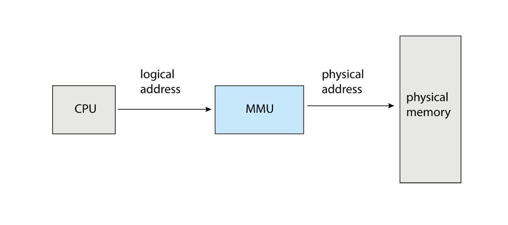
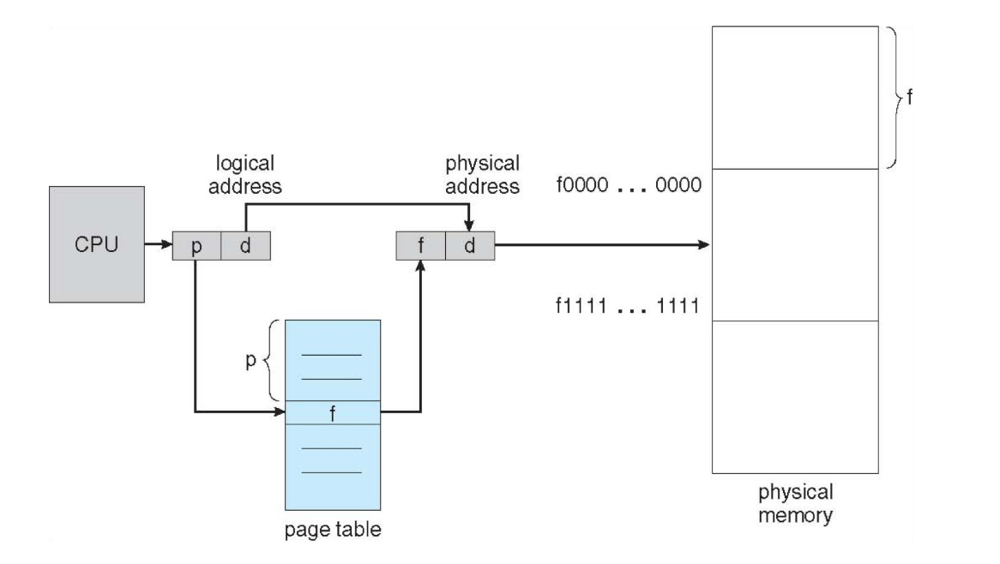
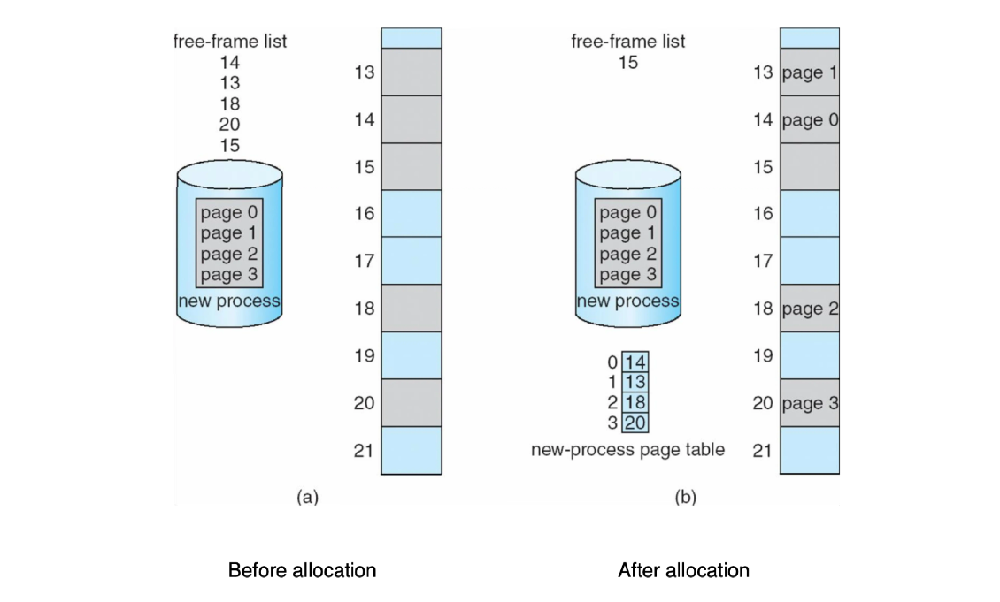
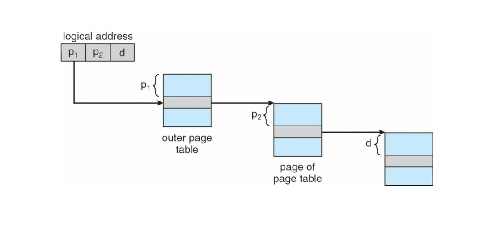
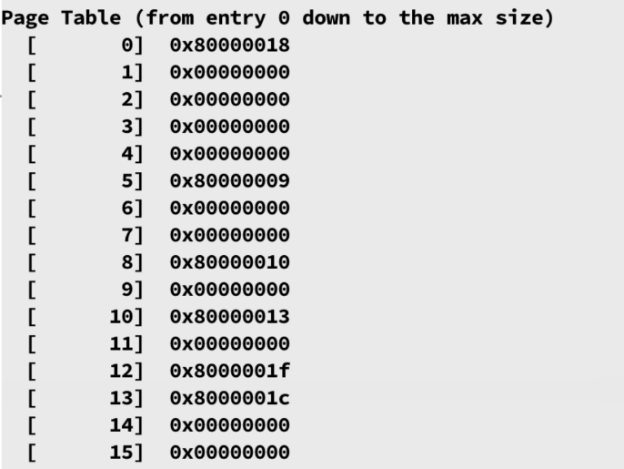
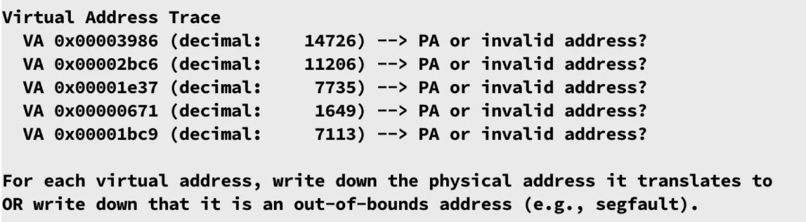
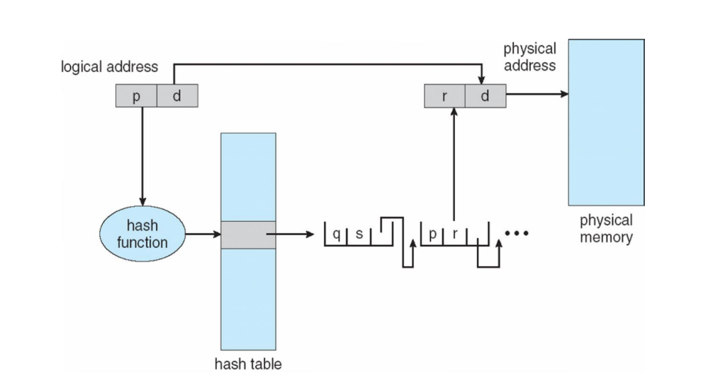
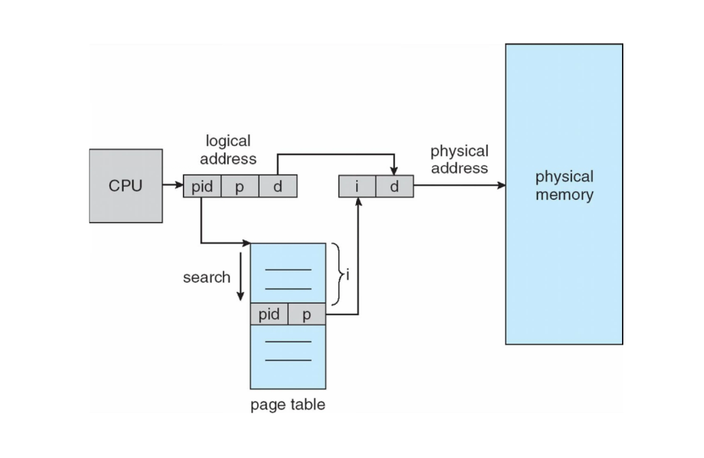

# Chapter4 Main Memory

***

**Address Binding:**

在程序的不同阶段，地址的形式会有所不同：

* 源代码阶段：符号化地址（symbolic address）
* 编译阶段：可重定位地址（relocatable address）
* 链接阶段：绝对地址（absolute address）

!!! note
    绝对地址依然是虚拟地址。
    绝对地址并不一定“绝对”，例如**位置无关可执行文件（PIE）**，其能够在mem的任何位置运行，而无需依赖固定的地址。

$~$

**Virtual & Physical Address Space:**

虚拟地址（virtual address），又称逻辑地址（logical address），是由CPU生成的地址。

物理地址（physical address）是由内存单元实际识别的地址。

在编译时刻和加载时刻，va和pa一致，因为程序的内存位置在这两个阶段是确定的；在运行时刻，进程可能会被OS移到不同的内存区域，va和pa就不再相同，而是需要进行转换。

$~$

**Memory Management Unit (MMU):**

MMU是运行时刻将va映射成pa的硬件单元。

考虑最简单的映射方式：MMU将va加上一个偏移量得到pa，那么这个偏移量一般存放在**relocation register**中，也就是va对应的起始pa（va一般从0开始映射）。

$~$

**Dynamic Loading:**

动态加载的意思是，执行程序时并不一次性将整个程序载入内存，而是在需要的时候才加载，例如需要使用某个函数，则将该函数的代码加载到内存中。

好处：未使用的代码不会被加载，可以节约内存空间，适用于处理大量代码但不常用的情况；不需要额外的OS支持，可以通过程序设计来实现。

$~$

**Dynamic Linking:**

动态链接的意思是，在运行时刻才按需链接代码库。

程序调用库函数时，会使用一个**stub**来查找库函数的内存地址。

好处：适用于共享库。

$~$

**Contiguous Allocation:**

内存的分配可以是连续分配。在这种情况下，通常先将内存分成内核进程（低地址）和用户进程（高地址）两部分，给每个进程分配一块连续的内存空间。

连续分配的保护机制主要依赖于relocation register，这个我们之前提到过，存放的是偏移量，但这只是笼统的说法，实际上其还分为：

* base register: 存储起始pa，即偏移量
* limit register: 存储界限值，va不能超过这个值

有以下几种分配策略：

* first-fit: 找到第一块空闲且足够大的空间就进行分配
* best-fit: 在空闲且足够大的空间中，找到最小的空间进行分配
* worst-fit: 在空闲且足够大的空间中，找到最大的空间进行分配

以上三种分配策略会导致**外部碎片化（external fragmentation）**，空闲的空间加在一起或许能满足一个进程的内存需求，但不符合连续分配的要求。主要的解决方法是分页。

!!! Note
    first-fit和best-fit通常比worst-fit表现更好。

$~$

**Paging:**

分页的思路是将物理内存分成固定大小的内存块，称为**frame**；将虚拟内存分成同样大小的内存块，称为**page**。page通过**页表（page table）** 映射到frame。这样一来，虚拟内存的每个page映射到的frame不需要是连续的，也就不存在外部碎片化的问题。

分页的缺点是**内部碎片化（internal fragmentation）**，分配的内存块大小超过进程的实际需要，导致内存块内部的剩余空间无法使用。

$~$

**Address Translation:**

在分页中，va分成两个部分：

* page number 页号：作为页表的索引，得到对应的物理地址的frame number
* page offset 页内偏移：与frame number结合得到物理地址

$~$

**Frame Table：**

页框表记录的是物理内存中frame的使用情况。包括每个frame是否被占用，被哪个进程的哪一个page占用等，通常存放在内存中。

$~$

**Page Table:**

页表记录的是某个进程的page到frame的映射关系，能通过page number找到对应的frame number。

!!! Note
    页框表是所有进程共享的，页表是每个进程独有的。

页表通常放在内存中，需要连续，由**page-table base register (PTBR)**
存放页表的pa，由**page-table length register (PTLR)** 存放页表的大小。

!!! Note
    RISC-V架构中的`satp`寄存器起到的就是PTBR的作用。

这样实现页表之后，每次遇到访存的指令，实际上需要两次访存：第一次查表得到需要的pa，第二次与pa上的数据交互。为了减少访存次数，可以使用TLB。

$~$

**Translation Look-Aside Buffer (TLB):**

TLB本质上是一个页表的cache，存放最近使用的页表项。

TLB依托**associative memory 关联存储**进行快速查找，可以一次性并行搜索多项，提高查询效率。

$~$

**Address-Space Identifier (ASID):**

由于页表是每个进程独有的，因此进程上下文切换时，页表和TLB都需要改变，频繁的进程切换会导致TLB miss的概率增大（首次访问必然miss）。

能否在进程切换时不去清空TLB？解决方法是使用ASID。ASID唯一标识了每个进程，因此，只要TLB中的页表项也标识了对应的ASID，那么相当于TLB中存放了多个进程的页表项，进程切换时也不需要清空TLB。

$~$

**Effective Access Time (EAT):**

!!! Example
    **设TLB的命中率为80%，访问一次mem的时间为10ns，求EAT。**

    TLB hit：一次访存（10ns）  
    TLB miss：两次访存（20ns）  
    EAT = 0.8 * 10 + 0.2 * 20 = 12ns

$~$

**Memory Protection:**

如何保证内存不会被非法访问？

事实上，每一个页表项都包含一些内存保护相关的位：

* **present bit**：表示该页表项是否有效
* **NX bit**：将内存区域划分为代码存储区和数据存储区，防止数据被误执行
* **PXN bit**：限制特权模式访问用户态代码（否则会导致permission fault）

$~$

**Hierarchical Page Tables:**

在分级页表中，只有最后一级页表存储页号到帧号的映射关系，其他级别的页表只存储下一层页表的物理地址。

分级页表能大大减小页表的大小。

!!! Example
    **假设虚拟地址空间为16KB，物理内存大小为32KB，页大小为1KB，页表项最高位为VALID位，下图为页表内容：**

    

    **给出以下va，求其映射的pa：**

    

    14位va，其中10位为页内偏移，4位为索引号。

    15位pa，其中10位为页内偏移，5位为物理帧号。

    序号|va|索引号|页内偏移|页表项|VALID位|pa
    ---|---|---|---|---|---|---
    1|0x3986|14|0x186|0x00000000|0|NaN
    2|0x2bc6|10|0x3c6|0x80000013|1|0x4fc6
    3|0x1e37|7|0x237|0x00000000|0|NaN
    4|0x0671|1|0x271|0x00000000|0|NaN
    5|0x1bc9|6|0x3c9|0x00000000|0|NaN

$~$

**Hashed Page Tables:**

虚拟页号通过哈希函数映射到物理帧号。

哈希页表中存储多个元素，每个元素包括：虚拟页号、物理帧号、指向下一元素的指针。

查找过程为：将虚拟页号经过哈希函数映射得到对应的哈希值，然后遍历对应的哈希链，比较其中每一个元素的虚拟页号与当前页号是否一致，如果一致则返回对应的物理帧号，否则通过该元素中下一元素的指针沿着链表继续查找。

$~$

**Inverted Page Tables:**

倒排页表与之前的页表不同的是，之前的页表只能从va找到对应pa，而倒排页表在原有功能上还可以从pa找到对应va。

每一个物理帧对应一个页表项，页表项包含对应的进程ID和虚拟页号。

缺点：从va到pa要遍历整张倒排页表；一个物理帧只能对应一个进程的一个虚拟页。

$~$

**Swapping:**

当内存不够时，进程可能会被交换到磁盘上，等到之后需要运行这个进程再重新加载到内存中。

swapping会增加上下文切换的开销。