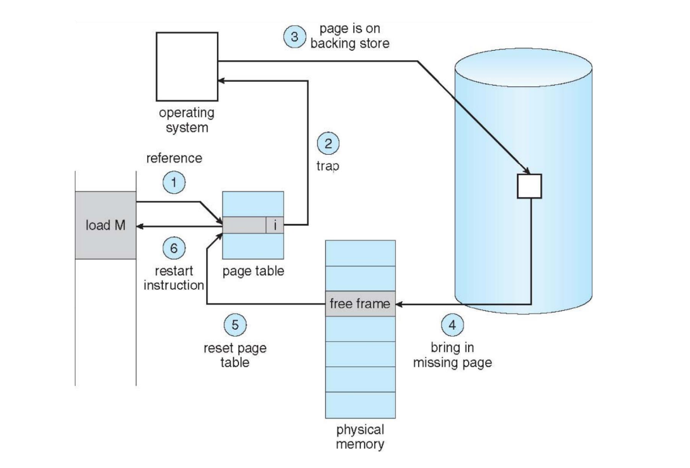
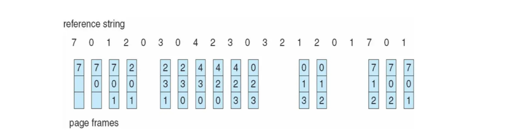
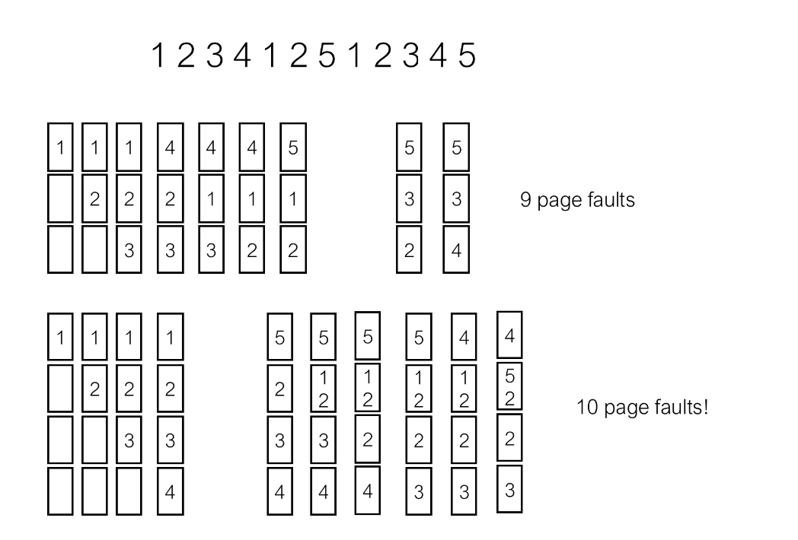
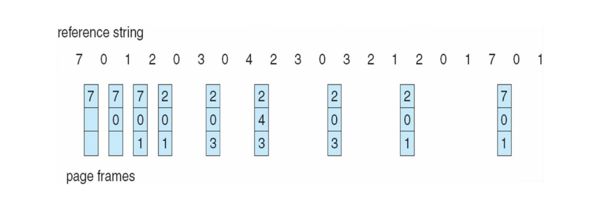
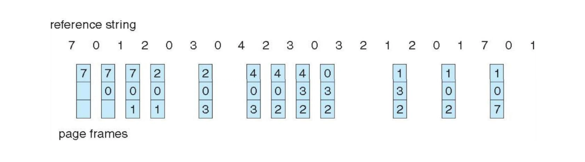
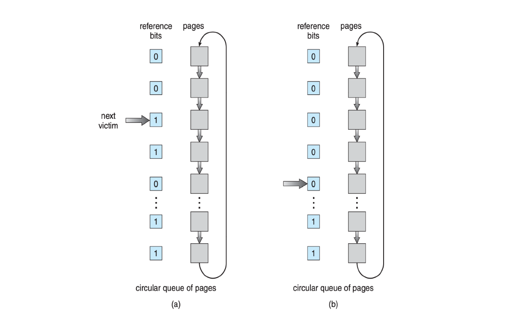
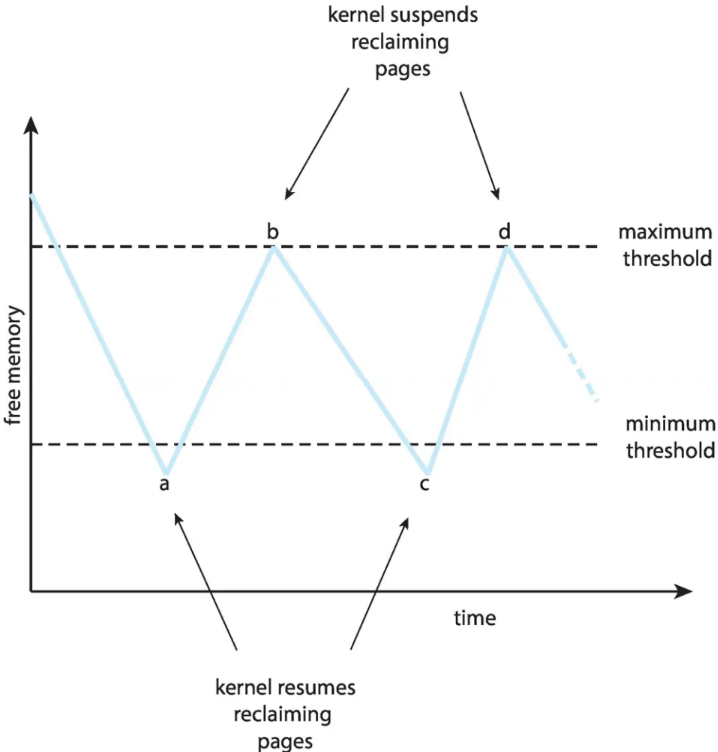
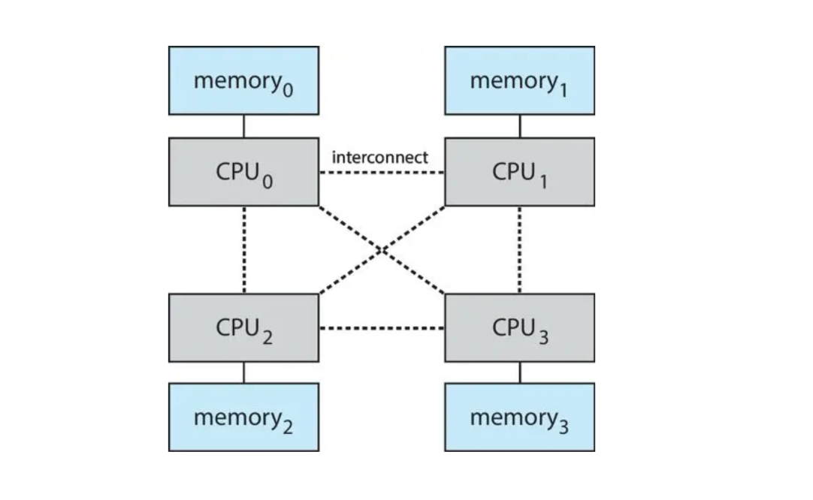
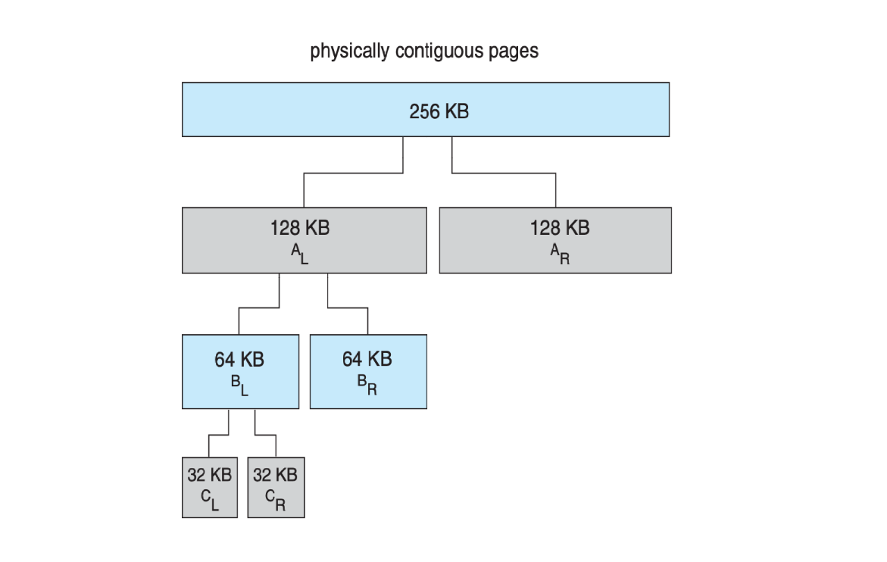
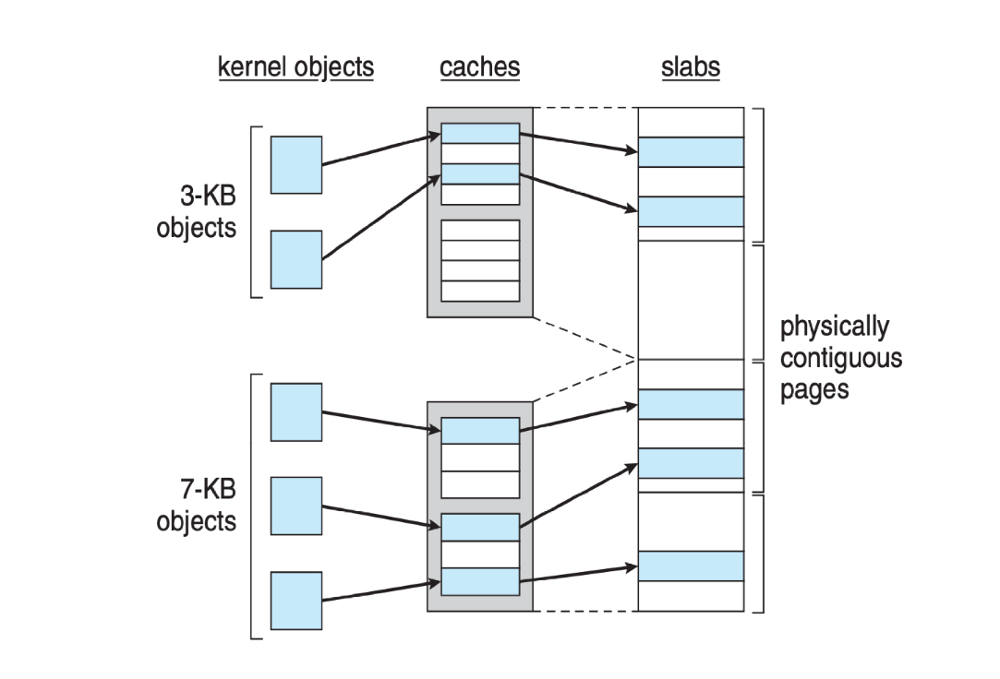

# Chapter5 Virtual Memory

***

**Demand Paging:**

demand paging的意思是只有进程需要访问某一页时，才通过swapping将其从磁盘加载到内存中。

最极端的情况是**lazy swapper**，即除非需要，否则不会加载任何页面到内存中。

还有一种做法是**pre-paging**，即在访问某些页之前，预先加载进内存。

$~$

**Valid-Invalid Bit:**

每一个页表项都有一个有效位，对于一个va，如果查页表得到的页表项的有效位为0，说明va对应的页还不在物理内存中，会触发**page fault**。

$~$

**Page Fault:**

page fault分为两种：

* va不合法：产生异常
* va合法，但目标页不在物理内存
  
    * 寻找空闲页框
    * 将目标页从磁盘加载到空闲页框
    * 更新页表项
    * 重新执行该指令

$~$

**Free-Frame List:**

物理内存中的空闲页框由free-frame list管理。

通常情况下，OS会使用**zero-fill-on-demand**，即当一个页框被分配时，OS会将其内容清零。

$~$

**Demand Paging: EAT**

设缺页率为$p$，则EAT为：

$$(1-p)\times \text{memory access time}+p\times(\text{page fault overhead}+\text{swapping overhead}+\text{instruction restart overhead})$$

!!! Note
    此处没有考虑查页表的开销。

$~$

**Copy-on-Write (COW):**

父进程创建子进程后，父子进程一开始共享数据页，只有其中一方需要写入数据时，才会触发异常，对该页进行拷贝。

$~$

**Page Replacement:**

如果物理内存没有空闲的frame，但又需要从磁盘载入目标页到内存，应该如何替换？

每一个frame会维护脏位。如果脏位为0，说明该页与磁盘上的内容一致，应当被优先替换。

$~$

**Page Replacement Algorithms:**

页替换算法的目标是希望替换出去的页不要马上被访问到。通过reference string进行测试，这串数字表示依次访问哪些页，计算会引发多少次缺页。

这里给出一个reference string的例子：

$$7,0,1,2,0,3,0,4,2,3,0,3,0,3,2,1,2,0,1,7,0,1$$

$~$

**First-In-First-Out (FIFO):**

优先替换内存中最早加载进去的数据页。

!!! Note
    使用FIFO，当物理页越多时，对于相同的reference string，缺页次数并不一定会减少。（**Belady's Anomaly**）

    反例：

    

$~$

**Optimal Algorithm (OPT):**

优先替换在未来最长一段时间内不会被访问到的数据页。

$~$

**Least Recently Used (LRU):**

优先替换内存中最久没有被使用的数据页。

对于如何确定数据页有多久没有被使用，有两种方法：

* **counter-based**：每个数据页记录最后一次被访问的时间戳，被访问则立刻更新
* **stack-based**：维护一个栈，每次访问数据页时将其移到栈顶，栈底的页即为最久未被访问的页

!!! Note
    OPT和LRU不存在Belady's Anomaly。

由于counter-based和stack-based开销都比较大，因此可以考虑LRU的近似实现，使用**reference bit**。每一个数据页都有这一位，加载进内存后如果被访问过则置为1，否则保持0。替换时优先替换reference bit为0的数据页。

但是，这种方法并不能表示出访问的时间顺序，如果想进一步模拟时间顺序，可以使用**additional-reference-bits algorithm**。该算法用一定的位数来表示最近几个时间段内该页是否被访问。例如，10010101表示在过去8秒内，第1、4、6、8秒被访问过。比较时，只要看最右边的1即可。

$~$

**Second-Chance Algorithm:**

每个数据页依然有一个reference bit，但用处不同。

当需要替换时，依次检查每一页的reference bit。如果为1，则将其置为0，给它第二次机会，继续检查下一页；如果为0，则替换该页。

second-chance算法有一种改进，除了reference bit外，还增加了一个**modified bit**，表示该数据页的内容和磁盘是否一致。以下序偶按照被替换的优先级从高到低排列：

* (0, 0)：最近未被使用，内容和磁盘一致
* (0, 1)：最近未被使用，内容和磁盘不一致
* (1, 0)：最近被使用，内容和磁盘一致
* (1, 1)：最近被使用，内容和磁盘不一致

$~$

**Page-Buffering Algorithm:**

维护一定数量的空闲页框，当发生缺页时，可以将新的数据页先加载进这些空闲页框中直接使用，寻找待替换的数据页并替换的过程可以延迟进行。

$~$

**Allocation of Frames:**

物理内存的页框数是有限的，如何分配给不同的进程？

* **fixed allocation**：每个进程分配固定数量的页框，用完自己的页框后，即使其他进程仍有空闲的也不能使用，只能替换；
* **global allocation**：与上述相反，替换时可以从所有进程的页框中选择。

$~$

**Reclaiming Pages:**

并不是等到没有任何空闲页框再进行页替换，当空闲页框的数量低于某个阈值时就进行页替换。

$~$

**Major and Minor Page Faults:**

* major page fault: va到pa有映射，但目标页不在物理内存中；
* minor page fault: 目标页在物理内存中，但va到pa的映射还没有建立。

一个进程运行一段时间，一般为minor page fault较多，major page fault较少，因为很多共享库已经在内存中了。

$~$

**Non-Uniform Memory Access (NUMA):**

在多核系统中，内存分布在不同位置，不同CPU访问内存的速度不同，靠近的访问更快。

优化思想：

* 尽可能在靠近CPU的地方分配内存；
* 同一个进程尽可能在同一个CPU上运行。

$~$

**Thrashing:**

如果系统进行页替换，被替换的页很快又要访问，导致系统花大量时间在页替换上，这种现象称为thrashing。

从CPU角度来看，利用率不变；但从用户角度来看，利用率降低。如果根据用户角度，内核认为利用率过低，需要增加新的进程，那么就会导致更多的缺页，利用率进一步降低，形成恶性循环。

如此看来，demand paging能较好地缓解thrashing，因为thrashing的根源在于需求大于内存，而demand paging有较好的局部性（high locality），因此可以减少缺页率。

解决方法1：

控制thrashing影响的范围，可以使用：

* local page replacement: 每个进程只在自己分配到的页中进行替换
* priority page replacement: 优先级高的进程能分配到更多页，从而减少thrashing的影响

解决方法2：

为每个进程尽可能分配满足需求的页：工作集模型（此处省略）

$~$

**Buddy System:**

将内存分块，每一块都是2的幂次方大小，根据请求的内存向上舍入到最接近的大小作为分配块的大小。当没有合适的块，只有更大的块时，需要不断分裂直到大小合适。

例如，有一个256KB的块，现在请求21KB，则256→128→64→32，将分裂得到的32KB的块分配给请求。

优势：未被使用的块可以迅速合并成更大的块；物理地址上连续。
劣势：内部碎片化。

$~$

**Slab Allocator:**

相比于buddy system，slab allocator更适合分配小块内存。

slab allocator本质上是包含一个或多个slab的cache，一个slab的大小是一个或多个page，slab会被划分成同样大小的object。

对于每一种数据结构，内核使用一个slab allocator。在其中一个slab中进行划分，存储该数据结构的object。如果一个slab已经满了，那么就寻找下一个没满的slab。

slab的可能状态：

* full：所有object都被使用
* empty：所有object都未被使用
* partial：有些object被使用，有些未被使用

从下到上为使用的优先级。每次先去寻找partial的slab，如果没有，再去寻找empty的slab，如果都没有，则需要创建一个新的slab，此时可以使用buddy system来分配一个新的slab。

有时候slab可以提前初始化。例如：某个slab专门分配给pcb，可以先将所有object初始化好，相当于预制一部分，当正式申请pcb时取到一个object后就不用再初始化了。

优势：易于分配和回收，没有碎片化。

$~$

**Prepaging:**

预先加载一些页到内存中，以降低进程刚开始时的缺页率。

$~$

**Page Size:**

数据页的大小应该怎样选择？

针对情况|大小选择|原因
---|---|---
减少碎片化（fragmentation）|小|如果需求很小但页很大，那么剩余空间被浪费，造成碎片化
减小页表尺寸（page table size）|大|对于同样大小的内存，页越大，页表项越少
更精细的内存管理（resolution）|小|粒度越小自然管理越精细
减小IO开销（IO overhead）|大|与减少缺页有关
减少缺页（number of page faults）|大|大页面一次能附带更多数据，访问更容易命中
局部性原理（locality）|小|?
增加TLB命中率（TLB effectiveness）|大|与减少页表项有关

$~$

**TLB Reach:**

通过TLB能够访问到的内存大小。

$$\text{TLB reach}=\text{TLB size}\times\text{page size}$$