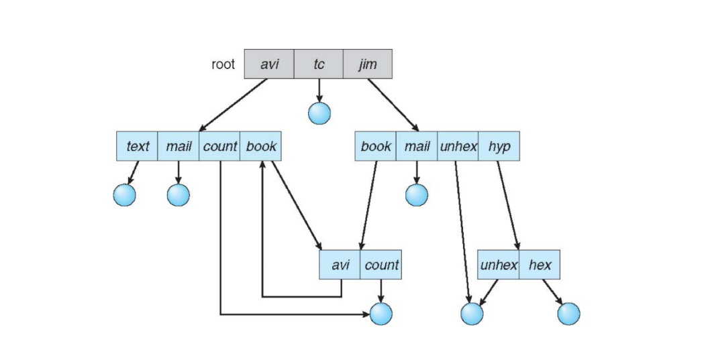
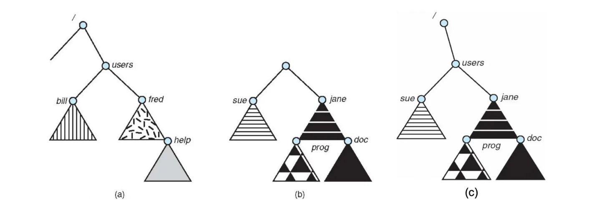

# Chapter6 File System Interface

***

**File Attributes:**

一个文件的属性包含在一个结构体中，包括：

* name: 人类可读标识
* identifier: 文件系统分配的唯一标签
* type: 文件类型，如文本、二进制、目录等
* location: 文件的位置（指针）
* size: 文件大小
* protection: rwx等权限
* ...

$~$

**File Structure:**

文件结构由OS或程序决定：

* no structure: 二进制流，没有特定的结构（Linux文件等）
* simple record structure: 由定长或变长记录组成（数据库等）
* complex structure: 结构复杂（文档文件、可重定位程序文件等）

用户程序负责识别文件结构。

$~$

**Access Methods:**

文件的访问方式分为：

* sequential access: 顺序访问，从头到尾逐步读取或写入，如磁带等
* direct access: 直接访问，访问时间不随文件大小变化，如磁盘等

$~$

**Directory Structure:**

目录本质上也是一种特殊的文件，其包含一系列下层文件信息的节点。

$~$

**Disk Structure:**

磁盘可以分为不同**分区（partition）**，不同分区可以有不同的文件系统。例如，Windows的C盘、D盘等都是不同的分区。

一个包含文件系统的分区称为**卷（volume）**，一个不包含文件系统的磁盘/分区称为**raw disk/partition**。

!!! Note
    数据库系统通常会使用raw disk来存储数据，以提高性能。

一个磁盘可以分成多个分区，多个磁盘也可以形成一个分区。

$~$

**Single-Level Directory:**

整个文件系统只有一个目录，所有用户的文件都在这个目录下。

文件命名上会有问题，比如A用户和B用户都各自创建了一个同名的文件，但两个同名文件不能处在同一目录下。

不支持分组，如按照类型、用途等组织文件。

$~$

**Two-Level Directory:**

每个用户有自己的目录，避免了命名问题，但仍然不支持分组。

$~$

**Tree-Structured Directory:**

多层级，完美解决了命名问题和分组问题，是最常见的文件组织形式。

然而仍然无法共享文件或目录。

!!! Note
    对于一个文件，有绝对路径和相对路径，绝对路径是从根目录开始的完整路径，相对路径是从当前目录开始的路径。

$~$

**Acyclic-Graph Directory:**

无环图目录相比于树形目录更加灵活，允许多个链接指向同一个文件或目录。例如，上图的dict/all、dict/w/list和spell/words/list实际上指向了同一个文件。

但是，这也导致了悬挂指针的问题。例如，如果删除了dict/all，那么dict/w/list和spell/words/list就会指向一个不存在的文件。

解决方法：用**reference counter**记录一个文件被多少路径指向，用**back pointer**记录一个文件被哪些路径指向。只有发现没有被任何路径指向时，才会真正删除文件。

$~$

**Hard Link and Soft Link:**

link指的是不同文件的路径指向同一个文件，分为hard link和soft link。

hard link指的是两个文件名指向同一个inode。如：home目录有两个文件file和file1，若file1是file的hard link，则二者指向同一个inode，如果要删掉file1，则并不能立刻删掉对应的inode和data。

soft link的意思是：若file2是file的soft link，其inode指向的data block中存的并不是数据，而是file的路径。

soft link的优点是可以跨文件系统，但hard link不行。

$~$

**General Graph Directory:**

比无环图目录更加自由，允许任意方向的链接，可能形成循环。

$~$

**Mounting:**

文件系统的挂载指的是连接文件系统与OS，使得OS能访问该文件系统对应的磁盘分区。

文件系统被挂载到的目录称为**mount point**。一旦挂载，mount point下旧的内容就会被隐藏（注意不是删除），等到新的文件系统被卸载后，旧的内容才会重新显示。

例如，下图中a为原本存在的文件系统，b是等待挂载的文件系统，c是b挂载到a的/users上后形成的结构。

$~$

**Access Control Lists (ACL):**

对于每一个文件和目录，都配有相应的ACL，记录谁能进行什么操作。

优点：精细控制。  
缺点：存储开销大，管理复杂。

$~$

**Unix Access Control:**

三种权限：**read (r)**, **write (w)**, **execute (x)**。

三种用户：**owner**, **group**, **other**。

!!! Note
    目录的execute权限表示能否进入该目录。