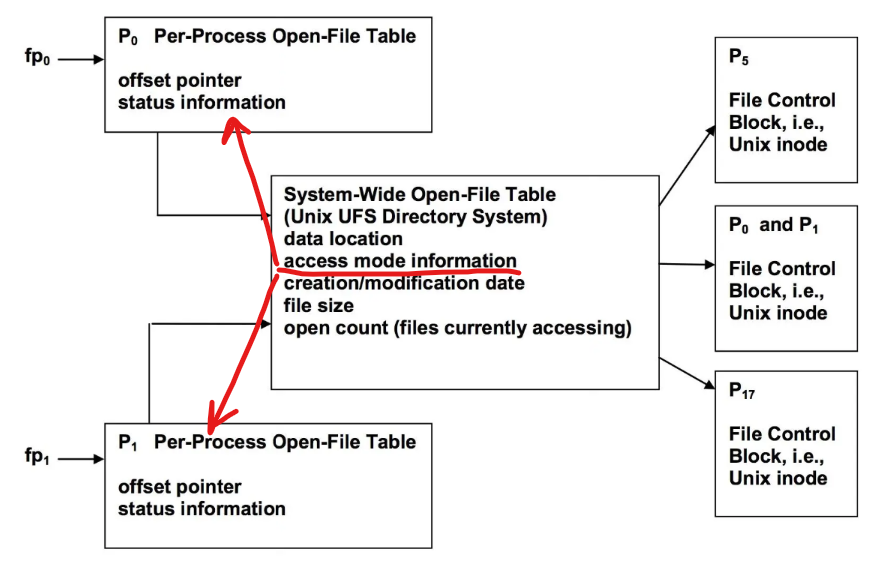
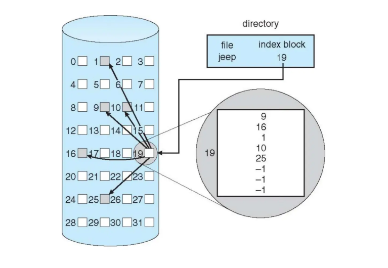
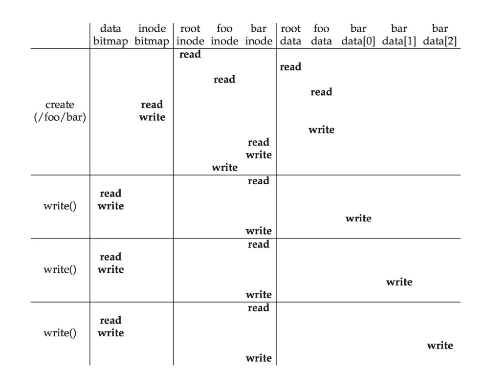

<span style="font-family: 'Times New Roman';">

# Chapter7 File System Implementation

***

**File System Structure:**

* 磁盘中的结构：
  
    * **boot control block**: 存储OS引导信息，通常位于卷的第一个block，仅当卷包含OS镜像时才需要
    * **volume control block (superblock)**: 存储文件系统级别的信息，如block的数量，空闲block的数量，block的大小，空闲FCB的数量等
    * **directory structure**: 每一个目录都会维护其下文件名与inode的映射关系，所有映射关系组成文件系统级别的目录结构
    * **file control block (FCB)**: 存储文件的元数据，在Unix/Linux系统中又称为**inode**

* 内存中的结构：
  
    * **mount table**: 记录不同文件系统的挂载点、类型等信息
    * **system-wide open-file table**: 对于要打开的文件，操作这个文件时需要把磁盘上对应的FCB加载到内存来更新，如果系统运行时操作很多文件，那么可以把这些文件的FCB放到这张表上便于操作
    * **per-process open-file table**: 不同进程操作同一文件时，FCB只有一个，但进程需要维护额外信息，例如file offset（指针）等，就存在这张表中
    * **IO memory buffer**

使用文件系统时，磁盘上的结构会映射到内存中，注意mount table只存在于内存中，因为它是一个使用时概念。

$~$

**File Control Block (FCB):**


!!! Note
    一个文件系统能存多少文件不仅受到物理空间的限制，还受到FCB数量的限制。

$~$

**Create Operation:**

首先，在磁盘上分配一个inode。

然后，将文件名与inode进行映射，放到目录结构中。

$~$

**Open Operation:**

打开文件时，OS得到的是一个路径。首先，OS去这个路径下找到这个文件，遍历system-wide open-file table检查这个文件是否已经被打开。

如果已经被打开，那么在当前进程的per-process open-file table中创建一个新的entry，并保存指向system-wide open-file table中对应entry的指针。

否则，先要将文件的inode加载到system-wide open-file table中。

然后，更新system-wide open-file table中的inode信息，如打开计数等。

!!! Note
    一个进程如果关掉文件，那么per-process open-file table中的entry会被删除，system-wide open-file table中的inode中的打开计数会减1。  
    如果所有进程都关掉这个文件，那么system-wide open-file table中的inode会被写回磁盘并被删除。



一个inode中的指针有的直接指向data block，有的指向其他区域，这些区域中仍然是指针，指向data block或者下一层的指针，这种多级指针的实现能支持更大的文件。


$~$

**Directory Implementation:**

* 线性链表：顺序存储文件名+指向inode的指针
* 哈希表：利用哈希函数计算文件名的哈希值，查表得到映射到的inode序号

$~$

**Disk Block Allocation-Contiguous Allocation:**


文件的所有data block连续。

优点：实现简单，只需要记录起始位置和长度。  
缺点：不够灵活，文件大小如果改变会比较麻烦；外部碎片化；需要定期整理出空闲空间（compaction）

有一些文件系统使用**extent-based contiguous allocation**，即将文件分成多个extent，每个extent包含的一系列block是连续的，但是extent之间不一定相邻。

$~$

**Disk Block Allocation-Linked Allocation:**


文件需要的data block不需要连续，而是用链表链接起来，文件的每个data block中存储下一个block的地址。

优点：没有外部碎片化；不需要定期整理空闲空间。  
缺点：磁盘寻址和IO操作频繁；指针需要额外存储空间。

$~$

**Disk Block Allocation-Indexed Allocation:**



每个文件都有对应的index block，index block中存储指向所有data block的指针。

优点：没有外部碎片化；支持随机访问。  
缺点：index block需要额外存储空间（文件很小时比较明显）。

索引也可以多级，类似于之前的inode多级指针。


$~$

**Bitmap:**

每个bit表达一个block的使用情况，0表示空闲，1表示占用。

优点：容易找到连续的空闲空间。  
缺点：需要额外存储空间。

例如：一个block的大小为$4\text{KB}=2^{12}\text{B}$，整个磁盘的大小为$2^{40}\text{B}$，那么磁盘上有$2^{40}/2^{12}=2^{28}$个block。如果bitmap上每一个bit表示一个cluster，每一个cluster由4个block组成，那么需要$2^{28}/4=2^{26}$个bit来表示整个磁盘的空闲空间，即bitmap的大小为$8\text{MB}$。

$~$

**Linked Free Space:**

用链表连接每一个空闲block。

优点：不需要额外存储空间，因为指针可以存储在每个block中。  
缺点：难以得到连续的空闲空间。


$~$

**Grouping and Counting:**

如果在使用链表的情况下寻找可用块，需要遍历链表，而由于指针存放在每个block中，可能会导致频繁的磁盘IO操作。

因此，grouping使用**index block**加以改进。index block中存储一组空闲block的地址和指向下一个index block的指针，这样寻找多个空闲block时不需要遍历整个链表。

此外，针对链表难以得到连续空闲空间的缺点，counting使用**cluster**加以改进。每一个链表节点记录首个空闲block的地址和后面连续的空闲block的数量，这样一组连续的空闲block称为一个cluster。

$~$

**Recovery:**

* backup
* **log-structured file system (LSFS)**: 更新被写入循环日志（circular log）中，一旦写入循环日志就表示已提交；但是日志并不是最终存储数据的位置，系统会定期重放（replay），将更新实际作用到对应的存储位置，然后将相应日志移除

$~$

**Example:**

假设我们有64个block，每个block的大小为4KB：


其中，我们使用54个block存储实际的数据：


再使用5个block存储inode。假设一个inode的大小为256B，则一共可以有80个inode，对应80个文件：


再使用bitmap来管理空闲的block。inode block的bitmap和data block的bitmap分开来各占用一个block：


最后，使用一个block来存储superblock，存储内容包括inode的数量、data block的数量、inode block的起始位置、data block的起始位置、magic number等：


每一个inode都有一个编号（inumber），例如，当我们需要寻找编号为32的inode时，首先有32*sizeof(inode)=8KB，然后就可以计算地址为4KB(superblock)+8KB(inode block)+8KB(32个inode)=20KB：


$~$

**Read /foo/bar:**


首先进行open操作。读取根目录的inode，得到根目录的data block；根目录的data block中有foo目录和其inode的映射关系，因此可以找到foo目录的inode，得到foo目录的data block；foo目录的data block中有bar文件和其inode的映射关系，因此可以找到bar文件的inode。

然后进行read操作。读取bar文件的inode，得到bar文件的第一个data block并读取；然后对bar文件的inode进行修改，更新其访问时间等元数据。bar文件的其他data block同理。

$~$

**Write /foo/bar:** 



此处假设bar文件还不在磁盘上。

首先进行create操作。同样地，从根目录的inode一直读到foo目录的data block，发现foo目录中没有bar文件的inode映射，因此需要创建。

此时需要从inode bitmap中找到一个空闲inode，更新inode bitmap，并将bar文件与新创建的inode的映射关系写入foo目录的data block中。

bar文件的inode要更新bar文件的元数据，因此进行读写（不知道为什么这里除了写还要读）；由于foo目录的data block进行了更新，因此也要更新foo目录的inode。

之后进行write操作。与read操作不同之处在于，需要读写data bitmap，因为要分配空闲的data block。

$~$

**Crash Scenario:**

bitmap (B), inode (I), data block (D)写入磁盘的时间和空间都不一致，crash时会有不同的情况。

case1：只有D写回。

从文件系统一致性的角度来看，由于inode和bitmap没有更新，因此磁盘上的元数据依然反映旧的状态。这意味着文件系统认为该文件的相关信息仍未发生改变，因此不会自相矛盾。

但是从用户的角度来看，由于元数据没有更新，用户无法通过正常的文件访问手段看到或读取到这部分新修改的数据。用户对文件状态的感知并没有改变，感觉数据“丢失”了。

case2：只有I写回。

inode显示文件应该有新数据，但实际读取到的数据并不正确。

bitmap和inode的信息不一致，bitmap认为data block未被使用，而inode则认为其“拥有”它。后续分配data block可能会错误地将其分配给其他文件，导致数据覆盖和损坏。

case3：只有B写回。

bitmap认为data block已被使用，但实际上并没有任何文件拥有它，因为inode没有更新。所以这会导致空间泄漏（space leak）。

case4：I和B写回。

元数据指向的是错误数据（garbage data）。

case5：I和D写回。

同样有不一致的问题。

case6：B和D写回。

不知道data block属于哪一个文件。

$~$

**Data Journaling:**

假设要写的内容有I[v2]、B[v2]和Db，我们先将变更写入日志（磁盘单独分配出来的一块区域），事务开头为TxB，事务结尾为TxE。当日志全部安全存入磁盘后，再将变更写到磁盘的实际位置，这也就是检查点的效果。

综上：整体分为**journal write**和**checkpoint**两个阶段。


这样可以保证一致性。因为如果写回磁盘的时候（checkpoint）发生crash，还可以通过日志重写。

但是，如果是写日志的时候（journal write）发生crash应该怎么办？

实际上，TxE可以作为一个事务提交的标志，只有TxE写入磁盘后，才认为事务提交成功。一个不完整的事务是不会被执行的，这也能保证一致性。

综上：整体分为**journal write**、**journal commit**和**checkpoint**三个阶段。


如果日志写满了怎么办？

使用**circular log**，即日志区域到底后再从头寻找。日志也有对应的superblock，当一个检查点过后，会将已经完成的事务释放，方式是更新日志的superblock。

综上：整体分为**journal write**、**journal commit**、**checkpoint**和**free**四个阶段。


我们发现同一个数据会写两遍，一次是到日志中，还有一次是到磁盘的实际位置。能否进行优化？

实际上，data block可以不需要日志，直接写到磁盘的实际位置。

综上：整体分为**data write**、**journal metadata write**、**journal commit**、**checkpoint metadata**和**free**五个阶段。


1处crash没问题，因为元数据没有更新，充其量只是写了一些garbage data而已。

2处crash没问题，因为还没有提交，所以仍然保证一致性。

3处crash没问题，因为可以通过日志重写元数据。

!!! Example
    **The file system begins in an empty state, with just a root directory. As the simulation takes place, various operations are performed, thus slowly changing the on-disk state of the file system.**

    **The possible operations are:**

    * **`mkdir()`-creates a new directory**
    * **`create()`-creates a new(empty) file**
    * **`open()`, `write()`, `close()`-appends a block to a file**
    * **`link()`-creates a hard link to a file**
    * **`unlink()`-unlinks a file(removing it if linkcnt==0)**

    **The inodes each have three fields: the first field indicates the type of file(f for regular file, d for directory); the second indicates which data block belongs to a file(here, files can only be empty, which would have the address of the data block set to -1, or one block in size, which would have a non-negative address); the third shows the reference count for the file or directory. For example, the following inode is a regular file, which is empty(address field set to -1), and has just one link in the file system:**

    `[f a:-1 r:1]`

    **If the same file had a block allocated to it(say block 10), it would be shown as follows:**

    `[f a:10 r:1]`

    **If someone then created a hard link to this inode, it would then become:**

    `[f a:10 r:2]`

    **Finally, data blocks can either retain user data or directory data. If filled with directory data, each entry within the block is of the form (name, inumber), where "name" is the name of the file or directory, and "inumber" is the inode number of the file. Thus, an empty root directory looks like this:**

    `[(.,0)(..,0)]`

    **If we add a single file "f" to the root directory, which has been allocated inode number 1, the root directory contents would then become:**

    `[(.,0)(..,0)(f,1)]`

    **If a data block contains user data, it is shown as just a single character within the block, e.g., "h". If it is empty and unallocated, just a pair of empty brackets ([]) are shown.**

    **An entire file system is thus depicted as follows:**

    ```
    inode bitmap 11110000
    inodes      [d a:0 r:6] [f a:1 r:1] [f a:-1 r:1] [d a:2 r:2] [] ...
    data bitmap 11100000
    data        [(.,0)(..,0)(y,1)(z,2)(f,3)] [u] [(.,3)(..,0)] [] ...
    ```

    **The file system has eight inodes and eight data blocks.**

    **The root directory contains three entries(other than "." or ".."), to "y", "z" and "f". By looking up inode 1, we can see that "y" is a regular file(type f), with a single data block allocated to it(address 1). In that data block 1 are the contents of the file "y": namely, "u". We can also see that "f"(inode number 3) is a directory, also empty. You can see from the bitmaps that the first four inode bitmap entries are marked as allocated, as well as the first three data bitmap entries.**

    ```
    Initlal state

    inode bitmap 10000000
    inodes [d a:0 r:2] [] [] [] [] [] [] []
    data bitmap 10000000
    data [(.0)(..,0)] [] [] [] [] [] [] []

    create("/y");

    inode bitmap 11000000
    inodes [d a:0 r:2] [f a:-1 r:1] [] [] [] [] [] []
    data bitmap 10000000
    data [(.0)(..,0)(y,1)] [] [] [] [] [] [] []

    fd=open("/y",O_WORONLY|O_APPEND);
    write(fs,buf,BLOCKSIZE);
    close(fd);

    inode bitmap 11000000
    inodes [d a:0 r:2] [f a:1 r:1] [] [] [] [] [] []
    data bitmap 11000000
    data [(.,0)(..,0)(y,1)] [u] [] [] [] [] [] []

    link("/y","/m");

    inode bitmap 11000000
    inodes [d a:0 r:2] [f a:1 r:2] [] [] [] [] [] []
    data bitmap 11000000
    data [(.,0)(..,0)(y,1)(m,1)] [u] [] [] [] [] [] []
    ```

    **Now, the question is:**

    ```
    What operations?

    inode bitmap 11000000
    inodes [d a:0 r:2] [f a:1 r:1] [] [] [] [] [] []
    data bitmap 11000000
    data [(.,0)(..,0)(y,1)] [u] [] [] [] [] [] []

    What operations?

    inode bitmap 11100000
    inodes [d a:0 r:2] [f a:1 r:1] [f a:-1 r:1] [] [] [] [] []
    data bitmap 11000000
    data [(.,0)(..,0)(y,1)(z,2)] [u] [] [] [] [] [] []

    What operations?

    inode bitmap 11110000
    inodes [d a:0 r:3] [f a:1 r:1] [f a:-1 r:1] [d a:2 r:2] [] [] [] []
    data bitmap 11100000
    data [(.,0)(..,0)(y,1)(z,2)(f,3)] [u] [(.,3)(..,0)] [] [] [] [] []
    ```

    解答：

    第一个操作：`unlink("/m")`

    第二个操作：`create("/z")`

    第三个操作：`mkdir("/f")`