

# Chapter8 Mass Storage

***

**Magnetic Disk:**

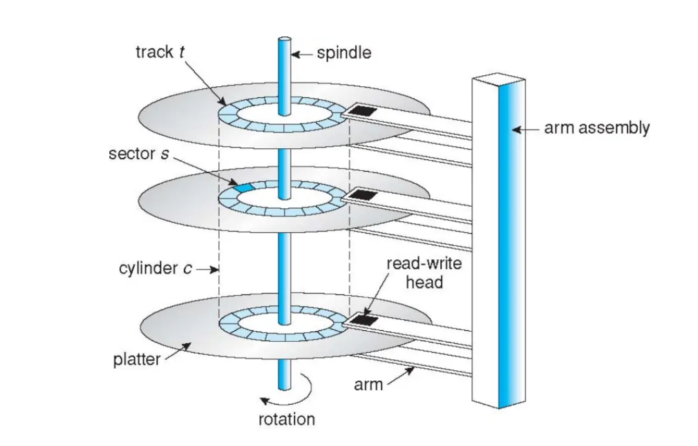

**position time**指的是将磁头移动到目标扇区所需的时间，又称为random-access time，其分成seek time和rotation latency两部分。**seek time**是磁头移动到目标轨道所需的时间，**rotation latency**是磁盘旋转到目标扇区所需的时间。

$$\text{average access time}=\text{average seek time}+\text{average rotation latency}$$

$$\text{average IO time}=\text{average access time}+\frac{\text{data to transfer}}{\text{transfer rate}}+\text{controller overhead}$$

$~$

**Solid-State Disk (SSD):**

在SSD中，读写以page为单位，多个page组成一个block。

SSD的主要问题是写数据时无法直接覆盖，需要以block为单位进行整体擦除，且擦除也有次数的限制。

初始时，SSD中的数据都是1，写入时将1变为0。例如1111，要写成0xa，则将其中两个1写为0，变成1010。接着如果要将0xa改成0xb，就会涉及到将0重新变成1，此时只能将0xa所在的page（变成0xb）写到另一个page中。

于是我们发现，如果不进行整体擦除，SSD中有效数据和无效数据是混杂的。

controller会维护一个**flash translation layer (FTL) table**，记录哪些数据页是有效的。

当一个block中的无效页达到一定比例后，会启动**garbage collection (GC)** 机制：将有效页拷贝到**over-provisioning area**中，然后更新FTL table并整体擦除。

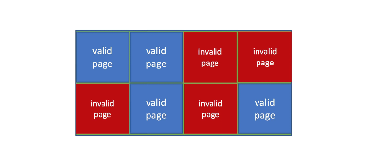

$~$

**Disk Attachment:**

硬盘可以通过不同的方式连接到计算机系统中，主要有以下三种方式：

* host-attached：主线直连，如小型计算机系统接口（SCSI）、光纤通道（FC）等
* network-attached：网络连接，如网络附加存储（NAS）等
* storage area network (SAN)：通过专用设备存储，然后通过网络连接

$~$

***

### Disk Scheduling

以磁盘访问位置序列

$$98,183,37,122,14,124,65,67$$

为例，整体范围为$[0,199]$，起始位置为$53$。

$~$

**First Come First Served (FCFS):**

按照序列顺序访问：

$$53\rightarrow98\rightarrow183\rightarrow37\rightarrow122\rightarrow14\rightarrow124\rightarrow65\rightarrow67$$

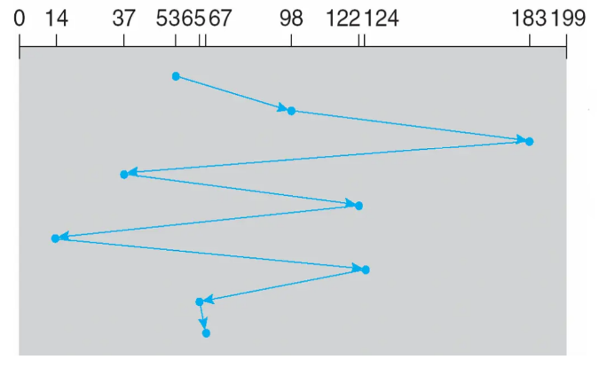

优点：实现简单；对每个磁盘请求较为公平，不会有某个磁盘请求被长期延迟。  
缺点：并不优化。

$~$

**Shortest Seek Time First (SSTF):**

优先选择离当前位置最近的磁盘请求：

$$53\rightarrow65\rightarrow67\rightarrow37\rightarrow14\rightarrow98\rightarrow122\rightarrow124\rightarrow183$$

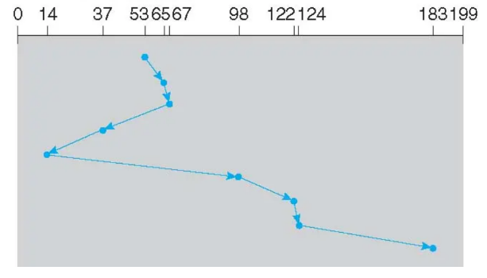

优点：平均响应时间减少，吞吐量增加。  
缺点：提前计算距离需要开销；饥饿问题；不同请求响应时间差距较大。

$~$

**SCAN (elevator):**

类似于电梯，先移动到一边的最远端，一路上处理磁盘请求；再反向移动到另一边的最远磁盘请求，一路上同样处理磁盘请求：

$$53\rightarrow37\rightarrow14\rightarrow0\rightarrow65\rightarrow67\rightarrow98\rightarrow122\rightarrow124\rightarrow183$$

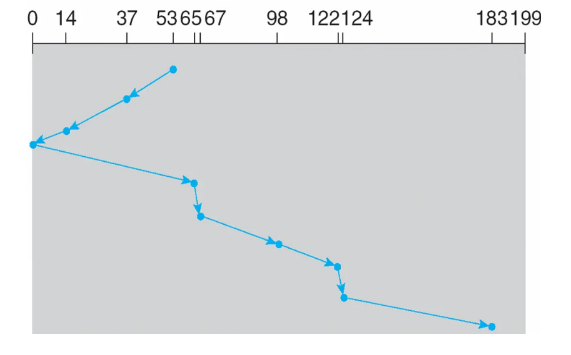

优点：高吞吐量；不同请求响应时间差距较小。  
缺点：刚被磁头访问过或者错过的区域需要等待一次完整扫描后才能再次访问。

$~$

**C-SCAN:**

类似于SCAN，但在到达一端后，磁头直接跳转到另一端的最远端，继续处理磁盘请求，就像只负责上行或者只负责下行的电梯：

$$53\rightarrow65\rightarrow67\rightarrow98\rightarrow122\rightarrow124\rightarrow183\rightarrow199\rightarrow0\rightarrow14\rightarrow37$$

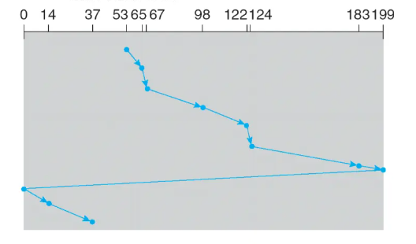

优点：比SCAN的等待时间更均匀。

$~$

**LOCK/C-LOCK:**

LOCK与SCAN相比，唯一的差别就是并不会到达磁盘的起始位置或结束位置，而是访问序列中的最小值或最大值：

（下面仅列举C-LOCK）

$$53\rightarrow65\rightarrow67\rightarrow98\rightarrow122\rightarrow124\rightarrow183\rightarrow14\rightarrow37$$

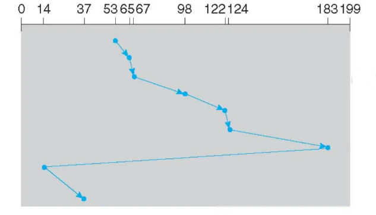

优点：比SCAN更快，因为边界范围更小。

$~$

***

### Redundant Array of Inexpensive Disks (RAID)

RAID是一种存储技术，用于提高磁盘阵列的性能、可靠性和数据安全性。

$~$

**RAID 0:**

将数据均匀分布在多个磁盘上，有利于并行读写。

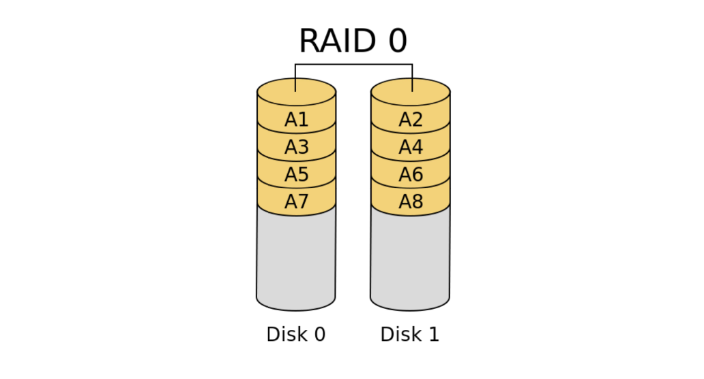

$~$

**RAID 1:**

将数据备份在多个磁盘上，读操作可以并行加速，但写操作取决于最慢的磁盘。

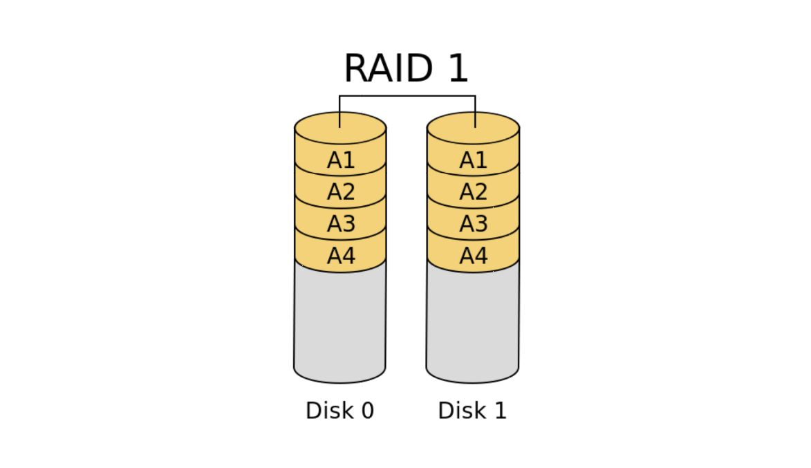

$~$

**RAID 2:**

将数据按照位进行划分，而不是块或者页，分布在多个磁盘上。

使用汉明码（Hamming Code）进行错误检测与纠正，典型结构是4位数据+3位校验，因此通常需要7个磁盘。

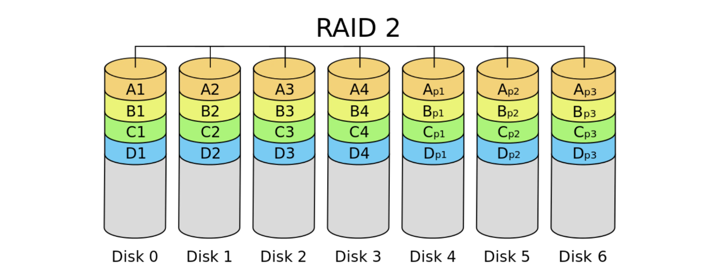

$~$

**RAID 4:**

在RAID 0的基础上，增加了校验磁盘，这提高了数据的可靠性，但在写操作上比RAID 0慢。

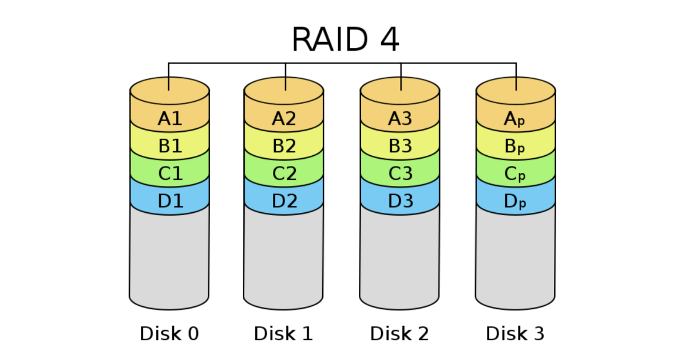

$~$

**RAID 5:**

RAID 5与RAID 4不同之处在于，校验数据并不单独存放在校验磁盘上，而是和普通数据一样均匀分布，在写操作上同样比RAID 0慢。

$~$

**RAID 6:**

RAID 6在RAID 5的基础上增加了第二组校验数据。

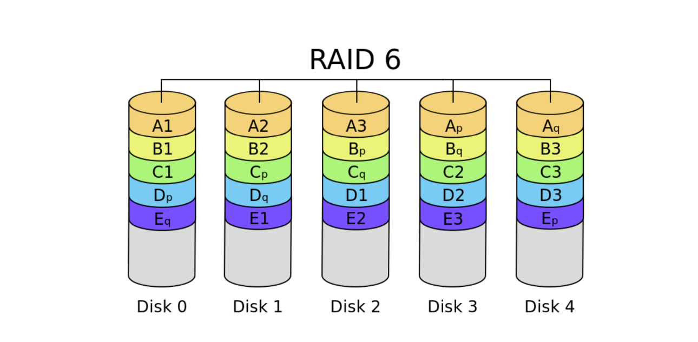