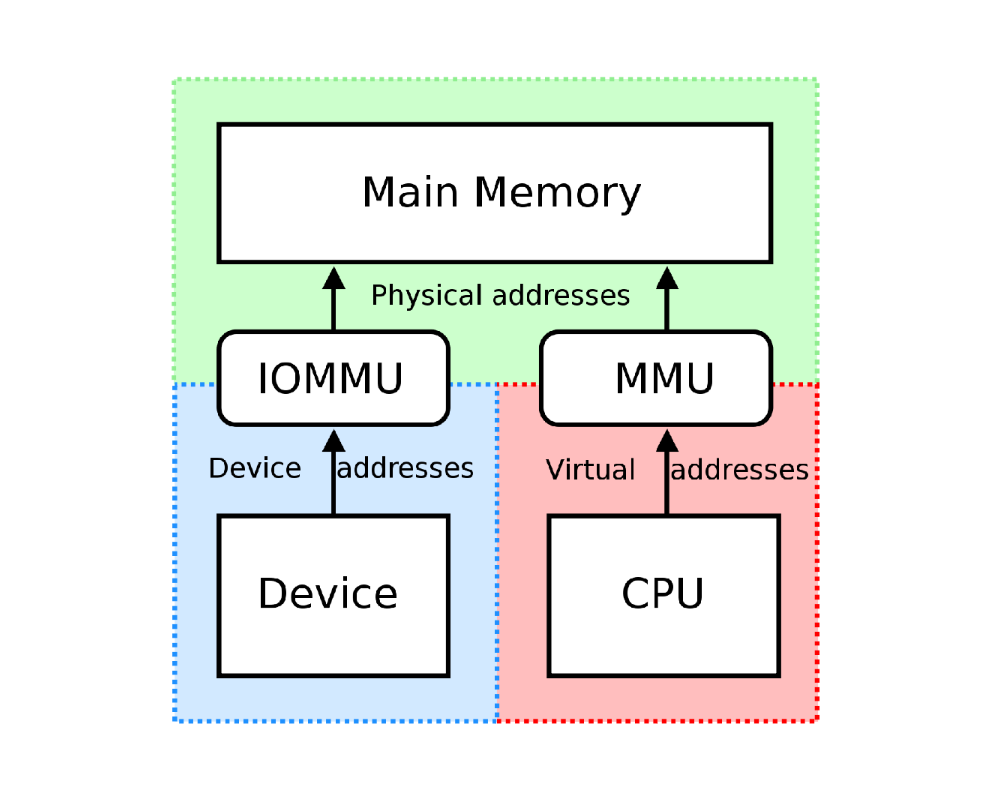

# Chapter9 IO

***

**Common Concepts:**

* 总线（bus）：连接CPU、内存和IO设备的通信通道，使各组件能够交换数据。
* 端口（port）：设备与计算机的连接点，如USB端口、串口、网口等。
* 控制器（controller）：负责管理和控制设备，确保正确的数据传输。

$~$

**IO Access:**

* 轮询（polling）：CPU定期检查设备状态，判断是否需要处理IO请求。
* 中断（interrupt）：设备在需要处理IO请求时发送中断信号，让CPU暂停当前任务，转而处理IO请求。

!!! Note
    interrupt一般优于polling，但是当IO十分频繁时，如果使用interrupt，会有过多的上下文切换开销。

$~$

**Direct Memory Access (DMA):**

DMA允许IO设备与内存直接交互，而不需要经过CPU。

$~$

**IOMMU:**

由于DMA允许IO设备直接访问内存，这可能会导致安全问题，而IOMMU可以解决这个问题。

IOMMU位于IO设备和内存之间，负责地址转换和访问控制，确保IO设备只能访问被允许的内存区域。IOMMU对于不同设备有不同的映射关系，查不同的页表。

!!! Note
    IOMMU的粒度是一个page，但一个page中往往混杂着不同内存数据，因此其并不能保证绝对安全。

$~$

**Synchronous/Asynchronous IO:**

异步IO是一种非阻塞式的IO操作，进程发起IO请求后可以继续执行，等到IO操作完成后，通过信号（signal）或回调（callback）通知进程。

同步IO分为阻塞式和非阻塞式。

阻塞式同步IO就是通俗意义上理解的那种，进程需要停下来等待。

非阻塞式同步IO在发起IO请求时，如果数据没有就绪，则继续执行，但会通过轮询等机制监听数据是否就绪。一旦就绪，进程发起IO请求。

我们可以通俗地说异步IO和非阻塞式同步IO的区别在于：前者的进程被动，而后者的进程主动。

目前最常用的是阻塞式同步IO。