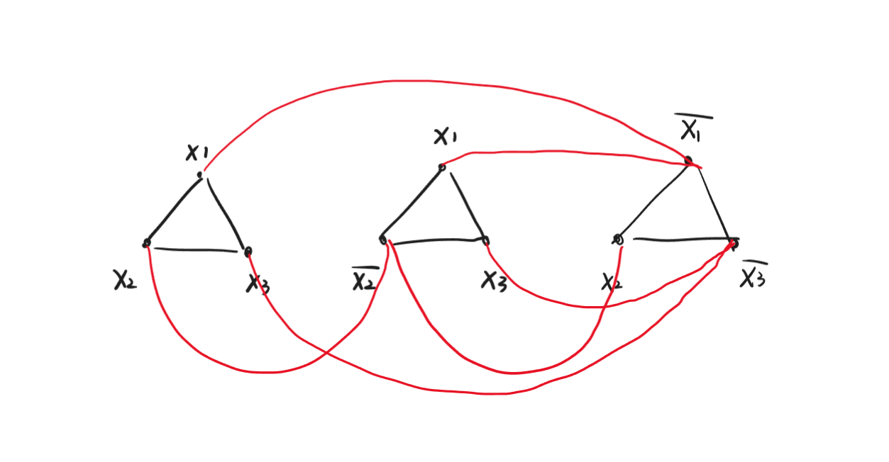

<span style="font-family: 'Times New Roman';">

# Lec13

***

## Cook-Levin Theorem

**3SAT 是 NP-complete 的。**

要证明 3SAT 是 NP-complete 的，我们需要证明两点：

* $\text{3SAT}\in\text{NP}$
* $\forall F\in\text{NP},F\leqslant_p\text{3SAT}$

其中，第一点显然。对于第二点，我们将证明：

$$\forall F\in\text{NP},F\leqslant_p\text{NANDSAT}\leqslant_p\text{SAT}\leqslant_p\text{3SAT}$$

**NANDSAT:**

给定一个 NAND-CIRC program $Q$，$Q$ 有 $n$ 位输入，输出为 $0/1$。是否存在一个输入 $t\in\\{0,1\\}^n$，满足 $Q(t)=1$？

**SAT:**

和 3SAT 唯一的区别是：每个 clause 中的 literal 数量可以是任意多个。

### 证明 $\text{NANDSAT}\leqslant_p\text{SAT}$

例如 $n=3$，输入 $t_1t_2t_3$，输出 $y$：

```py linenums="1"
temp1 = NAND(t1, t2)
temp2 = NAND(t2, t3)
y = NAND(temp1, temp2)
```

问是否存在一个 $t_1t_2t_3$ 的赋值满足要求，等价于在问：是否能满足

<div align="center">

(temp1 == NAND(t1, t2)) $\land$ (temp2 == NAND(t2, t3)) $\land$ (y == NAND(temp1, temp2)) $\land$ (y == 1)

</div>

对于形如 `a == NAND(b, c)` 的等式，其有等价形式

$$(\overline{a}\lor\overline{b}\lor\overline{c})\land(a\lor b)\land(a\lor c)$$

对于 `y == 1`，等价于 $y$。

这个归约是多项式时间的。

!!! Note
    归约时间 $T(n)$ 中的 $n$ 针对的是待转换目标的长度，在这里指的是 NAND-CIRC program 的长度（行数），而不是 NAND-CIRC program 的输入位数。

### 证明 $\text{SAT}\leqslant_p\text{3SAT}$

例如：

$$\phi=(x_1\lor x_2)\land(x_1\lor x_2\lor x_3\lor x_4)$$

可以引入新的变量：

$$(x_1\lor x_2)\Leftrightarrow (x_1\lor x_2\lor y)\land(x_1\lor x_2\lor \overline{y})$$

$$(x_1\lor x_2\lor x_3\lor x_4)\Leftrightarrow (x_1\lor x_2\lor z)\land(x_3\lor x_4\lor \overline{z})$$

这个归约是多项式时间的。

### 证明 $\forall F\in\text{NP},F\leqslant_p\text{NANDSAT}$

如果 $F\in\text{NP}$，则存在多项式时间的 NAND-TM program $V$，使得对于任意 $x\in\\{0,1\\}^*$：

$$F(x)=1\Leftrightarrow\exists t\in\{0,1\}^*,V(x,t)=1$$

且

$$|t|\leqslant |x|^a$$

对于给定的 $x$，$F(x)=1$ 当且仅当满足上述两个条件。

首先，我们观察到上述的 $V$ 是 NAND-TM program，而 NANDSAT 需要 NAND-CIRC program，二者的差别在于一个循环。回忆之前的内容，只要输入长度和运行时间都有上界，则可以展开。

给定 $x$ 后，$V$ 的输入长度：

$$|x|+|t|\leqslant |x|+|x|^a\leqslant 2|x|^a$$

又有 $V$ 的运行时间为多项式，因此运行时间至多为输入长度的多项式倍，记为 $(2|x|^a)^b$。

因此，可以把循环展开，展开的用时为 $\text{poly}(2|x|^a,(2|x|^a)^b,|V|)$。

展开后，得到一个 NAND-CIRC program $Q$，$Q(x,t)=V(x,t)$。

由于 $Q$ 中的 $x$ 固定，因此转换为 $Q'$，$Q'(t)=Q(x,t)$。

因此，$F(x)=1$ 当且仅当存在 $t$ 使得 $Q'(t)=1$，即 $t$ 是 NANDSAT 的一个实例。

***

## 应用

有了 Cook-Levin Theorem，我们可以证明 $G$ 是 NP-complete 的：

* $G\in\text{NP}$
* $\text{3SAT}\leqslant_p G$

### Independent Set Problem

给定图 $G=(V,E)$ 和正整数 $k$，能否从节点中挑出一个大小为 $k$ 的子集，使得子集中任意两个节点之间都没有边相连？

显然，$\text{IS}\in\text{NP}$。

然后，可以证明 $\text{3SAT}\leqslant_p\text{IS}$。

例如：

$$\phi=(x_1\lor x_2\lor x_3)\land (x_1\lor\overline{x_2}\lor x_3)\land(\overline{x_1}\lor x_2\lor \overline{x_3})$$

针对 $\phi$ 中每一个括号，可以构造一个三角形；然后把 $x_i$ 和 $\overline{x_i}$ 相连：



令 $k=m$，即括号的数量。

若 $\phi$ 能被满足，则每个括号内至少有一个 literal 为真，那么在每个三角形中随便选一个为真的节点，每个三角形内只选一个节点，因此内部不会相连；不同三角形的节点之间也不会相连，因为跨三角形的边一边为 $x_i$ 一边为 $\overline{x_i}$，不可能同时为真。

如果能在图中找到 $k=m$ 各互不相连的节点，则这些节点一定是每个三角形各一个，否则会有两个节点在同一三角形内，即相连。此外，也不可能一个在 $x_i$ 一个在 $\overline{x_i}$，否则与不相连的前提矛盾。这个时候，让选出来的每个节点对应的 literal 为真，则 $\phi$ 中每个括号至少有一个 literal 为真，且不会产生矛盾，因此 $\phi$ 能被满足。