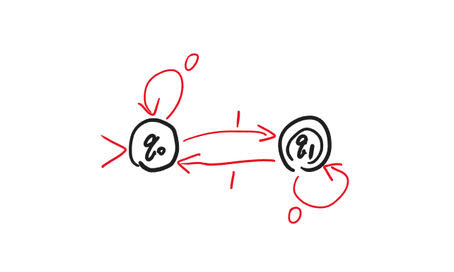
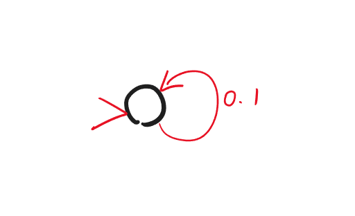
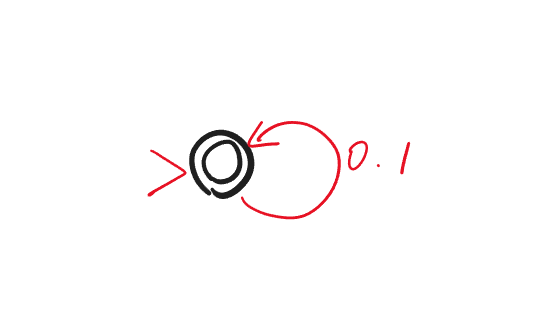
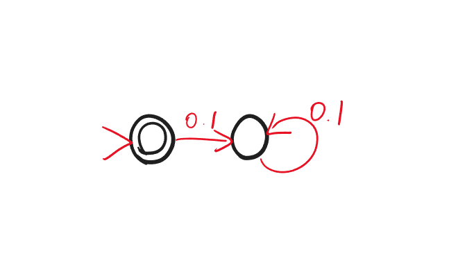
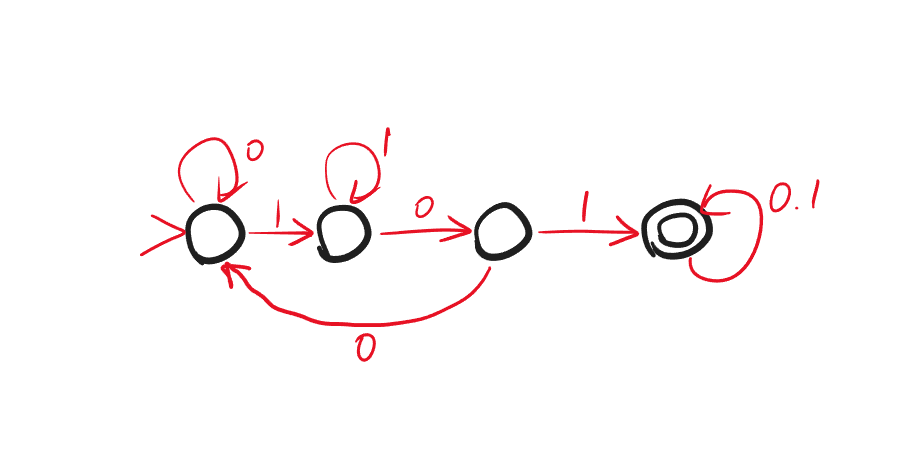
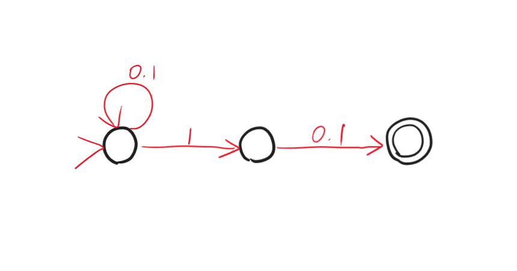

<span style="font-family: 'Times New Roman';">

# Lec4

***

## 一般函数

### 一般函数与布尔函数

之前考虑的都是有限函数，即输入和输出长度固定的函数。接下来考虑**一般函数**：

$$f:\\{0,1\\}^\*\rightarrow\\{0,1\\}^\*$$

要看一般函数的可计算性，只需要看其中的一类函数，即**布尔函数**：

$$bf:\\{0,1\\}^*\rightarrow\\{0,1\\}$$

原因是，任何一般函数 $f$ 都有一个对应的可计算性一致的布尔函数 $bf$，定义为：

$$bf(x,i,c)=\begin{cases}
    f(x)_i & \text{if } c=0, i<|f(x)|\\\
    1 & \text{if } c=1, i<|f(x)|\\\
    0 & \text{if } i\geqslant |f(x)|
\end{cases}$$

可以利用 $f$ 描述 $bf$：

```py linenums="1"
def bf(x, i, c):
    s = f(x)
    if i >= |s|:
        return 0
    if c == 0:
        return s[i]
    if c == 1:
        return 1
```

可以利用 $bf$ 描述 $f$：

```py linenums="1"
def f(x):
    res = []
    i = 0
    while bf(x, i, 1):
        res.append(bf(x, i, 0))
        i += 1
    return res
```

综上：$f$ 和 $bf$ 的可计算性一致，我们只需要考虑布尔函数的可计算性。

### Language

给定 $f:\\{0,1\\}^*\rightarrow\\{0,1\\}$，对应一个集合：

$$A_f=\\{x\in\\{0,1\\}^*:f(x)=1\\}$$

即函数值为 $1$ 的 $01$ 串的集合。这个集合称为 $f$ 的 **language**。

$f$ 和 $A_f$ 是等价的表述，即 compute a function = decide a language。

***

## Deterministic Finite Automaton (DFA)

### DFA Graph

现在以一个经典的布尔函数——**异或**为例：

$$\text{XOR}:\\{0,1\\}^*\rightarrow\\{0,1\\}$$

$$\text{XOR}(x)=\sum\limits_{i=0}^{|x|-1}x_i\mod 2$$

即：有奇数个 $1$ 结果就为 $1$；有偶数个 $1$ 结果就为 $0$。

$\text{XOR}$ 不能用之前的电路模拟，因为输入长度不固定；但显然可计算：

```py linenums="1"
def XOR(x):
    res = 0
    for i in range (len(x)):
        res = (res + x[i]) % 2
    return res
```

从程序中可以看出：$\text{XOR}$ 是 one-pass（从左到右只扫描一遍）、constant-memory（不算输入的话内存空间为常数级别）的。

我们可以用一张图来表示：



!!! Note
    图中的无边箭头指向的是初始状态；双边的圆圈是接受状态。概念见下文。

称为 **deterministic finite automaton (DFA)**。

DFA 的数学定义：

$$M=(K,s,F,\delta)$$

* $K$：有限状态集合
* $s\in K$：初始状态
* $F\subseteq K$：接受状态（accepting state）集合，即输出为 $1$ 的状态集合
* $\delta:K\times\\{0,1\\}\rightarrow K$：状态转移函数

给定长度为 $n$ 的输入 $x_0x_1...x_{n-1}$，每次读一位，来确定下一个状态是什么。即 $s_0=s$，$s_1=\delta(s_0,x_0)$，$s_2=\delta(s_1,x_1)$，依此类推，直到 $s_n=\delta(s_{n-1},x_{n-1})$。最后如果 $s_n\in F$，则 accept，否则 reject。

DFA $M$ 计算了一个布尔函数 $f$，当且仅当 $M$ accept $x$ $\Leftrightarrow$ $f(x)=1$。

DFA $M$ 决定了一个 language $A$，当且仅当 $M$ accept $x$ $\Leftrightarrow$ $x\in A$。

给定一个 DFA，只能判定唯一一个 language。

### Regular Language

能被 DFA 决定的 language 称为 **regular language**。

!!! Example
    $\emptyset$ 是 regular 的：

    

    $\\{0,1\\}^*$ 是 regular 的：

    

    $\\{e\\}$ 是 regular 的：

    

    $\\{w\in\\{0,1\\}^*: w \text{ contains 101 as substring}\\}$ 是 regular 的：

    

并不是所有布尔函数都是 regular 的。因为 DFA 每一项都有限，说明任意 DFA 都能编码，因此可数；然而布尔函数是不可数的。

### Theorem 1

若 language $A$ 和 $B$ 是 regular 的，那么 $A\cup B$ 也是 regular 的。

!!! Tip "Proof"
    存在两个 DFA $M_A$，$M_B$，分别判定 $A$ 和 $B$：

    $$M_A=(K_A,s_A,F_A,\delta_A)$$

    $$M_B=(K_B,s_B,F_B,\delta_B)$$

    构建新的 DFA $M$，使得 $M$ 判定 $A\cup B$：

    $$M=(K,s,F,\delta)$$

    * $K=K_A\times K_B$，即状态组
    * $s=(s_A,s_B)$
    * $F=\\{(q_A,q_B)\in K_A\times K_B: q_A\in F_A \text{ or } q_B\in F_B\\}$
    * $\delta((q_A,q_B),a)=(\delta_A(q_A,a),\delta_B(q_B,a))$

### Theorem 2

若 language $A$ 和 $B$ 是 regular 的，那么 $AB$ 也是 regular 的，这里的 $AB$ 指的是字符串拼接。

但此时无法立刻找到 DFA 进行判定，需要引入新的概念。

***

## Non-deterministic Finite Automaton (NFA)

除了 DFA，还有 **non-deterministic finite automaton (NFA)**。

例如：


我们可以看出与 DFA 的区别：

* 下一状态不唯一，例如 $q_0$ 接收 $0$ 后，下一个状态可以是 $q_0$，也可以是 $q_1$；
* 可以没有下一个状态，例如 $q_2$，因此如果接下来还有输入，NFA 就会 dead；
* e-transition，例如 $q_1$ 可以不接收任何输入直接转移到 $q_2$。

NFA 的数学定义：

$$N=(K,s,F,\Delta)$$

其中 $\Delta$ 与 DFA 的 $\delta$ 不同：$\delta$ 实际是一个函数，给定输入就会有对应输出；$\Delta$ 是一个关系，可以表示为三元组的集合，即 $\Delta\subseteq K\times\\{0,1,e\\}\times K$。

以上图为例，$\Delta=\\{(q_0,0,q_0),(q_0,0,q_1),(q_0,1,q_1),(q_1,0,q_2),(q_1,1,q_0),(q_1,e,q_2)\\}$

接下来考虑计算过程。假设输入为 $011$：


最后，只要所有可能的结果状态中有一个在接受状态集合 $F$ 中，就 accept，否则 reject。

!!! Example
    考虑 language $\\{w\in\\{0,1\\}^*:\text{the second symbol from the end of }w\text{ is 1}\\}$，即倒数第二位为 1，用 NFA 表示如下：

    