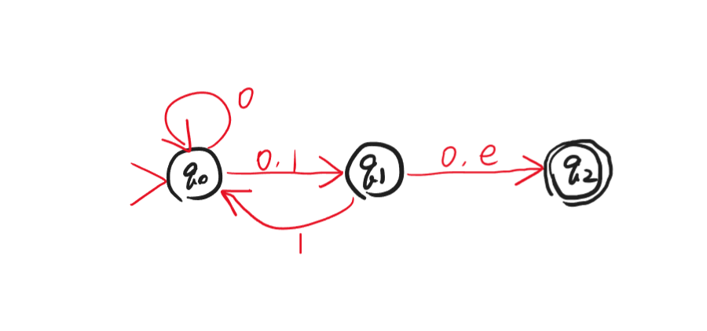
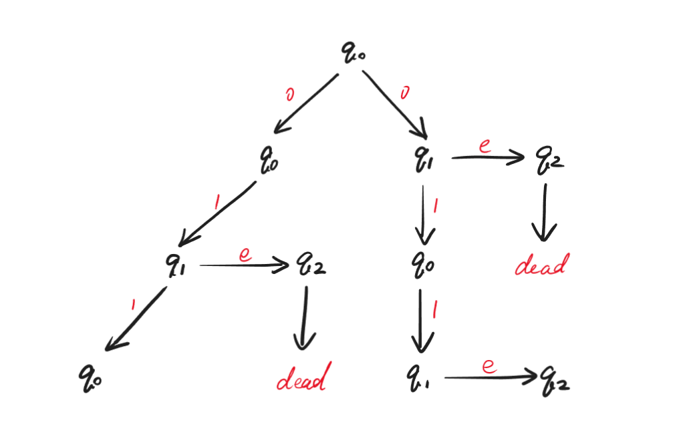
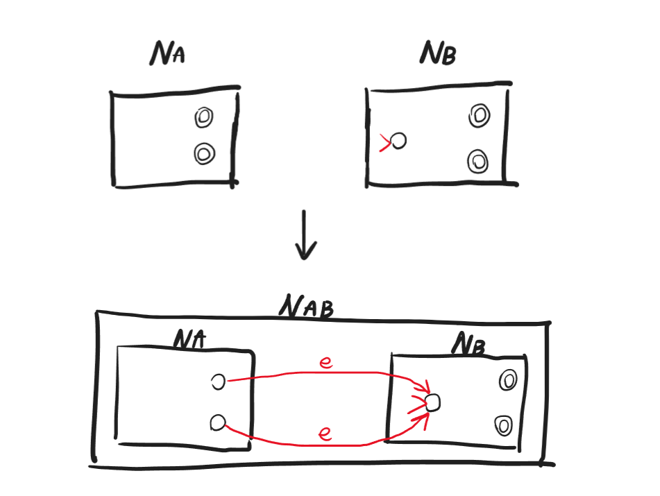
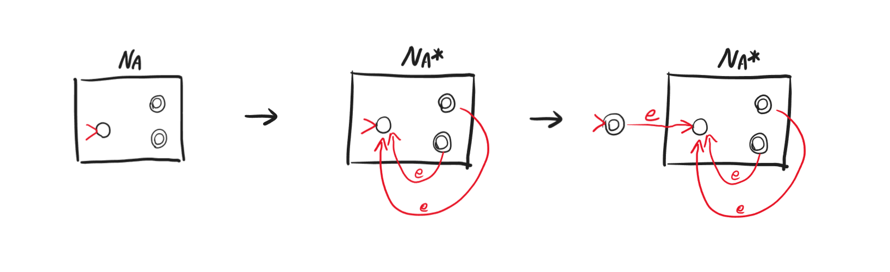
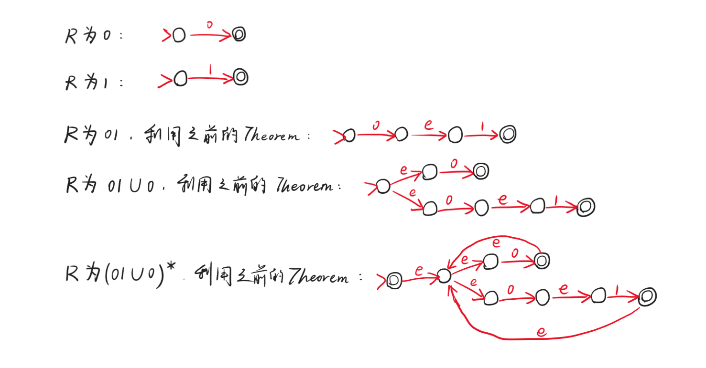
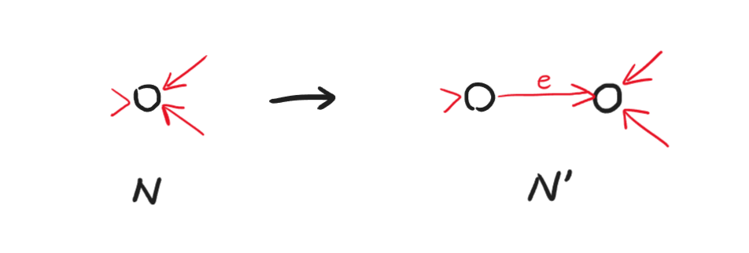
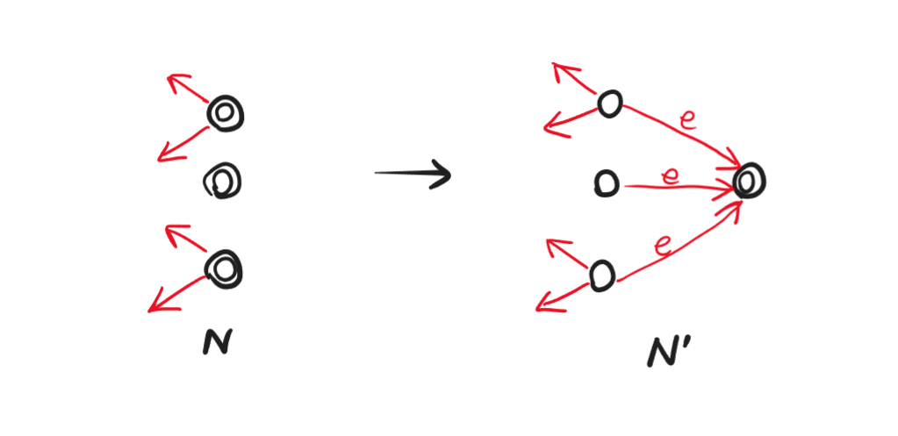
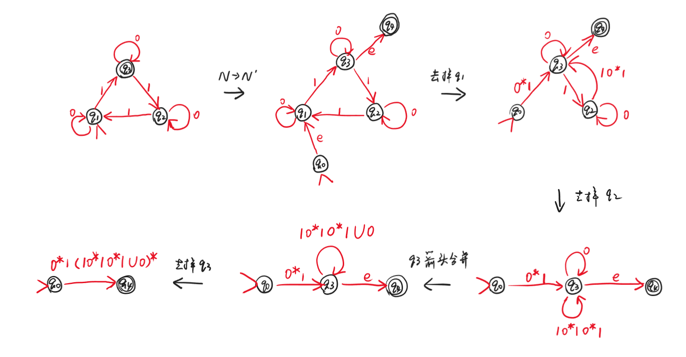

# Lec5

***

## DFA 和 NFA 延续

### Theorem 1

DFA 和 NFA 等价，即 language 能被 DFA 判定 $\Leftrightarrow$ language 能被 NFA 判定。

!!! Tip "Proof"
    DFA $\rightarrow$ NFA 是显然的，因为 DFA 中的 function 是 NFA 中一种特殊的 relation。

    现在我们考虑 NFA $\rightarrow$ DFA：

    考虑上个 lecture 的 NFA：

    

    

    我们尝试模拟树形结构的计算。在整个计算过程中，我们真正关心的是树的每一层状态的集合：

    $\\{q_0\\}$  
    $\downarrow$  
    $\\{q_0,q_1,q_2\\}$  
    $\downarrow$  
    $\\{q_0,q_1,q_2\\}$  
    $\downarrow$  
    $\\{q_0,q_1,q_2\\}$

    设 NFA 在输入到某个阶段时的状态集合为 $Q$，假设下一位输入为 $0$，则下一阶段时状态集合为 $Q'$，$Q'$ 会包含以下内容：

    * $\forall q\in Q,\text{ if } (q,0,q')\in\Delta,q'\in Q'$
    * $\forall q'\in Q',\text{ if } (q',e,q'')\in \Delta,q''\in Q'$

    !!! Note
        对于类似 $(q_1,e,q_2)$ 和 $(q_2,e,q_3)$ 的结构，我们假定必然存在 $(q_1,e,q_3)$，即闭包性质。

    于是给出符号化定义：

    $$p\in K，E(p)=\\{p\\}\cup\\{q:(p,e,q)\in\Delta\\}$$

    $$Q'=\bigcup\limits_{q\in Q}\bigcup\limits_{p:(q,0,p)} E(p)$$

    对于任意 $NFA=(K,s,F,\Delta)$，可以构造 $DFA=(K',s',F',\delta)$，其中：

    * $K'=\\{Q:Q\subseteq K\\}$
    * $s'=E(s)$
    * $F'=\\{Q\subseteq K:Q\cap F\neq\emptyset\\}$
    * $\delta:\forall Q\subseteq K,\forall a\in\\{0,1\\},\delta(Q,a)=\bigcup\limits_{q\in Q}\bigcup\limits_{p:(q,a,p)} E(p)$

### Corollary 1

language 是正规的 $\Leftrightarrow$ language 能被 DFA 判定 $\Leftrightarrow$ language 能被 NFA 判定。

### Theorem 2

若language $A$ 和 $B$ 是正规的，则它们的拼接 $AB$ 也是正规的。

!!! Tip "Proof"
    设 $A$ 对应的 NFA 为 $N_A=(K_A,s_A,F_A,\Delta_A)$，$B$ 对应的 NFA 为 $N_B=(K_B,s_B,F_B,\Delta_B)$。

    先跑 $N_A$，如果到达某个 accepting state，那么就到达了切分点，可能已经读完了拼接的 $A$ 的部分，接下来去读 $B$，也有可能还没有读完 $A$ 的部分，需要继续读 $A$。

    因此，我们可以让 $A$ 的每个 accepting state 通过 $e$-transition 连接到 $B$ 的 initial state，然后将 $B$ 的 accepting states 作为整体 NFA 的 accepting states。

    

### Theorem 3

若 language $A$ 是正规的，则 $A^*=\\{a_1a_2\dots a_k,k\geqslant 0\text{ and }a_i\in A\\}$ 也是正规的。

!!! Tip "Proof"
    与上一个 theorem 类似，$N_A$ 的 accepting states 都是切分点，可以通过 $e$-transition 连接到 $N_A$ 的 initial state。

    注意，此时还不能处理 $k=0$，即空串的情况。需要增加一个新的 initial state，并通过 $e$-transition 连接到原 initial state，同时将新的 initial state 设为 accepting state。

    

***

## 正则表达式 Regular Expression

### Definition

base case：

* $\emptyset$：描述的 language 为 $L(\emptyset)=\emptyset$
* $0$：描述的 language 为 $L(0)=\]{0\]}$
* $1$：描述的 language 为 $L(1)=\]{1\]}$

inductive case：

* 若 $R$ 是正则表达式，则 $R^{\*}$ 是正则表达式，且 $L(R^{\*})=L(R)^{\*}$
* 若 $R_1,R_2$ 是正则表达式，则 $R_1R_2$ 是正则表达式，且 $L(R_1R_2)=L(R_1)L(R_2)$
* 若 $R_1,R_2$ 是正则表达式，则 $R_1\cup R_2$ 是正则表达式，且 $L(R_1\cup R_2)=L(R_1)\cup L(R_2)$

!!! Note
    优先级：$^*$最高，接着是拼接，最后是并集。

!!! Example
    $\\{e\\}$ 对应的正则表达式是 $\emptyset^*$

    $\\{w\in\\{0,1\\}^\*:w \text{ starts with 0 and ends with 1}\\}$ 对应的正则表达式是 $0(0\cup 1)^\*1$

    $\\{w\in\\{0,1\\}^*:w \text{ has at least two 0's}\\}$ 对应的正则表达式是 $(0\cup 1)^\*0(0\cup 1)^\*0(0\cup 1)^\*$

### Theorem 4

language $A$ 是正规的 $\Leftrightarrow$ 存在正则表达式 $R$ 描述 $A$：$A=L(R)$

!!! Tip "Proof"
    $\Leftarrow$：

    例如：$(01\cup 0)^*$ 怎么用 NFA 表示？

    

    $\Rightarrow$：

    给定一个 NFA $N$，我们需要构造一个正则表达式 $R$ 使得 $L(R)=L(N)$，需要两步：

    第一步：先将 NFA $N$ 转换成等价的 NFA $N'$，满足：

    * 不能有箭头指向 initial state
      
    * 只能有一个 accepting state，且没有箭头从 accepting state 指向其他 state
      

    第二步：删除中间状态，直到只剩下 initial state 和 accepting state 为止。

    例如：

    