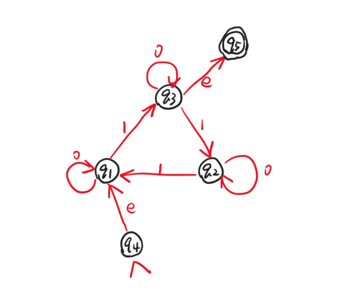
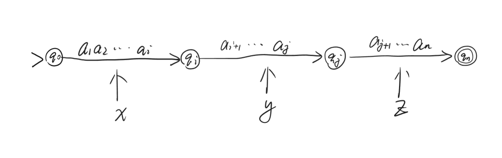

# Lec6

***

## NFA 与 regular expression 转换后续

从 NFA 到 regular expression 的转换，本质上是**动态规划**的过程。

定义 NFA $N=(K,s,F,\Delta)$，满足

* $K=\\{q_1,q_2,\dots,q_n\\}$，$s=q_{n-1}$，$F=\\{q_n\\}$
* $(p,a,q_{n-1})\notin\Delta$，即没有箭头指向 initial state
* $(q_n,a,p)\notin\Delta$，即没有箭头从 accepting state 指向其他 state

这样的定义就是上次 lecture 里提到的等价的 $N'$。

**Subproblem:**

对于 $\forall i,j\in[1,n]$，$k\in[0,n]$，定义 language

$$L_{ij}^k=\\{w\in\{0,1\}^*: w\text{ goes from } q_i \text{ to } q_j \text{ without passing any state whose index } >k\\}$$

我们的目标就是求：

$$L_{(n-1),n}^{n-2}$$

!!! Example
    

    $L_{41}^0=\\{e\\}$

    $L_{11}^0=\\{0\\}$

    $L_{32}^0=\\{1\\}$

    综上，如果 $q_i\rightarrow q_j$ 有箭头，内容为 $a$，则 $L_{ij}^0=\\{a\\}$；否则，$L_{ij}^0=\emptyset$

以上 example 为 base case。考虑**数学归纳法**，若 $L_{ij}^0\sim L_{ij}^{k-1}$ 均已知，如何计算 $L_{ij}^k$？

* case 1：中间经过的状态的 index 都小于 $k$，则对应 $L_{ij}^{k-1}$
* case 2：中间经过了状态 $q_k$（可能不止经过一次），则对应 $L_{ik}^{k-1}(L_{kk}^{k-1})^*L_{kj}^{k-1}$

综上：

$$L_{ij}^k=L_{ij}^{k-1} \cup L_{ir}^{k-1}(L_{rr}^{k-1})^*L_{rj}^{k-1}$$

通过上述递推式，我们就可以得到结果。

***

## Pumping Theorem

我们已经知道了很多证明某个 language 为 regular 的方法，如 DFA、NFA、regular expression 等。但是，证明某个 language 不是 regular 是很难的。

### Pumping Theorem

pumping theorem 给出了 regular 的一个必要条件：

若一个 language $L$ 是 regular 的，则存在正整数 $p$，对于 $L$ 中任意满足 $|w|\geqslant p$ 的字符串 $w$，都能被分解成某种 $w=xyz$ 的形式，满足：

* $|y|>0$
* 对于 $\forall i\geqslant 0$，$xy^iz\in L$
* $|xy|\leqslant p$，即重复段在前 $p$ 个字符中一定能找到

$p$ 称为 **pumping length**。

!!! Tip "Proof"

    设 $L$ 对应的 DFA 为 $M$，设 $p$ 为 $M$ 的状态数。

    对于任意一个满足 $|w|=n\geqslant p$ 的字符串 $w$，其在 $M$ 中的计算过程对应一个长度为 $n$ 的状态序列，涉及 $n+1$ 个状态：

    $$q_0\rightarrow q_1\rightarrow\dots\rightarrow q_{n-1}\rightarrow q_n$$

    由于 $n+1>p$，因此必然存在 $0\leqslant i<j\leqslant p$，使得 $q_i=q_j$。

    

    * 要求1：$|y|=j-i>0$，满足
    * 要求2：$q_i=q_j$，中间一段重复任意次后仍然到达这个状态，$xy^iz\in L$，满足
    * 要求3：$|xy|=j\leqslant p$，满足

### Application

pumping theorem 用于证明某个 language 不是 regular 的。

!!! Example
    **求证：$\\{0^n1^n:n\geqslant 0\\}$ 不是 regular 的。**

    反证法：假设其是 regular 的，记为 $A$。

    根据 pumping theorem，存在正整数 $p$ 满足要求。

    选择一个长度大于等于 $p$ 的字符串 $w=0^p1^p\in A$，分成三个部分满足三个条件。

    由第一个条件和第三个条件，$y$ 只能包含 $0$：$y=0^k\text{ for }k\geqslant 1$

    但考虑第二个条件：取 $i=0$，$xy^0z=0^{p-k}1^p\notin A$，矛盾。