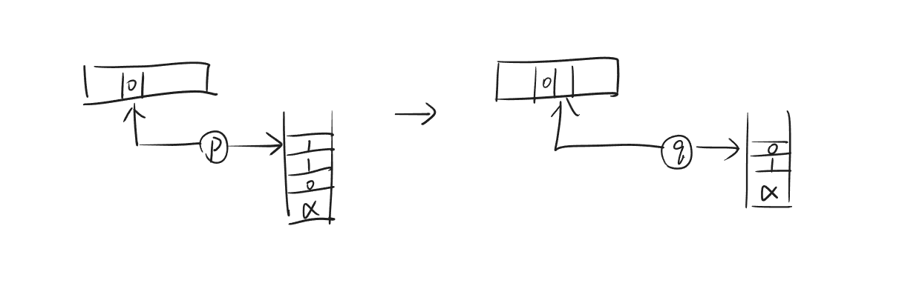
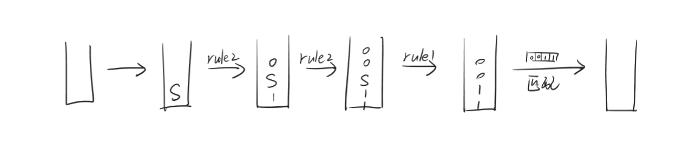
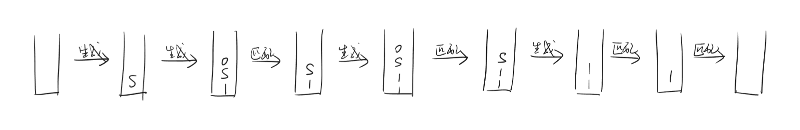

# Lec7

***

## Pushdown Automaton (PDA)

之前介绍的 DFA、NFA 和 regular expression 的计算能力有限，有许多 function/language 是无法描述的。因此，我们引入了更强的计算模型——Pushdown Automaton (PDA)。

PDA 可以看作 NFA 外带了一个**栈**作为内存：

**Definition:**

对 PDA 进行形式化定义：

$$P=(K,s,F,\Delta)$$

* $K$：状态集合
* $s$：初始状态
* $F$：接受状态集合
* $\Delta$：状态转移关系

尤其要关注的是 $\Delta$，$\Delta$ 是以下形式集合的子集：

$$(K\times\\{0,1,e\\}\times\\{0,1\\}^{\*})\times(K\times\\{0,1\\}^{\*})$$

* 前一个 $K$：当前状态
* $\\{0,1,e\\}$：当前输入符号
* 前一个 $\\{0,1\\}^*$：当前要从栈顶 pop 的字符串（当前栈顶内容）
* 后一个 $K$：下一个状态
* 后一个 $\\{0,1\\}^*$：要 push 进栈的字符串

!!! Example
    **$((p,0,110),(q,01))$**

    如果当前满足以下三个条件：

    * 当前状态为 $p$
    * 读到的一位为 $0$
    * 栈顶从上往下为 $110$

    那么，下一个状态会跳转到 $q$。此外，栈顶的 $110$ 会被 pop 掉，取而代之的是 push 进栈 $01$。

    

!!! Note
    如果只想 push，不想 pop，可以写成：

    $$((p,0,\alpha),(q,\beta\alpha))$$

**Configuration:**

在 PDA 中，广义的“状态”由以下三部分组成：

* 当前状态
* 输入字符串中还没有读到的部分
* 当前栈内容

我们称这三部分为 PDA 的 configuration，可以使用三元组表示，每个三元组来自集合：

$$K\times\\{0,1\\}^{\*}\times\\{0,1\\}^{\*}$$

给定两个 configuration $(p,x,\alpha)$ 和 $(q,y,\beta)$。如果左边的 configuration 可以通过一次状态转移变成右边的 configuration，我们记作：

$$(p,x,\alpha)\vdash_P (q,y,\beta)$$

如果左边的 configuration 可以通过多次状态转移变成右边的 configuration，对具体多少次没有要求，我们记作：

$$(p,x,\alpha)\vdash_P^* (q,y,\beta)$$

**Acceptance:**

有了 configuration 的定义，我们可以定义 PDA 的接受条件：

PDA $P$ 接受字符串 $w$，当且仅当

$$\exists q\in F,~(s,w,e)\vdash_P^*(q,e,e)$$

也就是说，在最终的诸多分支中，要存在某个结果满足三个条件：

* 把输入读完
* 到达接受状态
* 此时栈为空

能被 PDA 接受的字符串集合，称为**上下文无关语言 (Context-Free Language, CFL)**。

!!! Example
    **已知 $L=\\{w\in\\{0,1\\}^*:0's=1's\\}$，即字符串中 0 和 1 的数量相等，构造对应的 PDA。**

    $$K=\\{q\\}$$

    $$s=q$$

    $$F=\\{q\\}$$

    $$
    \begin{align}
    \Delta=\\{& ((q,0,e),(q,0)),\\\
    & ((q,0,1),(q,e)),\\\
    & ((q,1,e),(q,1)),\\\
    & ((q,1,0),(q,e))\\}
    \end{align}
    $$

    我们就考虑栈的相关操作。直观上看，如果当前手上的是 $0$，若栈顶有 $1$，则把 $1$ 拿出来，相当于抵消；若没有（栈顶为 $0$ 或空）则把 $0$ 放进去。如果当前手上的是 $1$ 也同理。

    由于多条分支时只要有一条成功即可，因此，如果当前手上的是 $0$，若栈顶有 $1$，也有一条分支做的是把 $0$ 继续叠上去，不过无伤大雅，最后我们不会管这条分支。

    **已知 $L=\\{ww^R:w\in\\{0,1\\}^*\\}$，其中 $w^R$ 是 $w$ 倒过来写，构造对应的 PDA。**

    $$K=\\{l,r\\}$$

    $$s=l$$

    $$F=\\{r\\}$$

    $$\begin{align}
    \Delta=\\{ & ((l,0,e),(l,0)), \\\
    & ((l,1,e),(l,1)), \\\
    & ((l,e,e),(r,e)), \\\
    & ((r,0,0),(r,e)), \\\
    & ((r,1,1),(r,e))\\}
    \end{align}$$

***

## Context-Free Grammar (CFG)

DFA、NFA、PDA 都属于 language recognizer，用来判断一个字符串是否属于某个 language。CFG 则是 language generator，用来生成某个 language 中的所有字符串。

先举一个简单的例子。考虑以下四条规则：

$$S\rightarrow 0S1$$

$$S\rightarrow A$$

$$A\rightarrow 0$$

$$A\rightarrow e$$

$S$ 和 $A$ 是 non-terminal，其中 $S$ 是 start symbol。$0$ 和 $1$ 是 terminal。

通过依次使用不同规则，可以从 start symbol $S$ 推导出不同的字符串。例如：

$$S\xrightarrow{rule1} 0S1\xrightarrow{rule1} 00S11\xrightarrow{rule2} 00A11\xrightarrow{rule4} 0011$$

**Definition:**

对 CFG 进行形式化定义：

$$G=(V,S,R)$$

* $V$：有限 symbol 集合，包括 $0$ 和 $1$
* $S\in V\setminus\\{0,1\\}$：start symbol，有且仅有一个
* $R\subseteq(V\setminus\\{0,1\\})\times V^*$：有限 rule 集合

使用上述定义，我们对上面的例子进行形式化描述：

* $V=\\{S,A,0,1\\}$
* $S=S$
* $R=\\{(S,0S1),(S,A),(A,0),(A,e)\\}$

**Generation:**

给定 $w,u\in V^*$，如果 $w$ 可以通过某条 rule 直接变成 $u$，我们记作

$$w\Rightarrow_G u$$

如果$w$ 可以通过多次应用 rule 变成 $u$，对具体多少次没有要求，我们记作：

$$w\Rightarrow_G^* u$$

我们可以定义 CFG 生成的字符串：

CFG $G$ 能够生成字符串 $w$，当且仅当

$$S\Rightarrow_G^* w$$

!!! Example
    **设计一个 CFG，能生成 $\\{w\in\\{0,1\\}^*:w=w^R\\}$，即回文字符串。**

    * $|w|=0\Rightarrow w=e$
    * $|w|=1\Rightarrow w=0\text{ or }1$
    * $|w|\geqslant 2\Rightarrow w=0u0\text{ or }1u1\text{ where }u=u^R$

    因此，CFG 的 rule 可以设计为：

    * $S\rightarrow e$
    * $S\rightarrow 0$
    * $S\rightarrow 1$
    * $S\rightarrow 0S0$
    * $S\rightarrow 1S1$
  
    !!! Note
        上面的 rule 可简写为：

        $$S\rightarrow e|0|1|0S0|1S1$$

***

## PDA 与 CFG 的等价性

PDA 与 CFG 是等价的。

### 从 CFG 到 PDA

想法：

* 在栈中非确定性地生成若干字符串（CFG 所能生成的字符串，分别处在不同分支）
* 与输入字符串进行匹配
* 如果匹配则接受

我们举一个例子：如果 CFG 有以下两条 rule:

* $S\rightarrow e$
* $S\rightarrow 0S1$

考虑输入为 $0011$，我们想达到的效果是：如果其能被 CFG 生成，那么 PDA 能够接受它；如果其不能被 CFG 生成，那么 PDA 会拒绝它。

来看一下栈的情况，我们希望在一位一位读入输入之前就把 $0011$ 生成出来并放入栈中，然后再进行匹配：

但是问题是：只能修改栈顶的内容，因此我们需要**匹配**与**生成**交替进行：

综上：若给定 CFG $G=(V,S,R)$，我们可以构造等价的 PDA $P=(K,s,F,\Delta)$，其中：

* $K=\\{p,q\\}$
* $s=p$
* $F=\\{q\\}$
* $\Delta$ 包含：  
    * $((p,e,e),(q,S))$  
    * $((q,e,A),(q,u))$，其中 $(A,u)\in R$  
    * $((q,0,0),(q,e))$  
    * $((q,1,1),(q,e))$  
  
其中前两条针对的是“生成”，后两条针对的是“匹配”。

### 从 PDA 到 CFG

!!! Warning
    笔者对于这一部分依然无法完全理解，请谨慎参考。

需要先对 PDA 进行化简。

**Simple PDA:**

PDA $P=(K,s,F,\Delta)$ 是 simple 的，当且仅当：

* $|F|=1$：只有一个接受状态
* 对于每个变换 $((p,a,\alpha),(q,\beta))\in \Delta$
    * 要么 $\alpha=e$ 且 $|\beta|=1$ （只 push 一个 symbol，不 pop）
    * 要么 $|\alpha|=1$ 且 $\beta=e$ （只 pop 一个 symbol，不 push）

任意一个 PDA 都可以转换为 simple PDA。

先看第一个要求：

若原本的 PDA 有多个接受状态，则创建一个新的状态 $f$。

对于所有老的接受状态 $q\in F$，添加变换 $((q,e,e),(f,e))$。

最后让 $F:=\\{f\\}$。

再看第二个要求：

不满足第二个要求有以下四种情况：

1. $|\alpha|\geqslant 1$ 且 $|\beta|\geqslant 1$：同时 pop 和 push
2. $|\alpha|>1$ 且 $\beta=e$：pop 多于一个 symbol
3. $\alpha=e$ 且 $|\beta|>1$：push 多于一个 symbol
4. $\alpha=e$ 且 $\beta=e$：栈没有变化

对于第一种情况：可以直接将 $((p,a,\alpha),(q,\beta))$ 拆分为 $((p,a,\alpha),(r,e))$ 和 $((r,e,e),(q,\beta))$，这样就转变为第二种情况和第三种情况。其中 $r$ 是一个自定义的新状态，为每个变换独有。

对于第二种情况和第三种情况：也是类似地拆分。

对于第四种情况：可以直接将 $((p,a,\alpha),(q,\beta))$ 替换为 $((p,a,0),(q,0))$，再类似地拆分。

**CFG Construction:**

接下来，simple PDA 怎么变成 CFG？

设 simple PDA 为 $P=(K,s,F,\Delta)$，CFG $G=(V,S,R)$

则按照如下方式构造：

$$V=\\{0,1\\}\cup\\{A_{pq}:(p,q)\in K\times K\\}$$

也就是说，对于 $P$ 中任意两个状态，都有一个对应的 symbol。

我们希望指定 $R$ 之后能达到的效果是：

$$A_{pq}\Rightarrow_G^* w$$

当且仅当

$$(p,w,e)\vdash_P^{\*} (q,e,e)$$

这样之后，设置 start symbol $S=A_{sf}$，其中 $s$ 是初始状态，$f$ 是唯一的接受状态，那么 PDA 和 CFG 就等价了。

接下来，我们使用类似**动态规划**的思路。

**基础情况：**

若 $p=q$，我们知道 $w=e$ 一定满足：

$$(p,w,e)\vdash_P^{\*} (p,e,e)$$

因此必有

$$A_{pp}\Rightarrow_G^* e$$

由于所有的 rule 都不会减少字符数量，因此必有

$$A_{pp}\rightarrow e$$

若 $p\neq q$，从 $p$ 读入若干字符到达 $q$，栈也不断变化，会出现两种情况。

**第一种情况：**

固定 $p,q$，输入 $w$，中间经过某个状态 $r$ 时，栈清空。此时要有 rule:

$$A_{pq}\rightarrow A_{pr}A_{rq}$$

原因：

如果 $w$ 可以被 PDA 接受，则可以拆成 $(p,w_1,e)\vdash_P^{\*} (r,e,e)$ 和 $(r,w_2,e)\vdash_P^{\*} (q,e,e)$，其中 $w=w_1w_2$。

也就是说 $A_{pr}\Rightarrow_G^{\*}(w_1)$，$A_{rq}\Rightarrow_G^{\*}(w_2)$。

那么 $A_{pq}$ 在拆成 $A_{pr}$ 和 $A_{rq}$ 后确实可以生成 $w_1w_2=w$。

如果 $w$ 不可以被 PDA 接受，那么上面的做法就不成立，$A_{pq}$ 就没法生成 $w$。

**第二种情况：**

固定 $p,q$，输入 $w$，中间栈从来没有空过，这样的话，研究从 $p$ 到 $q$ 的第一步和最后一步。

由于是 simple PDA，因此肯定 push 一个 $\alpha$；同理，最后一步肯定也是把这个 $\alpha$ pop 掉。也就是说，如果输入 $w$ 的第一步和最后一步分别是 $((p,a,e),(p',\alpha))$ 和 $((q',b,\alpha),(q,e))$，要有 rule:

$$A_{pq}\rightarrow aA_{p'q'}b$$

原因：

如果 $w$ 可以被 PDA 接受，则将 $w$ 拆成 $w=aw'b$，有 $(p',w',e)\vdash_P^{\*} (q',e,e)$。

也就是说 $A_{p'q'}\Rightarrow_G^* w'$。

那么 $A_{pq}$ 在拆成 $aA_{p'q'}b$ 后确实可以生成 $aw'b=w$。

如果 $w$ 不可以被 PDA 接受，那么上面的做法就不成立，$A_{pq}$ 就没法生成 $w$。